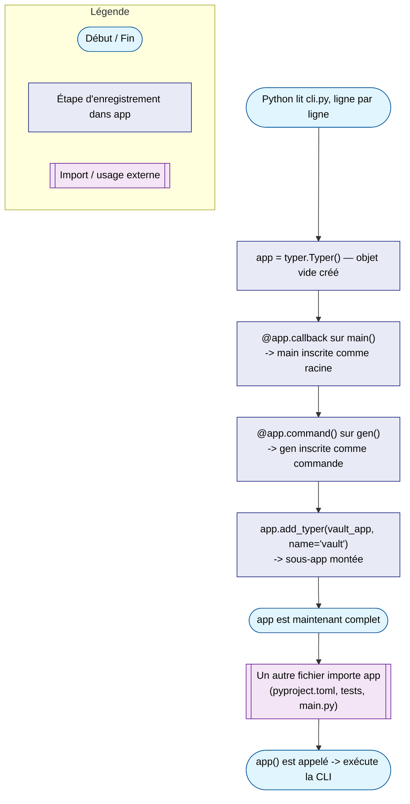

# Le pattern décorateur + registre

Le mécanisme observé dans [Typer](typer-app.md) — un objet central qui
accumule des inscriptions au fil des décorateurs — n'est pas une
particularité de Typer. C'est un pattern générique, extrêmement courant en
Python, qu'on retrouve sous des formes quasi identiques dans les frameworks
web, les frameworks de tests, et d'autres frameworks CLI.

---

## Rappel : qu'est-ce qu'un décorateur Python ?

Un décorateur est une fonction qui prend une fonction en entrée et retourne
quelque chose en sortie — la syntaxe `@decorateur` au-dessus d'une
définition de fonction est un raccourci pour `fonction =
decorateur(fonction)`.

```python
def mon_decorateur(fn):
    def wrapper(*args, **kwargs):
        print("avant l'appel")
        resultat = fn(*args, **kwargs)
        print("après l'appel")
        return resultat
    return wrapper

@mon_decorateur
def dire_bonjour():
    print("bonjour")

# équivalent à :
# dire_bonjour = mon_decorateur(dire_bonjour)
```

C'est l'usage "manuel" classique qu'on voit dans la plupart des tutoriels
(logging, mesure de temps, retry). Mais ce n'est pas le seul usage possible.

---

## Deux familles de décorateurs

| Famille | Ce que retourne le décorateur | Effet |
|---|---|---|
| **Wrapping** (tutoriel classique) | Une **nouvelle fonction**, qui enveloppe l'originale | Change le comportement à l'exécution (log, chrono, cache...) |
| **Enregistrement** (`@app.command()`, `@pytest.fixture`...) | La fonction **quasiment inchangée** | Effet de bord : inscrit la fonction dans un registre externe |

`@app.command()` de Typer appartient à la deuxième famille : il ne modifie
pas vraiment `gen` — il l'ajoute à une liste interne que `app` conserve.
C'est cette distinction qui explique pourquoi on continue d'importer `app`
(le registre) plutôt que `gen` (l'entrée qu'on vient d'y déposer).



---

## Le même pattern ailleurs en Python

### Click (la base de Typer)

```python
@click.group()
def cli():
    ...

@cli.command()
def gen():
    ...
```

`@click.group()` crée un objet `Group` ; `@cli.command()` y inscrit `gen`.
Typer fait exactement ça en interne — `app` est construit à partir d'un
`Group` Click.

### Flask / FastAPI

```python
@app.route("/users")          # Flask
def list_users(): ...

@app.get("/users")            # FastAPI
def list_users(): ...
```

`@app.route(...)` n'exécute rien à la lecture du fichier — il ajoute
`list_users` à la table de routage interne de `app`. C'est `app` (le
serveur WSGI/ASGI) qu'on lance avec `uvicorn` ou `flask run`, jamais
`list_users` directement.

### pytest

```python
@pytest.fixture
def client():
    ...
```

`@pytest.fixture` inscrit `client` dans un registre global que pytest
consulte au moment de collecter les tests — aucun appel direct à `client()`
n'apparaît dans le code utilisateur.

### Django admin

```python
@admin.register(MonModele)
class MonModeleAdmin(admin.ModelAdmin):
    ...
```

Même logique : la classe est attachée à l'objet `admin.site`, qui est le
véritable point d'entrée consulté par Django au démarrage.

---

## Tableau récapitulatif

| Framework | Objet registre | Décorateur d'enregistrement | Ce qu'on importe/exécute au final |
|---|---|---|---|
| Typer | `app = typer.Typer()` | `@app.command()`, `@app.callback()` | `app` |
| Click | `cli = click.Group()` (via `@click.group()`) | `@cli.command()` | `cli` |
| Flask | `app = Flask(__name__)` | `@app.route(...)` | `app` |
| FastAPI | `app = FastAPI()` | `@app.get(...)`, `@app.post(...)` | `app` |
| pytest | Registre interne (implicite) | `@pytest.fixture` | Le module de test lui-même (pytest le scanne) |
| Django admin | `admin.site` | `@admin.register(Modele)` | `admin.site` (consulté par Django) |

---

## Hors Python : le même besoin, sans décorateur

Les décorateurs sont une facilité syntaxique Python — le besoin
("agréger des sous-commandes dans un objet central") existe dans d'autres
écosystèmes, résolu par composition explicite :

```go
// Go — Cobra
rootCmd.AddCommand(genCmd)
rootCmd.AddCommand(vaultCmd)
```

```python
# Python — argparse (stdlib), sans décorateur
parser = argparse.ArgumentParser()
subparsers = parser.add_subparsers()
gen_parser = subparsers.add_parser("gen")
```

Dans les deux cas, il y a bien un objet racine (`rootCmd`, `parser`) qui
accumule des sous-éléments — seule la syntaxe change. Les décorateurs
rendent cette accumulation plus discrète visuellement (elle se lit au fil du
fichier, juste au-dessus de chaque fonction) mais le mécanisme sous-jacent
est identique.

---

## Pourquoi ce pattern est si répandu en Python

Sans décorateurs, il faudrait maintenir une liste ou un dictionnaire séparé
associant chaque nom de commande/route/fixture à sa fonction — un point
unique à mettre à jour à chaque ajout, facile à oublier :

```python
# Sans décorateur : un registre séparé, à maintenir à la main
COMMANDS = {
    "gen": gen,
    "vault-list": vault_list,
    "entry-list": entry_list,
}
```

Le décorateur supprime ce point de synchronisation : l'inscription se fait
**au même endroit** que la définition de la fonction, dans le même geste
d'écriture. Impossible d'oublier d'enregistrer une commande qu'on vient de
décorer.

---

## Résumé

```mermaid
mindmap
  root((Décorateur + registre))
    Deux familles
      Wrapping — change le comportement à l'exécution
      Enregistrement — inscrit dans un objet externe
    Ce qu'on importe
      Toujours l'objet registre
      Jamais une fonction décorée isolément
    Exemples Python
      Typer / Click — app, cli
      Flask / FastAPI — app
      pytest — registre implicite des fixtures
      Django admin — admin.site
    Hors Python
      Cobra (Go) — rootCmd.AddCommand
      argparse — add_subparsers, sans décorateur
    Pourquoi ce pattern
      Évite un registre séparé à maintenir à la main
      Inscription et définition au même endroit
```

!!! success "À retenir en une phrase"
    Un décorateur d'enregistrement ne transforme pas la fonction qu'il
    décore — il l'inscrit dans un objet central qui, lui, devient le
    véritable point d'entrée à importer et à exécuter.

---

## Voir aussi

- [L'objet `app`, callbacks et sous-commandes (Typer)](typer-app.md) —
  l'application concrète de ce pattern dans `pass-tool`.
- [pass-tool — documentation utilisateur](../../../systeme/ubuntu/alm_tools/outils/pass-tool.md)
