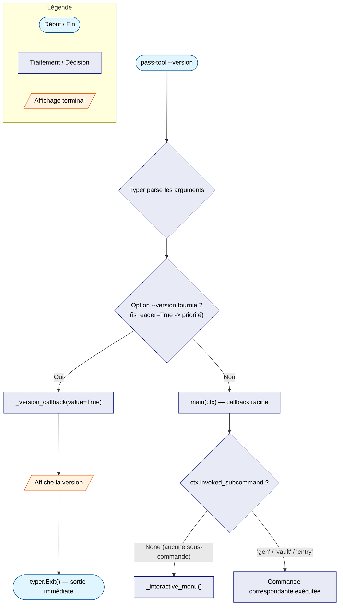
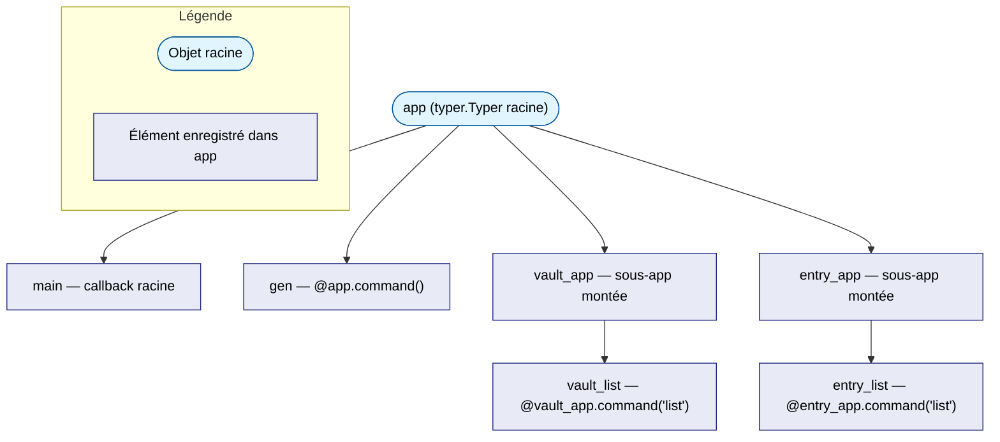

# L'objet `app`, callbacks et sous-commandes (Typer)

**Source du code utilisé en exemple :** `~/alm_tools/cli/pass-tool/src/pass_tool/cli.py`

---

## Qu'est-ce que Typer ?

[Typer](https://typer.tiangolo.com/) est un framework qui construit une CLI
à partir de **fonctions Python normales et de leurs type hints**. Écrit par
l'auteur de FastAPI, il applique la même idée : la signature de la fonction
sert de source de vérité, et le framework en déduit automatiquement le
comportement (ici, le parsing des arguments et la génération de l'aide).

```python
@app.command()
def gen(
    length: int = typer.Option(20, "--length", "-l", help="..."),
    clip: bool = typer.Option(False, "--clip", help="..."),
) -> None:
    ...
```

`length: int` devient une option qui n'accepte que des entiers ; `clip: bool`
devient un flag (`--clip` présent ou absent, pas de valeur à fournir). Typer
lit ces informations sur la fonction, il n'y a rien d'autre à déclarer.

---

## `app` est l'objet réel, pas les fonctions qu'on décore

C'est le point qui déroute le plus au début : dans `cli.py`, on écrit
plusieurs fonctions (`main`, `gen`, `vault_list`, `entry_list`,
`_interactive_menu`...), mais c'est **`app`** qu'on importe et qu'on exécute
— jamais l'une de ces fonctions isolément.

```python
app = typer.Typer(
    name="pass-tool",
    help="Wrapper ergonomique autour de pass-cli (Proton Pass)",
    add_completion=True,
)
vault_app = typer.Typer(help="Manage Proton Pass vaults.")
entry_app = typer.Typer(help="Manage Proton Pass entries.")
app.add_typer(vault_app, name="vault")
app.add_typer(entry_app, name="entry")
```

`app` est un objet qui, au fil de la lecture du fichier, **accumule** tout ce
qu'on lui attache : une fonction racine, des commandes, des sous-applications.
Chaque décorateur (`@app.command()`, `@app.callback()`) et chaque appel
(`app.add_typer(...)`) est une **inscription** dans cet objet — jamais une
transformation de la fonction en un nouveau point d'entrée autonome.

C'est pour ça que :

- `pyproject.toml` déclare `pass-tool = "pass_tool.cli:app"` — c'est `app`
  que le shim généré par `uv tool install` importe et appelle.
- les tests font `runner.invoke(app, ["--help"])` — jamais
  `runner.invoke(main, ...)` ou `runner.invoke(gen, ...)`.
- `if __name__ == "__main__": app()` appelle `app`, pas une fonction précise.

---

## Qu'est-ce qu'un « callback », en général ?

Avant d'entrer dans le vocabulaire Typer : un **callback** est une fonction
qu'on ne appelle **pas soi-même** — on la passe en référence à un autre
morceau de code, qui décidera **quand** l'appeler. C'est une inversion de
contrôle : on écrit le "quoi faire", quelqu'un d'autre décide du "quand".

```python
# "Rappelle-moi" (call back) quand le bouton est cliqué —
# je ne sais ni quand ni si ça arrivera, c'est le framework qui décide.
button.on_click(ma_fonction)
```

Dans Typer, ce principe apparaît sous **deux formes distinctes** — c'est une
source fréquente de confusion pour un débutant, car le même mot désigne deux
mécanismes différents dans le même fichier.

---

## Callback n°1 — le callback racine (`@app.callback`)

```python
@app.callback(invoke_without_command=True)
def main(
    ctx: typer.Context,
    version: bool | None = typer.Option(
        None, "--version", "-V",
        callback=_version_callback,
        is_eager=True,
        help="Show version and exit",
    ),
) -> None:
    """Wrap pass-cli commands ergonomically for Proton Pass."""
    if ctx.invoked_subcommand is None:
        _interactive_menu()
        raise typer.Exit()
```

`@app.callback(...)` enregistre `main` comme la fonction que **Typer
exécute avant toute sous-commande** — c'est le point de passage obligé de
n'importe quel appel à `pass-tool`, avec ou sans sous-commande.

- Par défaut, un callback racine ne s'exécute que si une sous-commande est
  aussi fournie. `invoke_without_command=True` change ce comportement : le
  callback s'exécute **même si aucune sous-commande n'est tapée** — c'est ce
  qui permet à `pass-tool` (sans rien derrière) de déclencher le menu
  interactif.
- `ctx: typer.Context` est l'objet que Typer construit après avoir parsé la
  ligne de commande. `ctx.invoked_subcommand` contient le nom de la
  sous-commande demandée (`"gen"`, `"vault"`, `"entry"`) — ou `None` si
  aucune n'a été tapée. C'est cette valeur que `main` inspecte pour décider
  de lancer `_interactive_menu()`.

## Callback n°2 — le callback d'option (« eager callback »)

```python
def _version_callback(value: bool) -> None:
    if value:
        console.print(f"pass-tool {__version__}")
        raise typer.Exit()
```

`_version_callback` est passé en argument `callback=` à `typer.Option(...)`,
dans la définition du paramètre `version` de `main`. Ce n'est **pas** le
callback racine — c'est une fonction que Typer appelle **dès que l'option
`--version` est parsée**, avant même d'exécuter le corps de `main`.

`is_eager=True` dit à Typer : "traite cette option en priorité, avant les
autres". C'est indispensable ici — si `--version` n'était pas eager, Typer
pourrait exiger que d'autres options obligatoires soient également fournies
avant de pouvoir traiter `--version`, ce qui casserait l'usage attendu
(`pass-tool --version` doit fonctionner seul, sans rien d'autre).

!!! tip "Comment les distinguer"
    - **Callback racine** (`@app.callback`) : décore une fonction entière,
      c'est le point d'entrée logique de toute l'application.
    - **Callback d'option** (`callback=...` dans `typer.Option`) : une
      fonction minuscule, dédiée à une seule option, appelée pendant le
      parsing — pas après.

---

## Le flux complet, visualisé



---

## Commandes et sous-apps : comment l'arborescence se construit

Trois mécanismes distincts alimentent `app`, chacun avec un rôle précis :

| Mécanisme | Exemple dans `cli.py` | Effet |
|---|---|---|
| `@app.callback(...)` | `main` | Fonction racine, exécutée avant/à la place de toute sous-commande |
| `@app.command()` | `gen` | Ajoute une commande directe : `pass-tool gen` |
| `@vault_app.command("list")` | `vault_list` | Ajoute une commande à la sous-app `vault_app` |
| `app.add_typer(vault_app, name="vault")` | (appel direct, pas un décorateur) | Monte `vault_app` comme sous-arborescence de `app`, sous le préfixe `vault` |

Le résultat : `pass-tool vault list` fonctionne parce que `vault_list` a été
enregistrée dans `vault_app` (`@vault_app.command("list")`), et que
`vault_app` lui-même a été monté dans `app` (`app.add_typer(vault_app,
name="vault")`). C'est une composition à deux niveaux, comme des
sous-dossiers dans une arborescence de fichiers.



---

## Comment `app` devient exécutable

```python
if __name__ == "__main__":
    app()
```

`app()` — appeler l'objet — déclenche la construction de la structure Click
sous-jacente à partir de tout ce qui a été enregistré (callback racine,
commandes, sous-apps), puis parse `sys.argv` et exécute la branche
correspondante.

C'est exactement ce que fait `uv run pass-tool` (via le point d'entrée
`pass_tool.cli:app` déclaré dans `pyproject.toml`) et ce que fait
`CliRunner().invoke(app, [...])` dans les tests — les deux appellent le même
objet `app`, l'un avec `sys.argv` réel, l'autre avec une liste
d'arguments simulée.

---

## Ce qu'il faut retenir

- `app` est l'objet applicatif complet — c'est lui qu'on importe, jamais une
  fonction décorée individuellement.
- Un décorateur Typer (`@app.command()`, `@app.callback()`) **enregistre**
  une fonction dans `app` ; il ne la remplace pas et ne devient pas
  lui-même le point d'entrée.
- « Callback » a deux sens différents dans ce fichier : le **callback
  racine** (point d'entrée logique de toute la CLI) et le **callback
  d'option** (déclenché pendant le parsing d'une option précise, souvent
  avec `is_eager=True`).
- Les sous-apps (`vault_app`, `entry_app`) montées via `add_typer` créent une
  arborescence de commandes à plusieurs niveaux.

---

## Voir aussi

- [Le pattern décorateur + registre](decorateurs-registry.md) — pourquoi ce
  mécanisme d'enregistrement se retrouve dans la plupart des frameworks
  Python.
- [pass-tool — documentation utilisateur](../../../systeme/ubuntu/alm_tools/outils/pass-tool.md)
- [pass-cli en Python — subprocess et JSON](../pass-cli-subprocess.md) —
  comment `cli.py` appelle `pass-cli` en coulisses.
