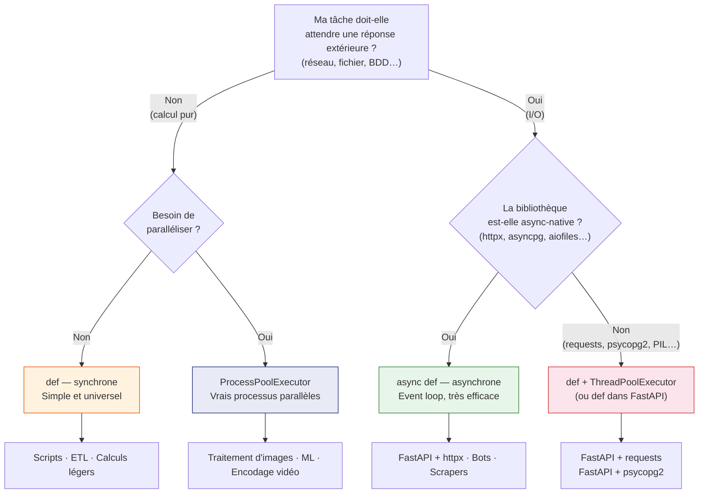

# Async vs Sync vs Threads — Guide de décision

Cette page met les **trois approches face à face** avec des exemples mesurables,
pour que vous puissiez choisir en connaissance de cause.

---

## Le test décisif : 5 tâches I/O en parallèle

Voici le même problème résolu trois fois. Exécutez les scripts et comparez.

### Version synchrone

```python
"""Téléchargement séquentiel — version synchrone.

Exécution :
    uv run compare_sync.py
"""

import time


def fetch_data(nom: str, duree: float) -> str:
    """Simule une requête réseau d'une durée variable.

    Args:
        nom: Identifiant de la ressource.
        duree: Durée simulée de la requête en secondes.

    Returns:
        Message de résultat.
    """
    print(f"  → [{nom}] Début  (durée : {duree}s)")
    time.sleep(duree)
    print(f"  ✓ [{nom}] Terminé")
    return f"Résultat de {nom}"


def main() -> None:
    taches = [
        ("Utilisateurs", 1.0),
        ("Produits",     0.8),
        ("Commandes",    1.2),
        ("Stocks",       0.5),
        ("Factures",     0.9),
    ]

    debut = time.perf_counter()
    resultats = [fetch_data(nom, duree) for nom, duree in taches]
    fin = time.perf_counter()

    total = sum(d for _, d in taches)
    print(f"\n[SYNC]  Temps réel      : {fin - debut:.2f}s")
    print(f"[SYNC]  Temps théorique : {total:.1f}s  (somme de toutes les durées)")
    print(f"[SYNC]  Résultats       : {len(resultats)} tâches terminées")


if __name__ == "__main__":
    main()
```

**Résultat attendu :**

```
  → [Utilisateurs] Début  (durée : 1.0s)
  ✓ [Utilisateurs] Terminé
  → [Produits] Début  (durée : 0.8s)
  ...

[SYNC]  Temps réel      : 4.40s
[SYNC]  Temps théorique : 4.4s  (somme de toutes les durées)
```

### Version avec threads

```python
"""Téléchargement parallèle — version avec threads.

Le GIL est libéré pendant time.sleep(), ce qui permet de vraies
exécutions simultanées.

Exécution :
    uv run compare_threads.py
"""

import concurrent.futures
import time


def fetch_data(nom: str, duree: float) -> str:
    """Simule une requête réseau d'une durée variable.

    Args:
        nom: Identifiant de la ressource.
        duree: Durée simulée de la requête en secondes.

    Returns:
        Message de résultat.
    """
    print(f"  → [{nom}] Début  (durée : {duree}s)")
    time.sleep(duree)   # GIL libéré ici — les autres threads avancent
    print(f"  ✓ [{nom}] Terminé")
    return f"Résultat de {nom}"


def main() -> None:
    taches = [
        ("Utilisateurs", 1.0),
        ("Produits",     0.8),
        ("Commandes",    1.2),
        ("Stocks",       0.5),
        ("Factures",     0.9),
    ]

    debut = time.perf_counter()

    with concurrent.futures.ThreadPoolExecutor(max_workers=len(taches)) as ex:
        futurs = [ex.submit(fetch_data, nom, duree) for nom, duree in taches]
        resultats = [f.result() for f in futurs]

    fin = time.perf_counter()
    duree_max = max(d for _, d in taches)
    print(f"\n[THREADS] Temps réel      : {fin - debut:.2f}s")
    print(f"[THREADS] Temps théorique : {duree_max}s  (durée de la plus longue tâche)")
    print(f"[THREADS] Résultats       : {len(resultats)} tâches terminées")


if __name__ == "__main__":
    main()
```

**Résultat attendu :**

```
  → [Utilisateurs] Début  (durée : 1.0s)
  → [Produits] Début  (durée : 0.8s)
  → [Commandes] Début  (durée : 1.2s)
  → [Stocks] Début  (durée : 0.5s)
  → [Factures] Début  (durée : 0.9s)
  ✓ [Stocks] Terminé
  ✓ [Produits] Terminé
  ...

[THREADS] Temps réel      : 1.20s
[THREADS] Temps théorique : 1.2s  (durée de la plus longue tâche)
```

### Version asynchrone

```python
"""Téléchargement concurrent — version asynchrone.

Exécution :
    uv run compare_async.py
"""

import asyncio
import time


async def fetch_data(nom: str, duree: float) -> str:
    """Simule une requête réseau d'une durée variable (version async).

    Args:
        nom: Identifiant de la ressource.
        duree: Durée simulée de la requête en secondes.

    Returns:
        Message de résultat.
    """
    print(f"  → [{nom}] Début  (durée : {duree}s)")
    await asyncio.sleep(duree)  # Suspend cette coroutine — les autres avancent
    print(f"  ✓ [{nom}] Terminé")
    return f"Résultat de {nom}"


async def main() -> None:
    taches = [
        ("Utilisateurs", 1.0),
        ("Produits",     0.8),
        ("Commandes",    1.2),
        ("Stocks",       0.5),
        ("Factures",     0.9),
    ]

    debut = time.perf_counter()
    resultats = await asyncio.gather(
        *[fetch_data(nom, duree) for nom, duree in taches]
    )
    fin = time.perf_counter()

    duree_max = max(d for _, d in taches)
    print(f"\n[ASYNC] Temps réel      : {fin - debut:.2f}s")
    print(f"[ASYNC] Temps théorique : {duree_max}s  (durée de la plus longue tâche)")
    print(f"[ASYNC] Résultats       : {len(resultats)} tâches terminées")


if __name__ == "__main__":
    asyncio.run(main())
```

**Résultat attendu :**

```
  → [Utilisateurs] Début  (durée : 1.0s)
  → [Produits] Début  (durée : 0.8s)
  → [Commandes] Début  (durée : 1.2s)
  → [Stocks] Début  (durée : 0.5s)
  → [Factures] Début  (durée : 0.9s)
  ✓ [Stocks] Terminé
  ✓ [Produits] Terminé
  ...

[ASYNC] Temps réel      : 1.20s
[ASYNC] Temps théorique : 1.2s  (durée de la plus longue tâche)
```

### Script unique — les trois en un seul lancement

Pour comparer directement, ce script exécute les trois approches à la suite
et affiche un tableau récapitulatif :

```python
"""Comparaison sync / threads / async sur 5 tâches I/O simulées.

Ce script est conçu pour être exécuté une seule fois et afficher
les trois temps côte à côte dans un tableau.

Exécution :
    uv run compare_all.py
"""

import asyncio
import concurrent.futures
import time

TACHES = [
    ("Utilisateurs", 1.0),
    ("Produits",     0.8),
    ("Commandes",    1.2),
    ("Stocks",       0.5),
    ("Factures",     0.9),
]


# ── Implémentation des trois approches ────────────────────────────────────────

def fetch_sync(nom: str, duree: float) -> str:
    """Version synchrone — bloque jusqu'à la fin de l'attente."""
    time.sleep(duree)
    return f"ok:{nom}"


def fetch_thread(args: tuple[str, float]) -> str:
    """Version thread — appelée par ThreadPoolExecutor.map() via un tuple."""
    nom, duree = args
    time.sleep(duree)
    return f"ok:{nom}"


async def fetch_async(nom: str, duree: float) -> str:
    """Version async — suspend la coroutine sans bloquer l'event loop."""
    await asyncio.sleep(duree)
    return f"ok:{nom}"


# ── Fonctions de mesure ────────────────────────────────────────────────────────

def mesurer_sync() -> float:
    """Exécute les 5 tâches de façon séquentielle et retourne le temps écoulé."""
    debut = time.perf_counter()
    [fetch_sync(nom, duree) for nom, duree in TACHES]
    return time.perf_counter() - debut


def mesurer_threads() -> float:
    """Exécute les 5 tâches en parallèle via threads et retourne le temps écoulé."""
    debut = time.perf_counter()
    with concurrent.futures.ThreadPoolExecutor(max_workers=len(TACHES)) as ex:
        list(ex.map(fetch_thread, TACHES))
    return time.perf_counter() - debut


async def _lancer_async() -> None:
    await asyncio.gather(*[fetch_async(nom, d) for nom, d in TACHES])


def mesurer_async() -> float:
    """Exécute les 5 tâches via l'event loop et retourne le temps écoulé."""
    debut = time.perf_counter()
    asyncio.run(_lancer_async())
    return time.perf_counter() - debut


# ── Affichage ─────────────────────────────────────────────────────────────────

def main() -> None:
    total_theorique = sum(d for _, d in TACHES)
    duree_max = max(d for _, d in TACHES)

    print(f"5 tâches I/O simulées")
    print(f"Temps séquentiel théorique : {total_theorique:.1f}s")
    print(f"Temps concurrent théorique : {duree_max}s\n")
    print("Mesure en cours...")

    t_sync    = mesurer_sync()
    t_threads = mesurer_threads()
    t_async   = mesurer_async()

    print()
    print("┌─────────────────┬──────────┬───────────────────────┐")
    print("│ Approche        │  Temps   │ Gain vs sync          │")
    print("├─────────────────┼──────────┼───────────────────────┤")
    print(f"│ Sync            │ {t_sync:5.2f}s   │ —                     │")
    print(f"│ Threads         │ {t_threads:5.2f}s   │ {t_sync/t_threads:4.1f}× plus rapide       │")
    print(f"│ Async           │ {t_async:5.2f}s   │ {t_sync/t_async:4.1f}× plus rapide       │")
    print("└─────────────────┴──────────┴───────────────────────┘")


if __name__ == "__main__":
    main()
```

**Résultat attendu :**

```
5 tâches I/O simulées
Temps séquentiel théorique : 4.4s
Temps concurrent théorique : 1.2s

Mesure en cours...

┌─────────────────┬──────────┬───────────────────────┐
│ Approche        │  Temps   │ Gain vs sync          │
├─────────────────┼──────────┼───────────────────────┤
│ Sync            │  4.40s   │ —                     │
│ Threads         │  1.21s   │ 3.6× plus rapide      │
│ Async           │  1.20s   │ 3.7× plus rapide      │
└─────────────────┴──────────┴───────────────────────┘
```

### Ce que cela montre

| | Sync | Threads | Async |
|---|---|---|---|
| **Temps total (I/O)** | 4.4s (somme) | ~1.2s (max) | ~1.2s (max) |
| **Ordre de fin** | Ordre de démarrage | Selon durée | Selon durée |
| **Complexité** | Minime | Moyenne | Légèrement verbeux |
| **Sécurité données partagées** | Oui | Risque de race conditions | Oui (monothread) |
| **Gain sur I/O** | — | 3.7× | 3.7× |

!!! success "La règle fondamentale"
    - **Sync** : temps total = **somme** de toutes les durées
    - **Threads** et **Async** : temps total ≈ durée de la **plus longue** tâche

---

## Quand aucune des trois n'aide : les tâches CPU

Ni sync, ni threads, ni async n'accélèrent les calculs purs — à cause
du GIL. Ce script en apporte la preuve :

```python
"""Démonstration : sync, threads et async sont équivalents sur CPU.

Le GIL interdit tout vrai parallélisme CPU en Python standard.

Exécution :
    uv run test_cpu_compare.py
"""

import asyncio
import concurrent.futures
import time


def calcul(n: int) -> int:
    """Calcule la somme des carrés de 0 à n-1 — tâche purement CPU.

    Args:
        n: Limite supérieure du calcul.

    Returns:
        Somme des carrés.
    """
    return sum(i * i for i in range(n))


async def calcul_async(n: int) -> int:
    """Version async — sans await, bloque l'event loop comme le sync."""
    return sum(i * i for i in range(n))


N = 8_000_000


def main() -> None:
    # Sync — séquentiel
    debut = time.perf_counter()
    for _ in range(4):
        calcul(N)
    t_sync = time.perf_counter() - debut

    # Threads — parallèle (mais GIL bloque)
    debut = time.perf_counter()
    with concurrent.futures.ThreadPoolExecutor(max_workers=4) as ex:
        list(ex.map(calcul, [N] * 4))
    t_threads = time.perf_counter() - debut

    # Async — concurrent (mais GIL bloque toujours)
    async def run() -> None:
        await asyncio.gather(*[calcul_async(N) for _ in range(4)])

    debut = time.perf_counter()
    asyncio.run(run())
    t_async = time.perf_counter() - debut

    print(f"[SYNC]    4 calculs CPU : {t_sync:.2f}s")
    print(f"[THREADS] 4 calculs CPU : {t_threads:.2f}s")
    print(f"[ASYNC]   4 calculs CPU : {t_async:.2f}s")
    print()
    print("→ Résultats identiques — le GIL bloque les trois approches.")
    print("  Pour du CPU en parallèle, utilisez multiprocessing.")


if __name__ == "__main__":
    main()
```

**Résultat attendu :**

```
[SYNC]    4 calculs CPU : 2.40s
[THREADS] 4 calculs CPU : 2.55s
[ASYNC]   4 calculs CPU : 2.40s
→ Résultats identiques — le GIL bloque les trois approches.
  Pour du CPU en parallèle, utilisez multiprocessing.
```

!!! warning "Pour les calculs CPU intensifs : `multiprocessing`"
    `multiprocessing.Pool` et `ProcessPoolExecutor` créent de **vrais processus**
    séparés — chacun avec son propre Python et son propre GIL. Ils peuvent réellement
    s'exécuter en parallèle sur plusieurs cœurs CPU.

    ```python
    import concurrent.futures

    with concurrent.futures.ProcessPoolExecutor(max_workers=4) as ex:
        resultats = list(ex.map(calcul, [N] * 4))
    # Temps : ~0.6s au lieu de ~2.4s — vrai parallélisme CPU
    ```

---

## Tableau de comparaison complet

| Critère | Sync | Threads | Async | Multiprocessing |
|---------|------|---------|-------|-----------------|
| **Complexité** | Faible | Moyenne | Moyenne | Élevée |
| **Performance I/O** | Faible | Bonne | Excellente | Faible |
| **Performance CPU** | Normale | Normale (GIL) | Normale (GIL) | Excellente |
| **Race conditions** | Non | Oui — verrous requis | Non (monothread) | Oui (mémoire partagée) |
| **Compatibilité bibliothèques** | Toutes | Toutes | Async-native requises | Toutes |
| **Débogage** | Facile | Difficile | Moyen | Très difficile |
| **Mémoire** | Faible | Moyenne | Faible | Élevée |
| **FastAPI `def`** | Thread pool auto | — | — | — |
| **FastAPI `async def`** | — | — | Event loop direct | — |

---

## Diagramme de décision



---

## Résumé : les règles pratiques

!!! success "Choisir `async def` si..."
    - Votre code fait des I/O réseau ou BDD
    - Les bibliothèques sont async-natives (`httpx`, `asyncpg`, `aiofiles`)
    - Vous construisez un serveur FastAPI haute performance
    - Vous devez lancer de nombreuses opérations en parallèle

!!! info "Choisir `def` + threads si..."
    - Vous utilisez des bibliothèques sans alternative async (`requests`, `psycopg2`)
    - Vous migrez du code sync existant sans tout réécrire
    - Vous écrivez un endpoint FastAPI avec `def` — FastAPI ajoute le thread pool

!!! warning "Rester avec `def` simple si..."
    - Le code ne fait pas d'I/O (calculs purs, transformations de données)
    - C'est un script ponctuel ou une tâche simple
    - Vous débutez — maîtrisez le sync avant d'aborder async et threads

!!! danger "Ne jamais faire"
    Utiliser `async def` avec des bibliothèques **synchrones** bloquantes.
    Cela gèle l'event loop entier et dégrade les performances *en dessous*
    du mode sync.

    ```python
    # ❌ Pire des deux mondes — bloque l'event loop entier
    async def get_user(url: str) -> dict:
        response = requests.get(url)   # requests est synchrone !
        return response.json()

    # ✅ Solution A — bibliothèque async
    async def get_user(url: str) -> dict:
        async with httpx.AsyncClient() as client:
            response = await client.get(url)
            return response.json()

    # ✅ Solution B — rester synchrone (FastAPI gère le thread pool)
    def get_user(url: str) -> dict:
        response = requests.get(url)
        return response.json()
    ```

---

*Voir aussi : [Python synchrone](sync.md) · [Python asynchrone](async.md) · [Les threads](threads.md)*

*Dans le contexte de FastAPI : [Architecture et code — Async vs Sync dans une API](../fastapi/code.md#async-vs-sync-la-regle-dor)*
