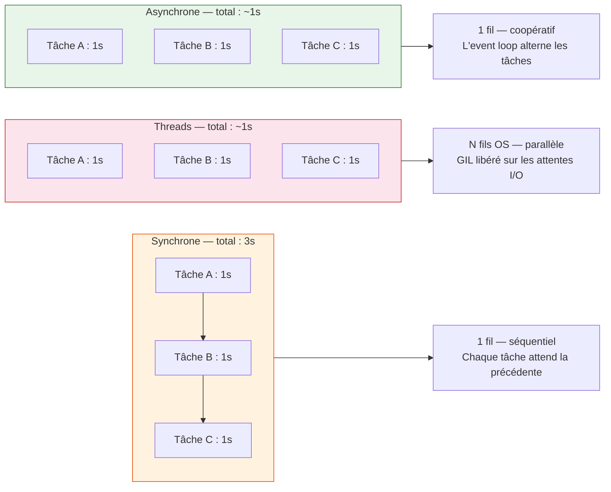

# Concurrence en Python — Sync, Threads & Async

Python propose **trois modèles** pour gérer plusieurs tâches simultanément.
Comprendre lequel choisir est indispensable dès que votre code attend des
données extérieures : réseau, disque, base de données.

## Pages

-   :material-arrow-down-thin: **[Python synchrone](sync.md)**

    Le mode par défaut — exécution ligne par ligne et blocage I/O.

-   :material-sync: **[Python asynchrone](async.md)**

    L'event loop, les coroutines `async/await` et `asyncio`.

-   :material-source-branch: **[Les threads](threads.md)**

    Parallélisme avec les bibliothèques sync — GIL, race conditions, verrous.

-   :material-scale-balance: **[Async vs Sync vs Threads](async-vs-sync.md)**

    Comparaison avec exemples mesurables et guide de décision.

## À retenir avant de commencer

- **Synchrone** = Python exécute une instruction à la fois ; pendant une
  attente réseau, **tout s'arrête**.
- **Threads** = plusieurs fils d'exécution OS ; chacun peut progresser
  pendant que les autres attendent ; attention aux **race conditions** sur les
  données partagées.
- **Asynchrone** = un seul fil d'exécution géré par une boucle d'événements ;
  pendant qu'une tâche attend, **les autres avancent** — sans risque de race
  condition.
- Le bon choix dépend de **ce que fait votre code**, pas de vos préférences.

