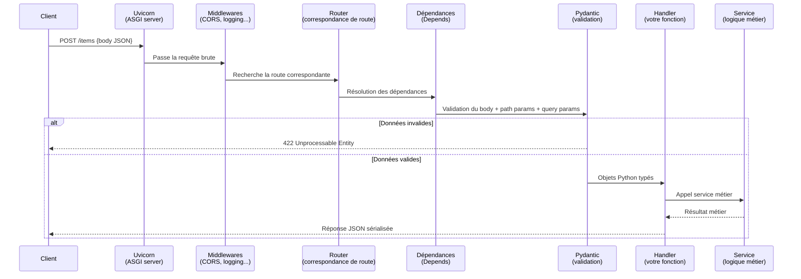
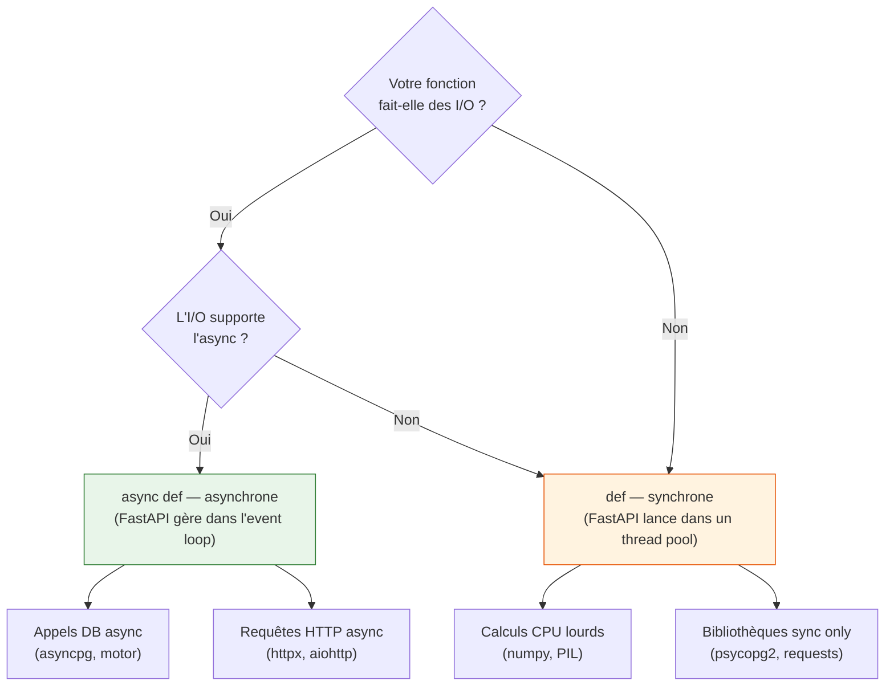
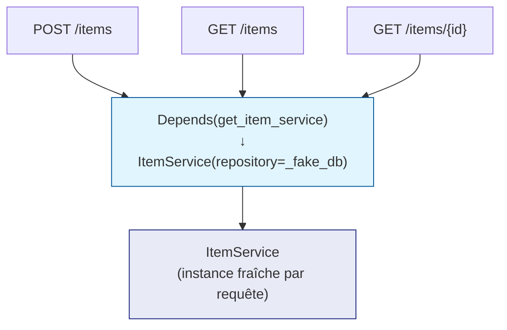

# FastAPI — Architecture et Code

## Cycle de vie d'une requête

Comprendre ce qui se passe sous le capot est indispensable pour déboguer efficacement.



---

## Async vs Sync : la règle d'or

FastAPI supporte les deux modes. Le choix impacte les performances :



!!! warning "L'erreur fréquente"
    Utiliser `async def` avec une bibliothèque **synchrone** (comme `requests` ou
    `psycopg2`) bloque l'event loop et dégrade les performances. Si votre bibliothèque
    n'est pas async-native, utilisez `def` — FastAPI l'exécutera dans un thread pool
    automatiquement.

---

## Structure de projet (Clean Architecture)

Pour des projets au-delà du prototype, adoptez cette structure modulaire dès le départ :

```
my-api/
├── pyproject.toml
├── pyrightconfig.json
│
└── app/
    ├── main.py              # Initialisation FastAPI, inclusion des routers
    ├── core/
    │   └── config.py        # Variables d'environnement (pydantic-settings)
    │
    ├── api/
    │   └── v1/
    │       ├── __init__.py
    │       └── routers/
    │           ├── items.py     # Routes /items
    │           └── users.py     # Routes /users
    │
    ├── schemas/             # Modèles Pydantic (entrée / sortie)
    │   ├── item.py
    │   └── user.py
    │
    ├── services/            # Logique métier pure (sans FastAPI)
    │   └── item_service.py
    │
    └── repositories/        # Accès aux données (Port → Adaptateur)
        └── item_repository.py
```

!!! tip "Règle de visibilité"
    `main.py` importe les routers. Les routers importent les schemas et les services.
    Les services importent les repositories. **Les schemas n'importent jamais les
    routers, et les services n'importent jamais FastAPI.**

---

## Exemple complet : API de catalogue technique

### Schémas Pydantic (`app/schemas/item.py`)

```python
"""Modèles de données pour les items du catalogue.

Sépare les données d'entrée (ce que le client envoie) des données de sortie
(ce que l'API renvoie). Cette séparation évite d'exposer accidentellement
des champs internes (ex: hash de mot de passe).
"""

from pydantic import BaseModel, ConfigDict, Field, field_validator


class ItemBase(BaseModel):
    """Champs communs à la création et à la réponse."""

    name: str = Field(
        min_length=3,
        max_length=100,
        description="Nom de l'outil ou de la technologie.",
        examples=["FastAPI", "PostgreSQL"],
    )
    version: str = Field(
        pattern=r"^\d+\.\d+\.\d+$",
        description="Version sémantique au format MAJEUR.MINEUR.PATCH.",
        examples=["0.115.0"],
    )
    description: str | None = Field(
        default=None,
        max_length=500,
    )


class ItemCreate(ItemBase):
    """Données attendues lors de la création d'un item (POST /items)."""

    @field_validator("name")
    @classmethod
    def name_must_not_be_test(cls, v: str) -> str:
        """Interdit le mot 'test' dans le nom (environnement de production)."""
        if "test" in v.lower():
            raise ValueError("Le nom ne peut pas contenir 'test'.")
        return v.strip()


class ItemUpdate(BaseModel):
    """Données pour une mise à jour partielle (PATCH /items/{id}).

    Tous les champs sont optionnels — seuls les champs fournis sont mis à jour.
    """

    name: str | None = Field(default=None, min_length=3, max_length=100)
    version: str | None = Field(default=None, pattern=r"^\d+\.\d+\.\d+$")
    description: str | None = None
    is_active: bool | None = None


class ItemResponse(ItemBase):
    """Données renvoyées par l'API après création ou lecture.

    `from_attributes=True` permet de construire ce modèle depuis un objet
    ORM (SQLAlchemy, etc.) en plus des dicts.
    """

    model_config = ConfigDict(from_attributes=True)

    id: int
    is_active: bool = True
```

### Service métier (`app/services/item_service.py`)

```python
"""Logique métier pour la gestion du catalogue d'items.

Ce module ne connaît ni FastAPI, ni les détails de stockage.
Il travaille uniquement avec des entités Python.
"""

from app.schemas.item import ItemCreate, ItemResponse, ItemUpdate


class ItemService:
    """Gère les opérations sur le catalogue technique.

    Args:
        repository: Implémentation du stockage (injection de dépendances).
    """

    def __init__(self, repository: list[dict]) -> None:
        self._db = repository
        self._counter = 0

    def create(self, data: ItemCreate) -> ItemResponse:
        """Crée un nouvel item et le persiste.

        Args:
            data: Données validées par Pydantic.

        Returns:
            L'item créé avec son identifiant généré.
        """
        self._counter += 1
        record = {
            "id": self._counter,
            "is_active": True,
            **data.model_dump(),
        }
        self._db.append(record)
        return ItemResponse(**record)

    def get_all(self, active_only: bool = True) -> list[ItemResponse]:
        """Retourne tous les items, filtrés selon leur statut actif.

        Args:
            active_only: Si True, exclut les items désactivés.

        Returns:
            Liste des items correspondant au filtre.
        """
        items = self._db if not active_only else [
            i for i in self._db if i["is_active"]
        ]
        return [ItemResponse(**i) for i in items]

    def get_by_id(self, item_id: int) -> ItemResponse | None:
        """Recherche un item par son identifiant.

        Args:
            item_id: Identifiant unique de l'item.

        Returns:
            L'item trouvé, ou None si inexistant.
        """
        for item in self._db:
            if item["id"] == item_id:
                return ItemResponse(**item)
        return None

    def update(self, item_id: int, data: ItemUpdate) -> ItemResponse | None:
        """Met à jour partiellement un item existant (PATCH).

        Args:
            item_id: Identifiant de l'item à modifier.
            data: Champs à mettre à jour (seuls les champs non-None sont appliqués).

        Returns:
            L'item mis à jour, ou None si l'item est introuvable.
        """
        for item in self._db:
            if item["id"] == item_id:
                updates = data.model_dump(exclude_none=True)
                item.update(updates)
                return ItemResponse(**item)
        return None
```

### Router FastAPI (`app/api/v1/routers/items.py`)

```python
"""Endpoints REST pour le catalogue d'items.

Ce module ne contient aucune règle métier — il traduit HTTP en appels de service.
"""

from fastapi import APIRouter, Depends, HTTPException, Query, status

from app.schemas.item import ItemCreate, ItemResponse, ItemUpdate
from app.services.item_service import ItemService

router = APIRouter(prefix="/items", tags=["Catalogue"])

# Base de données simulée (remplacer par un vrai repository en production)
_fake_db: list[dict] = []


def get_item_service() -> ItemService:
    """Fabrique le service avec sa dépendance de stockage.

    En production, injecter ici une session SQLAlchemy ou un client MongoDB.
    """
    return ItemService(repository=_fake_db)


@router.post(
    "/",
    response_model=ItemResponse,
    status_code=status.HTTP_201_CREATED,
    summary="Ajouter un outil au catalogue",
)
async def create_item(
    item: ItemCreate,
    service: ItemService = Depends(get_item_service),
) -> ItemResponse:
    """Crée un nouvel item dans le catalogue technique.

    - **name** : Nom unique de l'outil (min 3 caractères, sans 'test')
    - **version** : Format sémantique obligatoire (ex: 1.2.3)
    - **description** : Description optionnelle (max 500 caractères)
    """
    return service.create(item)


@router.get(
    "/",
    response_model=list[ItemResponse],
    summary="Lister les outils du catalogue",
)
async def list_items(
    active_only: bool = Query(default=True, description="Filtrer sur les items actifs"),
    service: ItemService = Depends(get_item_service),
) -> list[ItemResponse]:
    """Retourne la liste des items du catalogue.

    Utilisez `?active_only=false` pour inclure les items désactivés.
    """
    return service.get_all(active_only=active_only)


@router.get(
    "/{item_id}",
    response_model=ItemResponse,
    summary="Récupérer un outil par son ID",
)
async def get_item(
    item_id: int,
    service: ItemService = Depends(get_item_service),
) -> ItemResponse:
    """Retourne un item spécifique par son identifiant numérique."""
    item = service.get_by_id(item_id)
    if item is None:
        raise HTTPException(
            status_code=status.HTTP_404_NOT_FOUND,
            detail=f"Item {item_id} introuvable.",
        )
    return item


@router.patch(
    "/{item_id}",
    response_model=ItemResponse,
    summary="Mettre à jour partiellement un outil",
)
async def update_item(
    item_id: int,
    data: ItemUpdate,
    service: ItemService = Depends(get_item_service),
) -> ItemResponse:
    """Met à jour uniquement les champs fournis dans le body (PATCH sémantique)."""
    updated = service.update(item_id, data)
    if updated is None:
        raise HTTPException(
            status_code=status.HTTP_404_NOT_FOUND,
            detail=f"Item {item_id} introuvable.",
        )
    return updated
```

### Point d'entrée (`app/main.py`)

```python
"""Initialisation de l'application FastAPI.

Ce fichier est le seul à connaître tous les routers. Il ne contient
aucune logique métier ni route directe.
"""

from fastapi import FastAPI
from fastapi.middleware.cors import CORSMiddleware

from app.api.v1.routers import items

app = FastAPI(
    title="Catalogue Technique",
    description="API de gestion des outils et technologies.",
    version="1.0.0",
    docs_url="/docs",
    redoc_url="/redoc",
)

# Middleware CORS — autoriser les appels depuis le navigateur
app.add_middleware(
    CORSMiddleware,
    allow_origins=["http://localhost:3000"],  # Frontend de dev
    allow_methods=["*"],
    allow_headers=["*"],
)

# Inclusion des routers
app.include_router(items.router, prefix="/api/v1")


@app.get("/", include_in_schema=False)
async def root() -> dict[str, str]:
    return {"message": "API opérationnelle. Voir /docs pour la documentation."}
```

---

## L'injection de dépendances (`Depends`)

`Depends` est le système d'injection de dépendances de FastAPI. Il permet de partager
de la logique entre endpoints sans la dupliquer.



### Dépendances enchaînées

Les dépendances peuvent elles-mêmes avoir des dépendances :

```python
from fastapi import Header, HTTPException, Depends


async def verify_api_key(x_token: str = Header(...)) -> str:
    """Vérifie que le header X-Token est présent et valide.

    Args:
        x_token: Header HTTP X-Token (requis).

    Returns:
        Le token validé.

    Raises:
        HTTPException: 403 si le token est absent ou incorrect.
    """
    if x_token != "secret-token":
        raise HTTPException(
            status_code=403,
            detail="Token invalide ou manquant.",
        )
    return x_token


async def get_current_user(token: str = Depends(verify_api_key)) -> dict:
    """Résout l'utilisateur courant à partir du token validé.

    Args:
        token: Token déjà validé par verify_api_key.

    Returns:
        Dictionnaire représentant l'utilisateur connecté.
    """
    return {"username": "alice", "role": "admin"}


# Endpoint protégé — les deux dépendances s'exécutent en séquence
@router.get("/admin/items")
async def admin_items(
    user: dict = Depends(get_current_user),
) -> dict:
    return {"user": user["username"], "items": []}
```

---

## Codes de statut HTTP courants

| Code | Constante FastAPI | Signification |
|------|-------------------|---------------|
| 200 | `HTTP_200_OK` | Succès — lecture/mise à jour |
| 201 | `HTTP_201_CREATED` | Ressource créée |
| 204 | `HTTP_204_NO_CONTENT` | Suppression réussie (pas de body) |
| 400 | `HTTP_400_BAD_REQUEST` | Données invalides côté client |
| 401 | `HTTP_401_UNAUTHORIZED` | Authentification manquante |
| 403 | `HTTP_403_FORBIDDEN` | Authentifié mais non autorisé |
| 404 | `HTTP_404_NOT_FOUND` | Ressource introuvable |
| 422 | `HTTP_422_UNPROCESSABLE_ENTITY` | Validation Pydantic échouée |
| 500 | `HTTP_500_INTERNAL_SERVER_ERROR` | Erreur serveur non anticipée |

!!! tip "Toujours utiliser les constantes `status.HTTP_xxx`"
    Écrire `status_code=201` fonctionne, mais `status_code=status.HTTP_201_CREATED`
    est auto-documenté et évite les erreurs de frappe. Votre IDE complètera le nom.

---

## Tests unitaires et d'intégration

### Test du service métier (sans HTTP)

```python
# tests/test_item_service.py
import pytest
from app.schemas.item import ItemCreate
from app.services.item_service import ItemService


@pytest.fixture
def service() -> ItemService:
    return ItemService(repository=[])


def test_create_item_returns_response(service: ItemService) -> None:
    data = ItemCreate(name="FastAPI", version="0.115.0")
    result = service.create(data)
    assert result.id == 1
    assert result.name == "FastAPI"
    assert result.is_active is True


def test_get_all_returns_only_active(service: ItemService) -> None:
    service.create(ItemCreate(name="FastAPI", version="0.115.0"))
    # Désactiver l'item via update
    from app.schemas.item import ItemUpdate
    service.update(1, ItemUpdate(is_active=False))

    active = service.get_all(active_only=True)
    assert len(active) == 0

    all_items = service.get_all(active_only=False)
    assert len(all_items) == 1
```

### Test de l'endpoint HTTP (TestClient)

```python
# tests/test_items_router.py
from fastapi.testclient import TestClient
from app.main import app

client = TestClient(app)


def test_create_item_returns_201() -> None:
    response = client.post(
        "/api/v1/items/",
        json={"name": "PostgreSQL", "version": "16.0.0"},
    )
    assert response.status_code == 201
    data = response.json()
    assert data["name"] == "PostgreSQL"
    assert data["id"] == 1


def test_create_item_with_invalid_version_returns_422() -> None:
    response = client.post(
        "/api/v1/items/",
        json={"name": "PostgreSQL", "version": "invalid"},
    )
    assert response.status_code == 422


def test_get_nonexistent_item_returns_404() -> None:
    response = client.get("/api/v1/items/9999")
    assert response.status_code == 404
```

Lancez les tests :

```bash
uv run pytest -v
```
