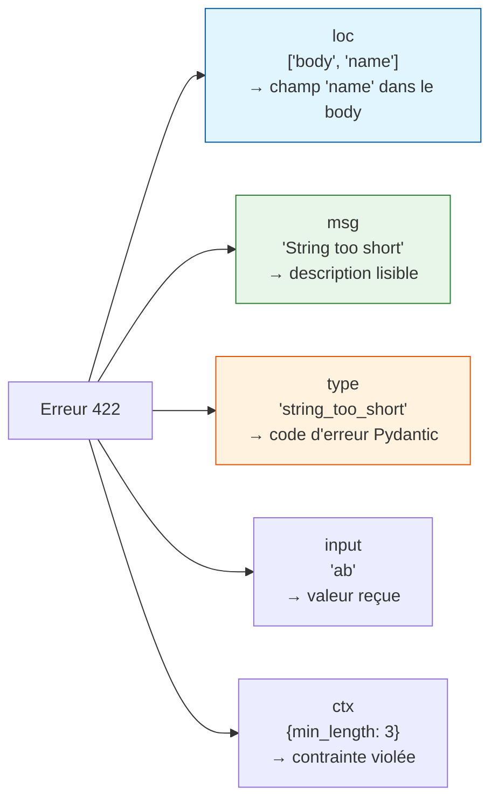
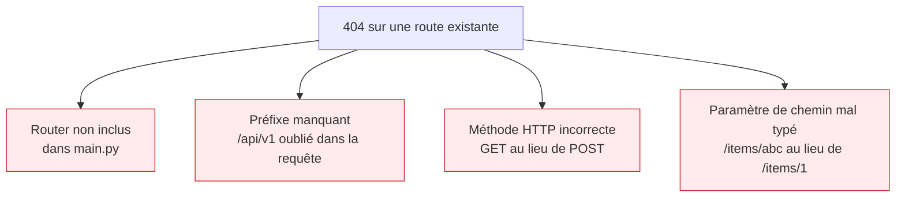
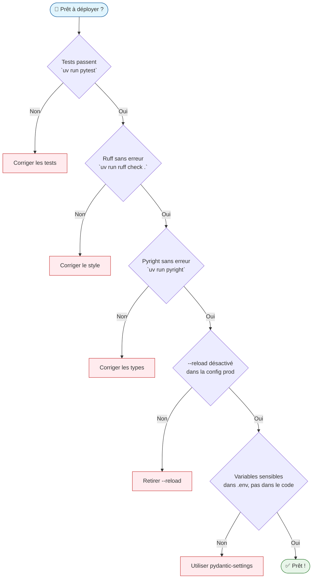

# FastAPI — Débogage et Exercices

## Configuration du débogueur

### VS Code — `launch.json`

Créez `.vscode/launch.json` à la racine du projet :

```json
{
  "version": "0.2.0",
  "configurations": [
    {
      "name": "FastAPI — Debug avec rechargement",
      "type": "debugpy",
      "request": "launch",
      "module": "uvicorn",
      "args": ["app.main:app", "--reload", "--port", "8000"],
      "jinja": true,
      "justMyCode": false
    }
  ]
}
```

Appuyez sur `F5` pour lancer en mode debug. Placez un breakpoint dans n'importe quel
handler — VS Code s'y arrêtera lors du prochain appel.

!!! tip "Inspecter les objets Pydantic dans le débogueur"
    Dans les variables locales de VS Code, les instances Pydantic apparaissent avec
    tous leurs champs. Utilisez le panneau "Variables" ou évaluez `item.model_dump()`
    dans la console de debug pour voir le dictionnaire complet.

### Zed Editor

Zed n'a pas encore de débogueur intégré (état juin 2025). Utilisez la console de logs
via la tâche dans `tasks.json` :

```json
{
  "label": "FastAPI dev",
  "command": "uv run uvicorn app.main:app --reload --log-level debug",
  "use_new_terminal": true,
  "reveal": "always"
}
```

Le flag `--log-level debug` affiche dans le terminal chaque requête reçue, chaque
dépendance résolue, et les erreurs avec leur traceback complet.

---

## Journaux (Logging)

Configurez `logging` dans `app/core/config.py` pour un suivi en production :

```python
"""Configuration globale de l'application.

Centralise le logging et les variables d'environnement.
"""

import logging
import sys


def setup_logging() -> None:
    """Configure le logger racine pour FastAPI et Uvicorn.

    Format : timestamp | niveau | module | message
    """
    logging.basicConfig(
        level=logging.INFO,
        format="%(asctime)s | %(levelname)-8s | %(name)s | %(message)s",
        handlers=[logging.StreamHandler(sys.stdout)],
    )


logger = logging.getLogger(__name__)
```

Utilisez le logger dans vos services :

```python
import logging

logger = logging.getLogger(__name__)


class ItemService:
    def create(self, data: ItemCreate) -> ItemResponse:
        logger.info("Création item: name=%s version=%s", data.name, data.version)
        # ...
        logger.debug("Item créé: %s", result.model_dump())
        return result
```

---

## Sessions de débogage : erreurs courantes

### Erreur 1 — 422 Unprocessable Entity

L'erreur 422 est la plus fréquente. Elle signifie que Pydantic a rejeté les données
entrantes. Le corps de la réponse explique précisément pourquoi.

**Requête envoyée :**

```bash
curl -X POST http://localhost:8000/api/v1/items/ \
  -H "Content-Type: application/json" \
  -d '{"name": "ab", "version": "pas-semver"}'
```

**Réponse 422 :**

```json
{
  "detail": [
    {
      "type": "string_too_short",
      "loc": ["body", "name"],
      "msg": "String should have at least 3 characters",
      "input": "ab",
      "ctx": {"min_length": 3}
    },
    {
      "type": "string_pattern_mismatch",
      "loc": ["body", "version"],
      "msg": "String should match pattern '^\\d+\\.\\d+\\.\\d+$'",
      "input": "pas-semver",
      "ctx": {"pattern": "^\\d+\\.\\d+\\.\\d+$"}
    }
  ]
}
```

**Comment lire cette erreur :**



**Correction :** Lisez `loc` pour identifier le champ, `msg` pour comprendre la règle,
`input` pour voir ce qui a été reçu.

---

### Erreur 2 — 404 mais la route existe

**Symptôme :** Vous appelez `GET /items/1` et recevez 404, mais la route est définie.

**Vérification :**

```bash
# Lister toutes les routes enregistrées
curl http://localhost:8000/openapi.json | python -m json.tool | grep '"path"'
```

**Causes fréquentes :**



**Solution C1 :** Vérifiez `app/main.py` :

```python
# Oublié ?
app.include_router(items.router, prefix="/api/v1")
```

---

### Erreur 3 — `RuntimeError: no running event loop`

**Symptôme :** Une bibliothèque synchrone est appelée dans un `async def`.

```python
# ❌ Problème : requests est synchrone, bloque l'event loop
@router.get("/external")
async def fetch_data() -> dict:
    response = requests.get("https://api.example.com/data")  # Bloque !
    return response.json()
```

**Solution :** Utiliser `httpx` en mode async, ou `def` (synchrone) :

```python
# ✅ Option 1 : httpx async
import httpx

@router.get("/external")
async def fetch_data() -> dict:
    async with httpx.AsyncClient() as client:
        response = await client.get("https://api.example.com/data")
    return response.json()


# ✅ Option 2 : def synchrone (FastAPI gère le thread pool)
@router.get("/external")
def fetch_data() -> dict:
    response = requests.get("https://api.example.com/data")
    return response.json()
```

---

### Erreur 4 — Réponse ne correspond pas au `response_model`

**Symptôme :** Le handler retourne un dict avec un champ extra, et ce champ disparaît
de la réponse sans erreur visible.

```python
class ItemResponse(BaseModel):
    id: int
    name: str
    # 'secret_internal_id' n'est pas dans le modèle

@router.get("/{item_id}", response_model=ItemResponse)
async def get_item(item_id: int) -> dict:
    # Ce champ sera filtré silencieusement par response_model
    return {"id": 1, "name": "FastAPI", "secret_internal_id": "xyz"}
```

C'est en réalité le comportement **attendu** — `response_model` filtre les champs
non déclarés. C'est une protection contre les fuites de données sensibles.

---

## Exercices pratiques

### Exercice 1 — Validation personnalisée sur un schéma

**Objectif :** Ajouter des règles métier sur le champ `name` d'un modèle Pydantic.

**Énoncé :** Modifiez `ItemCreate` pour que `name` :

1. Contienne uniquement des lettres, chiffres, tirets et points
2. Ne commence pas par un chiffre
3. Soit en minuscules uniquement

??? success "Solution"

    ```python
    import re
    from pydantic import BaseModel, Field, field_validator


    class ItemCreate(BaseModel):
        name: str = Field(min_length=3, max_length=100)
        version: str = Field(pattern=r"^\d+\.\d+\.\d+$")

        @field_validator("name")
        @classmethod
        def validate_name_format(cls, v: str) -> str:
            """Valide le format du nom selon les conventions de nommage.

            Args:
                v: Valeur brute du champ name.

            Returns:
                Le nom validé (inchangé).

            Raises:
                ValueError: Si le nom ne respecte pas les conventions.
            """
            v = v.strip()

            if not re.match(r"^[a-z][a-z0-9.\-]*$", v):
                raise ValueError(
                    "Le nom doit être en minuscules et ne contenir que "
                    "des lettres, chiffres, tirets (-) et points (.)."
                )
            if v[0].isdigit():
                raise ValueError("Le nom ne peut pas commencer par un chiffre.")

            return v
    ```

    **Tests :**

    ```python
    import pytest
    from pydantic import ValidationError


    def test_valid_name():
        item = ItemCreate(name="fastapi", version="0.1.0")
        assert item.name == "fastapi"


    def test_name_with_uppercase_raises():
        with pytest.raises(ValidationError, match="minuscules"):
            ItemCreate(name="FastAPI", version="0.1.0")


    def test_name_starting_with_digit_raises():
        with pytest.raises(ValidationError, match="commencer"):
            ItemCreate(name="1fastapi", version="0.1.0")
    ```

---

### Exercice 2 — Dépendance d'authentification par header

**Objectif :** Protéger des routes avec un token API dans un header HTTP.

**Énoncé :** Créez une dépendance `require_api_key` qui :

1. Lit le header `X-API-Key`
2. Retourne 401 si le header est absent
3. Retourne 403 si le token ne correspond pas à `"super-secret-key"`
4. Retourne le token validé (str) si tout est correct

Appliquez cette dépendance à la route `POST /items/`.

??? success "Solution"

    ```python
    # app/api/v1/dependencies.py
    from fastapi import Header, HTTPException, status


    async def require_api_key(
        x_api_key: str | None = Header(default=None),
    ) -> str:
        """Vérifie que le header X-API-Key est présent et valide.

        Args:
            x_api_key: Valeur du header HTTP X-API-Key.

        Returns:
            Le token validé.

        Raises:
            HTTPException: 401 si le header est absent, 403 si invalide.
        """
        if x_api_key is None:
            raise HTTPException(
                status_code=status.HTTP_401_UNAUTHORIZED,
                detail="Header X-API-Key manquant.",
                headers={"WWW-Authenticate": "ApiKey"},
            )
        if x_api_key != "super-secret-key":
            raise HTTPException(
                status_code=status.HTTP_403_FORBIDDEN,
                detail="Token API invalide.",
            )
        return x_api_key
    ```

    Application sur la route :

    ```python
    # app/api/v1/routers/items.py
    from app.api.v1.dependencies import require_api_key

    @router.post(
        "/",
        response_model=ItemResponse,
        status_code=status.HTTP_201_CREATED,
        dependencies=[Depends(require_api_key)],  # Protège sans injection dans le handler
    )
    async def create_item(
        item: ItemCreate,
        service: ItemService = Depends(get_item_service),
    ) -> ItemResponse:
        return service.create(item)
    ```

    **Tests :**

    ```python
    def test_create_item_without_token_returns_401() -> None:
        response = client.post(
            "/api/v1/items/",
            json={"name": "fastapi", "version": "0.115.0"},
        )
        assert response.status_code == 401


    def test_create_item_with_wrong_token_returns_403() -> None:
        response = client.post(
            "/api/v1/items/",
            json={"name": "fastapi", "version": "0.115.0"},
            headers={"X-API-Key": "wrong-token"},
        )
        assert response.status_code == 403


    def test_create_item_with_valid_token_returns_201() -> None:
        response = client.post(
            "/api/v1/items/",
            json={"name": "fastapi", "version": "0.115.0"},
            headers={"X-API-Key": "super-secret-key"},
        )
        assert response.status_code == 201
    ```

---

### Exercice 3 — Router avec préfixe et tags

**Objectif :** Créer un second router `users` qui coexiste avec `items` dans la même
application.

**Énoncé :**

1. Créez `app/schemas/user.py` avec un modèle `UserCreate` (champs : `username: str`,
   `email: str`)
2. Créez `app/api/v1/routers/users.py` avec un endpoint `POST /users/`
3. Incluez le router dans `main.py` sous le préfixe `/api/v1`
4. Vérifiez dans `/docs` que les deux routers apparaissent sous des tags distincts

??? success "Solution partielle (structure)"

    ```python
    # app/schemas/user.py
    from pydantic import BaseModel, EmailStr, Field

    # uv add "pydantic[email]" pour EmailStr
    class UserCreate(BaseModel):
        username: str = Field(min_length=3, max_length=50, pattern=r"^[a-z0-9_]+$")
        email: EmailStr


    # app/api/v1/routers/users.py
    from fastapi import APIRouter
    from app.schemas.user import UserCreate

    router = APIRouter(prefix="/users", tags=["Utilisateurs"])

    @router.post("/", status_code=201)
    async def create_user(user: UserCreate) -> dict:
        return {"username": user.username, "email": user.email, "id": 1}


    # app/main.py — ajout
    from app.api.v1.routers import items, users

    app.include_router(items.router, prefix="/api/v1")
    app.include_router(users.router, prefix="/api/v1")
    ```

---

## Checklist avant mise en production



| Élément | Commande de vérification |
|---------|--------------------------|
| Tests | `uv run pytest -v --tb=short` |
| Linting | `uv run ruff check .` |
| Types | `uv run pyright` |
| Sécurité deps | `uv run pip-audit` |
| Coverage | `uv run pytest --cov=app --cov-report=term-missing` |
