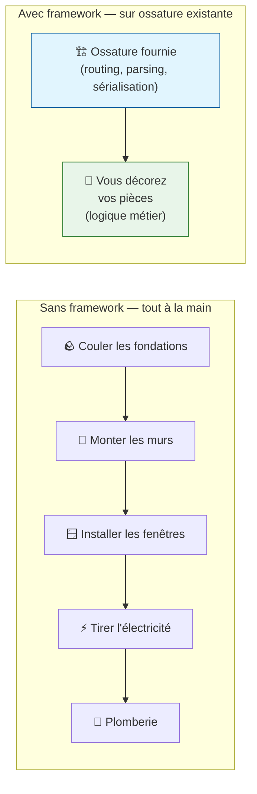
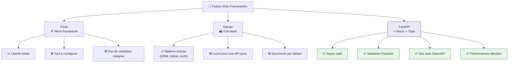
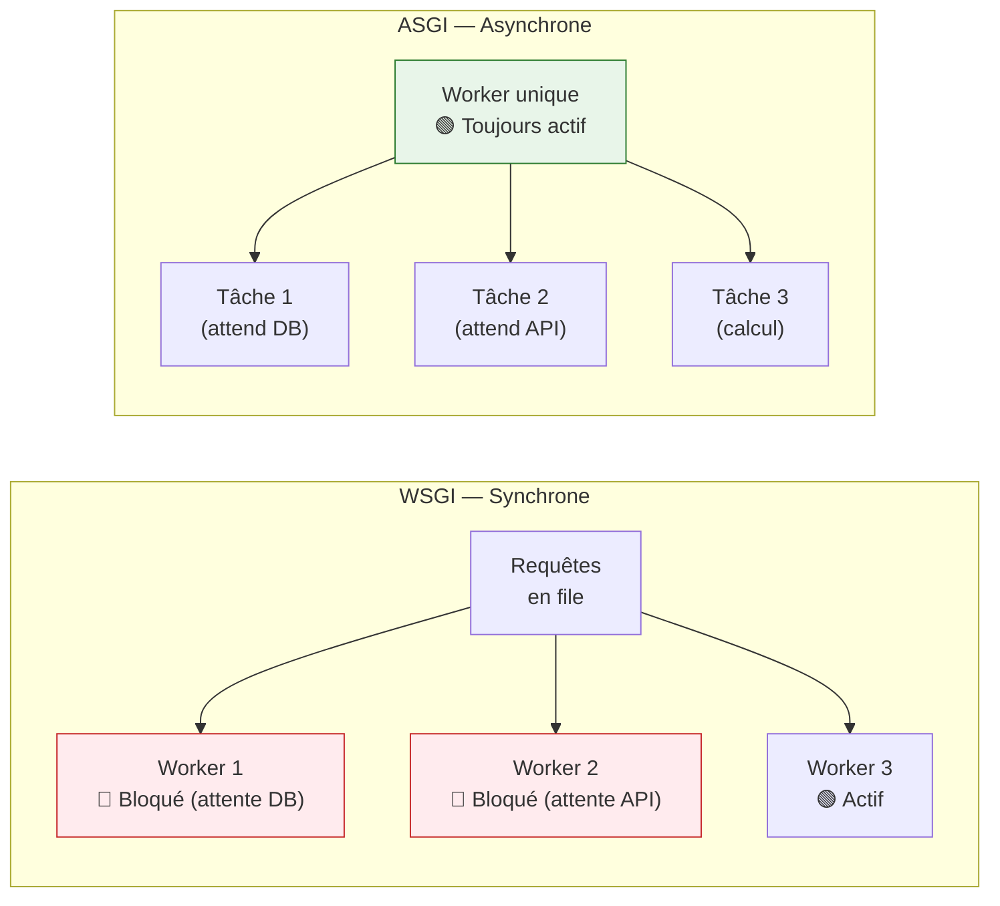
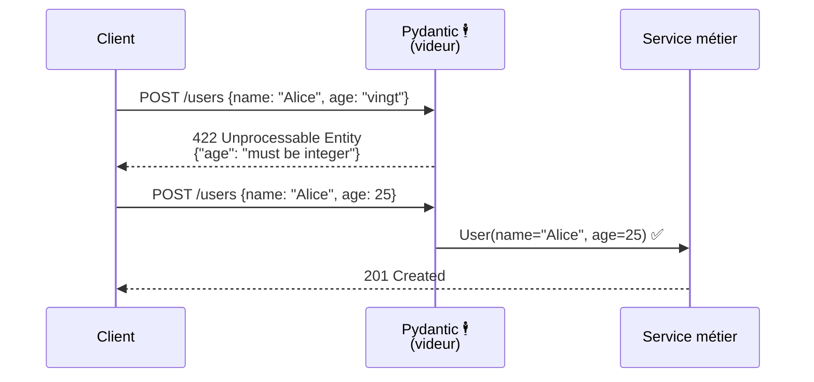
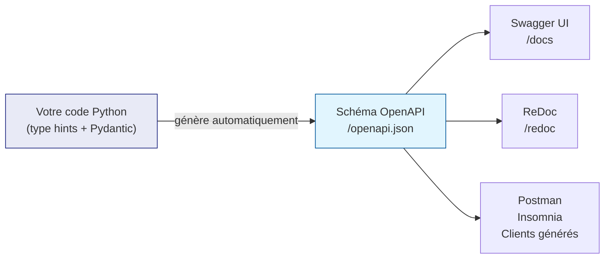

# FastAPI — Introduction et Concepts

FastAPI est un framework web Python moderne conçu pour construire des **API performantes**
avec un minimum de code et un maximum de robustesse. Ce guide vous accompagne de zéro
jusqu'à une architecture de production.

---

## Qu'est-ce qu'un framework ?

Avant d'écrire la moindre ligne, posons une question fondamentale.

Un **framework** (cadre de travail) est un ensemble de composants pré-construits qui
impose une structure et résout les problèmes communs à votre place. Il vous dit
*où* mettre votre code et *comment* il sera exécuté.

### Analogie : construire une maison



Sans framework, chaque projet repart de zéro : gérer les sockets réseau, parser les
requêtes HTTP, sérialiser les réponses JSON... Des centaines de lignes avant d'écrire
la moindre règle métier. Le framework prend en charge toute cette plomberie.

!!! info "Différence framework / bibliothèque"
    - **Bibliothèque** : vous l'appelez quand vous voulez (`import requests`). Vous
      gardez le contrôle du flux.
    - **Framework** : *il vous appelle*. Vous branchez votre code dans ses points
      d'extension (routes, middlewares, hooks). C'est le principe
      d'**inversion de contrôle**.

---

## La famille des frameworks web Python



| Critère | Flask | Django | FastAPI |
|---------|-------|--------|---------|
| Courbe d'apprentissage | Faible | Élevée | Moyenne |
| Performance (req/s) | ~1 000 | ~1 200 | ~15 000+ |
| Validation intégrée | ❌ | ✅ (basique) | ✅ (Pydantic) |
| Asynchrone natif | ❌ | Partiel | ✅ |
| Documentation auto | ❌ | ❌ | ✅ OpenAPI |
| Type hints exploités | ❌ | ❌ | ✅ |
| Idéal pour | Prototypes | Applications complètes | APIs modernes |

---

## Pourquoi FastAPI change la donne

### 1. Le typage Python comme contrat

Python 3.5+ introduit les **type hints** — des annotations optionnelles qui précisent
le type attendu de chaque variable. FastAPI les utilise non pas comme documentation,
mais comme **spécification exécutable** de votre API.

```python
# Sans type hints — aucune garantie
@app.get("/users")
def get_user(user_id):
    ...

# Avec type hints — FastAPI génère parsing + validation + doc
@app.get("/users/{user_id}")
def get_user(user_id: int) -> UserResponse:
    ...
```

Avec la deuxième version, FastAPI :

1. **Parse** `user_id` en entier (retourne 422 si ce n'est pas possible)
2. **Génère** l'entrée dans la doc Swagger avec le bon type
3. **Valide** le modèle de réponse `UserResponse`

### 2. Performance : ASGI vs WSGI

Les frameworks traditionnels (Flask, Django) utilisent **WSGI** — un protocole synchrone
qui traite une requête à la fois par worker.

FastAPI utilise **ASGI** (Asynchronous Server Gateway Interface), qui permet à un seul
worker de traiter des milliers de requêtes en parallèle grâce à la programmation
asynchrone.



---

## Pydantic : le gardien de vos données

**Pydantic** est la bibliothèque de validation de données sur laquelle FastAPI est bâti.
Elle transforme vos classes Python en validateurs automatiques.

### Analogie : le videur de discothèque



Sans Pydantic, vous écririez pour chaque endpoint :

```python
# Validation manuelle — fastidieux et source d'erreurs
@app.post("/users")
def create_user(data: dict):
    if "name" not in data:
        return {"error": "name is required"}, 400
    if not isinstance(data.get("age"), int):
        return {"error": "age must be an integer"}, 400
    if data["age"] < 0:
        return {"error": "age must be positive"}, 400
    # ... et ça continue
```

Avec Pydantic :

```python
from pydantic import BaseModel, Field

class UserCreate(BaseModel):
    name: str
    age: int = Field(ge=0, description="Âge en années révolues")

@app.post("/users")
def create_user(user: UserCreate):
    # Ici, user.name est garanti str et user.age est garanti int >= 0
    ...
```

Pydantic v2 (inclus dans FastAPI 0.100+) valide à la vitesse du C grâce à son core
réécrit en Rust.

### Ce que Pydantic génère automatiquement

À partir d'un simple modèle Python, Pydantic produit :

- Un **schéma JSON** conforme OpenAPI 3.1
- Des **messages d'erreur explicites** par champ invalide
- La **conversion de types** (une string `"42"` devient l'entier `42` si attendu)
- La **sérialisation** vers dict/JSON pour les réponses

---

## La documentation interactive (Swagger UI)

FastAPI génère automatiquement deux interfaces de documentation :

| URL | Interface | Usage |
|-----|-----------|-------|
| `/docs` | **Swagger UI** | Tester les endpoints interactivement |
| `/redoc` | **ReDoc** | Documentation de référence lisible |
| `/openapi.json` | JSON brut | Importation dans Postman, client SDK |



!!! tip "Pas besoin de Postman en développement"
    `/docs` offre une interface complète pour tester chaque endpoint avec des formulaires
    pré-remplis selon vos modèles Pydantic. En développement, c'est votre outil principal.

---

## Prérequis pour ce guide

- Python **3.12+** (vérifier avec `python --version`)
- `uv` installé (`curl -LsSf https://astral.sh/uv/install.sh | sh`)
- Notions de base Python : fonctions, classes, exceptions
- Connaissance de HTTP basique : méthodes GET/POST, codes de statut

!!! note "Notions HTTP rappelées dans ce guide"
    Chaque fois qu'un concept HTTP est utilisé (code 422, header, body), il est expliqué
    en contexte. Aucune connaissance préalable n'est supposée.
