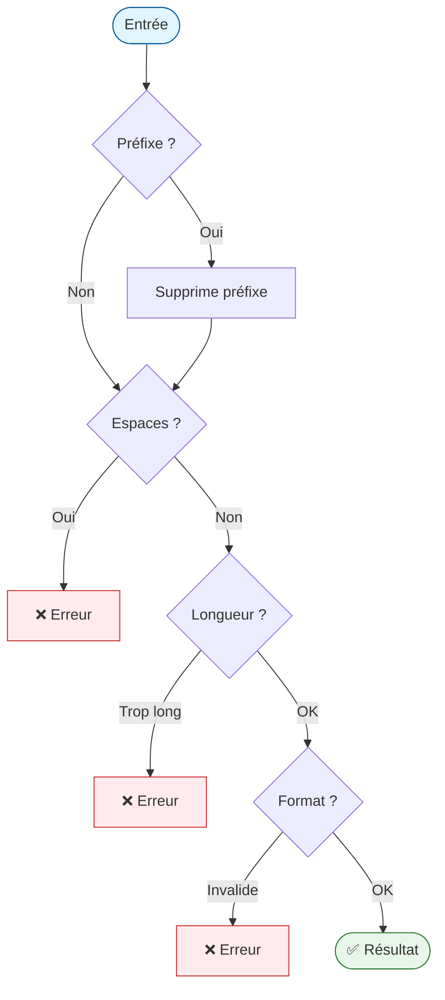
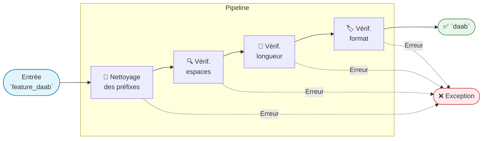
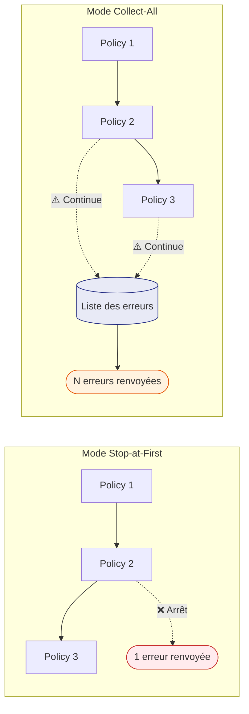
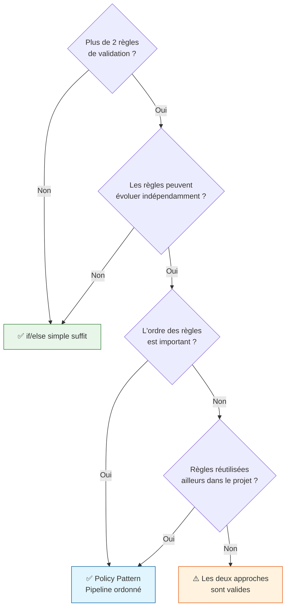
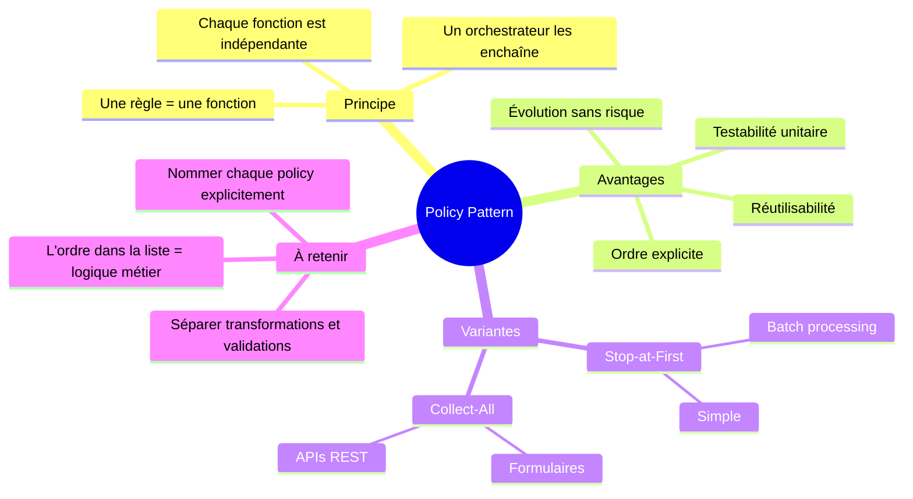

# Policy Pattern — Pipeline de Validation

## Qu'est-ce que le Policy Pattern ?

Le **Policy Pattern** (ou patron de stratégie de règle) est une façon d'organiser des règles
de traitement en **unités indépendantes et interchangeables**, plutôt qu'en une longue chaîne
de `if/else` imbriqués.

En Python, sa forme la plus naturelle est le **pipeline de validation** : chaque règle est une
fonction qui reçoit une valeur, la vérifie (ou la transforme), puis passe le résultat à la
règle suivante.

---

## Le problème : le code spaghetti

Imaginons qu'on doive valider un nom de branche Git. Les règles :

1. Supprimer les préfixes `feature.`, `feature_`, `feature-`
2. Interdire les espaces
3. Longueur maximale : 44 caractères
4. Doit commencer par `da` ou `dy` suivi de 2 lettres

**Approche naïve avec `if/else` :**

```python
def validate_branch(name: str) -> str | None:
    import re
    if name.startswith("feature_") or name.startswith("feature.") or name.startswith("feature-"):
        name = name[8:]
    if " " in name:
        print("Erreur : espaces interdits")
        return None
    if len(name) > 44:
        print("Erreur : trop long")
        return None
    if not re.match(r'^(da|dy)[a-zA-Z]{2}', name):
        print("Erreur : format invalide")
        return None
    return name
```

Ce code fonctionne, mais présente des problèmes dès qu'il grandit :



!!! warning "Les 4 problèmes de cette approche"
    1. **Difficile à tester** : pour tester la règle de longueur seule, il faut passer par toutes les règles précédentes.
    2. **Ordre opaque** : si on réorganise les `if`, des bugs subtils apparaissent.
    3. **Réutilisation nulle** : la règle "interdire les espaces" est enfouie dans cette fonction et ne peut pas être partagée.
    4. **Évolution risquée** : ajouter une règle oblige à toucher au code existant.

---

## La solution : le Pipeline de Validation

Le Policy Pattern transforme chaque règle en **une fonction autonome**. Un orchestrateur
les enchaîne dans l'ordre voulu.



Chaque politique (policy) est **indépendante** : elle ne sait rien des autres.
L'orchestrateur décide de l'ordre et de la gestion des erreurs.

---

## Implémentation pas à pas

### Étape 1 — Définir le type `Policy`

```python
import re
from typing import Callable

# Une Policy est une fonction : str -> str
# Elle retourne la valeur (éventuellement transformée) ou lève une ValueError
Policy = Callable[[str], str]
```

!!! note "Pourquoi `Callable[[str], str]` ?"
    C'est la façon Python de dire "une fonction qui prend une `str` et retourne une `str`".
    Ce n'est qu'une annotation — Python ne l'impose pas à l'exécution, mais elle sert de
    documentation et est vérifiée par les outils d'analyse statique (mypy, pyright).

### Étape 2 — Écrire les policies

Chaque fonction fait **une seule chose** :

```python
def policy_clean_prefixes(text: str) -> str:
    """Supprime le préfixe feature., feature_ ou feature- s'il est présent."""
    return re.sub(r"^feature[._-]", "", text)


def policy_no_spaces(text: str) -> str:
    """Rejette toute chaîne contenant un espace."""
    if " " in text:
        raise ValueError("Les espaces sont interdits dans le nom de branche.")
    return text


def policy_max_length(text: str) -> str:
    """Rejette les chaînes de plus de 44 caractères."""
    if len(text) > 44:
        raise ValueError(
            f"Le nom dépasse 44 caractères ({len(text)} actuellement)."
        )
    return text


def policy_check_da_dy(text: str) -> str:
    """Vérifie que la chaîne commence par da ou dy suivi d'au moins 2 lettres."""
    if not re.match(r"^(da|dy)[a-zA-Z]{2}", text):
        raise ValueError(
            "Format invalide : doit commencer par 'da' ou 'dy' "
            "suivi d'au moins 2 lettres (ex: daab, dycd)."
        )
    return text
```

!!! tip "Règle d'or"
    Une policy = une règle = un nom explicite. Si vous hésitez sur le nom,
    c'est que votre fonction fait probablement deux choses différentes.

### Étape 3 — L'orchestrateur (version simple)

```python
def process_branch_name(name: str) -> str:
    """Valide et nettoie un nom de branche Git."""
    policies: list[Policy] = [
        policy_clean_prefixes,  # (1) On nettoie d'abord
        policy_no_spaces,       # (2) On vérifie le contenu
        policy_max_length,      # (3) On vérifie la taille APRÈS nettoyage
        policy_check_da_dy,     # (4) On vérifie le format spécifique
    ]

    result = name
    for policy in policies:
        result = policy(result)  # Chaque policy reçoit le résultat de la précédente

    return result
```

!!! warning "L'ordre est crucial ici"
    `policy_max_length` est placée **après** `policy_clean_prefixes` intentionnellement.
    Si `"feature_"` (8 caractères) est supprimé d'abord, la chaîne résultante est plus
    courte. L'ordre des policies dans la liste `IS` la logique métier.

---

## Code complet et fonctionnel

```python
import re
from typing import Callable

Policy = Callable[[str], str]


def policy_clean_prefixes(text: str) -> str:
    """Supprime le préfixe feature., feature_ ou feature- s'il est présent."""
    return re.sub(r"^feature[._-]", "", text)


def policy_no_spaces(text: str) -> str:
    """Rejette toute chaîne contenant un espace."""
    if " " in text:
        raise ValueError("Les espaces sont interdits dans le nom de branche.")
    return text


def policy_max_length(text: str) -> str:
    """Rejette les chaînes de plus de 44 caractères."""
    if len(text) > 44:
        raise ValueError(
            f"Le nom dépasse 44 caractères ({len(text)} actuellement)."
        )
    return text


def policy_check_da_dy(text: str) -> str:
    """Vérifie que la chaîne commence par da ou dy suivi d'au moins 2 lettres."""
    if not re.match(r"^(da|dy)[a-zA-Z]{2}", text):
        raise ValueError(
            "Format invalide : doit commencer par 'da' ou 'dy' "
            "suivi d'au moins 2 lettres (ex: daab, dycd)."
        )
    return text


def process_branch_name(name: str) -> str:
    """Valide et nettoie un nom de branche Git."""
    policies: list[Policy] = [
        policy_clean_prefixes,
        policy_no_spaces,
        policy_max_length,
        policy_check_da_dy,
    ]
    result = name
    for policy in policies:
        result = policy(result)
    return result


# --- Tests manuels ---
test_cases = [
    ("feature_daab", "daab"),           # Nettoyage du préfixe -> OK
    ("feature.dycd", "dycd"),           # Autre préfixe -> OK
    ("daab", "daab"),                   # Pas de préfixe -> OK
    ("feature_da ab", "ValueError"),    # Espace -> erreur
    ("feature_" + "daab" * 12, "ValueError"),  # Trop long -> erreur
    ("feature_toto", "ValueError"),     # Format invalide -> erreur
]

for input_val, expected in test_cases:
    try:
        result = process_branch_name(input_val)
        status = "✅" if result == expected else "⚠️"
        print(f"{status} '{input_val}' -> '{result}'")
    except ValueError as e:
        status = "✅" if expected == "ValueError" else "❌"
        print(f"{status} '{input_val}' -> Erreur : {e}")
```

**Résultat attendu :**

```
✅ 'feature_daab' -> 'daab'
✅ 'feature.dycd' -> 'dycd'
✅ 'daab' -> 'daab'
✅ 'feature_da ab' -> Erreur : Les espaces sont interdits dans le nom de branche.
✅ 'feature_daabdaabdaabdaabdaabdaabdaabdaabdaabdaabdaabdaab' -> Erreur : Le nom dépasse 44 caractères (48 actuellement).
✅ 'feature_toto' -> Erreur : Format invalide : doit commencer par 'da' ou 'dy' suivi d'au moins 2 lettres (ex: daab, dycd).
```

---

## Variante : collecter toutes les erreurs

Par défaut, le pipeline **s'arrête à la première erreur**. Si vous voulez retourner
**toutes** les violations en même temps (utile pour les formulaires), modifiez
uniquement l'orchestrateur :

```python
from dataclasses import dataclass, field


@dataclass
class ValidationResult:
    value: str
    errors: list[str] = field(default_factory=list)

    @property
    def is_valid(self) -> bool:
        return len(self.errors) == 0


def process_branch_name_all_errors(name: str) -> ValidationResult:
    """Exécute toutes les policies et collecte toutes les erreurs."""
    result = ValidationResult(value=name)

    # Les policies de transformation sont séparées des policies de validation
    transformation_policies: list[Policy] = [policy_clean_prefixes]
    validation_policies: list[Policy] = [
        policy_no_spaces,
        policy_max_length,
        policy_check_da_dy,
    ]

    # Étape 1 : transformations (pas d'erreur possible ici)
    for policy in transformation_policies:
        result.value = policy(result.value)

    # Étape 2 : validations (on collecte sans s'arrêter)
    for policy in validation_policies:
        try:
            policy(result.value)
        except ValueError as e:
            result.errors.append(str(e))

    return result


# Exemple : une entrée avec plusieurs problèmes simultanés
bad_input = "feature_to to"  # Espace ET format invalide
report = process_branch_name_all_errors(bad_input)
print(f"Valeur nettoyée : '{report.value}'")
print(f"Valide : {report.is_valid}")
for err in report.errors:
    print(f"  - {err}")
```

```
Valeur nettoyée : 'to to'
Valide : False
  - Les espaces sont interdits dans le nom de branche.
  - Format invalide : doit commencer par 'da' ou 'dy' suivi d'au moins 2 lettres (ex: daab, dycd).
```

---

## Comparaison des deux modes



| Critère | Stop-at-First | Collect-All |
|---------|--------------|-------------|
| Simplicité | ✅ Simple | ⚠️ Plus complexe |
| Expérience utilisateur | ⚠️ Un message à la fois | ✅ Toutes les erreurs d'un coup |
| Usage typique | Traitement de données en batch | Formulaires, APIs REST |
| Performances | ✅ S'arrête dès que possible | ⚠️ Exécute toutes les policies |

---

## Tester les policies individuellement

C'est l'un des grands avantages du pattern : chaque règle est **testable en isolation**.

```python
import pytest


def test_clean_prefixes_removes_underscore():
    assert policy_clean_prefixes("feature_daab") == "daab"


def test_clean_prefixes_removes_dot():
    assert policy_clean_prefixes("feature.daab") == "daab"


def test_clean_prefixes_removes_dash():
    assert policy_clean_prefixes("feature-daab") == "daab"


def test_clean_prefixes_leaves_other_prefixes():
    assert policy_clean_prefixes("fix_daab") == "fix_daab"


def test_no_spaces_raises_on_space():
    with pytest.raises(ValueError, match="espaces"):
        policy_no_spaces("da ab")


def test_no_spaces_passes_clean_string():
    assert policy_no_spaces("daab") == "daab"


def test_max_length_raises_when_too_long():
    with pytest.raises(ValueError, match="44 caractères"):
        policy_max_length("d" * 45)


def test_max_length_passes_at_exactly_44():
    assert policy_max_length("d" * 44) == "d" * 44


def test_check_da_dy_raises_on_invalid_format():
    with pytest.raises(ValueError, match="Format invalide"):
        policy_check_da_dy("toto")


def test_check_da_dy_passes_da_prefix():
    assert policy_check_da_dy("daab") == "daab"


def test_check_da_dy_passes_dy_prefix():
    assert policy_check_da_dy("dycd") == "dycd"
```

Avec la version `if/else` monolithique, tester `policy_max_length` isolément était
**impossible** — il fallait construire une entrée qui passe toutes les vérifications
précédentes. Ici, on appelle directement la fonction.

---

## Quand utiliser ce pattern ?



### Cas d'usage typiques

| Cas | Adapté ? |
|-----|---------|
| Validation de formulaire (email, mot de passe, téléphone) | ✅ Très adapté |
| Pipeline ETL (Extract, Transform, Load) | ✅ Très adapté |
| Traitement de noms de branches/tags Git | ✅ Très adapté |
| Validation d'une seule règle simple | ❌ Surengineering |
| Logique métier complexe avec états | ⚠️ Préférer le Strategy Pattern |

---

## Résumé



!!! success "À retenir en une phrase"
    Le Policy Pattern transforme une validation complexe en une **liste ordonnée de fonctions
    simples**, chacune testable et modifiable sans toucher aux autres.
