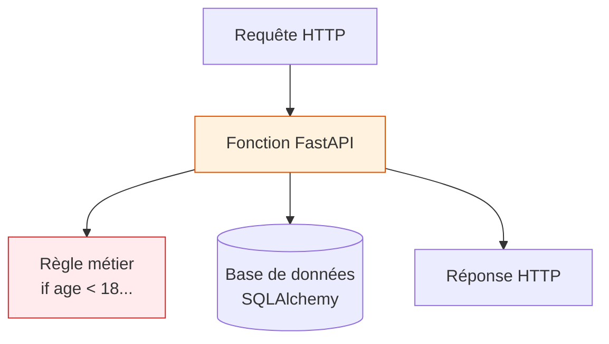
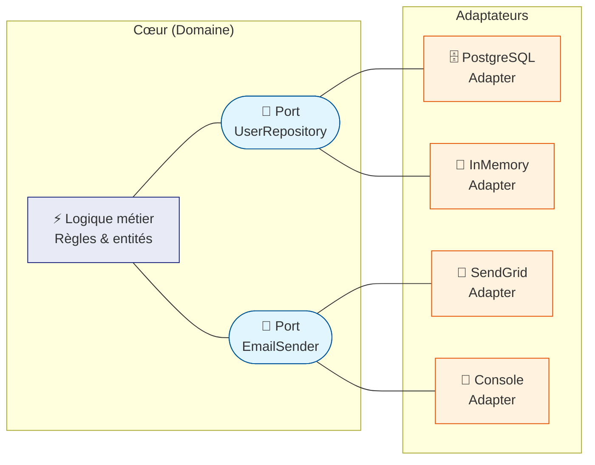
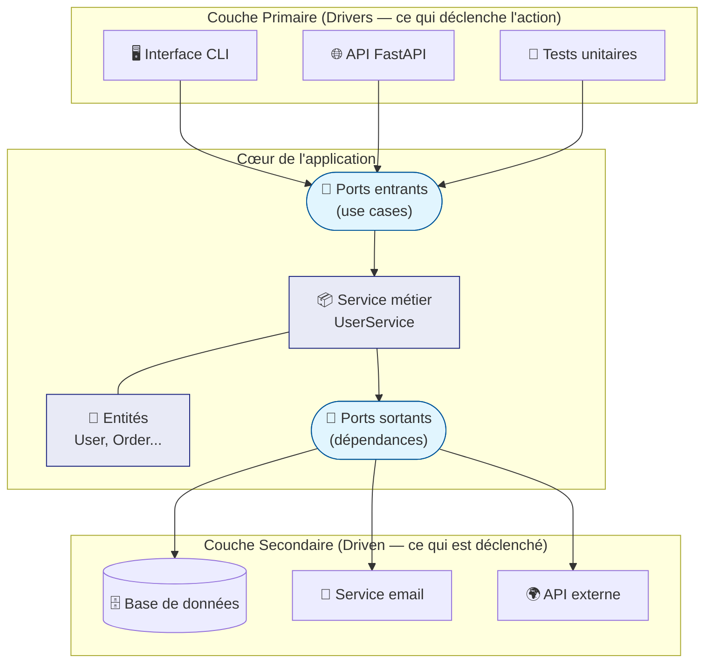
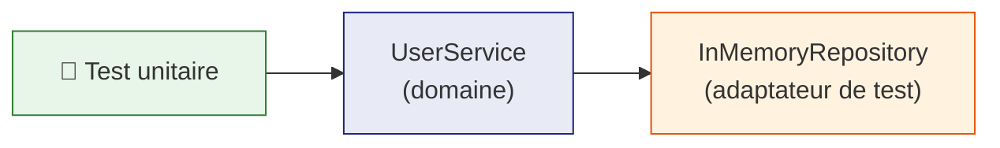
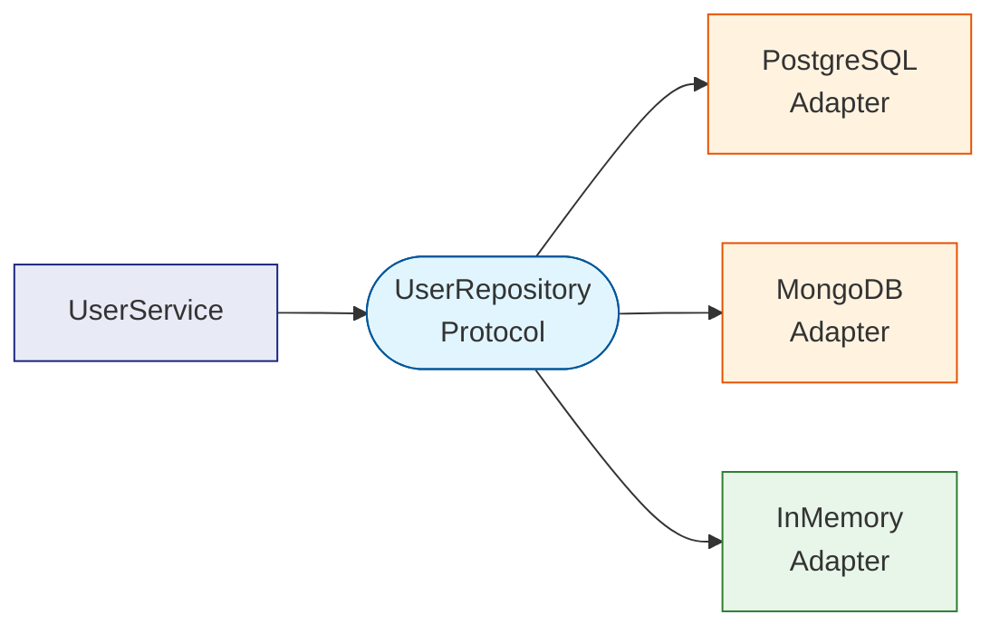
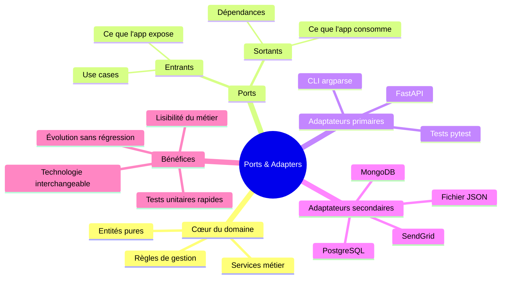

# Ports & Adapters — Architecture Hexagonale

## Qu'est-ce que ce pattern ?

Le pattern **Ports & Adapters** (aussi appelé **Architecture Hexagonale**) a été formalisé
par Alistair Cockburn en 2005. Son objectif : isoler complètement la **logique métier** de
tout ce qui est technique (framework web, base de données, envoi d'emails, etc.).

L'idée centrale est que votre application a un **cœur précieux** — ses règles métier —
et que tout le reste n'est que branchement.

---

## Le problème : la dette technique

### Le code "spaghetti"

Dans une application rapide à écrire, il est tentant de tout mélanger : les règles métier,
le framework web, et l'accès à la base de données cohabitent dans la même fonction.



!!! warning "Les 3 dangers du code couplé" 1. **Tester une règle métier impose de démarrer un serveur web** — un test unitaire
qui lance une base de données n'est plus unitaire, c'est un test d'intégration
non intentionnel, lent et fragile. 2. **Changer de base de données = réécrire la logique métier** — PostgreSQL vers
MongoDB signifie toucher à des fonctions qui n'ont rien à voir avec le stockage. 3. **Lire le code métier oblige à traverser du bruit technique** — un développeur
cherchant la règle "un utilisateur doit être majeur" la trouve noyée entre du SQL
et des `HTTPException`.

### Exemple concret — tout mélangé

```python
from fastapi import FastAPI, HTTPException
from pydantic import BaseModel

app = FastAPI()
users_db = []  # Simulation d'un stockage

@app.post("/users")
async def create_user(name: str, age: int):
    # RÈGLE MÉTIER mélangée au FRAMEWORK
    if age < 18:
        raise HTTPException(status_code=400, detail="Trop jeune !")

    # PERSISTANCE mélangée au MÉTIER
    user = {"name": name, "age": age}
    users_db.append(user)
    return user
```

Pour tester la règle `age < 18`, il faut instancier `FastAPI`, démarrer un client de
test, envoyer une requête HTTP, et analyser la réponse — tout ça pour vérifier une simple
comparaison d'entiers.

---

## Le concept : l'analogie de la prise électrique

Pensez à votre logique métier comme au **réseau électrique de votre appartement**.



- **Le Port (Interface)** : définit un _contrat_. Il dit _quoi faire_, pas _comment_.
  Le réseau électrique définit la forme de la prise — il ne sait pas ce que vous allez
  brancher dessus.
- **L'Adaptateur (Implémentation)** : réalise concrètement le contrat pour une technologie
  donnée. La lampe et le grille-pain respectent tous les deux la forme de la prise, mais
  fonctionnent différemment.

En Python, un Port s'exprime avec un `Protocol` (duck typing structurel) ou une classe
abstraite `ABC`. Un Adaptateur est une classe concrète qui l'implémente.

---

## L'architecture globale



!!! info "Ports entrants vs sortants" - **Ports entrants** (driven _by_ the app) : définissent comment l'extérieur peut
appeler votre application (ex: `register_user(name, age)`). FastAPI et les tests
utilisent ces ports. - **Ports sortants** (driving _the_ app) : définissent ce que votre application
demande à l'extérieur (ex: `save(user)`). La base de données et les services email
implémentent ces ports.

---

## Le "Avant / Après" : gestion d'utilisateurs

### Étape 1 — Les entités du domaine

Une entité est un objet métier pur, sans aucune dépendance vers un framework.

```python
from dataclasses import dataclass


@dataclass
class User:
    """Représente un utilisateur dans le domaine métier.

    Attributes:
        name: Prénom et nom de l'utilisateur.
        age: Âge en années révolues.
        email: Adresse email de contact.
    """
    name: str
    age: int
    email: str
```

### Étape 2 — Le Port (l'interface)

On définit le contrat que toute implémentation de stockage devra respecter.
`Protocol` est préféré à `ABC` : il ne requiert pas d'héritage explicite
([duck typing structurel](https://peps.python.org/pep-0544/)).

```python
from typing import Protocol


class UserRepository(Protocol):
    """Port sortant : contrat pour persister et récupérer des utilisateurs.

    N'importe quelle classe qui implémente ces méthodes satisfait ce contrat,
    même sans déclarer explicitement `class MyRepo(UserRepository)`.
    """

    def save(self, user: User) -> None:
        """Persiste un utilisateur."""
        ...

    def find_by_email(self, email: str) -> User | None:
        """Retourne l'utilisateur correspondant à l'email, ou None."""
        ...
```

### Étape 3 — Le Service métier (cœur du domaine)

Le service ne connaît ni FastAPI, ni SQLAlchemy, ni aucun outil. Il dépend uniquement
du Port (l'interface), pas de son implémentation.

```python
class UserService:
    """Orchestre la logique métier liée aux utilisateurs.

    Ce service est le seul endroit où vivent les règles :
    majorité, unicité de l'email, etc.

    Args:
        repo: Implémentation concrète du stockage (fournie par injection
              de dépendances — le service ne sait pas laquelle).
    """

    def __init__(self, repo: UserRepository) -> None:
        self._repo = repo

    def register_user(self, name: str, age: int, email: str) -> User:
        """Enregistre un nouvel utilisateur après validation des règles métier.

        Args:
            name: Nom complet de l'utilisateur.
            age: Âge de l'utilisateur (doit être >= 18).
            email: Email unique de l'utilisateur.

        Returns:
            L'utilisateur créé et persisté.

        Raises:
            ValueError: Si l'utilisateur est mineur ou si l'email existe déjà.
        """
        if age < 18:
            raise ValueError("L'utilisateur doit être majeur (age >= 18).")

        if self._repo.find_by_email(email) is not None:
            raise ValueError(f"L'email '{email}' est déjà utilisé.")

        new_user = User(name=name, age=age, email=email)
        self._repo.save(new_user)
        return new_user
```

### Étape 4 — Les Adaptateurs (les implémentations)

Chaque adaptateur implémente le Port pour une technologie précise.

=== "En mémoire (tests)"

    ```python
    class InMemoryUserRepository:
        """Adaptateur de stockage en mémoire — idéal pour les tests.

        Respecte le contrat UserRepository sans base de données réelle.
        """

        def __init__(self) -> None:
            self._store: dict[str, User] = {}

        def save(self, user: User) -> None:
            self._store[user.email] = user

        def find_by_email(self, email: str) -> User | None:
            return self._store.get(email)
    ```

=== "SQLAlchemy (production)"

    ```python
    from sqlalchemy.orm import Session


    class SqlAlchemyUserRepository:
        """Adaptateur de stockage PostgreSQL via SQLAlchemy.

        Isole toute la complexité SQL du reste de l'application.
        """

        def __init__(self, session: Session) -> None:
            self._session = session

        def save(self, user: User) -> None:
            db_user = UserModel(
                name=user.name,
                age=user.age,
                email=user.email,
            )
            self._session.add(db_user)
            self._session.commit()

        def find_by_email(self, email: str) -> User | None:
            row = (
                self._session.query(UserModel)
                .filter_by(email=email)
                .first()
            )
            if row is None:
                return None
            return User(name=row.name, age=row.age, email=row.email)
    ```

### Étape 5 — FastAPI (le point d'entrée)

FastAPI n'est plus qu'une fine couche de traduction : HTTP → domaine → HTTP.
Aucune règle métier n'y apparaît.

```python
from fastapi import FastAPI, Depends, HTTPException
from pydantic import BaseModel

app = FastAPI()


class CreateUserRequest(BaseModel):
    name: str
    age: int
    email: str


def get_user_service() -> UserService:
    """Fabrique le service avec son adaptateur (injection de dépendances)."""
    repo = InMemoryUserRepository()  # Remplacez par SqlAlchemyUserRepository
    return UserService(repo)         # en production


@app.post("/users", status_code=201)
async def create_user(
    body: CreateUserRequest,
    service: UserService = Depends(get_user_service),
) -> dict:
    try:
        user = service.register_user(
            name=body.name,
            age=body.age,
            email=body.email,
        )
        return {"name": user.name, "age": user.age, "email": user.email}
    except ValueError as exc:
        # Traduction : erreur métier → erreur HTTP
        raise HTTPException(status_code=400, detail=str(exc)) from exc
```

---

## Structure de projet recommandée

```
my_app/
├── domain/                    # Cœur — aucune dépendance externe
│   ├── entities.py            # User, Order, Product...
│   ├── ports.py               # UserRepository (Protocols)
│   └── services.py            # UserService, OrderService...
│
├── adapters/                  # Implémentations concrètes
│   ├── repository_memory.py   # InMemoryUserRepository
│   ├── repository_sql.py      # SqlAlchemyUserRepository
│   └── email_sendgrid.py      # SendGridEmailSender
│
├── api/                       # Couche FastAPI
│   ├── main.py                # App FastAPI + routing
│   ├── dependencies.py        # Injection de dépendances
│   └── schemas.py             # Modèles Pydantic (entrées/sorties)
│
└── tests/
    ├── test_services.py       # Tests unitaires (InMemory, sans HTTP)
    └── test_api.py            # Tests d'intégration (TestClient FastAPI)
```

!!! tip "Règle d'or pour décider où placer du code"
Posez-vous cette question : _"Si je transforme cette application web en script
en ligne de commande, cette partie du code survivrait-elle sans modification ?"_

    - **Oui** → c'est du domaine (`domain/`)
    - **Non** → c'est un adaptateur ou une couche technique

---

## Les avantages concrets

### Testabilité — sans base de données, sans serveur

Avec l'architecture couplée, tester la règle de majorité exigeait de démarrer FastAPI.
Maintenant, un test unitaire prend 5 lignes :

```python
import pytest
from domain.entities import User
from domain.services import UserService
from adapters.repository_memory import InMemoryUserRepository


@pytest.fixture
def service() -> UserService:
    return UserService(repo=InMemoryUserRepository())


def test_register_minor_user_raises(service: UserService) -> None:
    with pytest.raises(ValueError, match="majeur"):
        service.register_user(name="Alice", age=16, email="alice@ex.com")


def test_register_duplicate_email_raises(service: UserService) -> None:
    service.register_user(name="Alice", age=20, email="alice@ex.com")
    with pytest.raises(ValueError, match="déjà utilisé"):
        service.register_user(name="Alice2", age=25, email="alice@ex.com")


def test_register_valid_user_returns_user(service: UserService) -> None:
    user = service.register_user(name="Bob", age=22, email="bob@ex.com")
    assert isinstance(user, User)
    assert user.name == "Bob"
```



Pas de FastAPI. Pas de PostgreSQL. Pas de réseau. Le test s'exécute en millisecondes.

### Interchangeabilité des adaptateurs

Remplacer PostgreSQL par MongoDB revient à écrire un nouveau fichier `repository_mongo.py`
et changer une ligne dans `dependencies.py`. Le `UserService` ne bouge pas.



### Clarté du code métier

Un développeur qui arrive sur le projet ouvre `domain/services.py` et lit immédiatement
les règles de gestion, sans traverser du SQL ou des annotations FastAPI.

---

## Comparaison approche couplée vs découplée

| Critère                      | Code couplé                   | Ports & Adapters             |
| ---------------------------- | ----------------------------- | ---------------------------- |
| Test d'une règle métier      | Nécessite un serveur HTTP     | Un simple `pytest`           |
| Changer de base de données   | Réécriture partielle          | Nouvel adaptateur uniquement |
| Lisibilité des règles métier | Noyées dans le code technique | Isolées dans `services.py`   |
| Temps de démarrage des tests | Lent (I/O réseau, DB)         | Rapide (tout en mémoire)     |
| Complexité initiale          | Faible                        | Légèrement plus élevée       |
| Complexité à long terme      | Croît rapidement              | Reste maîtrisée              |

---

## Pièges courants

!!! danger "Fuites du domaine"
Le domaine ne doit **jamais** importer FastAPI, SQLAlchemy, Pydantic ou tout autre
framework. Si vous voyez `from fastapi import ...` dans `domain/services.py`,
c'est une fuite — le couplage est de retour.

!!! warning "Anémie du domaine"
Si `UserService` ne fait que déléguer à `UserRepository` sans aucune logique, le
pattern est mal appliqué. Les règles métier (`age < 18`, unicité de l'email) doivent
vivre dans le service, pas dans l'adaptateur ni dans FastAPI.

!!! tip "Ne pas sur-ingéniérer"
Pour un script de 50 lignes ou un prototype jetable, Ports & Adapters est
du surengineering. Ce pattern prend toute sa valeur quand : - L'application a plusieurs "portes d'entrée" (API + CLI + tâche planifiée) - L'équipe a besoin de tests unitaires rapides - Des changements de technologie sont prévisibles

---

## Récapitulatif visuel



!!! success "À retenir en une phrase"
Ports & Adapters impose une règle simple : **le domaine ne sait rien du monde
extérieur** — c'est toujours le monde extérieur qui s'adapte au domaine.
