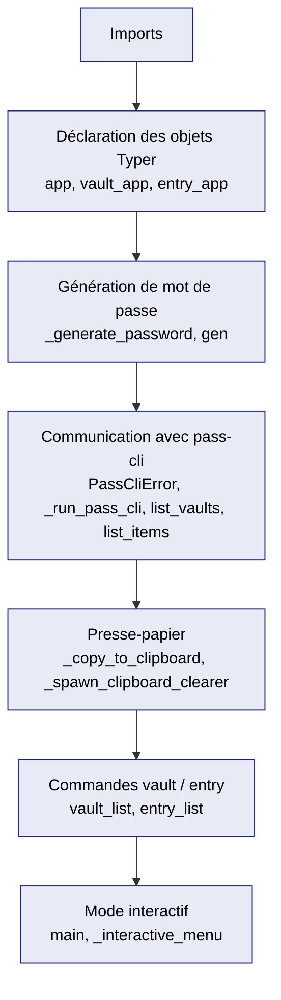

# 2. Lire le code section par section

**Source :** `~/alm_tools/cli/pass-tool/src/pass_tool/cli.py`

Ce fichier concentre toute la logique métier de pass-tool. Plutôt que de le
lire de haut en bas dans l'ordre d'écriture, on le découpe ici par **zone
fonctionnelle**, car c'est ainsi qu'on raisonne dessus quand on veut
modifier quelque chose.

!!! note "Repères par nom, pas par numéro de ligne"
    Ce guide identifie chaque élément par son **nom de fonction ou de
    décorateur** plutôt que par un numéro de ligne — les numéros de ligne
    dérivent au moindre edit (ajout d'un commentaire, d'une fonction...) et
    rendent une documentation obsolète en silence. Utilisez la recherche de
    votre éditeur (`Ctrl+F` sur le nom) pour localiser chaque élément dans
    le fichier réel.



---

## 2.1 En-tête : imports

Quelques imports méritent une explication avant même de commencer :

- `from __future__ import annotations` : active l'évaluation différée des
  annotations de type. Concrètement, ça permet d'écrire des types comme
  `str | None` dans les signatures de fonction sans que Python les évalue
  immédiatement à l'exécution — utile pour la compatibilité et pour éviter
  certains problèmes de référence circulaire entre types.
- `from typing import Any, cast` : `cast` ne fait **rien à l'exécution**.
  C'est une indication destinée uniquement à `mypy` (l'outil de
  vérification de types), qui dit en substance « fais-moi confiance, je
  sais que cette valeur a ce type précis ». On le rencontre parce que
  `json.loads()` (parsing de JSON) retourne toujours un type `Any` — `cast`
  sert à préciser à `mypy --strict` que le résultat est en réalité une
  `list[dict[str, Any]]`.
- `rich.console.Console`, `rich.prompt.*`, `rich.table.Table` : la
  bibliothèque **Rich**, qui gère l'affichage terminal enrichi (tables
  colorées, prompts interactifs).
- `import typer` : le framework CLI. Les décorateurs `@app.command()`
  qu'on croisera plus loin viennent de là.

## 2.2 Déclaration des objets Typer

Trois objets structurent toute la CLI, déclarés juste après les constantes
de génération de mot de passe :

- `app` : l'application Typer racine.
- `vault_app` et `entry_app` : deux **sous-applications** (sub-apps),
  montées sur `app` via `app.add_typer(...)`. C'est ce qui permet d'avoir
  des commandes groupées comme `pass-tool vault list` ou
  `pass-tool entry list` — chaque sous-app gère son propre espace de
  commandes.
- `console` : une instance `Console` de Rich, réutilisée partout pour
  afficher du texte formaté.

## 2.3 Génération de mot de passe

Ce groupe répond à la question « comment un mot de passe est-il généré ? » :

- Constantes en tête de fichier (`MIN_LENGTH`, `MAX_LENGTH`,
  `SPECIAL_CHARS`, `_CHAR_FAMILIES`) : le découpage majuscules / minuscules
  / chiffres / caractères spéciaux.
- `_filtered_families` : retire, dans chaque famille de caractères, ceux
  que l'utilisateur a explicitement exclus.
- `_generate_password` : construit le mot de passe en garantissant **au
  moins un caractère de chaque famille**, en s'appuyant sur le module
  `secrets` (générateur aléatoire cryptographiquement sûr — à ne pas
  confondre avec `random`, qui n'est pas adapté à un usage sécurité).
- `gen` (commande `@app.command()`) : la commande exposée à l'utilisateur
  (`pass-tool gen`). Elle valide les paramètres (longueur, exclusions),
  appelle `_generate_password`, et déclenche éventuellement la copie
  presse-papier.

C'est le groupe le plus autonome du fichier : il ne dépend d'aucun autre
groupe (pas d'appel à `pass-cli`, pas de presse-papier obligatoire).

## 2.4 Communication avec pass-cli

Ce groupe encapsule **tous** les appels au binaire externe `pass-cli` :

- `PassCliError` : exception personnalisée, détaillée en 2.4.1.
- `_run_pass_cli` : exécute `pass-cli` via `subprocess`, et lève
  `PassCliError` si le code de retour n'est pas 0.
- `_report_pass_cli_error` : affiche une erreur `pass-cli` de façon
  lisible (via Rich), avec un message d'aide si l'erreur ressemble à un
  problème d'authentification.
- `list_vaults` et `list_items` : appellent respectivement
  `pass-cli vault list --output json` et
  `pass-cli item list <vault> ... --output json`, puis parsent le JSON
  retourné.

C'est le point d'entrée technique le plus important si votre modification
touche à la façon dont pass-tool dialogue avec `pass-cli` (nouveau champ à
récupérer, nouvelle commande `pass-cli` à invoquer, etc.).

### 2.4.1 Le cycle de vie de PassCliError

Pour comprendre comment une erreur circule dans le programme, voici son
parcours complet :

1. **Définie** juste après `_generate_password` : une classe simple,
   héritant directement d'`Exception`.
2. **Levée** (`raise`) à un seul endroit du fichier : dans `_run_pass_cli`,
   quand `result.returncode != 0`. Le message porte le contenu de `stderr`
   (la sortie d'erreur du processus), nettoyé.
3. **Attrapée** (`except`) à deux endroits, tous deux dans des commandes
   Typer, avec exactement le même schéma :

```python
   except PassCliError as exc:
       _report_pass_cli_error(exc)
       raise typer.Exit(code=1) from exc
```

   — dans `vault_list` et dans `entry_list`. `raise typer.Exit(code=1)
   from exc` termine le programme proprement avec un code de sortie 1
   (convention Unix : 0 = succès, non-zéro = échec), en conservant la
   trace de l'exception d'origine (`from exc`) pour le débogage.

!!! tip "Schéma à reproduire"
    Si vous ajoutez une nouvelle commande qui appelle `_run_pass_cli`, vous
    devrez reproduire ce même bloc `except` pour gérer l'erreur de façon
    cohérente avec le reste du projet.

## 2.5 Presse-papier

Ce groupe gère la copie et l'effacement automatique du presse-papier
(clipboard) :

- `_copy_to_clipboard` et `_read_clipboard` : utilisent `wl-copy`/`wl-paste`
  (Wayland) avec un repli (fallback) vers `xclip` si indisponible.
- `_should_clear` : détermine si le presse-papier doit être effacé, en
  comparant son contenu actuel au mot de passe attendu — pour éviter
  d'effacer quelque chose que l'utilisateur aurait copié entre-temps.
- `_spawn_clipboard_clearer` : la fonction la plus technique du fichier,
  détaillée ci-dessous.

### 2.5.1 Comprendre `_spawn_clipboard_clearer`

C'est le point du code qui demande le plus d'attention pour un débutant, car
il mêle plusieurs notions de gestion de processus :

1. La fonction construit un **mini-script Python sous forme de chaîne de
   caractères**, qui attend un délai (`CLIP_CLEAR_DELAY_SECONDS`), relit le
   presse-papier, et ne l'efface que si son contenu est toujours le mot de
   passe attendu.
2. Ce script est lancé comme **processus enfant** via
   `subprocess.Popen(..., start_new_session=True)`. Le paramètre
   `start_new_session=True` détache l'enfant du groupe de processus du
   parent : il devient orphelin (reparenté au processus `init` du système)
   et **continue de tourner même après que pass-tool a terminé** et rendu
   la main au terminal.
3. Le mot de passe est transmis à cet enfant via son **entrée standard**
   (`stdin`), et non en argument de ligne de commande — pour qu'il
   n'apparaisse jamais dans la sortie de la commande `ps` (qui liste les
   processus et leurs arguments, visibles par d'autres utilisateurs du
   système).
4. La fonction n'appelle volontairement **pas** `communicate()` (la méthode
   habituelle pour dialoguer avec un `subprocess` et attendre sa fin) : cela
   bloquerait pass-tool jusqu'à la terminaison de l'enfant, soit plusieurs
   secondes d'attente forcée. À la place, le code écrit sur `stdin` puis
   ferme immédiatement le tube (pipe), ce qui permet à pass-tool de se
   terminer tout de suite pendant que l'enfant continue seul en
   arrière-plan.

!!! warning "Priorité en cas de modification"
    Si votre modification touche à la copie presse-papier, c'est cette
    fonction qu'il faudra comprendre en priorité.

## 2.6 Sous-apps vault / entry

- `vault_list` (commande `@vault_app.command("list")`) : appelle
  `list_vaults`, affiche le résultat dans une `Table` Rich.
- `entry_list` (commande `@entry_app.command("list")`) : appelle
  `list_items`, avec un filtrage optionnel par coffre (`--vault`) et par
  recherche textuelle (`--search`, insensible à la casse).

Ces deux commandes sont les **consommatrices** du groupe 2.4 : elles ne
parlent jamais directement à `pass-cli`, elles passent toujours par
`list_vaults`/`list_items`.

`_truncate` est un utilitaire d'affichage transverse, utilisé par
`vault_list` pour raccourcir les identifiants trop longs dans le tableau.

## 2.7 Mode interactif

- `_version_callback` : callback Typer déclenché par `--version`.
- `main` (`@app.callback(invoke_without_command=True)`) : le point d'entrée
  racine. `invoke_without_command=True` signifie que cette fonction
  s'exécute même si l'utilisateur n'a précisé aucune sous-commande — c'est
  ce qui permet de détecter l'absence de commande et de basculer vers le
  menu interactif.
- `_interactive_menu` : affiche un menu guidé (prompts Rich) qui redirige
  ensuite vers `gen`, `vault_list` ou `entry_list` selon le choix de
  l'utilisateur.

Pour le détail du mécanisme `@app.callback` / sous-apps, voir
[CLI Python — Typer & Click](../cli/typer-app.md).

---

## Repère visuel : où intervenir selon ce que vous voulez modifier

| Vous voulez... | Zone à regarder |
|---|---|
| Changer la génération de mot de passe (longueur, règles, caractères) | 2.3 |
| Ajouter/modifier un appel à `pass-cli` | 2.4 |
| Changer le comportement du presse-papier (délai, effacement) | 2.5 |
| Modifier l'affichage des coffres/entrées | 2.6 |
| Modifier le menu interactif | 2.7 |

---

**Suite :** [3. Comprendre les patterns avancés](patterns-avances.md)
