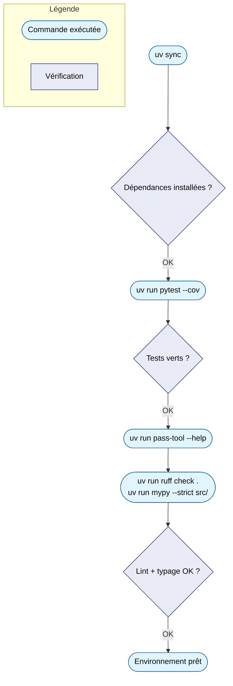

# 1. Mise en route technique

Avant de lire le code, on vérifie que tout fonctionne. Ces commandes
s'exécutent depuis la racine du projet (`~/alm_tools/cli/pass-tool`).



## Installer les dépendances

```bash
uv sync
```

`uv` lit `pyproject.toml` et `uv.lock`, puis crée (ou met à jour) un
environnement virtuel local dans `.venv/`. Vous n'avez rien d'autre à
installer manuellement : pas de `pip install`, pas de `venv` à créer à la
main.

## Lancer les tests

```bash
uv run pytest --cov
```

`uv run` exécute une commande **dans** l'environnement du projet, sans avoir
besoin de l'activer manuellement (`source .venv/bin/activate`). Vous devez
voir les 30 tests passer, avec un rapport de couverture affiché en fin de
sortie.

## Lancer l'outil lui-même

```bash
uv run pass-tool --help
```

Ceci exécute pass-tool tel qu'il serait installé, mais depuis le code source
local — pratique pour tester une modification immédiatement.

## Vérifier la qualité du code

```bash
uv run ruff check .        # lint (style, erreurs probables)
uv run mypy --strict src/  # vérification des types
```

Ces deux commandes ne modifient rien : elles signalent des problèmes. Le
Makefile du projet regroupe d'ailleurs plusieurs de ces vérifications dans
une seule commande — voir
[Le workflow de contribution](workflow-et-exercice.md).

!!! tip "Point de contrôle"
    Si `uv sync`, `pytest --cov`, `ruff check` et `mypy --strict` s'exécutent
    sans erreur inattendue, votre environnement est prêt. Vous n'avez besoin
    d'aucune installation supplémentaire (pas de package système, pas
    d'extension d'éditeur en plus de Python + Ruff déjà configurées).

---

**Suite :** [2. Lire le code section par section](lecture-du-code.md)
