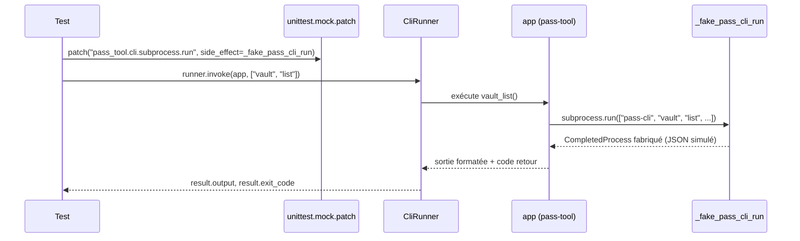

# 4. Lire et comprendre les tests

Les tests vivent dans `tests/`, un fichier par thématique fonctionnelle.

!!! note "Pas de conftest.py"
    Il n'y a pas de `conftest.py` (le fichier où pytest cherche normalement
    des fixtures partagées) — le partage entre fichiers se fait ici par
    **import Python direct** d'un module de test vers un autre. Une
    particularité de ce projet à connaître avant de chercher un
    `conftest.py` qui n'existe pas.

## 4.1 Panorama par fichier

| Fichier | Ce qu'il teste | Simule (mock) `pass-cli` ? |
|---|---|---|
| `test_cli.py` | Aide générale, sous-commandes visibles, génération de base | Non (sauf un test qui utilise le vrai presse-papier) |
| `test_password.py` | `_generate_password` en isolation pure | Non — aucun subprocess impliqué |
| `test_clipboard.py` | `_copy_to_clipboard` / `_read_clipboard` / `_should_clear` | Non — utilise le vrai `wl-copy`/`xclip` de la machine |
| `test_vault_entry.py` | Commandes `vault list` / `entry list` | **Oui** — définit le mécanisme de mock réutilisé ailleurs |
| `test_interactive.py` | Menu interactif (`pass-tool` sans sous-commande) | Oui — réutilise le mock de `test_vault_entry.py` |

!!! warning "Dépendance à un presse-papier réel"
    `test_clipboard.py` dépend d'un presse-papier système réel disponible
    (Wayland ou X11). Si vous exécutez les tests dans un environnement sans
    serveur graphique (ex. conteneur, SSH sans affichage), ces tests précis
    pourraient échouer pour une raison indépendante de votre modification —
    bon réflexe à avoir avant de chercher un bug côté code.

## 4.2 Le mécanisme de mock : simuler pass-cli sans l'exécuter

pass-tool communique avec le vrai binaire `pass-cli` via `subprocess.run`
(chapitre 2, [section 2.4](lecture-du-code.md#24-communication-avec-pass-cli)).
Pour tester le comportement de pass-tool **sans** dépendre d'un vrai
`pass-cli` installé et connecté, les tests remplacent temporairement cette
fonction par une version simulée : c'est ce qu'on appelle du **mocking** (de
l'anglais *mock*, « simuler » / « imiter »).

!!! tip "Le point technique précis à retenir"
    On patche `pass_tool.cli.subprocess.run`, et non `subprocess.run` tout
    court. C'est une règle générale de `unittest.mock` : il faut cibler la
    référence **telle qu'importée dans le module testé**, pas le module
    d'origine. Comme `cli.py` fait `import subprocess` puis appelle
    `subprocess.run(...)`, la référence à intercepter est bien
    `pass_tool.cli.subprocess.run`.



Exemple concret, extrait de `test_vault_entry.py` :

```python
def _completed(
    stdout: str = "", returncode: int = 0, stderr: str = ""
) -> subprocess.CompletedProcess:
    return subprocess.CompletedProcess(
        args=["pass-cli"], returncode=returncode, stdout=stdout, stderr=stderr
    )

def _fake_pass_cli_run(
    cmd: list[str], **_kwargs: object
) -> subprocess.CompletedProcess:
    if cmd[1:3] == ["vault", "list"]:
        return _completed(json.dumps({"vaults": VAULTS}))
    if cmd[1:3] == ["item", "list"]:
        vault_name = cmd[3]
        items = ITEMS_BY_VAULT.get(vault_name, [])
        return _completed(json.dumps({"items": items}))
    message = f"unexpected command: {cmd}"
    raise AssertionError(message)
```

Le principe : `_fake_pass_cli_run` reçoit la commande que pass-tool aurait
envoyée à `pass-cli` (sous forme de liste de chaînes, `cmd`), regarde
quelle sous-commande a été demandée (`vault list`, `item list`), et
retourne un `CompletedProcess` fabriqué à la main — l'objet que
`subprocess.run` aurait normalement retourné après une vraie exécution.

Cette fonction est ensuite branchée via `side_effect` (un paramètre de
`unittest.mock.patch` qui dit « à chaque appel, exécute cette fonction à la
place ») :

```python
with patch("pass_tool.cli.subprocess.run", side_effect=_fake_pass_cli_run):
    result = runner.invoke(app, ["vault", "list"])
```

`patch(...)` est utilisé ici comme **gestionnaire de contexte** (`with`) :
le remplacement de `subprocess.run` n'est actif qu'à l'intérieur du bloc
`with`, et la fonction d'origine est restaurée automatiquement en sortie —
même en cas d'erreur dans le bloc.

## 4.3 Simuler un échec de pass-cli

Le même mécanisme sert à tester la gestion d'erreur (le cycle de vie de
`PassCliError`, [section 2.4.1](lecture-du-code.md#241-le-cycle-de-vie-de-passclierror)) :

```python
def test_vault_list_reports_actionable_error_on_pass_cli_failure() -> None:
    def _fake_fail(cmd: list[str], **_kwargs: object) -> subprocess.CompletedProcess:
        return _completed(
            stderr="Not logged in. Please run pass-cli login first.", returncode=1
        )

    with patch("pass_tool.cli.subprocess.run", side_effect=_fake_fail):
        result = runner.invoke(app, ["vault", "list"])

    assert result.exit_code == 1
    assert "pass-cli login" in result.output
```

Ici, `_fake_fail` simule un `pass-cli` qui échoue (`returncode=1`, message
d'erreur imitant une session expirée). Le test vérifie que pass-tool réagit
correctement : code de sortie 1, et le message affiché contient bien
l'indication utile pour l'utilisateur (`_report_pass_cli_error`).

## 4.4 `runner.invoke` : simuler l'exécution de la CLI

Tous les tests qui touchent à une commande utilisent
`runner.invoke(app, [...])`. `runner` est une instance de
`typer.testing.CliRunner` : elle simule un appel en ligne de commande sans
lancer un vrai sous-processus séparé, et capture la sortie (`result.output`)
et le code de retour (`result.exit_code`) pour qu'on puisse les vérifier
avec `assert`.

Le deuxième argument est la liste des arguments qu'on taperait après
`pass-tool` : `["vault", "list"]` équivaut à taper `pass-tool vault list`
dans un terminal. Pour le menu interactif, un paramètre `input=` simule ce
que l'utilisateur taperait au clavier :

```python
result = runner.invoke(app, [], input="vault\n")
```

## 4.5 Quelques tests simples, pour ancrer les principes

Pas tous les tests n'ont besoin de mock — ceux qui touchent à une fonction
pure (sans effet de bord, sans appel externe) sont directs :

```python
def test_should_clear_when_clipboard_still_holds_expected_password() -> None:
    assert _should_clear("s3cr3t", "s3cr3t") is True
```

Et pour vérifier qu'une erreur est bien levée dans un cas donné, on utilise
`pytest.raises` :

```python
def test_generate_password_raises_when_family_fully_excluded() -> None:
    with pytest.raises(ValueError, match="majuscules"):
        _generate_password(20, string.ascii_uppercase)
```

`match="majuscules"` vérifie, en plus du type d'exception, qu'un mot précis
apparaît dans le message d'erreur — pas seulement qu'une `ValueError`
quelconque a été levée.

## 4.6 Lancer un test isolé

Deux syntaxes, selon ce que vous savez déjà :

```bash
cd ~/alm_tools/cli/pass-tool

# Par chemin::nom — sans ambiguïté, à privilégier
uv run pytest tests/test_vault_entry.py::test_vault_list_displays_mocked_vaults

# Par -k — filtre sur un morceau du nom, pratique si le fichier est incertain
uv run pytest -k test_vault_list_displays_mocked_vaults
```

!!! note "La couverture s'affiche même sur un test isolé"
    `pyproject.toml` configure `pytest` avec l'option `-v` (verbose) et un
    rapport de couverture par défaut (`--cov=src --cov-report=term-missing`),
    donc même un test isolé affichera ce rapport. Ce n'est pas gênant, mais
    si vous voulez une sortie minimale, vous pouvez surcharger temporairement
    avec `--no-cov`.

---

**Suite :** [5. Le workflow de contribution](workflow-et-exercice.md)
