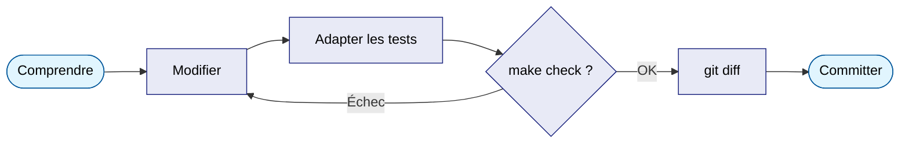

# 5. Le workflow de contribution

Cette page décrit comment enchaîner les vérifications avant de proposer une
modification, en s'appuyant sur les outils déjà présents dans le projet —
puis propose un exercice pratique pour ancrer la démarche.

## 5.1 Le Makefile : un raccourci vers les vérifications

Le projet fournit un `Makefile` à la racine, avec ces cibles principales :

```bash
make install       # équivalent de uv sync
make test           # équivalent de uv run pytest --cov
make lint            # équivalent de uv run ruff check .
make format           # applique le formatage automatique (ruff format)
make type-check        # équivalent de uv run mypy --strict src/
make check               # enchaîne lint + type-check + test en une seule commande
make run                  # lance pass-tool en local (uv run pass-tool)
```

!!! tip "`make check` — la commande à connaître par cœur"
    C'est le **filet de sécurité minimal** avant de committer quoi que ce
    soit, puisqu'il n'y a pas de CI automatique sur ce projet (ni GitHub
    Actions, ni GitLab CI) — tout repose sur cette vérification locale.

    ```bash
    make check
    ```

    Si cette commande passe sans erreur, votre modification respecte le
    style, le typage, et ne casse aucun test existant.

## 5.2 pre-commit : le garde-fou automatique

Un petit rappel de vocabulaire Git d'abord : un **commit** est
l'enregistrement d'un ensemble de modifications dans l'historique du dépôt
(déclenché par `git commit`). **pre-commit** est le nom d'un outil (et de
son fichier de configuration, `.pre-commit-config.yaml`) qui s'intercale
**juste avant** que ce commit ne soit réellement enregistré, pour lancer
automatiquement quelques vérifications rapides. Si elles échouent, le
commit est refusé — un peu comme un contrôle qui bloquerait l'entrée en
salle si une pièce manque.

Une fois activé, `pre-commit` exécute ainsi automatiquement une partie de
ces vérifications à chaque `git commit`, avant même que le commit ne soit
créé — pratique pour ne pas oublier `make check` par distraction.

Activation (une seule fois par clone du dépôt) :

```bash
uv run pre-commit install
```

!!! note "Si un hook échoue"
    Par exemple si `ruff` corrige automatiquement un détail de style, le
    commit est bloqué et les fichiers modifiés sont à re-ajouter (`git add`)
    avant de retenter.

## 5.3 Cycle recommandé pour une modification

En cohérence avec une démarche méthodique, l'enchaînement recommandé pour
toute modification, même petite, est :

1. **Comprendre avant de toucher** — relire la section du fichier concernée
   ([chapitre 2](lecture-du-code.md)) avant d'écrire quoi que ce soit.
2. **Modifier** le code source dans `src/pass_tool/cli.py` (ou ailleurs
   selon le besoin).
3. **Adapter ou ajouter des tests** correspondants dans `tests/` — pour une
   modification de comportement, un test existant doit souvent être ajusté ;
   pour une nouvelle fonctionnalité, un nouveau test s'impose
   ([chapitre 4](tests.md)).
4. **Vérifier localement** avec `make check` (ou les commandes séparées de
   [la mise en route](mise-en-route.md) si vous préférez isoler l'étape qui
   échoue).
5. **Relire le diff** (`git diff`) avant de committer, pour s'assurer que
   seules les lignes voulues sont modifiées.
6. **Committer** en suivant la convention utilisée sur ce projet (5.4).



## 5.4 Convention de commit

Les commits suivent le style **Conventional Commits** : un préfixe qui
indique la nature du changement (`feat:`, `fix:`, `docs:`, `refactor:`...),
suivi d'une description courte à l'infinitif ou au présent.

---

## 6. Exercice pratique : ajouter `vault count`

!!! note "Énoncé non disponible dans les extraits fournis"
    L'énoncé complet de cet exercice n'a pas été transmis dans les fichiers
    source utilisés pour construire cette page — seuls le résumé de ce
    qu'il couvre et le message de commit final sont disponibles. Le principe
    de l'exercice, déductible du résumé ci-dessous : implémenter une commande
    `pass-tool vault count`, qui affiche le nombre de vaults disponibles, en
    réutilisant l'infrastructure existante plutôt qu'en la dupliquant.

Commit attendu à l'issue de l'exercice :

```
feat: ajoute la commande vault count
```

### Ce que cet exercice couvre

- Ajouter une commande sur une sous-app existante (`vault_app`, voir
  [3.1](patterns-avances.md#31-decorateurs-typer-et-sous-applications)).
- Réutiliser une fonction de communication `pass-cli` déjà existante
  (`list_vaults`, voir
  [2.4](lecture-du-code.md#24-communication-avec-pass-cli)) sans dupliquer
  de logique.
- Reproduire le schéma de gestion d'erreur `PassCliError` (voir
  [2.4.1](lecture-du-code.md#241-le-cycle-de-vie-de-passclierror)).
- Écrire un test qui réutilise l'infrastructure de mock existante (voir
  [4.2](tests.md#42-le-mecanisme-de-mock-simuler-pass-cli-sans-lexecuter))
  sans en créer une nouvelle.

!!! success "Si cet exercice s'est bien déroulé"
    Vous avez touché — sans avoir eu besoin de les inventer — les
    mécanismes centraux du fichier : décorateurs Typer, gestion d'erreur, et
    tests avec mock. La prochaine modification réelle sur un point non
    couvert ici (par exemple, le presse-papier) demandera de relire
    attentivement [2.5.1](lecture-du-code.md#251-comprendre-_spawn_clipboard_clearer)
    avant d'intervenir.

---

**Suite :** [6. Où trouver quoi](reference.md)
