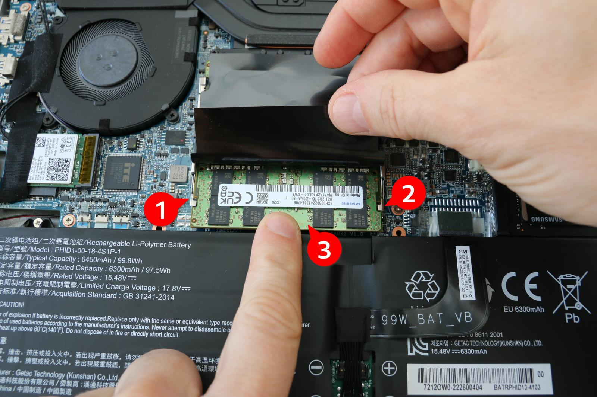
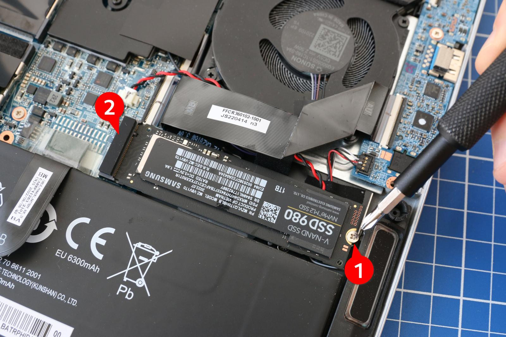
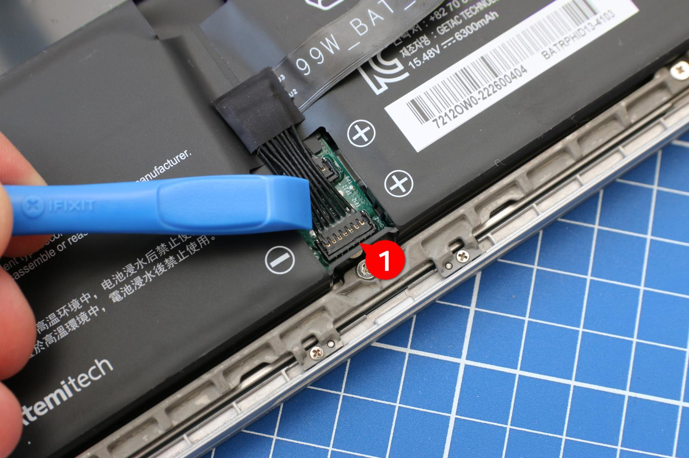
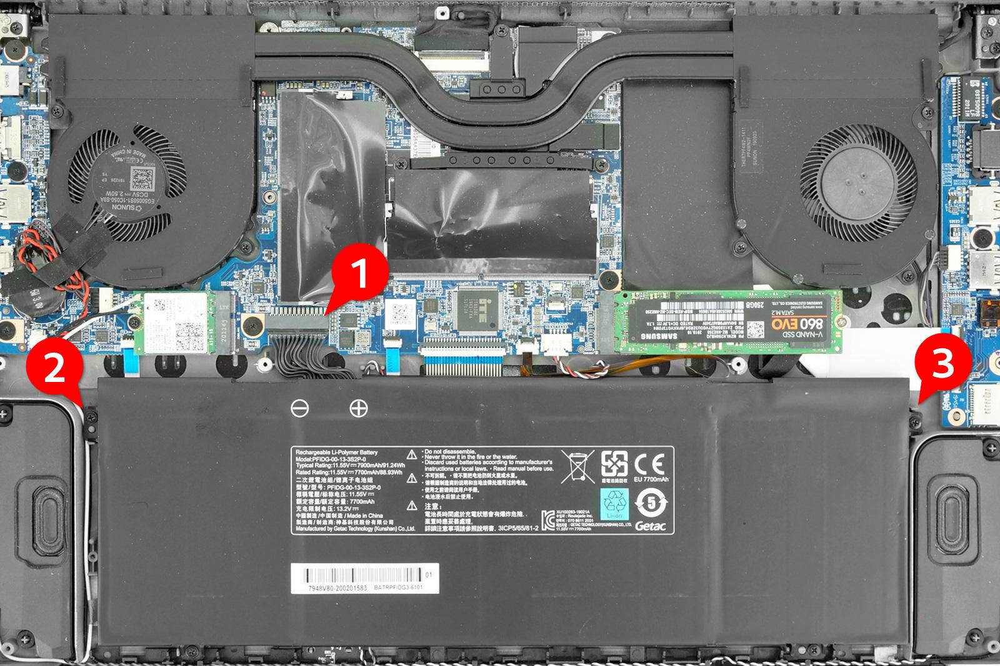
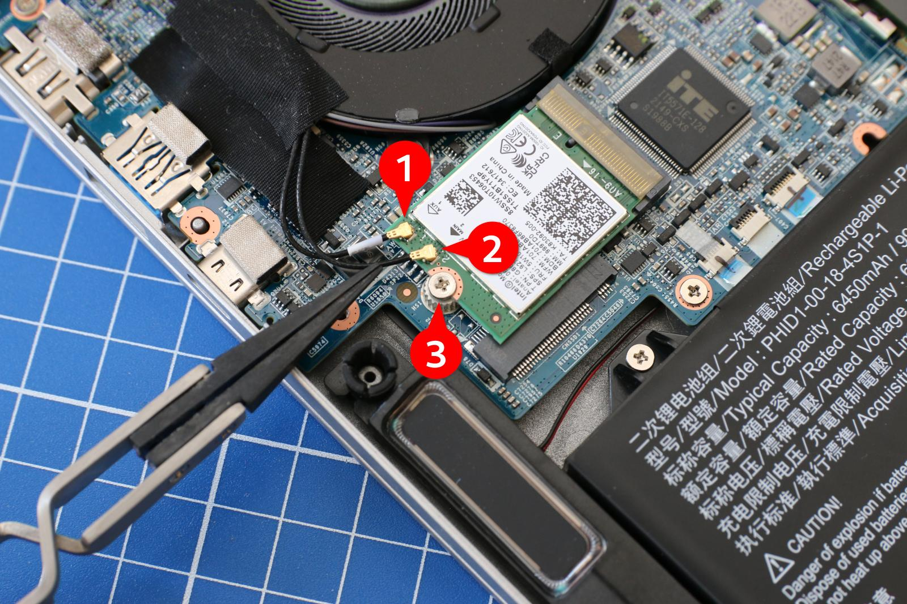
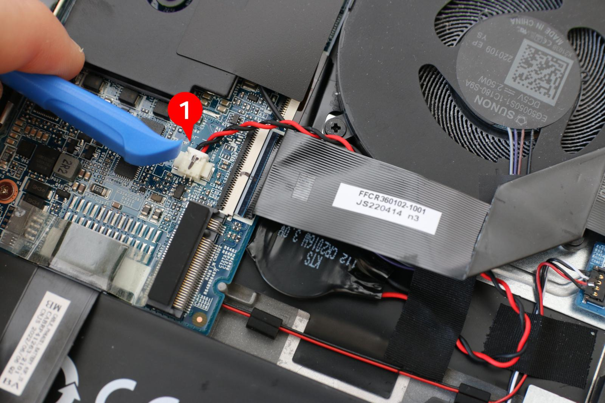
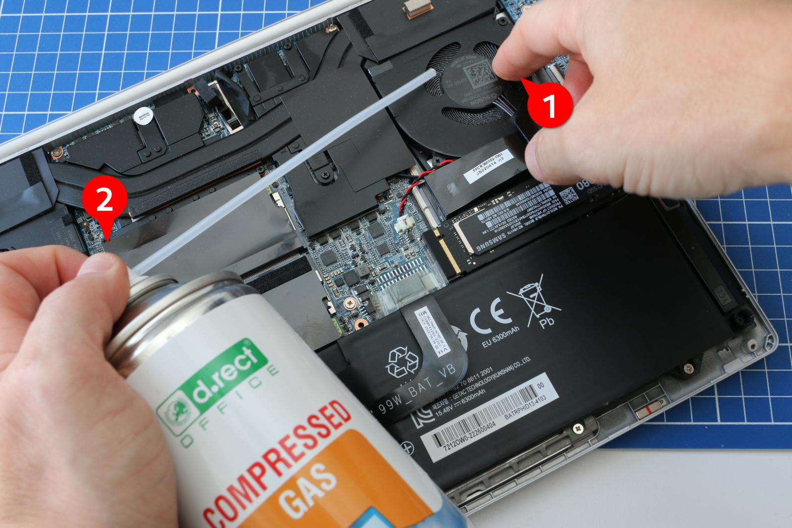

# Entretien et mise à niveau du portable TUXEDO

!!! info "Points importants"
    - Guide **générique**, applicable à tous les modèles TUXEDO — la RAM,
      le SSD, la carte Wi-Fi et les ventilateurs sont accessibles après
      dépose du panneau inférieur (voir [Maintenabilité](materiel.md#chassis)
      sur la page Matériel).
    - **Batterie collée** : la procédure spécifique décrite ci-dessous ne
      concerne que les séries *InfinityBook S14/S15/S17* — **pas** le
      InfinityBook Pro 14 Gen10 AMD, dont la batterie est vissée (voir
      [Remplacement de la batterie](#remplacement-de-la-batterie)).
    - **Pile CMOS et démontage complet du refroidissement** : réservés aux
      utilisateurs expérimentés — la garantie est annulée en cas de dépose
      complète du système de refroidissement.
    - Ouverture du boîtier autorisée par TUXEDO sans annulation de la
      garantie, à condition de suivre la procédure avec soin — voir aussi
      [Mise à jour du BIOS/UEFI et de l'EC](mise-a-jour-bios-ec.md) pour une
      autre opération de maintenance courante.

Traduction du guide officiel TUXEDO
[Upgrade & maintenance of your TUXEDO notebook](https://www.tuxedocomputers.com/en/Infos/Help-Support/Instructions/Upgrade-maintenance-of-your-TUXEDO-notebook.tuxedo),
pertinent pour le
[TUXEDO InfinityBook Pro 14 — Gen10 AMD](materiel.md) : la RAM, le SSD et la
carte Wi-Fi de cette machine sont conçus pour être facilement accessibles et
remplaçables par l'utilisateur.

!!! danger "Avertissement du fabricant"
    Merci de suivre les étapes suivantes avec soin et de respecter la
    procédure telle que décrite. **Aucune garantie ni responsabilité ne
    peut être engagée** en cas de dommage causé par une mise à niveau ou un
    entretien mal exécuté.

## Pourquoi mettre à niveau ou entretenir son TUXEDO ?

Mettre à niveau la mémoire vive (RAM) ou le stockage de masse (HDD ou SSD)
de son ordinateur TUXEDO est simple et peut être réalisé en toute sécurité,
même par un néophyte, à condition d'apporter le soin nécessaire et de
suivre toutes les étapes requises.

L'entretien du système, en particulier le nettoyage des ventilateurs du
boîtier, peut aussi aider le portable TUXEDO à fonctionner plus frais et
plus silencieusement. Chez TUXEDO Computers, l'utilisateur garde le plein
contrôle de sa machine : contrairement à d'autres fabricants, l'ouverture du
boîtier à des fins d'entretien et de mise à niveau est explicitement
autorisée, **sans annuler la garantie**.

Le maintien de la garantie est toutefois conditionné à une exécution
professionnelle et soignée, conforme aux étapes décrites dans ce guide.
Aucune responsabilité ne peut être engagée pour un dommage résultant d'une
mauvaise manipulation.

## Préparatifs

Prévoir un plan de travail rangé et suffisamment grand, ainsi que tous les
outils nécessaires — notamment des tournevis adaptés. Un tapis antistatique
comme support du portable est idéal pour éviter tout risque de décharge
électrostatique, mais ce n'est pas indispensable : à défaut, se décharger de
l'électricité statique en touchant un radiateur avant de dévisser l'appareil.

Le port de gants est recommandé lors de la manipulation des composants
internes, pour éviter de transférer du gras cutané sur des contacts
sensibles — sauf si les mains ont été lavées au savon au préalable. Dans
tous les cas, éviter tout contact direct avec les contacts électriques à
l'intérieur de la machine.

## Ouverture du boîtier

S'assurer que le portable TUXEDO n'est **pas branché sur secteur**. Poser
ensuite l'appareil sur une surface plane, panneau inférieur vers le haut, et
retirer toutes les vis — idéalement rassemblées dans un petit récipient.

!!! warning "Vis de longueurs différentes"
    Certains appareils n'ont pas toutes leurs vis de même longueur. Noter
    l'emplacement des vis de longueurs différentes et les séparer dans des
    contenants distincts pour ne pas les confondre au remontage.

Une fois la dernière vis retirée, le panneau inférieur se soulève
simplement sur la plupart des modèles. Sur certains modèles, il peut être
nécessaire de le décrocher de ses ancrages plastiques : utiliser dans ce
cas un objet fin et non métallique, comme une spatule en plastique ou un
médiator de guitare électrique. Pour plus de détails, voir
[Instructions pour ouvrir le boîtier](ouverture-boitier.md).

## Mise à niveau de la RAM

Pour retirer un module de RAM, écarter légèrement les deux clips métalliques
situés à gauche et à droite jusqu'à ce que la barrette se libère de son
ancrage. Elle peut alors être retirée.

Pour installer une nouvelle barrette, l'insérer dans l'emplacement libre en
l'inclinant légèrement, contacts en premier. L'encoche présente sur le bord
de la zone de contact guide l'orientation et n'autorise le verrouillage que
dans le bon sens. Une fois la barrette bien engagée dans le rail de
l'emplacement, appuyer doucement dessus jusqu'à ce que les deux clips
métalliques se referment d'eux-mêmes et la verrouillent en place.

*Pour retirer le module de RAM, écarter les deux petits clips à droite et à
gauche de la puce mémoire. La carte de RAM se soulève alors légèrement vers
l'avant sous l'effet du ressort.*

## Mise à niveau du stockage (HDD/SSD)

Pour retirer un SSD (ici au format M.2), desserrer la vis de fixation
située à l'extrémité arrière de la barrette de stockage. Une fois la vis
desserrée, le SSD se soulève légèrement de lui-même : il suffit alors de le
retirer avec précaution de son connecteur.

Pour installer un nouveau module SSD, l'insérer dans l'emplacement libre en
l'inclinant légèrement, contacts en premier, puis appuyer avec le doigt sur
l'extrémité arrière du SSD et le fixer à nouveau avec la vis.

*Pour retirer le module SSD, dévisser la vis de fixation et faire basculer
la carte vers le haut, hors de son connecteur.*

## Remplacement de la batterie

Après avoir retiré le panneau inférieur, débrancher le câble de la batterie
de la prise d'alimentation sur la carte mère. Selon l'appareil, le câble et
la prise de la batterie peuvent différer en couleur ou en forme. Ne
**jamais tirer sur les fins câbles** : lever progressivement et avec
précaution le connecteur plastique du câble hors de la prise
d'alimentation sur la carte mère. S'assurer de n'utiliser aucun outil en
matériau conducteur lors de cette opération.

*Il faut être très prudent lors du débranchement du câble de batterie.
Attention à ne pas endommager les fins câbles : ne tirer que sur le
connecteur plastique, jamais sur le câble.*

*La connexion entre la batterie et la carte mère est moins fragile sur
certains appareils. Procéder néanmoins avec beaucoup de précaution lors du
débranchement du connecteur.*

Ensuite, il suffit de desserrer toutes les vis qui fixent la batterie au
boîtier, puis de la retirer. L'installation d'une nouvelle batterie suit
l'ordre inverse : positionner la batterie, la visser, puis rebrancher le
câble sur le connecteur d'alimentation de la carte mère.

!!! note "Batteries collées — non applicable au InfinityBook Pro 14"
    Certains appareils TUXEDO ont une batterie collée. Cela concerne
    uniquement les séries suivantes :

    - InfinityBook S14
    - InfinityBook S15
    - InfinityBook S17

    Pour ces séries, après avoir débranché le câble comme décrit
    ci-dessus, faire glisser un objet plat et non métallique (par exemple
    une carte plastique) le long de tous les côtés accessibles de la
    batterie pour la décoller délicatement de son adhésif double-face.
    Fixer la nouvelle batterie au boîtier avec un adhésif double-face avant
    de rebrancher le câble.

    **Cette procédure ne concerne pas le InfinityBook Pro 14 Gen10 AMD** —
    voir la fiche [Batterie et alimentation](materiel.md#batterie-et-alimentation)
    sur la page Matériel : la batterie de ce modèle est vissée, pas collée.

## Remplacement de la carte Wi-Fi

Pour remplacer la carte Wi-Fi/WLAN : comme pour le SSD, desserrer la vis qui
fixe la carte à la carte mère. Détacher ensuite avec précaution, de
préférence avec une spatule fine et non métallique ou un médiator de
guitare électrique, les deux câbles d'antenne fixés juste au-dessus de la
vis. Il suffit alors de débrancher les câbles d'antenne et de retirer
facilement le module Wi-Fi de son connecteur pour le remplacer par une
autre carte.

*Les antennes Wi-Fi et Bluetooth, généralement intégrées au cadre de
l'écran, se connectent à la carte WLAN par des connecteurs filigranes. Lors
du branchement, s'assurer que les connecteurs sont correctement emboîtés
sur leurs prises.*

## Remplacement de la pile CMOS

Dans de (très) rares cas — par exemple en cas de décharge, ou pour
réinitialiser le BIOS — il peut être nécessaire de remplacer la pile CMOS
ou de débrancher la carte mère.

!!! danger "À ne faire qu'en connaissance de cause"
    Ne procéder à cette opération que si l'on sait exactement ce que l'on
    fait, ou si le support technique TUXEDO l'a explicitement conseillé.

Pour débrancher la pile CMOS de la carte mère, retirer avec précaution le
petit connecteur au câble rouge et noir de son port.

*La pile CMOS permet de conserver les réglages du BIOS et de maintenir
l'horloge de l'ordinateur en marche lorsque l'appareil est éteint et
débranché de l'alimentation.*

## Entretien de la ventilation et du refroidissement

!!! danger "Réservé aux utilisateurs expérimentés"
    L'entretien du système de refroidissement (en particulier la
    réapplication de pâte thermique) ne doit être réalisé que par des
    utilisateurs expérimentés. Aucune responsabilité ne peut être engagée
    pour un dommage au système de refroidissement et/ou au ventilateur
    causé par un entretien mal réalisé. **La garantie est annulée en cas de
    dépose complète du système de refroidissement.**

Pour que le portable TUXEDO continue de fonctionner silencieusement et au
frais après plusieurs mois d'usage, il est recommandé de nettoyer le
ventilateur ainsi que les ailettes du radiateur tous les six à douze mois,
selon l'environnement d'utilisation.

En principe, cette opération peut être réalisée facilement sans démonter
les composants, à l'aide d'une bombe d'air comprimé pour souffler à travers
les pales du ventilateur et les ailettes du radiateur.

*Lors du nettoyage du ventilateur, bien bloquer les pales de l'hélice avec
un doigt ou un autre objet souple.*

!!! warning "Bloquer le ventilateur pendant le soufflage"
    En utilisant cette méthode, maintenir la roue du ventilateur avec un
    doigt ou un objet souple, en appuyant légèrement, pour éviter une
    survitesse, un endommagement des roulements ou des composants.

Pour un démontage complet du système de refroidissement, procéder avec la
plus grande précaution : tout dommage (caloduc plié, points de contact
rayés, pâte thermique mal répartie) peut fortement dégrader les
performances de refroidissement. Pour rappel, la garantie est annulée en
cas de dépose complète du système de refroidissement.

Sur certains portables TUXEDO, les ventilateurs peuvent être retirés
individuellement ; sur d'autres modèles, ils sont fixés en permanence au
système de refroidissement. Débrancher avec précaution le fin câble du
ventilateur du connecteur de la carte mère, puis retirer les vis qui fixent
le boîtier du ventilateur au châssis du portable. Dévisser ensuite les vis
qui fixent le système de refroidissement à la carte mère et soulever avec
précaution l'ensemble du radiateur.

### Remplacement de la pâte thermique

Après quelques années, la pâte thermique — qui assure un transfert de
chaleur homogène entre la puce CPU (et la puce graphique, le cas échéant)
et le système de refroidissement — peut se dessécher légèrement, ce qui
affecte la conductivité thermique. Retirer avec précaution l'ancienne pâte
thermique du radiateur et de la puce CPU/GPU à l'aide d'un essuie-tout ou
d'un chiffon, puis nettoyer les deux surfaces des résidus restants avec un
peu d'alcool à 90°.

Appliquer ensuite une nouvelle quantité de pâte thermique — une goutte de
la taille d'une tête d'épingle, ou un fin trait allongé de quantité
équivalente — sur la puce CPU/graphique nettoyée, puis repositionner le
radiateur en exerçant une pression légère et homogène.

!!! warning "Ne pas soulever le radiateur une fois posé"
    Ne pas soulever le radiateur pour le reposer une seconde fois : cela
    peut créer de petites bulles d'air dans la fine couche de pâte
    thermique, ce qui nuit aux performances de refroidissement.

Serrer ensuite les vis du système de refroidissement avec une pression
légère dans un premier temps, non pas dans l'ordre mais **en diagonale**,
afin de répartir le plus uniformément possible la pression du radiateur sur
le CPU/GPU. Une fois toutes les vis en place avec une légère pression,
resserrer l'ensemble des vis, toujours en diagonale, avec un peu plus de
force. Si les ventilateurs avaient été retirés individuellement, les
revisser en place et rebrancher leur câble sur la carte mère.

## Support et service

| Contact | Détail |
|---|---|
| Horaires | Lundi à vendredi, 9h–13h et 14h–17h (heure allemande) |
| Téléphone | +49 (0) 821 / 8998 2992 |

Merci d'inclure le numéro de commande, le nom du modèle et une description
aussi détaillée que possible de la demande — plus les détails fournis sont
nombreux, plus la demande peut être traitée rapidement.

---

Source : [Upgrade & maintenance of your TUXEDO notebook](https://www.tuxedocomputers.com/en/Infos/Help-Support/Instructions/Upgrade-maintenance-of-your-TUXEDO-notebook.tuxedo)
