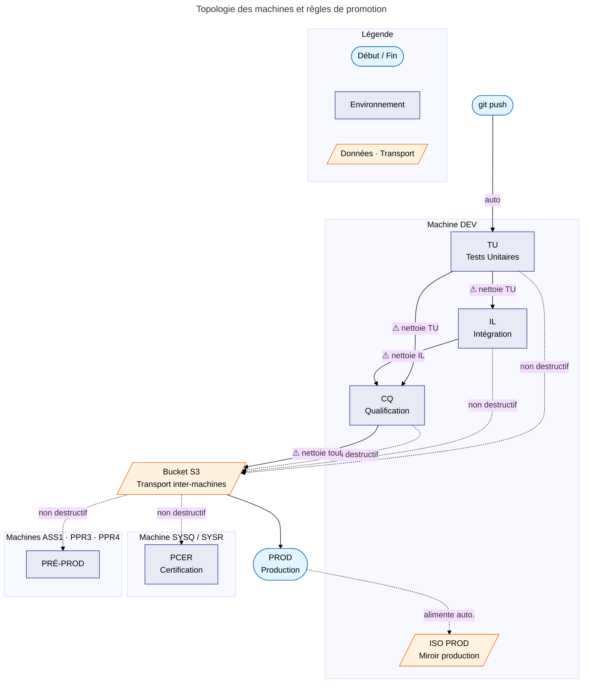
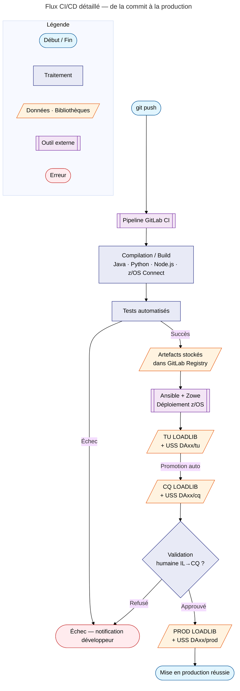

# Conception du pipeline CI/CD GitLab → z/OS

> Expression de besoin v1 — Pipeline d'intégration et de déploiement continus depuis GitLab vers IBM z/OS.

!!! abstract "Ce document est une expression de besoin"
    Ce dossier **n'est pas un document de conception finalisé**. Il exprime les besoins identifiés, les contraintes connues, et pose les questions architecturales à trancher collectivement. Les décisions listées en fin de document **restent ouvertes** et devront être arrêtées avant toute implémentation.

!!! note "Périmètre de l'étude"
    Cette CI/CD couvre exclusivement les **technologies modernes** non prises en charge par ChangeMan :

    - **Java** (applications, services)
    - **Python** (scripts, services)
    - **JavaScript / Node.js** (services, outillage)
    - **z/OS Connect** (artefacts OpenAPI2 et OpenAPI3)

    Le **COBOL**, le JCL et les technologies historiques restent entièrement gérés par ChangeMan et sont **hors périmètre** de cette étude.

---

## Avant de commencer — Concepts clés

Cette section s'adresse à toute personne qui découvre soit le CI/CD, soit le monde du Mainframe IBM. Si vous maîtrisez déjà ces environnements, passez directement à la [topologie des environnements](#topologie-des-environnements).

??? info "Qu'est-ce que le CI/CD ?"
    **CI** (*Continuous Integration* — Intégration Continue) désigne le fait de compiler, tester et valider automatiquement le code à chaque modification d'un développeur, sans intervention humaine.

    **CD** (*Continuous Deployment* — Déploiement Continu) va plus loin : une fois le code validé, il est automatiquement déployé vers un ou plusieurs environnements (test, recette, production).

    **En pratique :** un développeur pousse son code sur GitLab → une série d'étapes s'enchaîne automatiquement → le binaire compilé atterrit sur le Mainframe au bon endroit, sans que personne n'ait à intervenir manuellement.

??? info "Qu'est-ce qu'un Mainframe IBM z/OS ?"
    Un **Mainframe** (aussi appelé « grand système ») est un type d'ordinateur conçu pour traiter des volumes très élevés de transactions avec une fiabilité extrême. Les banques, assurances et grandes administrations l'utilisent pour leurs applications critiques (paie, comptabilité, paiements).

    **IBM z/OS** est le système d'exploitation qui tourne sur ces machines. Il est très différent de Linux ou Windows : il a ses propres concepts de fichiers, de processus et d'outils.

??? info "Glossaire des termes Mainframe utilisés dans ce document"
    | Terme | Définition simple |
    |-------|-------------------|
    | **LPAR** | *Logical Partition* — partition logique d'un Mainframe. Un même serveur physique peut héberger plusieurs LPAR indépendantes, comme des machines virtuelles. |
    | **USS** | *Unix System Services* — couche Unix intégrée à z/OS. Permet d'utiliser des commandes Unix (`ls`, `cp`, `sh`…) et de stocker des fichiers dans une arborescence classique (`/u/projet/…`). |
    | **PDS / PDSE** | *Partitioned Data Set* — format de fichier propre à z/OS. C'est une bibliothèque qui contient des **membres** (analogues à des fichiers). Ex : `PRJ.APP01.TU.LOAD(MONPROG)`. |
    | **LOADLIB** | Bibliothèque PDS contenant des **programmes compilés** (exécutables) prêts à être lancés. |
    | **COBOL** | Langage de programmation très utilisé sur Mainframe, notamment pour la finance. Les sources `.cbl` sont compilées en modules exécutables stockés dans une LOADLIB. |
    | **JCL** | *Job Control Language* — langage de script propre à z/OS, utilisé pour soumettre des travaux (jobs) au système. C'est l'équivalent des scripts shell sur Linux. |
    | **BPXBATCH** | Programme JCL qui permet d'exécuter une commande Unix (USS) depuis un job JCL. Pont entre le monde JCL et le monde Unix. |
    | **OPC / TWS** | Ordonnanceur de tâches sur z/OS (équivalent de `cron` sur Linux). Il planifie et enchaîne les jobs à des horaires définis. |
    | **Zowe** | Framework open source qui expose des API REST pour interagir avec z/OS depuis l'extérieur (GitLab, Ansible, etc.). |
    | **Ansible** | Outil d'automatisation open source qui permet de déployer et configurer des systèmes à distance, y compris z/OS via Zowe. |
    | **z/OS Connect EE v2** | Version de z/OS Connect basée sur **OpenAPI2**. Les artefacts produits sont des fichiers `.ar`. La construction s'effectue avec l'utilitaire `zconbt` directement sous USS. |
    | **z/OS Connect v3** | Version de z/OS Connect basée sur **OpenAPI3**. Les artefacts produits sont des fichiers `.war`. La construction nécessite l'**IBM API Connect Designer**, exécuté sous Docker. |
    | **zconbt** | Utilitaire USS fourni par IBM pour construire les artefacts `.ar` de z/OS Connect EE v2 (OpenAPI2). S'exécute directement sur z/OS sans conteneur. |
    | **ChangeMan** | Outil de gestion de configuration logicielle (*SCM*) dédié au Mainframe, alternative à Endevor. Il gère les versions des sources et la promotion des composants (COBOL, JCL) à travers les environnements. Il ne supporte pas les technologies modernes telles que les artefacts z/OS Connect. |
    | **DAxx / DYxx** | Identifiants de projets internes. `DAxx` désigne les applications développées en interne ; `DYxx` désigne les progiciels tiers (livrés sans code source). |

---

## Situation actuelle

### Parc applicatif

L'environnement cible compte environ **600 applications Mainframe**, réparties entre :

- Des applications développées en interne (`DAxx`) — code source COBOL, JCL, Java, Python.
- Des progiciels tiers (`DYxx`) — livrés sous forme de binaires, sans code source.

### ChangeMan — l'outil SCM en place

La gestion des sources et des déploiements est aujourd'hui assurée par **ChangeMan**, un outil de gestion de configuration logicielle (*SCM — Software Configuration Management*) propre au Mainframe IBM. C'est une alternative à Endevor, autre SCM Mainframe très répandu.

??? info "Ce que ChangeMan gère"
    ChangeMan orchestre la **promotion des composants** à travers les environnements successifs. Il contrôle les versions, gère les cycles de validation, déclenche compilations et copies en bibliothèques PDS, et assure les déploiements entre machines via un **bucket S3** comme vecteur de transport inter-machines.

    Il couvre les technologies suivantes :

    - Sources COBOL (`.cbl`, `.cpy`) et modules assembleur
    - JCL et procédures cataloguées
    - Fichiers de paramètres
    - **Java** — compilation via le compilateur Java déployé sous USS, production de `.jar` ou `.class`

### Limites de ChangeMan — l'origine du besoin

ChangeMan ne prend pas en charge les technologies les plus récentes. Ces composants sont aujourd'hui gérés **manuellement**, sans traçabilité ni automatisation.

!!! warning "Périmètre non couvert par ChangeMan — gestion manuelle aujourd'hui"
    | Technologie | Artefacts concernés | Situation actuelle |
    |-------------|--------------------|--------------------|
    | **z/OS Connect OpenAPI2** | Artefacts `.ar`, fichiers de définition YAML OpenAPI2, copybooks générés | Déploiement manuel, aucun historique de version |
    | **z/OS Connect OpenAPI3** | Artefacts `.war`, fichiers de définition YAML OpenAPI3, copybooks générés | Déploiement manuel, aucun historique de version |
    | **Python** | Environnements virtuels (`venv`), modules `.pyc` | Copie manuelle vers USS |
    | **JavaScript / Node.js** | Modules, bundles, scripts | Copie manuelle vers USS |

    C'est précisément **ce périmètre non couvert** qui motive la mise en place d'un pipeline GitLab CI/CD.

!!! warning "Décision à prendre — périmètre Java dans le pipeline"
    ChangeMan gère déjà le Java (compilation + déploiement). La question est ouverte : le pipeline CI/CD doit-il **prendre en charge tout le Java** pour moderniser le processus (Maven, Gradle, tests automatisés), ou seulement les projets Java que ChangeMan ne sait pas construire ?

---

## Principes directeurs

Ces trois principes sont **non négociables** : toute décision architecturale doit les respecter.

### 1. Mémoire du pipeline

Le pipeline couvre l'ensemble des composants des technologies modernes gérées hors ChangeMan :

- **Java** — archives `.jar`, composants web `.war`
- **Python** — packages, environnements virtuels (`venv`)
- **JavaScript / Node.js** — applications et modules Node.js
- **Scripts shell** — scripts USS exécutables
- **Documentation** — fichiers Markdown (`.md`)
- **z/OS Connect** — artefacts OpenAPI2 (`.ar`) et OpenAPI3 (`.war`), fichiers de définition (`.yaml`), copybooks générés

Il doit maintenir un **état complet et permanent** à trois niveaux :

| Niveau | Ce qui est tracé |
|--------|-----------------|
| **En cours de construction** | Builds actifs : qui a poussé quoi, quelle étape est en cours, depuis combien de temps |
| **Construit** | Chaque artefact produit : commit SHA, auteur, date, version, technologie concernée |
| **Déployé** | Par environnement et par machine : quelle version est déployée, depuis quand, par qui |

- L'état de chaque environnement (TU, IL, CQ, PCER, PRÉ-PROD, PROD) est **toujours connu et consultable** depuis GitLab.
- Le **retour arrière** (*rollback*) est possible à tout moment vers n'importe quelle version précédemment construite.
- Un **journal d'audit** est conservé : qui a déployé quoi en production, et quand.

!!! warning "Décision à prendre — backend de la mémoire"
    Où stocker l'état du pipeline (builds, déploiements, historiques) ?

    | Option | Description | Points de vigilance |
    |--------|-------------|---------------------|
    | **GitLab Registry + metadata** | Artefacts tagués dans GitLab, état dans les jobs CI/CD | Dépendance totale à GitLab pour la traçabilité |
    | **DB2 for z/OS** | Tables relationnelles sur la plateforme Mainframe (HA native, RACF, SQL) | Nécessite une API REST DB2 pour l'écriture depuis GitLab ; complexité supplémentaire |
    | **Hybride** | GitLab pour les artefacts, DB2 pour l'état et l'audit | Meilleure résilience mais deux systèmes à maintenir |

    DB2 for z/OS est une option sérieuse : il est déjà présent, hautement disponible, RACF-protégé, et adapté à un SI critique. L'accès depuis le pipeline se ferait via les **services REST DB2** (API HTTP), sans client DB2 natif sur les runners.

Ce besoin de mémoire implique de s'appuyer sur une **source de vérité unique** — GitLab Registry, DB2 for z/OS, ou un hybride des deux — et non sur le contenu des bibliothèques ou répertoires Mainframe qui peuvent dériver au fil du temps.

### 2. Simplicité pour les développeurs

Le développeur ne doit pas avoir à connaître les détails de l'infrastructure Mainframe pour livrer son code.

!!! success "Expérience cible"
    Un `git push` déclenche tout. Le développeur reçoit une notification de succès ou d'échec en quelques minutes. Il n'ouvre jamais un terminal TSO, ne soumet jamais un JCL manuellement, ne copie jamais un fichier sur USS à la main.

- **Onboarding rapide** : intégrer un nouveau projet dans le pipeline doit être faisable en moins d'une demi-journée, via un modèle de configuration réutilisable.
- **Retour immédiat** : les erreurs de compilation ou d'exécution des tests remontent directement dans GitLab, avec le détail du log.
- **Autonomie** : les développeurs peuvent déclencher eux-mêmes la promotion vers CQ, sans passer par une équipe d'exploitation.

### 3. Approche API

Toutes les interactions avec z/OS passent par des **API**, sans accès direct ni opération manuelle.

| Besoin | API à utiliser |
|--------|---------------|
| Déposer des fichiers sur USS | Zowe Files REST API |
| Soumettre un job JCL | Zowe Jobs REST API |
| Copier un membre PDS | Zowe Data Sets REST API |
| Gérer les instances z/OS Connect | z/OS Connect Admin API |
| Lire les logs d'exécution | Zowe Jobs REST API |

!!! warning "Décision à prendre — orchestrateur"
    Deux options crédibles ; Jenkins est explicitement écarté.

    | Option | Description | Position |
    |--------|-------------|----------|
    | **Ansible + collection IBM z/OS** | Playbooks Ansible pilotant z/OS via Zowe | À étudier — dépendance Ansible à maintenir |
    | **Scripts Zowe CLI natifs** | Appels Zowe CLI directement dans les stages GitLab CI | Plus simple, moins de couche supplémentaire |
    | ~~**Jenkins**~~ | Moteur CI/CD alternatif | **Écarté** — voir ci-dessous |

    !!! danger "Jenkins — pourquoi il est écarté"
        - **Aucun client officiel Jenkins pour z/OS** : point de fragilité majeur sur un SI critique
        - **Non promu par CA-GIP** : hors du cadre de gouvernance interne
        - **Couche supplémentaire** : Jenkins entre GitLab et z/OS ajoute un maillon qui peut tomber, sans apporter de valeur sur ce périmètre
        - **Avenir incertain** dans cet écosystème : la tendance est aux pipelines natifs GitLab CI/CD

### 4. Planification des déploiements en production

Le développeur doit pouvoir **programmer une installation en production**, sans mobiliser l'équipe d'exploitation.

!!! warning "Point ouvert — depuis quel outil ?"
    L'interface depuis laquelle le développeur programme l'installation n'est pas encore définie : GitLab CI/CD (interface native), un portail dédié, ou un autre outil. À préciser.

!!! info "Ce que la planification implique"
    - La date et l'heure du déploiement PROD sont saisies dans GitLab par le développeur.
    - Elles peuvent être **modifiées ou annulées** jusqu'au moment du déclenchement effectif.
    - D'autres actions pourront également être planifiables : rollback, synchronisation ISO PROD, fenêtre de maintenance.

!!! warning "Questions à trancher"
    - Le planning est-il géré côté **GitLab** (le pipeline reste en attente d'un déclencheur horaire) ou côté **OPC/TWS** (GitLab soumet à OPC/TWS qui exécute à l'heure voulue) ?
    - Qui peut modifier ou annuler une planification ? Le développeur seul, ou également un responsable de release ?
    - Faut-il une confirmation explicite dans GitLab peu avant l'heure planifiée pour éviter un déploiement devenu non souhaité ?
    - Y a-t-il des plages horaires interdites ou des jours de gel imposés ?

### 5. Traçabilité légale source ↔ exécutable

La réglementation impose de pouvoir établir une **bijection** entre tout exécutable déployé et le code source exact qui l'a produit — et réciproquement.

??? info "Qu'est-ce qu'une bijection source ↔ exécutable ?"
    Une **bijection** signifie qu'à chaque exécutable correspond un et un seul source, et inversement. Si un binaire est en production, on doit pouvoir retrouver le fichier source exact qui l'a généré. Si un source est modifié, le binaire précédent ne peut plus lui être associé.

#### Approche projet — Java, Python, Node.js, z/OS Connect

Un projet (un dépôt Git, un commit) peut produire **plusieurs artefacts** : modules compilés, scripts, fichiers de configuration. La traçabilité s'établit au **niveau du projet** : un tag Git (ou commit SHA) sur le dépôt est la référence unique de la livraison. Il n'est pas nécessaire de taguer chaque artefact individuellement.

!!! success "Granularité retenue : le projet"
    Tous les artefacts produits depuis un même commit portent le **même identifiant de projet**. La bijection est donc : un tag de projet ↔ l'ensemble des artefacts de cette livraison.

Le tableau ci-dessous décrit comment cet identifiant est techniquement intégré dans chaque type d'artefact :

| Technologie | Artefacts produits | Intégration du tag projet |
|---|---|---|
| **Java** | Un ou plusieurs `.jar` / `.war` | SHA du commit Git dans `MANIFEST.MF` |
| **Python** | Plusieurs modules `.pyc`, `venv` complet | SHA dans un fichier `.build-info` ou `__version__` |
| **Node.js** | Modules, bundles, scripts | SHA dans `package.json` ou un fichier `.build-info` |
| **Scripts shell** | Un ou plusieurs scripts USS | SHA en commentaire d'en-tête du script |
| **z/OS Connect OpenAPI2** | Artefacts `.ar`, copybooks générés | SHA dans les métadonnées de l'artefact `zconbt` |
| **z/OS Connect OpenAPI3** | Artefacts `.war`, fichiers `.yaml`, copybooks générés | SHA dans le champ `info.version` du fichier `.yaml` |

---

## Questions préalables à la conception

Avant de valider l'architecture, les réponses aux questions suivantes sont indispensables. Elles permettront de lever les incertitudes qui bloquent certaines décisions.

### Questions fonctionnelles

| # | Question | Statut |
|---|----------|--------|
| F1 | Quelle est la fréquence attendue des déploiements ? (quotidienne, hebdomadaire…) | ☐ À clarifier |
| F2 | Qui déclenche la promotion vers CQ et vers PROD ? (développeur, chef de projet, astreinte ?) | ☐ À clarifier |
| F3 | Le rollback doit-il être automatique en cas d'erreur détectée, ou toujours déclenché manuellement ? | ☐ À clarifier |
| F4 | Y a-t-il des contraintes réglementaires sur les déploiements en production ? (double validation, fenêtre de maintenance obligatoire ?) | ☐ À clarifier |
| F5 | Comment les équipes métier valident-elles en CQ aujourd'hui ? Doivent-elles recevoir une notification automatique quand un déploiement CQ est prêt ? | ☐ À clarifier |
| F6 | Le pipeline doit-il gérer les migrations de données (scripts SQL, DDL DB2) en plus des binaires applicatifs ? | ☐ À clarifier |
| F7 | Quel est le texte réglementaire exact imposant la bijection source ↔ exécutable ? | ☐ À documenter — granularité : **projet** (décision arrêtée) |
| F8 | Y a-t-il des plages horaires interdites ou des périodes de gel (freeze) pour les déploiements en production ? | ☐ À clarifier |
| F9 | Qui peut reprogrammer ou annuler une installation en production déjà planifiée ? | ☐ À clarifier |
| F10 | Quelles autres actions (rollback, synchronisation ISO PROD…) doivent être planifiables depuis GitLab ? | ☐ À clarifier |

### Questions sur l'existant

| # | Question | Statut |
|---|----------|--------|
| E1 | Quelle version de ChangeMan est en place ? Y a-t-il des scripts de promotion existants potentiellement réutilisables ? | ☐ À clarifier |
| E2 | GitLab est-il déjà en place ? Quelle version ? Des runners sont-ils déjà configurés, et sur quel OS ? | ☐ À clarifier |
| E3 | Zowe est-il déjà installé sur les LPAR cibles ? Quelle version ? L'API Gateway Zowe est-elle activée ? | ☐ À clarifier |
| E4 | Ansible est-il déjà utilisé par une équipe ? Existe-t-il des playbooks z/OS existants réutilisables ? | ☐ À clarifier |
| E5 | Quelle est la connectivité réseau entre GitLab et les LPAR z/OS ? (port 443 ouvert ? passage par une DMZ ?) | ☐ À clarifier |
| E6 | Les droits RACF permettent-ils à un compte de service de déposer des fichiers USS et de soumettre des jobs JCL ? | ☐ À clarifier |
| E7 | Un registre d'artefacts (GitLab Registry, Nexus, Artifactory) est-il déjà disponible et accessible depuis z/OS ? | ☐ À clarifier |
| E8 | JDK et interpréteurs Python sont-ils déjà installés sur USS ? Quelles versions sont homologuées ? | ☐ À clarifier |
| E9 | Les artefacts z/OS Connect en production sont-ils documentés (inventaire des `.ar` OpenAPI2 et `.war` OpenAPI3 actifs, par version) ? | ☐ À clarifier |
| E10 | Les machines SYSQ/SYSR (PCER) et ASS1/PPR3/PPR4 (PRÉ-PROD) sont-elles accessibles depuis GitLab via Zowe ? | ☐ À clarifier |
| E11 | Y a-t-il des contraintes d'accès réseau ou RACF spécifiques entre la machine DEV et les machines PCER/PRÉ-PROD ? | ☐ À clarifier |
| E12 | Quel est le bucket S3 utilisé aujourd'hui par ChangeMan pour les transferts inter-machines ? Les runners GitLab peuvent-ils y accéder ? | ☐ À clarifier |
| E13 | Quelles sont les credentials S3 (clé d'accès, secret, endpoint) et qui les gère ? Existe-t-il un bucket par environnement cible ou un bucket partagé ? | ☐ À clarifier |

### Questions sur les technologies

| # | Question | Statut |
|---|----------|--------|
| T1 | L'orchestrateur retenu est-il **Ansible + collection IBM z/OS**, ou des **scripts Zowe CLI** appelés directement depuis GitLab CI ? | ☐ À décider |
| T2 | L'instance z/OS Connect est-elle une par environnement (TU, IL, CQ…) ou mutualisée ? Dispose-t-elle d'une API d'administration pour le rechargement à chaud ? | ☐ À clarifier |
| T3 | Faut-il une **API Gateway** (ex. IBM API Connect) devant z/OS Connect, ou z/OS Connect est-il directement exposé aux consommateurs ? | ☐ À décider |
| T4 | Comment les **secrets** (mots de passe, certificats TLS, tokens) sont-ils gérés dans le pipeline ? (variables CI/CD GitLab, HashiCorp Vault, RACF keyring ?) | ☐ À décider |
| T6 | Quel format de notification est attendu en cas d'échec ou de succès ? (e-mail, Teams, webhook…) | ☐ À clarifier |
| T7 | La planification PROD est-elle gérée dans GitLab (pipeline en attente) ou déléguée à OPC/TWS (GitLab soumet, OPC/TWS exécute à l'heure) ? | ☐ À décider |
| T8 | Quel mécanisme d'horodatage et de taggage est retenu pour la bijection source ↔ exécutable sur les technologies modernes ? | ☐ À décider |

---

## Topologie des environnements

### Les machines et leurs environnements

Le périmètre couvre **quatre zones machines distinctes**. La machine DEV regroupe à elle seule quatre des environnements du cycle de vie.

| Zone machine | Identifiants | Environnements hébergés | Rôle principal |
|---|---|---|---|
| **Machine DEV** | — | TU · IL · CQ · ISO PROD | Développement, tests, qualification |
| **Machine SYSQ / SYSR** | — | PCER | Certification — recette système indépendante |
| **Machines pré-production** | ASS1 · PPR3 · PPR4 | PRÉ-PROD | Validation finale avant production |
| **Machine production** | — | PROD | Production |



### Description de chaque environnement

| Environnement | Machine | Rôle | Déclenchement |
|---|---|---|---|
| **TU** — Tests Unitaires | DEV | Valider le composant seul, isolément | Automatique à chaque `git push` |
| **IL** — Intégration | DEV | Vérifier que les composants fonctionnent ensemble | Promotion depuis TU (⚠ nettoie TU) |
| **CQ** — Qualification | DEV | Recette fonctionnelle par les équipes métier | Promotion depuis TU ou IL (⚠ nettoie la source) |
| **ISO PROD** | DEV | Miroir exact de la production | Alimenté automatiquement lors du déploiement PROD |
| **PCER** — Certification | SYSQ / SYSR | Recette système indépendante | Promotion depuis TU, IL ou CQ — non destructif |
| **PRÉ-PROD** | ASS1 · PPR3 · PPR4 | Validation en conditions quasi-réelles | Promotion depuis TU, IL ou CQ — non destructif |
| **PROD** — Production | Production | Exécution réelle, données réelles | Manuel + fenêtre de maintenance (⚠ nettoie tout) |

### Règles de promotion

!!! warning "Promotions destructives — l'environnement source est nettoyé"
    Certaines promotions **nettoient l'environnement source** après transfert des artefacts, afin de le libérer pour le prochain cycle de développement.

    | Promotion | Effet sur la source |
    |-----------|---------------------|
    | TU → IL | TU est nettoyé |
    | TU → CQ (saut direct) | TU est nettoyé |
    | IL → CQ | IL est nettoyé |
    | Vers PROD | TU, IL et CQ sont tous nettoyés |

!!! info "Promotions non destructives — la source est préservée"
    La promotion vers PCER ou PRÉ-PROD **ne modifie pas** l'environnement source. TU, IL et CQ restent intacts. Cela permet de certifier ou de tester en pré-production tout en continuant le développement en parallèle sur la machine DEV.

    | Promotion | Source affectée |
    |-----------|----------------|
    | TU / IL / CQ → PCER | Aucune |
    | TU / IL / CQ → PRÉ-PROD | Aucune |

!!! info "Transport inter-machines — Bucket S3"
    Toute promotion vers une machine différente de la machine DEV (PCER, PRÉ-PROD, PROD) **transite obligatoirement par un bucket S3**. C'est le mécanisme déjà utilisé par ChangeMan pour véhiculer les artefacts entre les LPAR. Le pipeline CI/CD doit réutiliser ce même vecteur de transport.

!!! warning "ISO PROD — conséquence du déploiement PROD, pas une cible directe"
    ISO PROD n'est pas déployée par le pipeline : elle est alimentée **automatiquement** comme effet de bord du déploiement en production. Son unique rôle est de permettre un retour arrière rapide en cas d'incident.

    **Séquence lors d'un déploiement PROD :**

    1. Nettoyage de TU, IL et CQ sur la machine DEV
    2. Déploiement des artefacts en PROD
    3. Copie automatique PROD → ISO PROD

!!! info "Qu'est-ce que la promotion ?"
    « Promouvoir » un artefact signifie le copier d'un environnement vers le suivant. On ne recompile jamais entre TU et PROD — c'est le **même binaire** construit une seule fois en TU qui remonte jusqu'en production. Cela garantit que ce qui est testé est exactement ce qui est livré.

---

## Structure des projets

### L'approche « Projet »

Les technologies couvertes (Java, Python, Node.js, z/OS Connect) produisent des **ensembles d'artefacts interdépendants** : bibliothèques, fichiers de configuration, interpréteurs, modules. Il faut donc penser en termes de **projet complet**, et non de composant isolé.

Un projet peut dépendre de dizaines de bibliothèques tierces (`JAR`, modules Python, packages npm), d'un interpréteur, de fichiers de configuration et de ressources. Tout cela doit être cohérent et présent au même endroit au moment de l'exécution.

### Arborescence USS cible

Pour chaque application `DAxx`, la structure suivante est créée sur z/OS :

```
/u/apps/DAxx/
├── venv/          ← Environnement Python isolé (interpréteur + packages)
├── node_modules/  ← Dépendances Node.js
├── bin/           ← Binaires et scripts exécutables (.pyc, .jar, .js, .sh)
├── config/        ← Fichiers de configuration propres à chaque environnement
├── zconnect/
│   ├── openapi2/  ← Artefacts OpenAPI2 actifs (.ar)
│   └── openapi3/  ← Artefacts OpenAPI3 actifs (.war + .yaml)
└── logs/          ← Journaux d'exécution
```

!!! tip "Un répertoire par environnement"
    En pratique, on n'a pas un seul `/u/apps/DAxx/` mais un par environnement :
    `/u/apps/DAxx/tu/`, `/u/apps/DAxx/il/`, etc. Cela garantit l'isolation complète entre les niveaux.

??? info "Qu'est-ce qu'un venv Python ?"
    Un `venv` (*virtual environment*) est un répertoire auto-suffisant contenant une copie de l'interpréteur Python et toutes les bibliothèques nécessaires au projet. Chaque projet a le sien — ils ne se mélangent pas. C'est l'équivalent Python d'un `JAR` fat pour Java.

### Flux CI/CD complet



---

## Décisions architecturales

Ces points doivent être **tranchés collectivement** avant de commencer la configuration Ansible et les scripts Zowe. Une réponse non arrêtée bloque l'implémentation.

### A. Arborescence et nommage

#### Conventions de nommage des PDS

##### Contraintes z/OS pour les noms de datasets

| Règle | Valeur |
|-------|--------|
| Longueur d'un segment (qualificatif) | 1 à **8 caractères** |
| Caractères autorisés | A–Z, 0–9, `@`, `#`, `$`, `-` |
| Séparateur | `.` (point — **compté** dans la longueur totale) |
| Longueur totale maximale | **44 caractères** (dots inclus) |
| Nombre maximum de segments pratique | **5** (5 × 8 + 4 points = 44) |

##### Structure proposée

Le nom doit être **lisible par tous** : on doit pouvoir retrouver le code application, l'environnement et la nature du contenu sans documentation.

```
<ORG> . <APPID> . <ENV> . <TYPE>
 3c      ≤6c      ≤5c     ≤4c        → max ~21 chars, largement dans les 44
```

| Segment | Longueur | Contenu | Valeurs |
|---------|---------|---------|---------|
| `ORG` | 3 | Organisation | `LCL` |
| `APPID` | ≤ 6 | Code application | `DA0001`, `DY0042` |
| `ENV` | ≤ 5 | Environnement | `TU` · `IL` · `CQ` · `ISO` · `PCER` · `PREP` · `PROD` |
| `TYPE` | ≤ 4 | Nature des artefacts | `LOAD` · `JARS` · `ZCON` · `CFG` · `VENV` |

##### Exemples

```
LCL.DA0001.TU.LOAD      ← modules Java de DA0001 en TU       (18 cars)
LCL.DA0001.CQ.JARS      ← archives JAR de DA0001 en CQ       (18 cars)
LCL.DA0001.ISO.LOAD     ← ISO PROD de DA0001                  (19 cars)
LCL.DA0001.PCER.ZCON    ← artefacts z/OS Connect en PCER      (20 cars)
LCL.DA0001.PROD.CFG     ← config de DA0001 en production      (19 cars)
```

!!! warning "Décision à prendre — dataset par projet ou global ?"
    Faut-il un **dataset par projet** ou un **dataset global avec membres** ?

=== "Option 1 — Dataset par projet (recommandée)"
    ```
    LCL.DA0001.TU.LOAD   ← tous les modules de DA0001 en TU
    LCL.DA0002.TU.LOAD   ← tous les modules de DA0002 en TU
    ```
    **Avantages :** isolation totale, purge simple, droits RACF granulaires.
    **Inconvénient :** multiplication des datasets (600 projets × 7 environnements = jusqu'à 4 200 datasets).

=== "Option 2 — Dataset global avec membres"
    ```
    LCL.GLOBAL.TU.LOAD(DA0001)   ← module de DA0001
    LCL.GLOBAL.TU.LOAD(DA0002)   ← module de DA0002
    ```
    **Avantages :** moins de datasets à gérer.
    **Inconvénients :** risque de collision de noms, impossible de purger un projet sans risquer d'impacter les autres.

#### Mapping projet / dépôt GitLab

!!! warning "Décision à prendre"
    Un dépôt GitLab correspond-il **strictement** à un identifiant `DAxx` ?

    Si un `DAxx` contient plusieurs micro-services (ex. une API, un batch, un composant z/OS Connect), ils doivent être **isolés dans des sous-répertoires distincts** du dépôt, et les artefacts déployés dans des chemins USS séparés :

    ```
    /u/apps/DA01/api/
    /u/apps/DA01/batch/
    /u/apps/DA01/zconnect/
    ```

#### Versioning des exécutables

!!! warning "Décision à prendre"
    Les binaires porteront-ils un **numéro de version** dans leur nom ou un **nom fixe** ?

| Stratégie | Exemple | Pour | Contre |
|-----------|---------|------|--------|
| Nom versionné | `api-1.2.0.war` | Traçabilité, rollback facile | L'ordonnanceur doit être mis à jour à chaque release |
| Nom fixe | `api.war` | L'ordonnanceur n'est jamais modifié | Moins de traçabilité, rollback plus complexe |

    Sur Mainframe, la **stratégie nom fixe** est souvent préférée car modifier les JCL d'ordonnancement à chaque release est coûteux et risqué.

---

### B. Gestion des environnements

#### Isolation entre TU, IL, CQ

!!! warning "Décision à prendre"
    Ces trois environnements résident-ils sur la **même LPAR** ?

    Si oui, l'isolation repose entièrement sur la séparation des répertoires USS et des datasets PDS. Le risque majeur est qu'un `venv` Python ou un `classpath` Java pointe accidentellement vers le mauvais répertoire.

    **Règle à appliquer :** chaque environnement doit avoir ses propres variables d'environnement (`PYTHONPATH`, `CLASSPATH`) définies dans les scripts de lancement, et **jamais** en dur dans le `~/.profile` partagé.

#### Nettoyage automatique entre deux builds

!!! warning "Décision à prendre"
    Lors d'un nouveau build en TU, faut-il **purger** l'arborescence précédente ou **écraser** les fichiers ?

| Approche | Comportement | Recommandation |
|----------|-------------|----------------|
| **Purge complète** | Supprime tout avant de redéployer | Recommandé pour éviter les fichiers orphelins |
| **Écrasement** | Remplace uniquement les fichiers modifiés | Plus rapide, mais risque de résidus d'une version précédente |

    La purge complète est **préférable en TU et IL**. En CQ et PROD, on préfère l'écrasement contrôlé pour limiter la fenêtre d'indisponibilité.

#### Validation ISO PROD

!!! info "Principe"
    ISO PROD est une copie exacte de la production avant tout déploiement. Elle sert de point de retour arrière en cas de problème.

!!! warning "Décision à prendre"
    Qui déclenche la synchronisation ISO PROD → PROD ?

    - **Option A :** un job OPC/TWS planifié en fin de déploiement réussit → déclenche la copie automatiquement.
    - **Option B :** une étape Ansible explicite dans le pipeline GitLab CI.

    L'option B est plus traçable (visible dans GitLab) mais nécessite que le pipeline reste ouvert jusqu'à la fin du déploiement en production.

---

### C. Artefacts spécifiques

#### z/OS Connect — construction et déploiement des artefacts

??? info "OpenAPI2 et OpenAPI3 — deux versions, deux outillages"
    z/OS Connect existe en deux versions majeures avec des différences importantes pour le pipeline :

    | | **z/OS Connect EE v2 — OpenAPI2** | **z/OS Connect v3 — OpenAPI3** |
    |---|---|---|
    | **Format des artefacts** | `.ar` | `.war` |
    | **Outil de construction** | `zconbt` (utilitaire USS, exécution directe sur z/OS) | IBM API Connect Designer (image Docker) |
    | **Fichiers de définition** | YAML OpenAPI 2.0 | YAML OpenAPI 3.0 |
    | **Complexité pipeline** | Simple — pas de conteneur nécessaire | Plus complexe — nécessite un runner Docker |

!!! warning "Décision à prendre — infrastructure Docker pour OpenAPI3"
    La construction des artefacts **OpenAPI3 requiert IBM API Connect Designer, disponible uniquement sous Docker**.

    - Les runners GitLab disposent-ils d'un accès Docker ?
    - L'image IBM API Connect Designer est-elle disponible dans le registre Docker interne ?
    - Ou la construction OpenAPI3 est-elle effectuée hors pipeline et les artefacts `.war` poussés directement dans le registre GitLab ?

!!! warning "Décision à prendre — redémarrage après déploiement"
    Le remplacement des artefacts (`.ar` ou `.war`) sur une instance z/OS Connect active nécessite un **redémarrage** pour prise en compte. Le pipeline doit-il le déclencher automatiquement ?

    ```
    MODIFY ZOSCONN,STOP
    MODIFY ZOSCONN,START
    ```

    Un redémarrage non anticipé en production provoque une **interruption de service**. Il faut définir une fenêtre de maintenance ou vérifier si la version en place supporte le rechargement à chaud.

#### z/OS Connect — copybooks générés

??? info "Qu'est-ce qu'un copybook z/OS Connect ?"
    Le processus z/OS Connect génère des **copybooks COBOL** (`.cpy`) qui décrivent les structures de données (requêtes et réponses) des APIs exposées. Ces fichiers permettent aux programmes COBOL consommateurs de s'interfacer avec les services sans construire les structures manuellement.

    Ces copybooks sont **produits par le projet z/OS Connect**, versionnés dans GitLab avec les autres artefacts, et font pleinement partie du périmètre CI/CD.

Ces copybooks ne sont pas déployés dans l'environnement d'exécution applicatif, mais dans l'**environnement de compilation** des programmes COBOL qui les consomment, dans des structures USS adaptées.

!!! warning "Décision à prendre"
    Quelle est la cible de déploiement des copybooks z/OS Connect ?

    | Option | Structure cible | Compatibilité |
    |--------|----------------|---------------|
    | **USS dédié** | `/u/zconnect/copybooks/<projet>/` | Compilateur z/OS via `SYSLIB DD PATH=` |
    | **PDS/PDSE COPYLIB** | `PRJ.ZCONN.COPYLIB` | Compatible avec toutes les configurations de compilation existantes |

    Le répertoire USS dédié est plus cohérent avec l'approche projet, mais la COPYLIB PDS est plus compatible avec les processus de compilation déjà en place sur la machine DEV.

#### Livraison des progiciels DYxx

??? info "Qu'est-ce qu'un progiciel DYxx ?"
    Les `DYxx` sont des applications tierces livrées **sans code source**. On reçoit directement les binaires compilés — il n'y a pas de compilation à faire dans la CI/CD, uniquement un déploiement.

!!! warning "Décision à prendre"
    Sous quel format sont livrés les binaires DYxx ?

| Format | Description | Action dans le pipeline |
|--------|-------------|------------------------|
| **XMIT** | Format d'échange natif z/OS | Réception via `TSO RECEIVE`, puis copie en LOADLIB |
| **Dump de bibliothèque** | Export d'une PDSE complète | Restauration via IEBCOPY |
| **Binaire brut USS** | Fichier `.jar` ou `.so` sur USS | Copie directe dans le répertoire cible |

---

### D. Ordonnancement (OPC/TWS)

#### Appel des programmes Java et Python

??? info "Comment OPC/TWS lance-t-il un programme ?"
    OPC/TWS (aussi appelé Z Workload Scheduler) soumet des **jobs JCL** au système. Pour lancer un programme Java ou Python (qui vivent dans USS), il faut un JCL intermédiaire utilisant `BPXBATCH` pour exécuter une commande Unix.

!!! warning "Décision à prendre"
    L'ordonnanceur doit-il appeler des **procédures JCL standardisées** ou des **scripts USS** directement ?

=== "Option A — Procédures JCL (BPXBATCH)"
    ```jcl
    //RUNJAVA  JOB ...
    //STEP01   EXEC PGM=BPXBATCH
    //STD      DD *
    sh /u/apps/DA01/bin/run.sh
    /*
    ```
    **Avantages :** cohérent avec l'existant JCL, codes retour gérés nativement par OPC/TWS.

=== "Option B — Scripts USS directs"
    L'ordonnanceur appelle directement un script shell via un agent USS.
    **Avantages :** plus simple à maintenir par les développeurs.
    **Inconvénient :** nécessite un agent USS compatible OPC/TWS (pas toujours disponible).

    L'**option A (BPXBATCH)** est généralement recommandée pour la compatibilité avec l'existant.

#### Vérification de disponibilité avant déploiement

!!! warning "Point de vigilance critique"
    Si un programme est **en cours d'exécution dans OPC/TWS** au moment du déploiement, remplacer son binaire peut provoquer une erreur imprévisible — voire une corruption silencieuse.

    Le pipeline CI/CD doit vérifier, via l'API OPC/TWS ou Zowe, que l'application cible **n'est pas en cours d'exécution** avant de mettre à jour ses binaires.

---

## Points de vigilance architecturaux

### Gestion des dépendances partagées

C'est le **point le plus délicat** de l'approche projet sur Mainframe.

!!! danger "Risque : multiplication des copies"
    Sur Mainframe, la tradition est de **tout centraliser** dans des bibliothèques communes. L'approche projet moderne, elle, tend à **embarquer toutes les dépendances dans le package** (Fat-JAR, venv complet). Ces deux philosophies sont en tension.

    Si le projet DA01 et le projet DA02 utilisent tous les deux la bibliothèque `commons-utils-2.1.jar`, combien de copies existent sur le Mainframe ?

=== "Stratégie Fat-JAR / venv complet (autonomie)"
    Chaque projet embarque **toutes ses dépendances** dans son artefact.

    | Pour | Contre |
    |------|--------|
    | Déploiement indépendant | Duplication des bibliothèques communes (espace disque) |
    | Pas de conflit de versions | Mise à jour de sécurité = relivraison de tous les projets |
    | Rollback simple | |

=== "Stratégie bibliothèque partagée (mutualisation)"
    Les dépendances communes sont installées une seule fois dans un répertoire partagé `/u/shared/lib/`.

    | Pour | Contre |
    |------|--------|
    | Économie d'espace | Risque de conflit de versions entre projets |
    | Mise à jour centralisée | Un projet peut casser à cause d'une mise à jour qu'il n'a pas demandée |

!!! tip "Recommandation"
    Privilégier la **stratégie Fat-JAR / venv complet** pour les projets en développement actif. Envisager la bibliothèque partagée uniquement pour les composants **extrêmement stables** (JDK, bibliothèques IBM certifiées), gérés par l'équipe infrastructure, versionnés et auditables.

### Classpath Java sur Mainframe

!!! warning "Piège classique"
    Sur un serveur Linux classique, le `CLASSPATH` est défini dans des variables d'environnement ou dans des fichiers de configuration du serveur d'application. Sur z/OS, avec plusieurs environnements sur la même LPAR, il est **très facile de pointer vers le mauvais répertoire**.

    Règle : le `CLASSPATH` doit toujours être défini **localement dans le script de lancement** du programme, jamais hérité d'un profil système global.

---

## Récapitulatif des points ouverts

### Questions préalables (informations à collecter)

| # | Question | Statut |
|---|----------|--------|
| F1 | Fréquence et déclencheurs des déploiements | ☐ À clarifier |
| F2 | Qui valide les promotions vers CQ et PROD ? | ☐ À clarifier |
| F3 | Rollback automatique ou manuel ? | ☐ À clarifier |
| F4 | Contraintes réglementaires sur les déploiements PROD | ☐ À clarifier |
| F5 | Notification des équipes métier lors d'un déploiement CQ | ☐ À clarifier |
| F6 | Gestion des migrations DB2 dans le pipeline | ☐ À clarifier |
| F7 | Texte réglementaire exact sur la bijection source ↔ exécutable — granularité : par artefact ou par projet ? | ☐ À clarifier |
| F8 | Plages horaires ou périodes de gel pour les déploiements PROD | ☐ À clarifier |
| F9 | Qui peut modifier ou annuler une installation PROD planifiée ? | ☐ À clarifier |
| F10 | Autres actions planifiables depuis GitLab (rollback, ISO PROD…) | ☐ À clarifier |
| E1 | Version et scripts ChangeMan existants | ☐ À clarifier |
| E2 | Version GitLab et état des runners | ☐ À clarifier |
| E3 | Zowe : version, API Gateway activée ? | ☐ À clarifier |
| E4 | Playbooks Ansible z/OS existants | ☐ À clarifier |
| E5 | Connectivité réseau GitLab ↔ LPAR z/OS | ☐ À clarifier |
| E6 | Droits RACF du compte de service CI/CD | ☐ À clarifier |
| E7 | Registre d'artefacts disponible | ☐ À clarifier |
| E8 | JDK et Python déjà installés sur USS — versions homologuées | ☐ À clarifier |
| E9 | Inventaire des artefacts z/OS Connect actifs en PROD | ☐ À clarifier |
| E10 | Accessibilité des machines PCER et PRÉ-PROD depuis GitLab via Zowe | ☐ À clarifier |
| E11 | Contraintes réseau / RACF entre machine DEV et machines PCER/PRÉ-PROD | ☐ À clarifier |
| E12 | Bucket S3 utilisé par ChangeMan — accès depuis les runners GitLab | ☐ À clarifier |
| E13 | Credentials S3 et topologie (un bucket ou un par cible ?) | ☐ À clarifier |
| E14 | Périmètre Java dans le pipeline : tout Java, ou seulement les projets hors capacité ChangeMan ? | ☐ À décider |

### Décisions architecturales à trancher

| # | Décision | Statut |
|---|----------|--------|
| T0 | Backend mémoire du pipeline : GitLab Registry seul, DB2 for z/OS, ou hybride ? | ☐ À décider |
| T1 | Orchestrateur : Ansible + collection IBM z/OS ou Zowe CLI natif ? (Jenkins écarté) | ☐ À décider |
| T2 | Instances z/OS Connect : une par environnement ou mutualisée ? | ☐ À décider |
| T3 | API Gateway devant z/OS Connect ? | ☐ À décider |
| T4 | Gestion des secrets (GitLab CI, Vault, RACF keyring) | ☐ À décider |
| T6 | Format de notification (e-mail, Teams, webhook…) | ☐ À décider |
| T7 | Planification PROD : GitLab (pipeline en attente) ou OPC/TWS (exécution déléguée) ? | ☐ À décider |
| T8 | Mécanisme de taggage retenu pour la bijection source ↔ exécutable (technologies modernes) | ☐ À décider |
| T9 | Les runners GitLab disposent-ils de Docker ? L'image IBM API Connect Designer est-elle disponible pour construire les artefacts OpenAPI3 ? | ☐ À clarifier |
| T10 | La construction des artefacts OpenAPI2 via `zconbt` s'effectue-t-elle sur un runner connecté à USS ou via Zowe ? | ☐ À clarifier |
| A1 | Dataset par projet ou dataset global ? | ☐ À trancher |
| A2 | Un dépôt GitLab = un `DAxx` strict ? | ☐ À trancher |
| A3 | Noms des binaires versionnés ou fixes ? | ☐ À trancher |
| B1 | Isolation des venv Python entre environnements | ☐ À définir |
| B2 | Purge complète ou écrasement lors d'un nouveau build ? | ☐ À trancher |
| C1 | Redémarrage automatique de z/OS Connect ? | ☐ À trancher |
| C2 | Cible de déploiement des copybooks z/OS Connect : USS ou PDS COPYLIB ? | ☐ À trancher |
| C3 | Format de livraison des DYxx ? | ☐ À clarifier avec les fournisseurs |
| D1 | OPC/TWS : BPXBATCH ou agent USS ? | ☐ À trancher |
| D2 | Vérification de disponibilité avant déploiement | ☐ À implémenter |
| E1 | Fat-JAR / venv complet ou bibliothèques partagées ? | ☐ À trancher |

---

*Document maintenu par l'équipe CI/CD — dernière mise à jour : avril 2026.*
