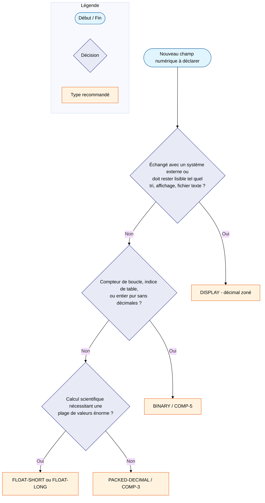

# Types numériques sur mainframe (COBOL / z/Architecture)

!!! info "Prérequis"
    Cette page suppose une familiarité de base avec COBOL (clause `PICTURE`,
    clause `USAGE`) et avec la notion d'octet. Voir
    [Boutisme (endianness)](endianness.md) en complément pour tout ce qui
    touche à l'ordre des octets dans les types binaires.

Le mainframe COBOL propose plusieurs façons de stocker un même nombre en
mémoire — pas seulement pour des raisons historiques, mais parce que chaque
format représente un compromis différent entre stockage, vitesse de calcul,
lisibilité et compatibilité externe. Cette page les liste, explique leur
structure, et donne des recommandations d'usage sourcées sur la documentation
IBM (*z/Architecture Principles of Operation* et *Enterprise COBOL for z/OS
6.x*).

## Vue d'ensemble

| Format | Clause(s) `USAGE` | Stockage physique | Précision typique | Cas d'usage recommandé |
|---|---|---|---|---|
| Décimal zoné | `DISPLAY` (implicite par défaut) | 1 octet par chiffre (EBCDIC) | 1 à 18 chiffres | Échange externe, tri, affichage |
| Décimal empaqueté | `PACKED-DECIMAL`, `COMP-3` | 2 chiffres par octet + signe | 1 à 31 chiffres | Calcul décimal (montants financiers) |
| Binaire fixe | `BINARY`, `COMP`, `COMP-4`, `COMP-5` | 2, 4 ou 8 octets (halfword/fullword/doubleword) | ≈ 4, 9 ou 18 chiffres | Compteurs, indices, entiers purs |
| Flottant hexadécimal (HFP) | `COMP-1` (4 octets), `COMP-2` (8 octets) | Base 16, format IBM historique | ≈ 6-7 ou ≈ 15-16 chiffres significatifs | Legacy uniquement — à éviter en nouveau code |
| Flottant binaire IEEE (BFP) | `FLOAT-SHORT` (4 octets), `FLOAT-LONG` (8 octets), `FLOAT-EXTENDED` (16 octets) | IEEE 754 binaire, conforme ANSI/ISO COBOL | ≈ 7, 15 ou 34 chiffres significatifs | Calcul scientifique à grande plage de valeurs |
| Flottant décimal (DFP) | *Aucune clause dédiée* — accélération matérielle des types décimaux existants | IEEE 754-2008 décimal, exécuté en matériel (z10+) | — | Bénéfice transparent sur `COMP-3`/`DISPLAY` existants |

Les sections suivantes détaillent chaque famille. Le décimal empaqueté et le
binaire fixe ont déjà des pages dédiées avec le détail bit à bit et le code
Python de conversion ; cette page se concentre sur la vue d'ensemble et la
comparaison entre familles.

## Virgule décimale : implicite (`V`) ou explicite (`.`)

Avant de détailler chaque format, un point transversal mérite d'être traité à
part : en COBOL, un champ décimal peut se déclarer de deux façons très
différentes selon qu'il sert au **calcul** ou à l'**affichage**. C'est un
piège fréquent pour qui découvre COBOL en venant de Python, où un `float` ou
un `Decimal` porte toujours sa virgule avec lui.

### La virgule implicite (`V`) — pour le calcul

Le symbole `V` dans une clause `PICTURE` indique la position de la virgule
décimale **sans lui réserver le moindre octet**. C'est une information
purement compilée : ni le compilateur ni le programme n'écrivent jamais de
caractère « point » ou « virgule » en mémoire pour un champ `V`. C'est le
format utilisé pour tout champ destiné au calcul, quel que soit son `USAGE`
(`DISPLAY`, `COMP-3`, `COMP`/`BINARY`).

```cobol
01 MONTANT-CALCUL       PIC S9(5)V99   COMP-3.
```

Cette déclaration signifie « 5 chiffres avant la virgule, 2 après, signé,
empaqueté » — 7 chiffres au total. Pour la valeur `123.45` :

- La valeur numérique manipulée par le programme est bien `123.45`.
- Les octets réellement stockés sont les 7 chiffres `0012345` empaquetés (+ le
  nibble de signe) — soit 4 octets au format `COMP-3` (voir
  [Format PACKED](../python/exemples-pratiques.md#format-packed-decimal-empaquete-comp-3)
  pour le détail bit à bit). **Aucun octet n'encode la position de la
  virgule** : c'est la `PICTURE` du programme qui « sait » où elle se trouve.

Le même principe s'applique à un champ `DISPLAY` :

```cobol
01 QUANTITE             PIC 9(3)V9(2) DISPLAY.
```

Pour la valeur `12.34`, les 5 octets EBCDIC stockés sont ceux des chiffres
`01234` — encore une fois, aucun octet pour la virgule.

!!! example "Alignement automatique lors d'un MOVE"
    COBOL aligne automatiquement les virgules implicites lors d'un `MOVE` ou
    d'un calcul entre deux champs dont la position du `V` diffère. Déplacer
    `QUANTITE` (`PIC 9(3)V9(2)`, valeur `012.34`) vers un champ `PIC
    9(5)V9(4)` produit `00012.3400` : la partie entière est cadrée à droite et
    complétée de zéros à gauche, la partie décimale est cadrée à gauche et
    complétée de zéros à droite — la virgule elle-même ne « bouge » jamais
    physiquement puisqu'elle n'a jamais été stockée.

Une seule clause `V` est autorisée par `PICTURE` (il ne peut évidemment pas y
avoir deux virgules). Elle peut aussi se placer en tête pour une valeur
purement fractionnaire, ex. `PIC V9(4)` pour une valeur entre `0` et `0.9999`.

### La virgule explicite (`.`) — uniquement pour l'affichage

Une clause `PICTURE` peut aussi contenir un **point réellement stocké**, mais
uniquement dans un contexte précis : un champ dit **« numeric-edited »**
(numérique édité), destiné exclusivement à l'affichage ou à l'impression de
rapports — jamais au calcul.

```cobol
01 MONTANT-CALCUL       PIC S9(5)V99   COMP-3.
01 MONTANT-AFFICHE      PIC ZZ,ZZ9.99.

MOVE MONTANT-CALCUL TO MONTANT-AFFICHE.
```

Si `MONTANT-CALCUL` vaut `12345.67`, l'instruction `MOVE` déclenche l'édition
et produit dans `MONTANT-AFFICHE` la chaîne de caractères ` 12,345.67` — 10
octets, où **chaque caractère est réellement écrit en mémoire** : les
chiffres, mais aussi la virgule de séparation des milliers et le point
décimal. Le `Z` en tête supprime le zéro non significatif en le remplaçant
par un espace.

!!! danger "Un champ numeric-edited n'est jamais un opérande de calcul"
    `MONTANT-AFFICHE` ne peut apparaître ni dans un `COMPUTE`, ni dans un
    `ADD`/`SUBTRACT`/`MULTIPLY`/`DIVIDE` en tant qu'opérande source : la
    présence de symboles d'édition (`.`, `,`, `Z`...) classe le champ comme
    numeric-edited, et seul un `MOVE` **depuis** un champ numérique (`V`) vers
    ce champ est autorisé. Le flux est toujours à sens unique : calculer sur
    un champ `V`, puis `MOVE` le résultat vers un champ édité pour
    l'affichage — jamais l'inverse.

Les symboles d'édition les plus courants :

| Symbole | Effet |
|---|---|
| `Z` | Supprime un zéro non significatif (remplacé par un espace) |
| `9` | Chiffre toujours affiché, y compris s'il vaut zéro |
| `.` | Point décimal réellement inséré (1 octet) |
| `,` | Virgule de séparation de milliers réellement insérée (1 octet) |
| `$` | Symbole monétaire |
| `+` / `-` | Signe explicite (toujours affiché / seulement si négatif) |
| `CR` / `DB` | Mention crédit/débit, affichée uniquement si négatif, sinon remplacée par des espaces |
| `*` | Protection contre falsification : remplace les zéros non significatifs par `*` (chèques) |
| `B` | Insère un espace (blanc) |
| `0` | Insère un zéro littéral |
| `/` | Insère une barre oblique (ex. dates `99/99/9999`) |

### Tableau récapitulatif

| | Virgule implicite (`V`) | Virgule explicite (`.`, numeric-edited) |
|---|---|---|
| Octets consommés par la virgule | 0 | 1 |
| Utilisable en calcul (`COMPUTE`, `ADD`...) | Oui | Non |
| `USAGE` concernés | `DISPLAY`, `COMP-3`, `COMP`/`BINARY` | `DISPLAY` uniquement |
| Rôle | Représentation interne pour le calcul | Présentation finale (rapport, écran) |
| Exemple | `PIC S9(5)V99 COMP-3` | `PIC ZZ,ZZ9.99` |

!!! info "Lien avec le code Python"
    Le paramètre `scale` des fonctions `unpack_comp3`/`pack_comp3` de la page
    [Exemples pratiques](../python/exemples-pratiques.md#format-packed-decimal-empaquete-comp-3)
    représente exactement le nombre de chiffres après le `V` — c'est la
    traduction directe de la virgule implicite COBOL en Python, puisqu'aucun
    octet ne la matérialise dans les données brutes à décoder.

??? note "Cas rare — le symbole `P` (échelle implicite hors du champ)"
    Un symbole encore plus rare, `P`, permet de représenter des zéros
    implicites **en dehors** des chiffres réellement stockés — utile pour de
    très grandes ou très petites valeurs sans gaspiller de stockage sur des
    zéros qu'on sait déjà être là. Par exemple, `PIC 9(3)PPP` représente une
    valeur dont les 3 derniers zéros (avant la virgule) ne sont pas stockés :
    les 3 chiffres stockés `123` représentent `123000`. Ce cas est
    suffisamment rare en pratique pour ne pas être approfondi ici.

## Décimal zoné (`DISPLAY`)

C'est le format par défaut : chaque chiffre occupe un octet entier, encodé en
EBCDIC (voir [encodage EBCDIC](../python/exemples-pratiques.md#encodage-ebcdic-ascii)
pour le détail de cet encodage). Concrètement, chaque octet combine deux
demi-octets :

- Le **nibble de zone** (4 bits de poids fort) — normalement `1111` (`F`) pour
  un chiffre EBCDIC standard.
- Le **nibble de chiffre** (4 bits de poids faible) — la valeur `0`–`9`.

Pour un champ signé (`PIC S9(3)`), le nibble de zone du **dernier octet
seulement** est remplacé par un code de signe (`1100`/`C` positif,
`1101`/`D` négatif) au lieu de `F` — c'est le même principe de code de signe
que pour le décimal empaqueté, mais appliqué à un seul octet au lieu d'un
nibble dédié. Une clause `SIGN IS SEPARATE` peut aussi être ajoutée pour
stocker le signe dans un octet séparé, distinct des chiffres.

!!! example "Exemple"
    Le nombre `123` en `DISPLAY` (non signé) occupe 3 octets EBCDIC : `0xF1
    0xF2 0xF3` — chaque octet est directement le code EBCDIC du chiffre
    correspondant (`1`, `2`, `3`). Signé négatif (`PIC S9(3)`, valeur `-123`),
    le dernier octet devient `0xD3` (nibble de zone remplacé par le code de
    signe négatif `D`, nibble de chiffre `3` inchangé).

**Avantage** : lisible directement comme du texte, comparable
octet-par-octet (utile pour un tri), interopérable avec des outils qui
attendent des fichiers texte.

**Inconvénient** : le plus coûteux en stockage des trois formats décimaux (1
octet par chiffre, contre 2 chiffres par octet pour `COMP-3`), et le plus
lent en arithmétique — chaque opération doit d'abord convertir vers un format
interne exploitable par les instructions decimal du processeur.

## Décimal empaqueté (`PACKED-DECIMAL` / `COMP-3`)

Voir la page [Exemples pratiques — Format PACKED](../python/exemples-pratiques.md#format-packed-decimal-empaquete-comp-3)
pour la structure bit à bit complète, le tableau des codes de signe, la
recommandation IBM sur le nombre de chiffres impair, et le code Python de
conversion (`unpack_comp3`/`pack_comp3`).

En résumé : 2 chiffres par octet (un par nibble) plutôt qu'un chiffre par
octet pour `DISPLAY`, plus un nibble de signe final. C'est le format
recommandé par IBM pour l'essentiel des calculs décimaux mainframe
(notamment les montants financiers) : plus compact que `DISPLAY`, et le
processeur z/Architecture dispose d'instructions decimal natives qui
opèrent directement sur ce format, sans conversion préalable.

## Binaire fixe (`BINARY` / `COMP` / `COMP-4` / `COMP-5`)

Un entier en complément à deux, stocké en big-endian sur 2 octets
(*halfword*), 4 octets (*fullword*) ou 8 octets (*doubleword*) selon le
nombre de chiffres déclarés. C'est le format le plus rapide pour de
l'arithmétique entière pure (jusqu'à 2 à 5 fois plus rapide que `COMP-3`
selon le guide de performance IBM), mais il n'a **pas de notion de
décimales** : toute logique de virgule (ex. centimes) doit être gérée
manuellement par mise à l'échelle (multiplier/diviser par une puissance de
10), ce que fait naturellement la clause `PICTURE` de `COMP-3` avec `V`.

Voir [Boutisme (endianness)](endianness.md) pour l'explication complète de
l'ordre des octets (indépendante de COBOL), et
[Exemples pratiques](../python/exemples-pratiques.md#boutisme-endianness-des-champs-binaires)
pour le code Python de conversion.

### `COMP`, `COMP-4`, `COMP-5`, `BINARY` : lequel choisir ?

Ces quatre clauses `USAGE` sont souvent confondues. En Enterprise COBOL for
z/OS 6.x :

- **`COMP`** et **`COMP-4`** sont strictement synonymes : un entier binaire
  en complément à deux, occupant un *halfword* (2 octets, 1 à 4 chiffres
  déclarés), un *fullword* (4 octets, 5 à 9 chiffres) ou un *doubleword* (8
  octets, 10 à 18 chiffres) selon le nombre de chiffres de la clause
  `PICTURE`.
- **`BINARY`** utilise le même stockage physique que `COMP`/`COMP-4`, mais
  son comportement à l'exécution dépend de l'option de compilation `TRUNC` :
  avec `TRUNC(STD)`, toute valeur qui dépasse le nombre de chiffres déclarés
  dans la `PICTURE` est tronquée à ce nombre de chiffres (comportement
  portable, mais qui coûte des instructions machine supplémentaires à chaque
  affectation) ; avec `TRUNC(OPT)`, le compilateur suppose que les données
  respectent toujours la `PICTURE` (le plus rapide, mais risqué si
  l'hypothèse est fausse) ; avec `TRUNC(BIN)`, tous les champs binaires du
  programme se comportent comme des `COMP-5` (troncature sur la taille
  binaire réelle, pas sur la `PICTURE`).
- **`COMP-5`** est la clause « binaire natif » : la valeur exploite toute la
  capacité du champ binaire (2/4/8 octets), sans jamais être tronquée au
  nombre de chiffres de la `PICTURE` — quelle que soit l'option `TRUNC` du
  programme. C'est le choix recommandé pour les champs échangés avec du code
  non-COBOL (C, PL/I, IMS, Db2...) qui peut y écrire des valeurs binaires en
  dehors des bornes décimales déclarées.

[D'après la documentation IBM sur l'option TRUNC](https://www.ibm.com/docs/en/cobol-zos/6.4.0?topic=options-trunc) :
plutôt que d'activer `TRUNC(BIN)` pour tout le programme (ce qui pénalise
aussi les champs qui n'en ont pas besoin), la pratique recommandée est de
déclarer `COMP-5` uniquement sur les champs concernés, et de garder
`TRUNC(OPT)` pour le reste — c'est l'option la plus performante en général, à
condition de valider que les données respectent bien la `PICTURE`.

!!! note "Ce qui ne change pas : l'endianness"
    `COMP`, `COMP-4`, `COMP-5` et `BINARY` partagent tous le même stockage
    physique big-endian sur z/OS. La conversion Python s'applique donc
    identiquement aux quatre, indépendamment de l'option `TRUNC` — celle-ci
    ne change que les règles de troncature côté COBOL, jamais l'ordre des
    octets en mémoire.

## Virgule flottante : trois familles bien distinctes

C'est la zone la plus mal comprise, car le terme « flottant » recouvre trois
implémentations très différentes sur mainframe.

### HFP — flottant hexadécimal (legacy)

`COMP-1` (4 octets, simple précision) et `COMP-2` (8 octets, double
précision) désignent, **par défaut sur z/OS**, le format *Hexadecimal
Floating-Point* (HFP) : un format propriétaire IBM introduit avec le
System/360 dans les années 1960, où l'exposant est en base 16 plutôt qu'en
base 2. Ce n'est **pas** le format IEEE 754 utilisé par la plupart des
langages modernes (Python, C, Java) — un même nombre binaire signifie une
valeur différente selon qu'il est interprété en HFP ou en IEEE 754.

!!! warning "Point à vérifier avant mise en œuvre"
    Le comportement exact de `COMP-1`/`COMP-2` (HFP par défaut vs IEEE selon
    les options de compilation `FLOAT`/`ARITH`) a évolué entre les versions
    d'Enterprise COBOL et diffère aussi entre plateformes (z/OS vs IBM i).
    Vérifier l'option de compilation effective (`FLOAT(S390)` vs
    `FLOAT(IEEE)`) avant de supposer le format d'un champ existant — ne pas
    se fier uniquement au nom de la clause `USAGE`.

### BFP — flottant binaire IEEE 754

`FLOAT-SHORT` (4 octets), `FLOAT-LONG` (8 octets) et `FLOAT-EXTENDED` (16
octets) sont les clauses `USAGE` du standard COBOL (ISO/ANSI) qui forcent
explicitement le format *Binary Floating-Point* (BFP) conforme IEEE 754 —
le même format que le type `float`/`double` de Python, C ou Java. C'est le
choix à privilégier pour du calcul scientifique ou de l'interopérabilité
avec du code non-COBOL qui suppose IEEE 754.

### DFP — flottant décimal (accélération matérielle, pas un type à déclarer)

Contrairement à HFP et BFP, le *Decimal Floating-Point* (DFP, IEEE 754-2008)
n'est **pas exposé comme une clause `USAGE` distincte en COBOL** — il n'existe
pas de `FLOAT-DECIMAL` à déclarer. Le DFP est un jeu d'instructions matérielles
introduit avec le processeur z9 et généralisé sur z10 et les processeurs
suivants, qu'Enterprise COBOL (V5 et ultérieur, avec l'option de compilation
`ARCH(8)` au minimum) peut utiliser pour **accélérer l'arithmétique décimale
existante** (`COMP-3`, `DISPLAY`) — sans qu'aucun changement de déclaration
`PICTURE`/`USAGE` ne soit nécessaire côté programme. L'intérêt pratique pour
un développeur COBOL est donc indirect : continuer à utiliser `COMP-3` pour
les montants financiers, en sachant que le matériel récent l'exécute plus
vite qu'auparavant, plutôt que de migrer vers un flottant binaire pour
gagner en performance.

!!! danger "Ne jamais utiliser un flottant binaire pour de l'argent"
    HFP et BFP représentent tous deux les valeurs en base 2. Une fraction
    décimale exacte comme `0.10` n'a **pas de représentation binaire exacte**
    — exactement le même problème qu'un `float` Python (`0.1 + 0.2 !=
    0.3`). Pour des montants financiers, le décimal empaqueté (`COMP-3`) ou
    le décimal zoné (`DISPLAY`) restent le choix correct, jamais `COMP-1`,
    `COMP-2`, `FLOAT-SHORT` ou `FLOAT-LONG`.

## Choisir le bon type



## Cas d'usage recommandés — synthèse

| Besoin | Type recommandé | Pourquoi |
|---|---|---|
| Montant financier, calcul décimal | `PACKED-DECIMAL` / `COMP-3` | Instructions decimal natives, pas d'erreur d'arrondi binaire, compact |
| Compteur, indice, entier pur | `BINARY` / `COMP-5` | Le plus rapide en arithmétique (2 à 5× `COMP-3`) |
| Échange externe, tri, lisibilité | `DISPLAY` | Lisible comme du texte, comparable octet par octet |
| Interfaçage avec du code non-COBOL (C, PL/I) | `COMP-5` plutôt que `COMP`/`BINARY` sous `TRUNC(STD)` | Pas de troncature inattendue à la taille de la `PICTURE` |
| Calcul scientifique, grande plage de valeurs | `FLOAT-SHORT` / `FLOAT-LONG` | Conforme IEEE 754, portable vers du code non-COBOL |
| Jamais pour de l'argent | `COMP-1` / `COMP-2` / `FLOAT-SHORT` / `FLOAT-LONG` | Base 2 : pas de représentation exacte des fractions décimales |

## Sources

- [z/Architecture Principles of Operation (SA22-7832)](https://www.ibm.com/docs/en/module_1678991624569/pdf/SA22-7832-14.pdf) — formats de données HFP/BFP/DFP, tailles halfword/fullword/doubleword/quadword.
- [Enterprise COBOL for z/OS — Numeric data formats](https://www.ibm.com/docs/en/cobol-zos/6.3.0?topic=arithmetic-formats-numeric-data) — clauses `USAGE` et leur représentation physique.
- [Enterprise COBOL for z/OS — option TRUNC](https://www.ibm.com/docs/en/cobol-zos/6.4.0?topic=options-trunc) — comportement `COMP`/`COMP-4`/`COMP-5`/`BINARY`.
- [PACKED-DECIMAL (COMP-3) — guide de performance](https://www.ibm.com/docs/en/SS6SG3_6.3.0/perf/packed_decimal.html) — recommandation du nombre de chiffres impair.
- [How to enable COBOL compilers to use Decimal Floating Point instructions](https://www.ibm.com/support/pages/how-enable-cobol-compilers-use-decimal-floating-point-instructions) — DFP et option `ARCH(8)`.

!!! info "Versions vérifiées le 2026-07-23"
    Les comportements liés aux options de compilation (`FLOAT`, `ARITH`,
    `TRUNC`, `ARCH`) évoluent d'une version d'Enterprise COBOL à l'autre.
    Revérifier sur la documentation de la version réellement installée avant
    toute décision de production.
