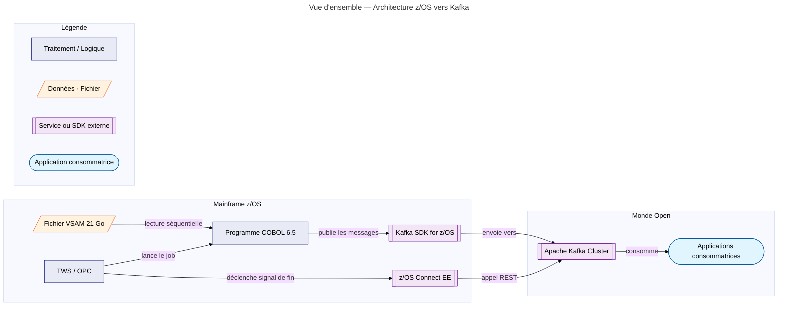
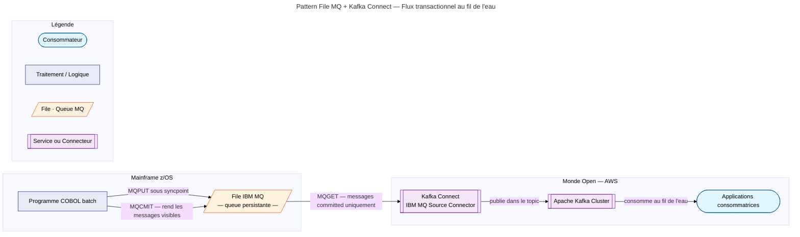
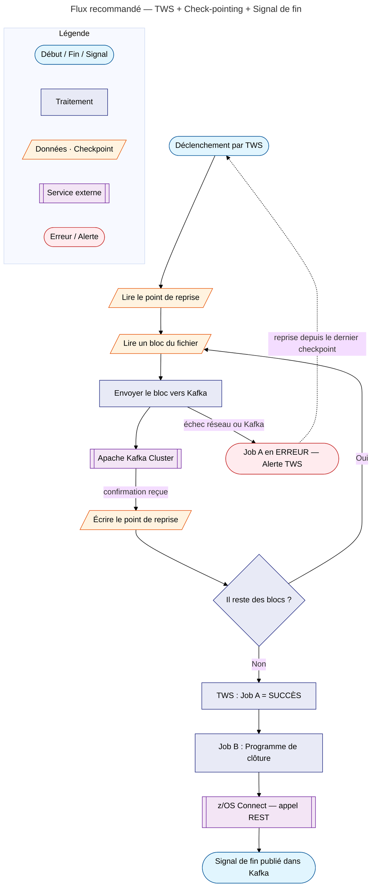

# Architecture z/OS → Kafka : Transfert de Données depuis IBM z/OS vers Apache Kafka

> Expression de besoin v1.0 — Transfert de données depuis IBM z/OS vers Apache Kafka.

!!! note "Origine de ce document — Résultats du PoC"
    Ce document est le résultat d'un **Proof of Concept (PoC)** mené sur l'utilisation d'Apache Kafka depuis des batchs COBOL via le **SDK IBM Kafka for z/OS**. L'objectif était de valider la faisabilité technique et d'identifier les contraintes propres à l'environnement Mainframe avant toute mise en production.

    Les résultats de ce PoC ont été présentés à un **comité inter-entités du groupe**, rassemblant plusieurs équipes partageant les mêmes enjeux d'intégration Mainframe ↔ Kafka. Cette présentation a permis de confronter les retours d'expérience et de consolider les orientations techniques décrites dans ce document.

!!! bug "Problèmes identifiés lors du PoC — À prendre en compte"
    Deux problèmes significatifs ont été mis en évidence. Ils doivent être adressés dans toute mise en production. Des pistes de solution sont proposées dans les sections suivantes.

    **1. Impossibilité de rollback en cas d'abend du batch COBOL**

    En cas d'arrêt anormal (abend) du batch COBOL, les messages déjà publiés dans Kafka **ne peuvent pas être annulés**. Contrairement à DB2 ou IBM MQ, Kafka ne supporte pas le rollback transactionnel natif côté producteur. Les messages envoyés avant l'abend restent définitivement persistés dans le topic, sans possibilité de les supprimer rétroactivement.

    **2. Ordre des messages non garanti en présence de plusieurs consommateurs**

    Kafka garantit l'ordre des messages **au sein d'une même partition**, mais pas entre plusieurs partitions. Si plusieurs consommateurs lisent le même topic en parallèle — ou si le topic comporte plusieurs partitions — **l'ordre global de traitement des messages n'est pas garanti**. Cela peut entraîner des incohérences dans les traitements qui dépendent d'un ordre strict.

!!! warning "Contexte et contrainte imposée"
    Cette étude répond à un besoin spécifique : **le consommateur côté AWS exige l'utilisation d'Apache Kafka** comme protocole d'échange. L'intégration Kafka est donc une contrainte dictée par le consommateur, à laquelle le Mainframe doit se conformer. Les approches présentées dans ce document ont pour objectif de répondre à cette obligation tout en respectant les contraintes techniques et opérationnelles propres à z/OS.

!!! abstract "À qui s'adresse ce document ?"
    Ce guide s'adresse à toute personne impliquée dans un projet faisant communiquer un Mainframe IBM (z/OS) avec une plateforme de streaming moderne comme Apache Kafka. Aucune connaissance préalable du Mainframe n'est requise.

    | Profil | Ce que vous trouverez ici |
    |--------|--------------------------|
    | Architecte Open / Cloud | Les contraintes spécifiques du Mainframe et comment les surmonter |
    | Développeur Java / Python | Les équivalents Mainframe des concepts que vous connaissez |
    | Chef de projet | Les enjeux, les risques et les compromis de chaque approche |
    | Développeur COBOL | L'impact de vos choix techniques sur les consommateurs Open |

---

## 1. Contexte : le "Quoi" et le "Pourquoi"

### 1.1 Le Mainframe : un coffre-fort numérique

Un Mainframe est un type de serveur conçu pour traiter des volumes de données astronomiques de manière fiable, sécurisée et continue.

!!! tip "Analogie"
    Si un serveur web classique est une voiture rapide et maniable, le Mainframe est un train de marchandises — moins agile, mais capable de transporter des millions de tonnes sans jamais s'arrêter.

Le Mainframe de ce projet tourne sous z/OS 2.5, le système d'exploitation d'IBM. Il contient un fichier de 21 Go regroupant des millions de CRO (Compte Rendu d'Opération).

### 1.2 Apache Kafka : l'autoroute de données

Apache Kafka est une plateforme qui permet de faire circuler des messages (données) entre applications de manière très rapide et à très grande échelle. Elle est souvent utilisée pour alimenter des tableaux de bord en temps réel, des applications mobiles ou des moteurs d'analyse.

!!! tip "Analogie"
    Kafka est comme une autoroute à plusieurs voies. Les producteurs (émetteurs) déposent des données à une entrée, les consommateurs (récepteurs) les récupèrent à une sortie, et l'autoroute gère le flux de manière ordonnée.

### 1.3 L'objectif du projet

Envoyer les 21 Go de données depuis le Mainframe vers Kafka, de manière :

- **Fiable :** sans perte ni doublon de données.
- **Récupérable :** en cas de panne en cours de route, on ne recommence pas tout depuis le début.
- **Traçable :** le monde Open sait exactement quand il peut commencer à consommer les données.

---

## 2. Les technologies en présence

### 2.1 z/OS : le système d'exploitation du Mainframe

z/OS est l'équivalent de Linux ou Windows, mais pour les Mainframes IBM. Associé à un matériel éprouvé il est conçu pour garantir une disponibilité quasi permanente (99,999 % de disponibilité).

### 2.2 COBOL 6.5 : le langage qui lit les données

COBOL est un langage de programmation massivement utilisé sur tous les Mainframe IBM et celui de LCL ne fait pas exception avec plus de 85% de son parc en COBOL.

La dernière version 6.5 apporte des améliorations de performance et des capacités de connectivité modernes.

La version 6.4 minimum est requise pour utiliser le Kafka SDK for z/OS.

### 2.3 Kafka SDK for z/OS : le pont entre deux mondes

Le Kafka SDK for z/OS est une bibliothèque (fournie par IBM ou Confluent) qui permet à un programme COBOL ou Java tournant sur z/OS d'envoyer des messages directement à un cluster Kafka.

!!! tip "Analogie Open"
    C'est l'équivalent du client Kafka Java/Python que vous utilisez habituellement, mais compilé et optimisé pour le Mainframe.

### 2.4 TWS/OPC : le chef d'orchestre des traitements

TWS (IBM Tivoli Workload Scheduler, anciennement OPC) est le planificateur/ordonnanceur de tâches du Mainframe. Il exécute des "jobs" selon un calendrier précis, gère les dépendances entre eux et surveille leur bon déroulement.

### 2.5 z/OS Connect EE : la passerelle vers les APIs modernes

z/OS Connect Enterprise Edition est un composant middleware qui permet au Mainframe d'exposer des services REST/HTTP ou d'appeler des APIs externes. Il traduit les appels réseau modernes en instructions compréhensibles par z/OS.

---

## 3. Vue d'ensemble de l'architecture

Le schéma ci-dessous illustre les composants impliqués et les flux de données entre le Mainframe et le monde Open.

---

## 4. Le défi principal : garantir la cohérence des données

### 4.1 Qu'est-ce qu'une transaction ?

Une transaction est un ensemble d'opérations qui doivent réussir toutes ensemble ou pas du tout. C'est le principe du "tout ou rien".

!!! example "Exemple bancaire"
    Un virement de 100 € implique de débiter le compte A ET créditer le compte B. Si l'une des deux opérations échoue, l'autre doit être annulée — sinon l'argent disparaît.

### 4.2 Le problème du "bouton Annuler" (Rollback)

Sur Mainframe, les technologies historiques comme DB2 (base de données) et MQ (messagerie) offrent nativement un mécanisme de rollback : si le programme plante à 99,9 % de sa progression, tout ce qui a été fait est automatiquement annulé, comme si rien ne s'était passé.

Sur Apache Kafka, ce mécanisme n'existe pas nativement. Kafka est conçu pour la performance et la scalabilité, pas pour la gestion transactionnelle au sens Mainframe. Les messages envoyés à Kafka sont persistés immédiatement et ne peuvent pas être "annulés" facilement.

### 4.3 Pourquoi cela pose un problème concret ?

Imaginez ce scénario :

1. Le programme COBOL commence à envoyer les 21 Go vers Kafka.
2. Après 10 Go envoyés (la moitié), le programme plante (coupure réseau, mémoire insuffisante, bug…).
3. Les 10 Go sont déjà dans Kafka — les applications consommatrices pourraient commencer à les traiter.
4. Mais les 11 Go restants n'arrivent jamais.
5. **Résultat :** les données dans Kafka sont incomplètes, et le monde Open travaille sur une vue partielle de la réalité.

!!! danger "Risque métier"
    Dans le secteur bancaire, des données tronquées peuvent conduire à des calculs erronés, des rapports incorrects ou des décisions basées sur une vue partielle de la réalité.

---

## 5. Voici 5 stratégies de sécurisation

### 5.1 Le Check-pointing (Le marque-page)

**Principe**

Le programme COBOL note régulièrement sa progression dans un fichier ou une table. Par exemple : "J'ai traité 1 000 000 de lignes", puis "J'ai traité 2 000 000 de lignes", etc. En cas de panne, on repart du dernier marque-page au lieu de tout recommencer.

**Comment ça marche techniquement ?**

1. Le programme divise le fichier en blocs (par exemple, 100 000 lignes par bloc).
2. Après chaque bloc envoyé avec succès à Kafka, il écrit le numéro du dernier bloc traité dans un fichier de point de reprise.
3. En cas de redémarrage, il lit ce fichier et reprend à partir du bloc suivant.

!!! success "Avantages"
    - Gain de temps massif : si on plante à 90 %, on repart de 90 %, pas de 0 %.
    - Économie de ressources : moins de données re-transmises inutilement.
    - Bien adapté aux très gros volumes comme les 21 Go de ce projet.

!!! warning "Inconvénients"
    - Développement COBOL plus complexe : il faut gérer la logique de reprise.
    - Risque de doublons si le checkpoint est écrit avant la confirmation Kafka.

---

### 5.2 Le Pattern Outbox (La zone tampon)

**Principe**

Avant d'envoyer quoi que ce soit à Kafka, on copie d'abord toutes les données dans une table DB2 (la base de données du Mainframe). Ensuite, un processus séparé lit cette table et publie vers Kafka.

**Comment ça marche techniquement ?**

1. Le programme COBOL insère les données dans une table DB2 dans une transaction garantie par le rollback.
2. Si l'insertion réussit à 100 %, la transaction est validée (commit DB2).
3. Un second programme lit la table DB2 et envoie les données vers Kafka.
4. Une fois chaque enregistrement envoyé avec succès, il est marqué "traité" dans DB2.

!!! success "Avantages"
    - Sécurité maximale : on exploite le mécanisme transactionnel natif de DB2.
    - Zéro risque de données partielles dans Kafka : soit tout est en DB2, soit rien.

!!! warning "Inconvénients"
    - Très coûteux : il faut stocker 21 Go supplémentaires dans DB2 (espace disque + licences IBM).
    - Très lent : l'écriture en base de données est bien plus lente que la lecture séquentielle d'un fichier.
    - Deux étapes de traitement, deux fois plus de jobs à surveiller.

!!! info "Quand l'utiliser ?"
    Pour des volumes plus faibles (quelques Mo à quelques Go) ou lorsque la garantie transactionnelle absolue est non négociable.

---

### 5.3 L'Idempotence Kafka (L'anti-doublon)

**Principe**

On configure le producteur Kafka pour qu'il attribue un identifiant unique à chaque message. Si le même message est envoyé deux fois (après une reprise sur panne par exemple), Kafka le détecte et ignore le doublon.

**Comment ça marche techniquement ?**

- La propriété `enable.idempotence=true` est activée dans la configuration du Kafka SDK.
- Kafka attribue un numéro de séquence à chaque message par producteur.
- Si le même message arrive deux fois (même numéro de séquence), Kafka l'ignore silencieusement.

!!! success "Avantages"
    - Très simple à mettre en place : un seul paramètre de configuration.
    - Élimine les doublons en cas de reprise.
    - Aucun coût de stockage supplémentaire.

!!! warning "Inconvénients"
    - Ne résout pas le problème de partialité : si le programme plante à mi-chemin, il faut tout renvoyer depuis le début. Les messages déjà envoyés seront bien dédoublonnés, mais on retraite inutilement la première moitié.
    - Pour 21 Go, recommencer depuis le début peut représenter plusieurs heures de traitement.

!!! tip "Conseil"
    L'idempotence ne remplace pas le check-pointing — elle le complète. Utilisez les deux ensemble pour une protection optimale.

---

### 5.4 Le Post-Step TWS avec Signal de Fin

**Principe**

Fonctionnement Technique de TWS/OPC

L'automatisation repose sur l'intelligence de l'ordonnanceur TWS/OPC et sa capacité à interpréter les codes retours pour piloter le flux de données vers le monde Open.

L'ordonnanceur TWS ne lance le Job B que si et seulement si le Job A s'est terminé avec succès à 100 %.

**Mécanisme de Surveillance et de Recovery**

Le pilotage TWS/OPC du Job A (Publication Kafka) utilise une **exit propriétaire** et un mécanisme de **recovery automatique** :

- **Seuil de criticité :** Tout code retour ($RC > 7$) déclenche l'arrêt immédiat du job par l'exit.
- **Gestion des erreurs :** Un mécanisme de _Recovery_ TWS est configuré pour reprendre l'exécution à un step spécifique de notification en cas d'erreur, permettant d'automatiser la gestion de l'échec plutôt que de simplement bloquer le flux.

**Étapes du Flux**

1.  **Lancement :** TWS lance le **Job A (COBOL)** qui publie les 21 Go de données dans Kafka.
2.  **Surveillance :** TWS analyse le code retour du Job A.
3.  **Scénario de Succès ($RC <= 7$) :** TWS lance un step de notification positive. Un traitement batch envoie un signal de "Complétude" à l'application Open via **z/OS Connect**.
4.  **Scénario d'Erreur ($RC > 7$) :** Le mécanisme de recovery prend la main et lance un step de notification d'alerte. Un traitement batch informe l'application Open via **z/OS Connect** que les messages sont incomplets et doivent être **abandonnés**.

!!! danger "En cas d'échec du Job A ($RC > 7$)"
    L'exit propriétaire arrête le job et TWS bloque le pipeline. L'équipe de supervision est alertée. Grâce au step de notification d'erreur, le monde Open est activement prévenu de l'invalidité des données et la suite des traitements n'est jamais déclenché.

!!! success "Avantages"
    - **Sécurité de bout en bout :** L'application Open ne traite jamais de données partielles grâce à la notification explicite d'abandon.
    - **Automatisme de reprise :** Le mécanisme de recovery TWS permet une gestion propre des erreurs sans intervention manuelle systématique pour informer l'aval.
    - **Lisibilité opérationnelle :** Les équipes de supervision voient immédiatement si le traitement est en succès ou en phase de "Recovery/Notification".
    - **Intégration moderne :** L'utilisation de **z/OS Connect** permet une communication fluide et synchrone entre le Mainframe et les API du monde Open.

!!! warning "Inconvénient"
    Les applications consommatrices doivent être conçues pour attendre le signal avant de traiter (légère complexité côté Open).

---

### 5.5 Le Pattern File MQ + Kafka Connect (Streaming Transactionnel)

#### Principe

Ce pattern utilise IBM MQ comme tampon transactionnel entre le Mainframe et Kafka. Le programme COBOL écrit chaque enregistrement dans une file MQ sous contrôle de syncpoint. Un connecteur Kafka Connect, déployé côté Open, surveille cette file en continu et publie chaque message vers Kafka dès qu'il est validé.

!!! tip "Analogie"
    Si les patterns batch sont des camions déchargeant des palettes une fois par jour, ce pattern est un **tapis roulant industriel** : chaque colis est acheminé dès qu'il est prêt, sans attendre la fin de la production.

#### Mécanisme transactionnel : le syncpoint MQ

Le point central de cette architecture est la **garantie d'intégrité** assurée par le mécanisme de **Syncpoint (Unité de Travail)** d'IBM MQ. IBM MQ est par définition une file d'attente persistante — il n'y a pas de zone de staging supplémentaire. Tout se joue sur le statut logique des messages dans cette file.

**L'état "Uncommitted"**

Quand le programme COBOL écrit (`MQPUT`) sous syncpoint, le message est physiquement enregistré dans la file et dans les logs de récupération de MQ, mais il est marqué comme **invisible** pour les lecteurs externes.

- Le connecteur Kafka Connect ne peut lire (`MQGET`) que les messages **"Committed"**.
- Tant que le COBOL travaille, le connecteur ne voit rien.

**Rollback**

Si le programme subit un Abend (arrêt brutal) ou rencontre une erreur avant la fin de l'unité de travail :

- MQ détecte la rupture et annule les `MQPUT` en cours via ses logs de récupération.
- Les messages invisibles sont supprimés de la file.
- Kafka reste vierge : aucune donnée partielle ne parvient aux consommateurs.

**Commit et transfert**

Quand le COBOL déclenche un `MQCMIT` :

- Les messages basculent en **"Committed"** et deviennent visibles.
- Le connecteur les aspire immédiatement et les publie dans Kafka.
- Le connecteur ne confirme la lecture à MQ qu'après réception de l'ACK Kafka, garantissant une livraison **"at-least-once"** sans perte.

#### Le choix de design clé : fréquence des commits

C'est la décision architecturale centrale de ce pattern. Elle détermine le compromis entre atomicité et latence.

| Mode | Fréquence du `MQCMIT` | Garantie d'atomicité | Latence côté consommateur |
|---|---|---|---|
| **Atomique** | Une seule fois, à la fin des 21 Go | Totale — Kafka reste vierge jusqu'au succès complet | Identique au batch (plusieurs heures) |
| **Streaming** | Fréquent (ex. tous les 100 000 enregistrements) | Partielle — les blocs déjà commités sont dans Kafka en cas d'abend | Faible (quelques secondes par bloc) |

!!! warning "Conséquence directe sur l'architecture"
    Il n'existe pas de mode offrant simultanément l'atomicité totale et une faible latence. Si le consommateur AWS doit traiter les données en temps réel, il faut concevoir un mécanisme de compensation côté consommateur pour gérer les lots incomplets — par exemple le signal d'abandon via TWS décrit en 5.4.

#### Fonctionnement technique global

1. **Production (Mainframe) :** Le programme COBOL batch écrit dans une file MQ locale sous contrôle transactionnel (syncpoint).
2. **Ingestion (Kafka Connect) :** Le **IBM MQ Source Connector** — déployé sur l'infrastructure Open — maintient une connexion persistante avec le queue manager MQ z/OS.
3. **Transformation (SMT & Converters) :** Le connecteur traduit le format binaire propriétaire (EBCDIC, COMP-3 via Copybook) en formats standards du Cloud (**JSON ou Avro**) grâce à un Schema Registry.
4. **Consommation (AWS) :** Les applications (MSK, Lambda, EKS) consomment les données avec l'assurance que chaque message reçu appartient à une unité de travail MQ validée.

!!! info "Dead Letter Queue (DLQ)"
    En production, configurer une DLQ sur le connecteur Kafka Connect est indispensable. Tout message non publiable dans Kafka (schéma invalide, topic inexistant, erreur de transformation) y est redirigé au lieu de bloquer le connecteur.

#### Pourquoi choisir ce pattern ?

- **Haute fiabilité :** La transactionnalité native de MQ empêche la pollution de Kafka par des données fragmentées.
- **Découplage fort :** Le Mainframe publie sans que les applications AWS n'aient besoin d'accéder directement aux bases z/OS (DB2, VSAM).
- **Réactivité possible :** En mode commits fréquents, la latence peut descendre à quelques secondes par bloc — incomparable avec un envoi batch unique.

!!! warning "Coût infrastructure"
    L'**IBM MQ Source Connector** (version Confluent) est sous licence commerciale. Il existe une version communautaire open-source (`kafka-connect-mq-source` sur GitHub) mais avec des fonctionnalités réduites. Ce coût doit être intégré dès l'étude de faisabilité.

---

## 6. Tableau comparatif des stratégies

| Stratégie                                             | Sécurité des données | Performance | Facilité de mise en œuvre | Coût infrastructure |          Mode |
| ----------------------------------------------------- | -------------------: | ----------: | ------------------------: | ------------------: | ------------: |
| Check-pointing                                        |                ★★★☆☆ |       ★★★★★ |                     ★★☆☆☆ |              Faible |         Batch |
| Pattern Outbox                                        |                ★★★★★ |       ★☆☆☆☆ |                     ★★★☆☆ |               Élevé |         Batch |
| Idempotence Kafka                                     |                ★★★☆☆ |       ★★★☆☆ |                     ★★★★★ |              Faible |         Batch |
| Post-Step TWS                                         |                ★★★★★ |       ★★★★☆ |                     ★★★★☆ |              Faible |         Batch |
| File MQ + Kafka Connect                               |                ★★★★☆ |       ★★★★☆ |                     ★★☆☆☆ |               Moyen |     Streaming |

!!! info ""
    Plus il y a d'étoiles (★), mieux c'est pour le critère concerné. La combinaison recommandée TWS + Check-pointing est détaillée au chapitre 7.

---

## 7. Architecture recommandée : TWS + Check-pointing

La solution optimale combine les deux meilleures approches :

- Le **check-pointing** pour ne jamais recommencer de zéro en cas de panne.
- Le **Post-Step TWS** pour garantir que le monde Open ne traite que des données complètes.

---

## 7. Considérations complémentaires

### 7.1 Performance et volumétrie

Pour 21 Go de données, quelques règles pratiques :

- **Taille des blocs :** entre 50 000 et 500 000 lignes par bloc selon la taille des enregistrements. Un bloc trop petit génère trop d'appels réseau ; un bloc trop grand augmente les pertes potentielles en cas de panne.
- **Compression :** activer la compression (GZIP ou LZ4) dans le SDK Kafka réduit le volume réseau de 60 à 80 % pour des données textuelles. 21 Go peuvent ainsi se réduire à moins de 7 Go sur le réseau.
- **Parallélisme :** si le fichier peut être découpé en partitions logiques (par région, par type de transaction…), plusieurs jobs COBOL peuvent tourner en parallèle, chacun écrivant dans sa propre partition Kafka.
- **Fenêtre de tir :** vérifier que la fenêtre batch disponible (typiquement la nuit) est suffisante pour transmettre le volume complet, en tenant compte de la compression et du débit réseau disponible.

### 7.2 Sécurité

| Aspect                 | Recommandation                                                                                           |
| ---------------------- | -------------------------------------------------------------------------------------------------------- |
| Chiffrement en transit | Activer TLS/SSL entre le Kafka SDK z/OS et le cluster Kafka                                              |
| Authentification       | Utiliser SASL/SCRAM ou des certificats mTLS pour le producteur COBOL                                     |
| Autorisation           | Le topic Kafka cible doit être en écriture uniquement pour le producteur Mainframe                       |
| Données personnelles   | Si le fichier contient des données personnelles (RGPD), envisager une pseudonymisation avant publication |
| Audit                  | Les logs TWS et z/OS fournissent une traçabilité complète et horodatée de chaque traitement              |

### 7.3 Surveillance et alertes

- TWS génère automatiquement des alertes si Job A dépasse sa durée maximale autorisée ou se termine en erreur.
- Kafka : surveiller le lag des consommateurs et le nombre de messages dans le topic après réception du signal de fin.
- Métriques clés à exposer : nombre de blocs traités, volume total publié (en octets), heure de début, heure de fin, statut du signal de fin.

---

## 8. Glossaire

| Terme                   | Définition simplifiée                                                                                                                                                                    |
| ----------------------- | ---------------------------------------------------------------------------------------------------------------------------------------------------------------------------------------- |
| Batch                   | Traitement différé d'un grand volume de données, sans interaction humaine (s'oppose au temps réel)                                                                                       |
| COBOL                   | Langage de programmation utilisé sur Mainframe, optimisé pour le traitement de données métier volumineuses                                                                               |
| Checkpoint              | Point de sauvegarde de la progression d'un traitement, permettant une reprise sans tout recommencer                                                                                      |
| Commit                  | Validation définitive d'une transaction : les données sont enregistrées de manière permanente                                                                                            |
| Consommateur (Consumer) | Application qui lit les messages depuis Kafka                                                                                                                                            |
| DB2                     | Base de données relationnelle d'IBM, utilisée sur Mainframe                                                                                                                              |
| ETL                     | Extract-Transform-Load : processus d'extraction, transformation et chargement de données                                                                                                 |
| Idempotence             | Propriété d'une opération qui peut être répétée plusieurs fois sans produire d'effets indésirables (pas de doublons)                                                                     |
| Job                     | Programme ou script exécuté de manière automatique par un ordonnanceur                                                                                                                   |
| JCL                     | Job Control Language : langage de configuration des jobs sur Mainframe (équivalent d'un script shell)                                                                                    |
| Kafka                   | Plateforme de streaming open-source pour le transport de messages à grande échelle                                                                                                       |
| Kafka Connect           | Outil de la suite Apache Kafka permettant d'intégrer des sources ou destinations externes (bases de données, files MQ, fichiers…) via des connecteurs configurables, sans écrire de code |
| Mainframe               | Serveur IBM haute capacité, utilisé dans les banques et grandes entreprises pour les traitements critiques                                                                               |
| MQ (IBM MQ)             | Système de messagerie à base de files d'attente (queues) utilisé sur Mainframe ; garantit la persistance et la livraison des messages même en cas de panne transitoire                   |
| MQ Source Connector     | Connecteur Kafka Connect qui lit les messages d'une file IBM MQ et les publie dans un topic Kafka de manière continue                                                                    |
| Pattern Outbox          | Zone tampon intermédiaire utilisée pour garantir la cohérence entre deux systèmes                                                                                                        |
| Producteur (Producer)   | Application qui publie des messages dans Kafka                                                                                                                                           |
| REST / API REST         | Interface de communication entre applications via le protocole HTTP, standard du web moderne                                                                                             |
| Rollback                | Annulation automatique d'une transaction en cas d'erreur — le "bouton Annuler"                                                                                                           |
| SDK                     | Kit de développement logiciel : ensemble d'outils fourni par un éditeur pour utiliser son service                                                                                        |
| Topic                   | Canal de messages dans Kafka : les producteurs publient dans un topic, les consommateurs y lisent                                                                                        |
| Transaction             | Ensemble d'opérations qui réussissent toutes ensemble ou sont toutes annulées (principe du "tout ou rien")                                                                               |
| TWS / OPC               | IBM Tivoli Workload Scheduler : ordonnanceur de tâches sur Mainframe (équivalent d'Apache Airflow)                                                                                       |
| VSAM                    | Virtual Storage Access Method : format de fichier haute performance utilisé sur Mainframe                                                                                                |
| z/OS                    | Système d'exploitation IBM des Mainframes                                                                                                                                                |
| z/OS Connect EE         | Passerelle permettant au Mainframe d'exposer ou d'appeler des APIs REST modernes                                                                                                         |

---

_Document maintenu par l'équipe LCL — Version 1.0 — Avril 2026._
