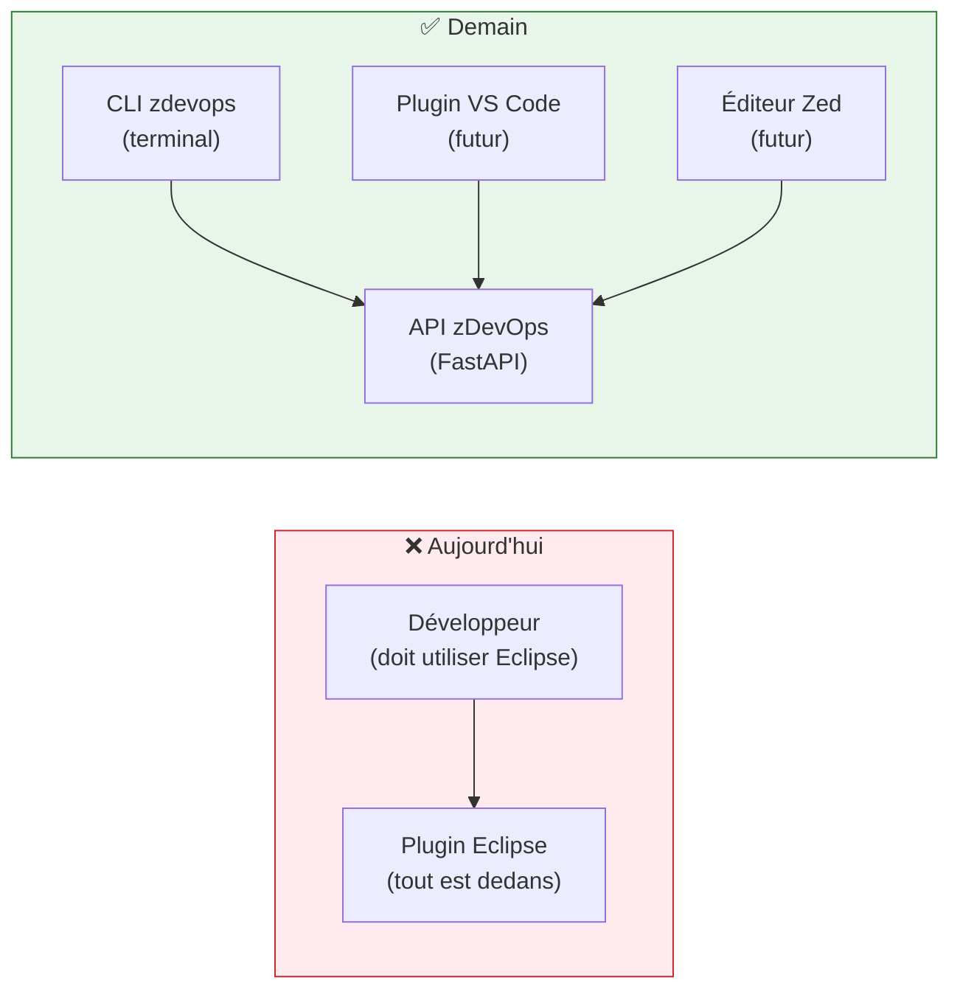
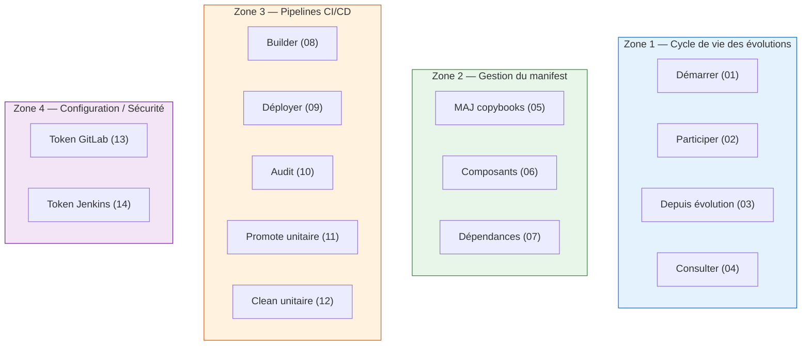
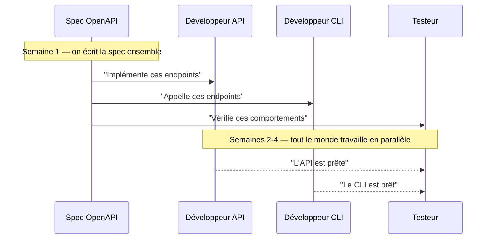
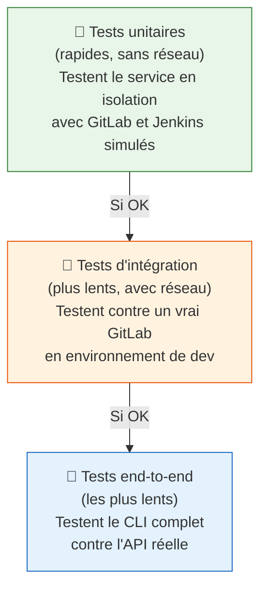

# Du Plugin Eclipse à l'API zDevOps — Guide de refactoring

> **Pour qui est ce guide ?**
> Ce guide s'adresse à des développeurs qui découvrent la conception d'API et les bonnes
> pratiques modernes. Les concepts sont expliqués avec des analogies du quotidien avant
> d'être traduits en termes techniques. L'objectif final est concret : remplacer l'ancien
> plugin Eclipse par une API FastAPI et un outil en ligne de commande (CLI) qui fonctionnent
> vraiment en production.

---

## Pourquoi ce refactoring ?

Le plugin Eclipse IDz zDevOps fonctionne — mais il est **prisonnier de son IDE**. Si tu
veux compiler une application mainframe depuis VS Code, depuis Zed, ou depuis un script
automatisé la nuit, tu ne peux pas. Il faut Eclipse, et c'est tout.

L'objectif est de **libérer la logique métier** de l'IDE qui l'emprisonne et de la
transformer en une API accessible depuis n'importe quel outil.



---

## Les 14 fonctions à migrer

Le plugin Eclipse propose 14 fonctions via le menu zDevOps. Ce sont elles qui deviennent
les endpoints de la future API :

| N° | Raccourci | Ce que ça fait | Priorité |
|---|---|---|---|
| 01 | `Ctrl+1` | Démarrer une évolution (créer une branche) | 🔴 Critique |
| 02 | `Ctrl+2` | Rejoindre une évolution existante | 🔴 Critique |
| 03 | `Ctrl+8` | Créer une évolution depuis une autre | 🟠 Haute |
| 04 | `Ctrl+9` | Consulter les sources en lecture seule | 🟡 Moyenne |
| 05 | `Ctrl+4` | Mettre à jour les copybooks partagés | 🟠 Haute |
| 06 | `Ctrl+5` | Gérer les composants du manifest | 🔴 Critique |
| 07 | `Ctrl+7` | Gérer les dépendances du manifest | 🟠 Haute |
| 08 | `Ctrl+0` | Builder (compiler via Jenkins) | 🔴 Critique |
| 09 | `Ctrl+B` | Déployer (via Jenkins) | 🔴 Critique |
| 10 | `Ctrl+6` | Audit qualité (via Jenkins) | 🟡 Moyenne |
| 11 | clic droit | Promote unitaire (test rapide) | 🟠 Haute |
| 12 | clic droit | Clean unitaire (nettoyage) | 🟡 Moyenne |
| 13 | `Ctrl+E` | Configurer le token GitLab | 🔴 Critique |
| 14 | `Ctrl+K` | Configurer le token Jenkins | 🔴 Critique |

!!! info "Où trouver les spécifications détaillées"
    Chaque fonction est documentée dans
    `/home/galan/workspaces/cicd_zdevops/plugin_zdevops/doc/` — un répertoire par fonction
    avec ses règles de gestion (`business_rules.md`).

---

## Ce que font les professionnels expérimentés

Quand des équipes d'ingénieurs expérimentés (Google, IBM, Microsoft…) reçoivent un projet
comme celui-ci, leur première réaction surprend toujours les débutants :

> **Ils ne commencent pas à coder.**

Voici pourquoi, et ce qu'ils font à la place.

---

### Étape 0 — Comprendre avant de construire

#### L'analogie de l'architecte

Imaginez qu'on vous demande de reconstruire une maison. Est-ce qu'un bon architecte
commence directement à poser des briques ? Non. Il passe du temps à comprendre :

- À quoi sert la maison ?
- Qui va l'habiter ?
- Quels problèmes avait l'ancienne ?
- Quelles pièces sont indépendantes ? Lesquelles communiquent ?

C'est exactement ce que fait un bon développeur avant de créer une API.

Dans notre cas, l'analyse critique du plugin a déjà été faite et documentée. Elle révèle
des problèmes importants — des bugs critiques et des défauts de conception — qu'il ne
faut surtout pas reproduire dans la nouvelle version.

!!! danger "Les bugs qu'on ne doit PAS reproduire"
    L'ancienne version du plugin a 5 bugs critiques identifiés :

    - **M1** — Deux développeurs créant une évolution au même moment sur la même application
      peuvent recevoir le même numéro d'artefact (doublons non détectés)
    - **M3** — Si le réseau coupe pendant l'écriture du manifest, le fichier peut être
      corrompu sans que personne ne le sache
    - **M4** — Les erreurs Git sont avalées silencieusement : l'opération semble réussir
      mais rien n'a été fait
    - **M5** — Le plugin peut commiter du code en votre nom, sans vous demander, avec
      un message générique

    Ces bugs viennent tous du même problème : **le code ne gère pas les cas d'erreur**
    et ne protège pas l'utilisateur contre les opérations destructives ou silencieuses.

---

### Étape 1 — Identifier les "zones de responsabilité"

#### L'analogie du restaurant

Dans un restaurant bien organisé, chaque zone a une responsabilité claire :
- La salle → prend les commandes et sert les plats
- La cuisine → prépare les plats
- Le garde-manger → stocke et fournit les ingrédients

Si le serveur essaie aussi de cuisiner et de gérer le stock, tout devient chaotique.

C'est exactement le problème de l'ancien plugin. Une seule classe Java (`GitLabService.java`)
fait **1800 lignes** et gère à la fois : les appels API GitLab, les opérations Git locales,
la gestion du manifest JSON, le téléchargement des copybooks, et la gestion du référentiel
d'applications. C'est ce qu'on appelle un **"God Object"** — une classe qui joue le rôle
de Dieu et fait tout.

#### Les zones de responsabilité de notre API

Dans la nouvelle architecture, on identifie 3 grandes zones naturelles :



En termes techniques, on appelle ça les **"bounded contexts"** (contextes délimités).
Chaque zone a ses propres règles, ses propres données, et communique avec les autres zones
via des interfaces claires — jamais en fouillant dans les détails internes des autres.

!!! tip "Règle d'or"
    Si une classe ou un fichier fait plus d'une chose, c'est un signe que quelque chose
    ne va pas. Une zone de responsabilité = un service = un ensemble de fichiers.

---

### Étape 2 — Concevoir le contrat avant de construire

#### L'analogie du plan d'architecte

Quand on construit un immeuble, l'architecte dessine les plans **avant** que les ouvriers
posent une seule brique. Les plans permettent à tout le monde de travailler en parallèle :
les électriciens savent où passer les câbles, les plombiers savent où installer les tuyaux
— avant même que les murs soient construits.

Pour une API, le "plan d'architecte" s'appelle la **spécification OpenAPI** (ou spec).
C'est un fichier qui décrit, en langage standardisé, tous les endpoints de l'API :

- Quelles routes existent (`POST /evolutions`, `GET /workspaces/status`…)
- Quels paramètres elles acceptent
- Quelles réponses elles retournent
- Quelles erreurs elles peuvent produire

#### Pourquoi c'est révolutionnaire

Si on a la spec avant le code :

1. Le **développeur de l'API** sait exactement quoi implémenter
2. Le **développeur du CLI** peut commencer à coder le client en parallèle, contre une
   version "simulée" de l'API (on appelle ça un "mock")
3. Le **testeur** sait exactement quoi valider
4. La **documentation** est générée automatiquement (FastAPI fait ça gratuitement)



!!! info "En pratique"
    La spec OpenAPI est un fichier YAML ou JSON. FastAPI peut la générer automatiquement
    depuis le code — mais les pros écrivent d'abord la spec, *puis* le code, pas l'inverse.
    L'outil **Stoplight Studio** (gratuit) permet de la visualiser et de la tester
    interactivement.

---

### Étape 3 — Ne pas reproduire les erreurs de l'ancien système

#### L'analogie de la rénovation

Quand on rénove une maison ancienne, on ne refait pas les mêmes erreurs que l'architecte
original. Si les canalisations étaient mal isolées et gelaient chaque hiver, on profite
de la rénovation pour les refaire correctement.

Dans notre cas, on sait exactement quelles erreurs éviter grâce à l'analyse critique
du plugin existant. Le tableau ci-dessous traduit les bugs identifiés en **décisions de
conception** pour la nouvelle API :

| Bug original | Ce qu'on fait à la place dans la nouvelle API |
|---|---|
| Numéros d'artefact en doublon (M1) | On utilise le mécanisme d'"optimistic locking" de GitLab pour éviter les conflits |
| Manifest corrompu si le réseau coupe (M3) | On sépare clairement les étapes : écrire → commiter → pousser. Si une étape échoue, on retourne une erreur précise, jamais un succès partiel |
| Erreurs Git avalées silencieusement (M4) | Chaque erreur produit une exception typée avec un message clair. Rien n'est ignoré. |
| Auto-commit sans consentement (M5) | Supprimé. L'API refuse d'agir si le dépôt local contient des modifications non sauvegardées. C'est l'utilisateur qui décide. |

!!! success "Le principe directeur"
    **Une API honnête dit toujours ce qu'elle fait.** Elle ne prend jamais de décision
    destructive sans que l'utilisateur l'ait demandée explicitement. Elle ne cache jamais
    les erreurs. Elle retourne toujours un résultat clair : succès ou échec, jamais
    "peut-être".

---

### Étape 4 — Classer les fonctions par priorité

#### L'analogie du triage médical

Aux urgences, le triage permet de soigner en premier les cas les plus critiques, pas les
premiers arrivés. C'est la même logique pour un projet de refactoring.

On classe les 14 fonctions selon deux axes :

- **Valeur métier** : sans cette fonction, rien d'autre ne fonctionne ?
- **Complexité technique** : est-ce difficile à implémenter ?

```mermaid
quadrantChart
    title Priorité des 14 fonctions
    x-axis Complexité faible --> Complexité haute
    y-axis Valeur faible --> Valeur haute
    quadrant-1 Phase 2
    quadrant-2 Phase 1 - Commencer ici
    quadrant-3 Phase 3
    quadrant-4 A evaluer

    Démarrer évolution (01): [0.35, 0.95]
    Participer évolution (02): [0.30, 0.85]
    Token GitLab (13): [0.15, 0.90]
    Token Jenkins (14): [0.15, 0.88]
    Builder (08): [0.75, 0.92]
    Déployer (09): [0.80, 0.88]
    Composants manifest (06): [0.40, 0.80]
    MAJ copybooks (05): [0.55, 0.72]
    Dépendances manifest (07): [0.45, 0.68]
    Évolution depuis évolution (03): [0.50, 0.65]
    Promote unitaire (11): [0.70, 0.60]
    Audit (10): [0.65, 0.50]
    Consulter sources (04): [0.30, 0.40]
    Clean unitaire (12): [0.55, 0.35]
```

**Phase 1 — Le minimum indispensable** (fonctions sans lesquelles rien ne marche) :
→ 01, 02, 13, 14 + la structure de l'API

**Phase 2 — Le cœur du métier** :
→ 06, 07, 05, 08, 09

**Phase 3 — Les fonctions complémentaires** :
→ 03, 04, 10, 11, 12

---

### Étape 5 — Concevoir le CLI comme un outil de développeur digne de ce nom

#### Ce qu'est un bon outil CLI

Un bon outil en ligne de commande n'est pas juste une série de `curl` déguisée. C'est
un outil que les développeurs *aiment* utiliser parce qu'il est :

- **Explicite** : il dit ce qu'il fait avant de le faire
- **Sûr** : il demande confirmation pour les actions dangereuses
- **Bavard quand nécessaire** : il affiche de la progression, des logs, des couleurs
- **Silencieux quand demandé** : il peut fonctionner en mode `--quiet` pour les scripts
- **Complétable** : la touche Tab complète les commandes dans le terminal

Comparaison entre un CLI médiocre et un CLI professionnel :

=== "❌ CLI médiocre"

    ```bash
    # Opaque, aucun feedback, risque de tout casser
    zdevops 01 da01 correction_tva BATCH
    ```

=== "✅ CLI professionnel"

    ```bash
    # Clair, sécurisé, avec options
    zdevops evolution start \
      --app da01 \
      --name correction_tva \
      --type BATCH \
      --description "Correction du calcul de TVA sur les opérations de crédit"

    # Avec retour visuel
    ✓ Vérification de l'application da01 dans GitLab...
    ✓ Vérification de l'unicité de la branche...
    ✓ Clone du dépôt local...
    ✓ Création de la branche feature_correction_tva...
    ✓ Initialisation du manifest...

    ✅ Évolution démarrée avec succès !
       Branche    : feature_correction_tva
       Manifest   : META-INF/da01_000042_correction_tva.mf.json
       Répertoire : /home/dev/workspace/da01
    ```

#### Les outils qui permettent ça

En Python, deux bibliothèques font le travail :

- **Typer** : gère la structure des commandes, les options, la complétion automatique
- **Rich** : gère l'affichage (couleurs, tableaux, barres de progression)

On les verra en détail dans les exercices pratiques.

---

### Étape 6 — Écrire les tests en même temps que le code

#### Pourquoi les pros testent autant

Une API bancaire touche à du code de production mainframe. Une erreur peut bloquer des
milliers de transactions. Les tests automatisés ne sont pas un luxe — ils sont le filet
de sécurité qui permet d'avancer sans avoir peur de casser quelque chose à chaque
modification.

L'ancien plugin n'était quasiment pas testable parce que toute la configuration était
"soudée" dans le code (`AppProperties` statique, bug A1). La nouvelle API est conçue
dès le départ pour être testée facilement.

**Trois niveaux de tests :**



La règle : **80% des tests sont des tests unitaires**. Ils s'exécutent en quelques
secondes et donnent un retour immédiat.

---

### Étape 7 — Rendre le système observable

#### L'analogie du tableau de bord

Un pilote d'avion ne vole pas à l'aveugle. Il a des instruments qui lui indiquent en
permanence : altitude, vitesse, carburant, cap. Si quelque chose va mal, il le sait
immédiatement.

Un système logiciel en production a besoin des mêmes instruments. On appelle ça
l'**observabilité** — la capacité de comprendre ce qui se passe à l'intérieur du système
depuis l'extérieur.

Dans la pratique, ça signifie des **logs structurés** — chaque événement important est
enregistré avec son contexte :

```python
# ❌ Log inutile — on sait que quelque chose s'est passé, mais quoi ?
print("Évolution créée")

# ✅ Log structuré — on sait QUOI, QUI, QUAND, et combien de temps
log.info(
    "evolution.created",
    app_code="da01",
    branch="feature_correction_tva",
    artifact_number=42,
    duration_ms=1240,
    user="jean.dupont@lcl.fr"
)
```

L'ancien plugin utilisait **4 mécanismes de logging différents** en même temps (bug m5).
La nouvelle API n'en a qu'un, cohérent, et tous les logs peuvent être analysés
automatiquement.

---

### Étape 8 — La vraie question avant de commencer

Avant même de choisir FastAPI ou n'importe quel autre framework, une équipe
professionnelle poserait cette question :

> **Est-ce qu'une API centralisée est vraiment nécessaire, ou est-ce qu'un CLI autonome
> suffit ?**

Ce n'est pas une question rhétorique — c'est une décision architecturale importante
avec des conséquences concrètes :

| Critère | CLI autonome | API + CLI |
|---|---|---|
| Installation | `pipx install zdevops` — c'est tout | Serveur à déployer et maintenir |
| Mise à jour | Chaque développeur met à jour son outil | Une mise à jour serveur bénéficie à tous |
| Ajout d'un plugin VS Code | Difficile | Trivial (même API) |
| Tests | Plus simples | Deux projets à tester |
| Logging centralisé | Impossible | Possible |

**Dans notre cas**, l'architecture API + CLI est justifiée parce que :
1. Un plugin VS Code est prévu à terme
2. Les pipelines CI/CD automatisés doivent pouvoir appeler l'API directement
3. La logique métier centralisée garantit un comportement identique quel que soit le client

---

## Le plan d'action complet

Voici les étapes concrètes pour mener ce projet à bien, dans l'ordre.

### Phase 0 — Fondations (1 à 2 semaines)

**Objectif :** Tout le monde sait où on va avant d'écrire une ligne de code.

| Tâche | Livrable | Durée |
|---|---|---|
| Lire toutes les `business_rules.md` des 14 fonctions | Connaissance partagée | 2 jours |
| Écrire la spec OpenAPI pour les fonctions de la Phase 1 | `openapi.yaml` | 3 jours |
| Définir les 5 décisions architecturales clés (ADR) | `decisions/` | 1 jour |
| Mettre en place le projet Python avec `uv` | Repo Git initialisé | 1 jour |

!!! info "Qu'est-ce qu'un ADR ?"
    Un **ADR** (Architecture Decision Record — "journal des décisions") est un document
    court qui répond à : "Pourquoi avons-nous choisi X plutôt que Y ?"
    
    Exemple : "Pourquoi Typer pour le CLI et pas Click ou Argparse ?"
    
    Ce document se lit dans 6 mois quand on a oublié pourquoi on a pris cette décision.

---

### Phase 1 — Le MVP : créer et rejoindre une évolution (2 à 3 semaines)

**Objectif :** Un développeur peut remplacer `Ctrl+1` et `Ctrl+2` du plugin par des
commandes CLI qui fonctionnent réellement.

```bash
# Ce qui doit marcher à la fin de la Phase 1
zdevops config set-gitlab-token
zdevops config set-jenkins-token
zdevops evolution start --app da01 --name ma_correction --type BATCH
zdevops evolution join --app da01 --name correction_existante
zdevops workspace status --app da01
```

**Étapes techniques :**

1. Structure du projet FastAPI (router, service, adapters, models, exceptions)
2. Endpoint `POST /api/v1/evolutions` (fonction 01 — déjà spécifiée)
3. Endpoint `POST /api/v1/evolutions/join` (fonction 02)
4. Endpoint `GET /api/v1/workspaces/status` (diagnostic)
5. Gestion sécurisée des tokens (fonctions 13 et 14)
6. Structure du projet CLI avec Typer
7. Commandes CLI correspondantes
8. Suite de tests unitaires complète

**Critère de succès :** `uv run pytest` → 100% vert. Un vrai clone se crée sur un vrai GitLab de dev.

---

### Phase 2 — Le cœur du métier (3 à 4 semaines)

**Objectif :** Un développeur peut gérer son manifest et déclencher un build depuis le
CLI.

```bash
zdevops manifest add src/CALCUTVA.cbl src/MONPROG.cbl
zdevops manifest dependencies add --app da02 --branch feature_copybook_partage
zdevops copybooks update
zdevops build
zdevops build --watch    # Suit les logs Jenkins en temps réel
```

**Étapes techniques :**

1. Endpoints manifest (fonctions 05, 06, 07)
2. Endpoint build — `POST /api/v1/builds` (fonction 08)
3. Polling Jenkins avec Server-Sent Events ou WebSocket pour le suivi en temps réel
4. Commandes CLI correspondantes avec affichage Rich (progression, logs colorés)
5. Tests d'intégration contre GitLab CE en Docker

---

### Phase 3 — Compléter le périmètre (2 à 3 semaines)

**Objectif :** Parité complète avec l'ancien plugin Eclipse.

```bash
zdevops deploy --env rec
zdevops audit
zdevops promote --component src/CALCUTVA.cbl
zdevops clean --component src/CALCUTVA.cbl
zdevops evolution fork --from feature_correction_tva --name nouvelle_evolution
zdevops sources view --app da01
```

---

### Phase 4 — Qualité et mise en production (1 à 2 semaines)

- Documentation utilisateur complète (avec exemples)
- Tests end-to-end sur l'environnement `dev`
- Package CLI installable (`pipx install zdevops`)
- Guide de migration depuis le plugin Eclipse

---

## Structure du projet cible

Voici à quoi ressemblera l'arborescence finale :

```
zdevops/                          ← Dépôt Git racine
│
├── api/                          ← Backend FastAPI
│   ├── pyproject.toml
│   ├── zdevops_api/
│   │   ├── main.py
│   │   ├── config.py
│   │   ├── exceptions.py
│   │   ├── models/
│   │   │   ├── evolution.py
│   │   │   ├── manifest.py
│   │   │   └── build.py
│   │   ├── routers/
│   │   │   ├── evolutions.py    ← Fonctions 01, 02, 03
│   │   │   ├── workspaces.py    ← Diagnostic
│   │   │   ├── manifest.py      ← Fonctions 05, 06, 07
│   │   │   ├── builds.py        ← Fonction 08
│   │   │   ├── deployments.py   ← Fonction 09
│   │   │   └── config.py        ← Fonctions 13, 14
│   │   └── services/
│   │       ├── evolution_service.py
│   │       ├── manifest_service.py
│   │       ├── jenkins_service.py
│   │       ├── repo_policies.py
│   │       ├── gitlab_service.py
│   │       └── git_service.py
│   └── tests/
│       ├── unit/
│       └── integration/
│
├── cli/                          ← Client CLI Typer + Rich
│   ├── pyproject.toml
│   ├── zdevops_cli/
│   │   ├── main.py               ← Point d'entrée `zdevops`
│   │   ├── config.py             ← Gestion de la config locale (~/.zdevops)
│   │   ├── client.py             ← Client HTTP vers l'API
│   │   └── commands/
│   │       ├── evolution.py      ← `zdevops evolution ...`
│   │       ├── manifest.py       ← `zdevops manifest ...`
│   │       ├── build.py          ← `zdevops build ...`
│   │       └── config.py         ← `zdevops config ...`
│   └── tests/
│
└── docs/                         ← Documentation MkDocs (ce site)
    └── openapi.yaml              ← Spec OpenAPI — source de vérité
```

---

## Exercices pratiques

Cette section sera enrichie au fil du projet. Chaque exercice correspond à une étape
réelle de l'implémentation.

### Exercice 1 — Lire une spec et identifier les questions ouvertes

**Objectif :** Lire la spec de la fonction 02 (Participer à une évolution) et lister
toutes les questions auxquelles la spec ne répond pas encore.

**Ressource :** `/home/galan/workspaces/cicd_zdevops/plugin_zdevops/doc/02_participer_evolution/business_rules.md`

**Questions à se poser pour chaque règle de gestion :**
1. Que se passe-t-il si le réseau coupe à cette étape ?
2. Quel code HTTP exact doit retourner l'API en cas d'erreur ?
3. Est-ce que le client (CLI) doit prendre une décision ici, ou l'API ?

---

### Exercice 2 — Écrire le premier endpoint en OpenAPI

**Objectif :** Écrire en YAML la définition du endpoint `POST /api/v1/evolutions/join`
(fonction 02) avec ses modèles de requête, de réponse et d'erreur.

**Template de départ :**
```yaml
paths:
  /api/v1/evolutions/join:
    post:
      summary: Rejoindre une évolution existante
      tags:
        - Évolutions
      requestBody:
        required: true
        content:
          application/json:
            schema:
              # À compléter...
      responses:
        "201":
          description: # À compléter...
        "404":
          description: # À compléter...
        "409":
          description: # À compléter...
```

---

### Exercice 3 — Premier endpoint FastAPI avec test

**Objectif :** Implémenter `GET /api/v1/workspaces/status` (le plus simple) avec son
modèle Pydantic, son service, et son test unitaire.

**Ce que vous allez apprendre :**
- Créer un modèle Pydantic de réponse
- Lire l'état du disque depuis un service Python
- Écrire un test qui ne touche pas le vrai disque (avec mock)

Ce premier exercice sera détaillé étape par étape dans les prochaines sessions.

---

## Ressources pour aller plus loin

| Ressource | Lien | Utilité |
|---|---|---|
| Spécifications des 14 fonctions | `/home/galan/workspaces/cicd_zdevops/plugin_zdevops/doc/` | Règles de gestion à implémenter |
| Architecture API (fondations) | [Architecture générale](../zdevops/architecture-generale.md) | Patterns et choix techniques |
| Cas concret POST /evolutions | [Cas concret](../zdevops/cas-concret-post-evolutions.md) | Code réel annoté de la fonction 01 |
| Doc FastAPI complète | [FastAPI — Concepts avancés](../../developpement/python/fastapi/concepts-avances.md) | Référence technique |
| Policy Pattern | [Policy Pattern](../../developpement/python/patterns/policy-pattern.md) | Pattern utilisé pour les stratégies de dépôt |
