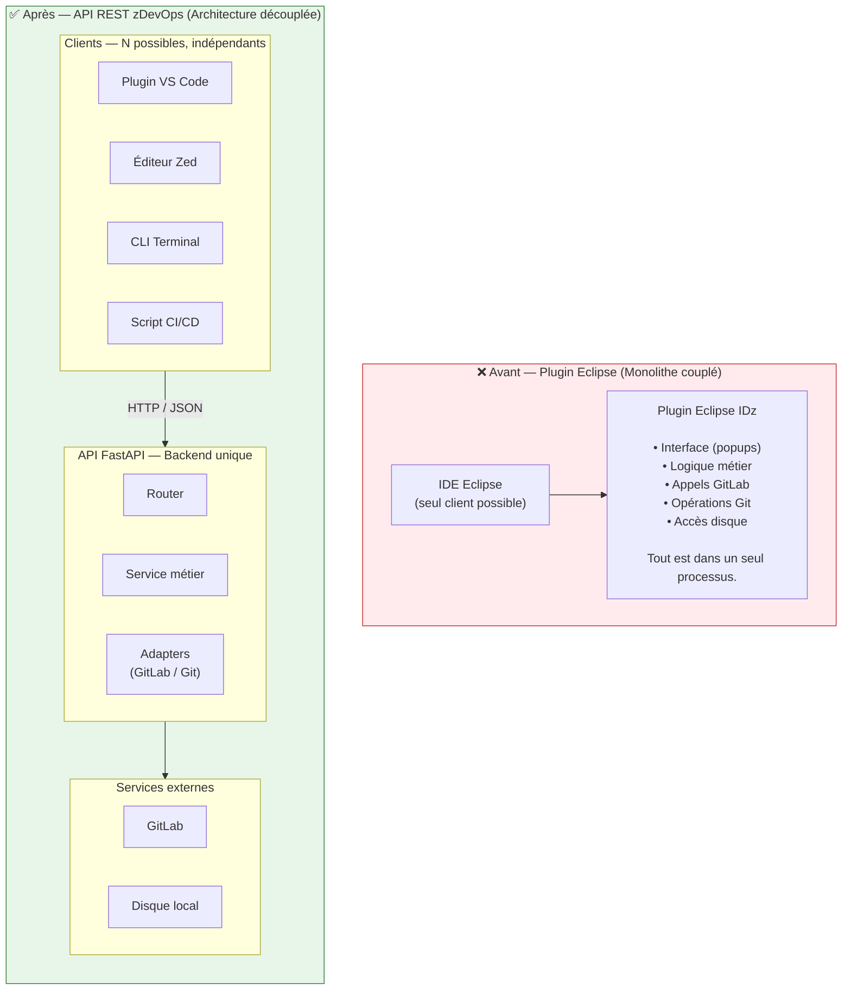
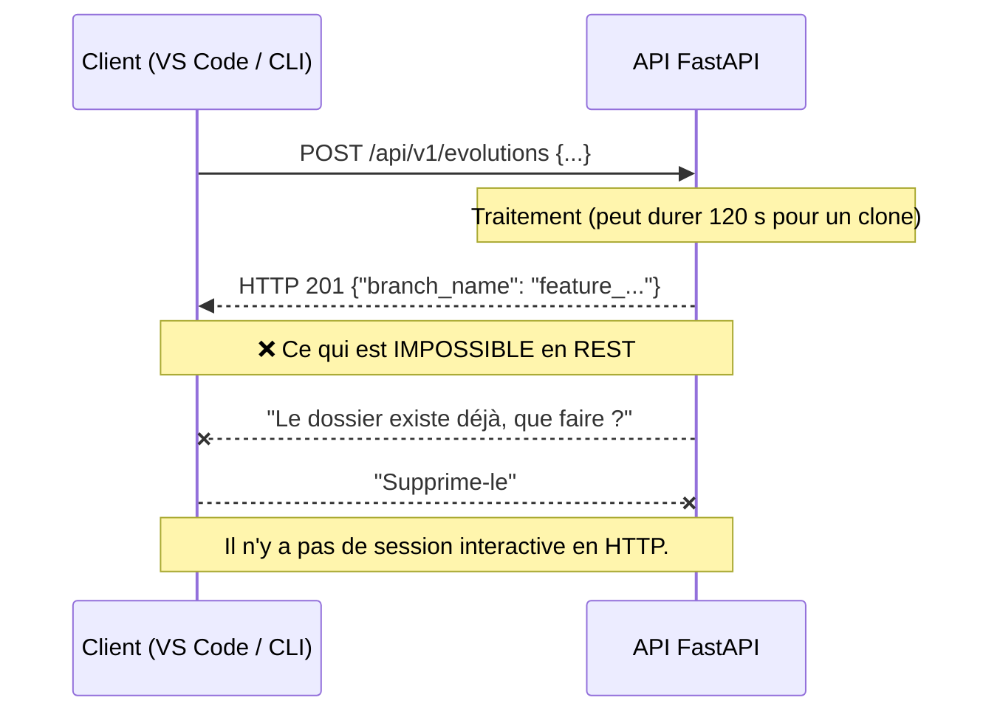
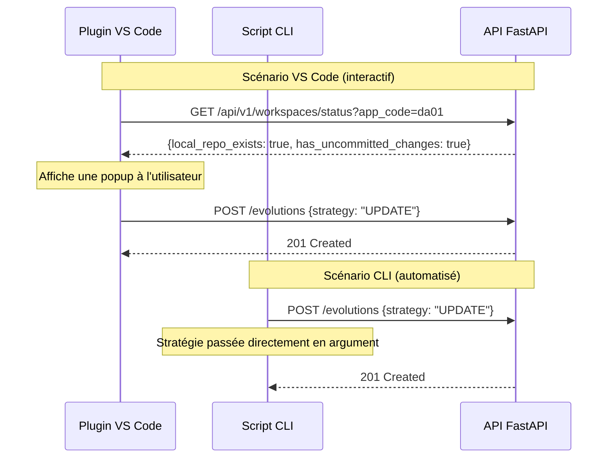
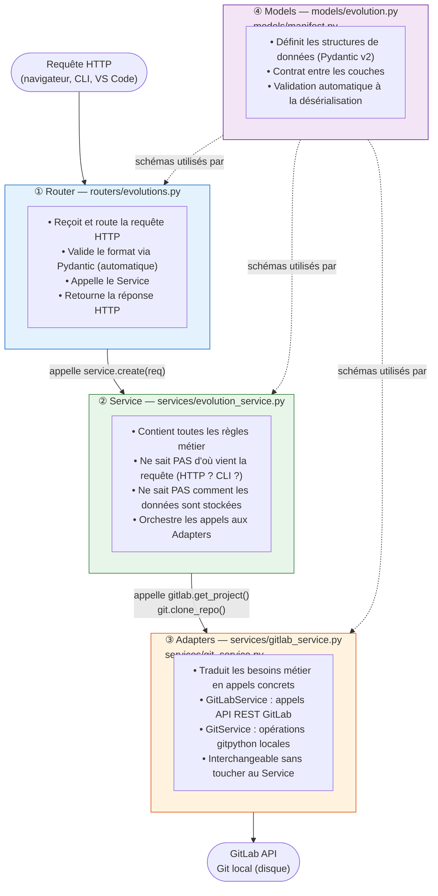
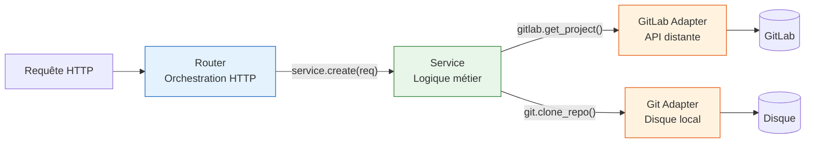
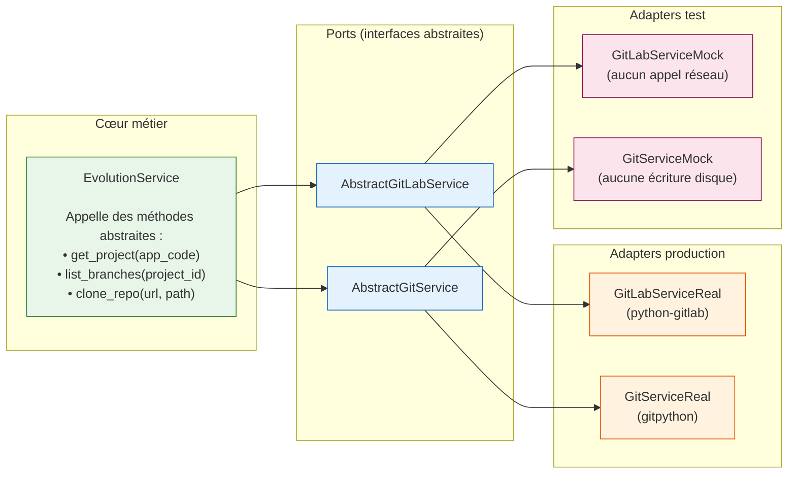
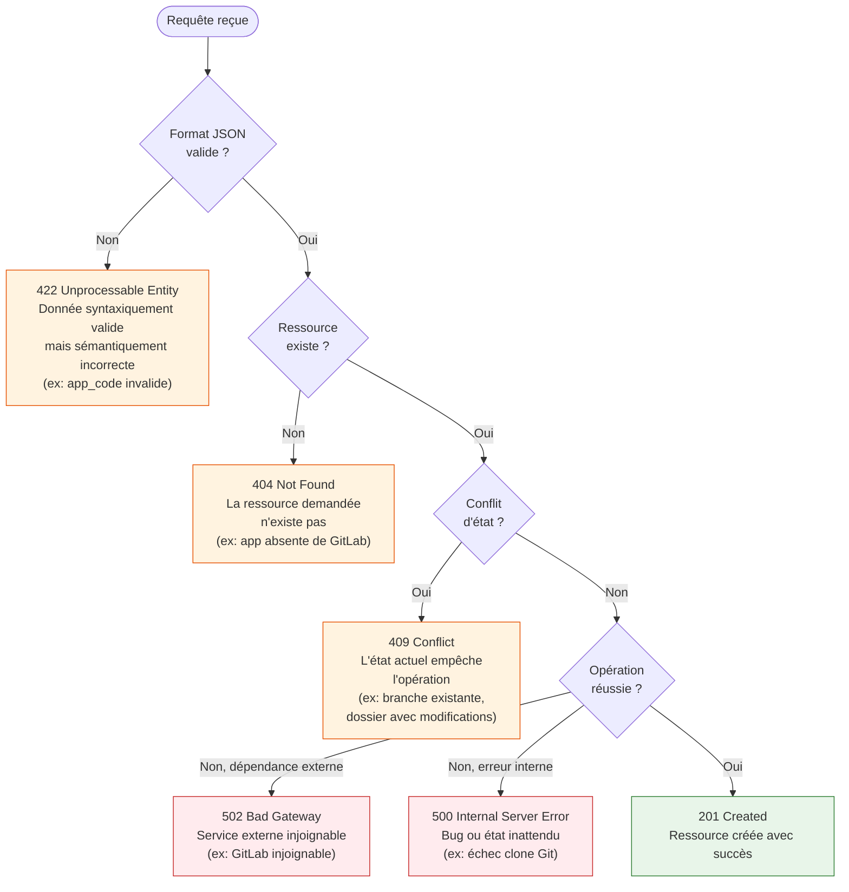

# Architecture API zDevOps — Fondations

> Ce document s'adresse à des développeurs juniors. Chaque choix technique est expliqué avec
> le *pourquoi* avant le *comment*. Aucune connaissance préalable de l'architecture logicielle
> n'est requise — seulement des bases en Python et en HTTP.

---

## 1. Avant / Après : du plugin monolithique à l'API

### 1.1 Ce qu'était le plugin Eclipse

Le plugin Eclipse IDz zDevOps était un **monolithe couplé à l'IDE** :

- Il ne fonctionnait que dans Eclipse (impossible de l'appeler depuis un terminal)
- Il accédait directement au système de fichiers, à Git et à GitLab sans couches intermédiaires
- Il affichait des popups et **attendait une réponse utilisateur** pendant son exécution
- Toute la logique — interface, règles métier, accès aux données — était mélangée

!!! info "Qu'est-ce qu'un monolithe ?"
    Un monolithe est une application où toute la logique (interface, calculs, accès aux
    données) est concentrée dans un seul bloc indivisible. Comme un couteau suisse soudé :
    pratique au départ, impossible à faire évoluer ou à réutiliser pièce par pièce.

### 1.2 L'architecture cible



### 1.3 Pourquoi ce refactoring ?

| Critère | Plugin Eclipse | API REST |
|---|---|---|
| Fonctionne depuis VS Code ? | ❌ Non | ✅ Oui |
| Fonctionne depuis un terminal ? | ❌ Non | ✅ Oui |
| Testable automatiquement ? | ❌ Difficile | ✅ Facile (`pytest`, `httpx`) |
| Logique métier isolée ? | ❌ Mélangée à l'UI | ✅ Dans les services |
| Utilisable par un script CI/CD ? | ❌ Non | ✅ Oui |
| Ajout d'un nouveau client (Zed) ? | ❌ Réécriture complète | ✅ Nouveau client, même API |

---

## 2. Séparation des responsabilités : API vs Client

### 2.1 HTTP est sans état et sans interaction

Une API REST ne peut pas "mettre en pause" son traitement pour poser une question à
l'utilisateur. HTTP est un protocole **sans état** (*stateless*) :

1. Le **client** envoie **une** requête
2. Le **serveur** renvoie **une** réponse
3. La connexion se **ferme** — il n'y a pas de dialogue



### 2.2 Qui fait quoi ?

```mermaid
flowchart LR
    subgraph CLIENT["🖥️ Responsabilité du Client"]
        direction TB
        C1["Afficher les messages d'erreur à l'utilisateur"]
        C2["Poser les questions de confirmation"]
        C3["Choisir la stratégie\n(supprimer / mettre à jour / annuler)"]
        C4["Adapter l'expérience à l'interface\n(popup GUI vs texte CLI)"]
    end

    subgraph API["⚙️ Responsabilité de l'API"]
        direction TB
        A1["Valider le format des paramètres"]
        A2["Détecter l'état du système\n(dossier présent ? branche existante ?)"]
        A3["Exécuter la stratégie demandée par le client"]
        A4["Retourner un résultat précis\n(succès ou erreur structurée avec suggestion)"]
    end

    CLIENT -->|"Requête HTTP avec la stratégie choisie"| API
    API -->|"Réponse JSON structurée"| CLIENT

    classDef client fill:#e8f5e9,stroke:#2e7d32
    classDef api fill:#e3f2fd,stroke:#1565c0
    class CLIENT client
    class API api
```



!!! tip "Règle d'or"
    L'API **rapporte l'état** et **exécute des ordres**. Le client **affiche** et
    **décide**. Si votre API contient du code qui "choisit à la place de l'utilisateur"
    sans qu'il l'ait demandé, la frontière a été franchie.

### 2.3 Même API, expériences différentes

Le même endpoint `POST /api/v1/evolutions` est consommé de façon radicalement différente
selon le client, **sans que l'API change d'une ligne** :



---

## 3. Les 4 couches de l'architecture FastAPI

### 3.1 Principe : une couche = une responsabilité

Le projet est découpé en 4 couches strictes. Chaque couche a **une seule responsabilité**
(principe SRP — *Single Responsibility Principle*) et ne communique qu'avec sa voisine
directe.



### 3.2 Structure de fichiers

```
zdevops_api/
├── main.py                      ← Application FastAPI + exception handlers globaux
├── config.py                    ← Variables d'environnement (pydantic-settings)
├── exceptions.py                ← Exceptions métier typées
├── models/
│   ├── __init__.py
│   ├── evolution.py             ← CreateEvolutionRequest, CreateEvolutionResponse
│   └── manifest.py              ← ManifestModel
├── routers/
│   ├── __init__.py
│   ├── evolutions.py            ← Route POST /api/v1/evolutions
│   └── workspaces.py            ← Route GET /api/v1/workspaces/status
└── services/
    ├── __init__.py
    ├── evolution_service.py     ← Logique métier (orchestre les adapters)
    ├── repo_policies.py         ← Policy Pattern : ClonePolicy, UpdatePolicy, DeleteAndReclonePolicy
    ├── gitlab_service.py        ← Adapter : appels API GitLab
    └── git_service.py           ← Adapter : opérations Git locales (gitpython)
```

### 3.3 Configuration — `config.py`

`pydantic-settings` lit les variables d'environnement (ou un fichier `.env`) et les
expose comme attributs Python typés. Toute la configuration passe par cet objet — aucune
valeur codée en dur dans le code.

```python
from functools import lru_cache
from pydantic_settings import BaseSettings

class Settings(BaseSettings):
    gitlab_url: str
    gitlab_token: str
    gitlab_group: str
    gitlab_params_project_id: int
    workspace_base_path: str
    toolchain: str
    git_user_name: str
    git_user_email: str

    model_config = {"env_file": ".env", "case_sensitive": False}

@lru_cache
def get_settings() -> Settings:
    return Settings()
```

`@lru_cache` garantit que le fichier `.env` n'est lu qu'une seule fois au démarrage,
pas à chaque requête. En test, on passe les valeurs directement :

```python
Settings(gitlab_url="http://mock", gitlab_token="test-token", ...)
```

### 3.4 Pourquoi cette séparation change tout

| Sans séparation | Avec séparation |
|---|---|
| Router de 300 lignes avec `if/else` métier | Router de 20 lignes qui délègue |
| Impossible de tester sans lancer le serveur HTTP | Service testable avec `pytest` sans HTTP |
| Changer GitLab → réécrire tout le router | Changer GitLab → modifier uniquement `gitlab_service.py` |
| Un bug dans la logique métier est noyé dans le code HTTP | Bug isolé dans le service, pile d'appel claire |

---

## 4. Design Patterns appliqués

### 4.1 Layered Architecture (Architecture en couches)

C'est le pattern fondamental : chaque couche ne communique qu'avec la couche immédiatement
en dessous d'elle. Le router ne connaît pas GitLab. Le service ne connaît pas HTTP.



!!! info "Analogie restaurant"
    Le **serveur** (Router) prend votre commande et l'apporte en cuisine. Le **cuisinier**
    (Service) prépare le plat selon la recette. Le **fournisseur** (Adapter) livre les
    ingrédients depuis l'extérieur. Chacun fait son travail sans se mêler de celui des
    autres. Si le fournisseur change, le cuisinier utilise la même recette.

### 4.2 Service Layer Pattern

La couche Service est **complètement indépendante du protocole de transport** (HTTP) et
du mécanisme de stockage (GitLab, Git). Elle exprime uniquement les règles métier.

=== "❌ Sans Service Layer"

    ```python
    # Dans le router — ANTI-PATTERN : logique métier mélangée à HTTP
    @router.post("/evolutions")
    async def create_evolution(req: CreateEvolutionRequest):
        # Validation métier directement dans le router
        if not re.match(r"^d[ay][a-z0-9]{2}$", req.app_code):
            raise HTTPException(status_code=422, detail="Format invalide")
        # Appel GitLab directement dans le router
        gl = gitlab.Gitlab(os.getenv("GITLAB_URL"), os.getenv("GITLAB_TOKEN"))
        try:
            project = gl.projects.get(f"group/{req.app_code}")
        except gitlab.exceptions.GitlabGetError:
            raise HTTPException(status_code=404, detail="App introuvable")
        # ... 150 lignes supplémentaires de logique dans le router
    ```

=== "✅ Avec Service Layer"

    ```python
    # Dans le router — PATTERN CORRECT : uniquement orchestration HTTP
    @router.post("/evolutions", status_code=201)
    async def create_evolution(
        req: CreateEvolutionRequest,
        service: EvolutionService = Depends(get_evolution_service),
    ) -> CreateEvolutionResponse:
        return await service.create(req)   # Délègue tout au service

    # Dans le service — logique métier isolée et testable sans HTTP
    class EvolutionService:
        def __init__(self, gitlab: GitLabService, git: GitService) -> None:
            self.gitlab = gitlab
            self.git = git

        async def create(self, req: CreateEvolutionRequest) -> CreateEvolutionResponse:
            # Toute la logique métier est ici, sans aucune dépendance à FastAPI
            await self.gitlab.assert_project_exists(req.app_code)
            await self.gitlab.assert_branch_available(req.app_code, req.evolution_name)
            # ...
    ```

### 4.3 Ports & Adapters (Architecture Hexagonale)

Ce pattern répond à une question clé : *que se passe-t-il si GitLab change son API ? Ou si
on veut tester le Service sans vrai serveur GitLab ?*

La réponse : le Service ne dépend pas directement de `python-gitlab`. Il dépend d'une
**interface abstraite** (un "Port"). Les implémentations concrètes (les "Adapters") sont
interchangeables.



!!! tip "Bénéfice concret pour les tests"
    Dans les tests unitaires, on injecte `GitLabServiceMock` qui ne fait aucun appel réseau.
    En production, on injecte `GitLabServiceReal`. Le `EvolutionService` ignore lequel il
    utilise — c'est l'injection de dépendances FastAPI (`Depends`) qui fait le choix au
    moment de la requête.

!!! note "ABC vs duck typing dans ce projet"
    Le diagramme montre des interfaces abstraites (`AbstractGitLabService`). En Python,
    on peut les formaliser avec `abc.ABC` pour que le type checker signale les méthodes
    manquantes dans un nouvel adapter. Dans un premier temps, le **duck typing** (même
    signatures sans classe de base) suffit et simplifie le code. L'ABC s'ajoute quand
    l'équipe grandit ou que le nombre d'adapters augmente.

---

## 5. Mécanismes FastAPI exploités

### 5.1 Pydantic v2 — Validation et contrat de données

Pydantic transforme automatiquement le JSON entrant en **objet Python typé et validé**.
Si la donnée ne respecte pas le schéma, FastAPI retourne un `422` avant même d'appeler
votre fonction.

!!! info "Documentation complète"
    Pydantic, les `Field()`, `field_validator`, la génération OpenAPI automatique et la
    validation de réponse (`response_model`) sont expliqués en détail dans :
    [FastAPI — Concepts avancés : Contrôle de types](../../developpement/python/fastapi/concepts-avances.md#3-controle-de-types-ce-que-fastapi-fait-avec-vos-annotations)

Dans le contexte zDevOps, la valeur ajoutée est de **documenter les règles métier dans
le modèle** via `@field_validator` (RG-01 et RG-02) plutôt que de les disperser dans
le service :

```python
@field_validator("app_code")
@classmethod
def validate_app_code(cls, v: str) -> str:
    # S'exécute AVANT que FastAPI appelle le router — le service ne voit jamais de
    # valeur invalide
    if not re.match(r"^d[ay][a-z0-9]{2}$", v):
        raise ValueError("Doit commencer par 'da'/'dy' + 2 car. alphanumériques")
    return v

@field_validator("evolution_name")
@classmethod
def validate_evolution_name(cls, v: str) -> str:
    if " " in v:
        raise ValueError("Le nom ne doit pas contenir d'espace")
    if not re.match(r"^[a-zA-Z0-9_]+$", v):
        raise ValueError("Seuls les caractères alphanumériques et '_' sont autorisés")
    if v.startswith("feature"):
        raise ValueError("Le nom ne doit pas commencer par 'feature'")
    return v
```

### 5.2 Injection de dépendances avec `Depends`

`Depends` permet de déclarer ce dont une fonction a besoin **sans le construire
elle-même** — FastAPI assemble et injecte la chaîne à chaque requête.

!!! info "Documentation complète"
    Le mécanisme de `Depends`, les dépendances enchaînées, l'auth par header et la
    résolution du graphe de dépendances sont expliqués de zéro dans :
    [FastAPI — Architecture et Code](../../developpement/python/fastapi/code.md#linjection-de-dependances-depends)

Chaîne de dépendances spécifique à l'API zDevOps — 4 niveaux imbriqués :

```python
from fastapi import Depends
from functools import lru_cache

@lru_cache
def get_settings() -> Settings:                      # ① Config (lue une seule fois)
    return Settings()

def get_gitlab_service(
    settings: Settings = Depends(get_settings),
) -> GitLabService:                                  # ② Adapter GitLab
    return GitLabService(settings)

def get_git_service(
    settings: Settings = Depends(get_settings),
) -> GitService:                                     # ③ Adapter Git
    return GitService(settings)

def get_evolution_service(
    gitlab: GitLabService = Depends(get_gitlab_service),
    git: GitService = Depends(get_git_service),
) -> EvolutionService:                               # ④ Service métier
    return EvolutionService(gitlab, git)

@router.post("/evolutions", status_code=201)
async def create_evolution(
    req: CreateEvolutionRequest,
    service: EvolutionService = Depends(get_evolution_service),
) -> CreateEvolutionResponse:                        # ⑤ Router (reçoit tout assemblé)
    return await service.create(req)
```

!!! tip "Remplacement pour les tests"
    ```python
    app.dependency_overrides[get_evolution_service] = lambda: MockEvolutionService()
    ```
    Le code du router ne change pas d'une ligne.

### 5.3 Exception handlers globaux

Sans handler global, chaque endpoint doit gérer ses propres erreurs avec `try/except` —
code dupliqué garanti. Les handlers centralisent la conversion
**"exception métier → réponse HTTP"** en un seul endroit.

```python
# exceptions.py — hiérarchie d'exceptions métier typées
class ZDevOpsError(Exception):
    """Exception de base pour toutes les erreurs métier de l'API."""
    def __init__(self, code: str, message: str, detail: str | None = None) -> None:
        self.code = code
        self.message = message
        self.detail = detail

class AppNotFoundError(ZDevOpsError): ...
class EvolutionAlreadyExistsError(ZDevOpsError): ...
class RepoHasUncommittedChangesError(ZDevOpsError): ...
class CloneFailedError(ZDevOpsError): ...

# main.py — handler global : une seule définition pour toute l'API
_STATUS_MAP: dict[str, int] = {
    "INVALID_APP_CODE_FORMAT":      422,
    "APP_NOT_FOUND_IN_GITLAB":      404,
    "APP_NOT_IN_REGISTRY":          404,
    "EVOLUTION_ALREADY_EXISTS":     409,
    "REPO_HAS_UNCOMMITTED_CHANGES": 409,
    "PULL_CONFLICT":                409,
    "CLONE_FAILED":                 500,
    "PULL_FAILED":                  500,
    "COMMIT_FAILED":                500,
    "PUSH_FAILED":                  500,
    "GITLAB_UNREACHABLE":           502,
}

@app.exception_handler(ZDevOpsError)
async def zdevops_handler(request: Request, exc: ZDevOpsError) -> JSONResponse:
    return JSONResponse(
        status_code=_STATUS_MAP.get(exc.code, 500),
        content=ErrorResponse(
            code=exc.code,
            message=exc.message,
            detail=exc.detail,
        ).model_dump(),
    )
```

!!! info "Avantage clé"
    Le service peut faire `raise AppNotFoundError(...)` sans se soucier du code HTTP.
    La correspondance code d'erreur ↔ statut HTTP est définie **une seule fois** dans
    `_STATUS_MAP`.

### 5.4 async/sync — point de vigilance avec gitpython

!!! warning "gitpython est une bibliothèque synchrone"
    Les adapters `git_service.py` utilisent `gitpython`, qui est **bloquant**. Déclarer
    ces méthodes en `async def` bloquerait l'event loop de FastAPI et dégraderait les
    performances sous charge concurrente.

    **Bonne pratique :** déclarer les méthodes Git en `def` simple. FastAPI les exécute
    automatiquement dans un thread pool sans bloquer l'event loop.

    ```python
    # ✅ Correct pour gitpython (synchrone)
    def clone_repo(self, app_code: str) -> git.Repo: ...

    # ❌ À éviter : bloque l'event loop sous charge
    async def clone_repo(self, app_code: str) -> git.Repo: ...
    ```

!!! info "Règle async/sync expliquée de zéro"
    [FastAPI — Architecture et Code : Async vs Sync](../../developpement/python/fastapi/code.md#async-vs-sync-la-regle-dor)

### 5.5 Exception handlers — lien vers la doc générale

Le pattern `@app.exception_handler` utilisé dans ce projet est expliqué en détail, avec
des exemples de hiérarchie d'exceptions et de reformatage des erreurs Pydantic, dans :
[FastAPI — Concepts avancés : Exception handlers globaux](../../developpement/python/fastapi/concepts-avances.md#2-exception-handlers-globaux)

---

## 6. Contrat d'API global et sémantique REST

### 6.1 Conventions de nommage

| Règle | Exemple correct | Exemple incorrect |
|---|---|---|
| Versioning dans l'URL | `/api/v1/evolutions` | `/evolutions` |
| Ressources au **pluriel** | `/evolutions` | `/evolution` |
| Noms en **kebab-case** | `/workspace-status` | `/workspaceStatus` |
| Champs JSON en **snake_case** | `app_code`, `evolution_name` | `appCode`, `EvolutionName` |
| Verbes HTTP pour les actions | `POST /evolutions` | `GET /createEvolution` |
| Corps de réponse toujours JSON | `Content-Type: application/json` | Texte brut |

### 6.2 Sémantique des codes HTTP



### 6.3 Tableau de référence complet

| Code | Signification | Notre usage | Pourquoi ce code et pas un autre |
|---|---|---|---|
| `201 Created` | Ressource créée | Évolution créée avec succès | `200 OK` signifie "traitement OK" sans création ; `201` précise qu'une ressource a été créée |
| `409 Conflict` | Conflit d'état | Branche existante, dossier avec modifications non commitées, conflit Git | Ce n'est pas un bug serveur (`500`) mais un état métier prévisible que le client doit gérer |
| `422 Unprocessable Entity` | Donnée invalide | `app_code` invalide, nom d'évolution avec espaces | `400 Bad Request` est générique ; `422` précise que le JSON est bien formé mais les *valeurs* sont incorrectes — plus utile pour le client |
| `404 Not Found` | Ressource introuvable | Application absente de GitLab ou de `applications.json` | Standard REST pour une ressource qui n'existe pas |
| `500 Internal Server Error` | Erreur serveur | Échec clone Git, échec commit | Réservé aux cas *imprévus* — un conflit Git prévisible ne doit jamais déclencher un 500 |
| `502 Bad Gateway` | Dépendance externe KO | GitLab injoignable | Signale que le problème vient d'un service tiers, pas de notre API — utile pour le monitoring |

!!! warning "409 vs 500 — une distinction importante"
    Un **conflit Git** est un état métier prévisible, pas un bug. Retourner `500` pour un
    conflit induirait les clients en erreur : ils penseraient à un bug serveur alors qu'il
    s'agit d'une situation que l'utilisateur doit résoudre. Le `409 Conflict` est la réponse
    sémantiquement correcte.

!!! warning "422 vs 400 — nuance FastAPI / Pydantic"
    FastAPI utilise `422` (et non `400`) pour toutes les erreurs de validation Pydantic.
    C'est un choix délibéré : le JSON est *syntaxiquement* valide (bien formé), mais les
    *valeurs* ne respectent pas les règles de validation. `422` est plus précis et plus
    utile pour le développeur qui consomme l'API.

### 6.4 Structure standard d'une réponse d'erreur

Toutes les erreurs de l'API respectent le même format JSON, avec un **code machine**
(pour que le client puisse traiter l'erreur en code) et un **message humain** (pour
l'affichage à l'utilisateur) :

```json
{
  "code": "EVOLUTION_ALREADY_EXISTS",
  "message": "L'évolution 'feature_correction_tva' existe déjà dans le dépôt distant",
  "detail": null
}
```

```json
{
  "code": "REPO_HAS_UNCOMMITTED_CHANGES",
  "message": "Le dépôt local 'da01' contient des modifications non commitées.",
  "detail": {
    "local_repo_path": "/home/dev/workspace/da01",
    "uncommitted_files_count": 7,
    "current_branch": "feature_ancienne_evolution",
    "suggestion": "Appelez GET /api/v1/workspaces/status?app_code=da01 pour inspecter l'état."
  }
}
```

!!! tip "Pourquoi un code machine ET un message humain ?"
    - Le **code machine** (`EVOLUTION_ALREADY_EXISTS`) permet au client (VS Code, CLI) de
      brancher sur un `if/switch` pour adapter son comportement.
    - Le **message humain** est affiché directement à l'utilisateur sans traitement.
    - Le champ **detail** fournit le contexte technique utile pour le débogage.
