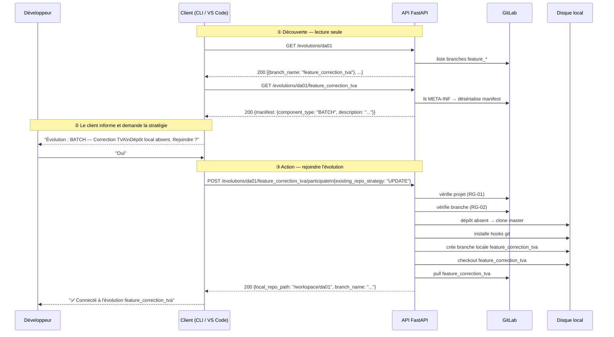

# Cas concret — Fonction 02 : Participer à une évolution

> Ce document applique les principes posés dans
> [Architecture générale](architecture-generale.md) à la deuxième fonction du projet :
> rejoindre une évolution existante. Il suit la même structure que
> [Cas concret : POST /evolutions](cas-concret-post-evolutions.md).

---

## 1. Contexte et différences avec la fonction 01

| | Fonction 01 — Démarrer | Fonction 02 — Participer |
|---|---|---|
| Nom de l'évolution | Saisi librement | Choisi dans la liste des branches existantes |
| Branche créée dans GitLab ? | ✅ Oui | ❌ Non — la branche existe déjà |
| Manifest créé ? | ✅ Oui | ❌ Non — manifest déjà existant |
| Écriture dans GitLab ? | Oui (branche + manifest + counter) | **Aucune** — opération locale uniquement |
| Race condition possible ? | Oui (ADR-001) | **Non** — pas d'écriture GitLab |

La fonction 02 est une **opération locale** : elle lit des informations depuis GitLab
(liste des branches, contenu du manifest), puis configure le workspace local du
développeur pour travailler sur une évolution existante. GitLab n'est jamais modifié.

---

## 2. Endpoints introduits

Cette fonction requiert trois endpoints complémentaires :

| Méthode | Endpoint | Rôle |
|---|---|---|
| `GET` | `/api/v1/evolutions/{app_code}` | Liste les branches `feature_*` disponibles |
| `GET` | `/api/v1/evolutions/{app_code}/{branch_name}` | Détails d'une évolution + manifest |
| `POST` | `/api/v1/evolutions/{app_code}/{branch_name}/participate` | Rejoindre l'évolution |

Les deux `GET` sont des **opérations de découverte** (lecture seule, sans effet de bord)
que le client appelle avant de déclencher le `POST`. Ils correspondent aux opérations
effectuées par la boîte de dialogue Eclipse lors de la saisie du code application et de
la sélection de l'évolution.

---

## 3. Analyse des règles de gestion

### RG-01 — Validation du code application

**Spécification :** même règle que la fonction 01 — format `d[ay][a-z0-9]{2}`,
existence vérifiée dans GitLab.

✅ **Conforme** — Pydantic `@field_validator` sur `app_code`, identique à la
fonction 01. Aucune duplication de code : le validator est défini une seule fois
dans `models/common.py` et réutilisé.

---

### RG-02 — Chargement des évolutions disponibles

**Spécification :** lister toutes les branches du dépôt GitLab.

✅ **Conforme avec filtre métier** — L'API filtre sur les branches `feature_*`.

!!! info "Pourquoi filtrer sur `feature_*` ?"
    Le plugin Java retourne toutes les branches (y compris `master`, `develop`, tags…).
    L'API restreint aux branches `feature_*` car le seul cas d'usage de cet endpoint est
    de rejoindre une évolution — jamais de se positionner sur `master`.
    Un paramètre `?include_all=true` peut être ajouté plus tard si le besoin émerge.

```
GET /api/v1/evolutions/da01
→ 200 OK
[
  {"branch_name": "feature_correction_tva", "created_at": "2025-03-12T10:00:00Z"},
  {"branch_name": "feature_bug_42",         "created_at": "2025-04-01T08:30:00Z"}
]
→ 404 si le projet da01 n'existe pas dans GitLab
→ 200 [] si aucune branche feature_* n'existe
```

---

### RG-03 — Lecture du manifest pour affichage

**Spécification :** quand l'utilisateur sélectionne une évolution, lire le fichier
manifest dans GitLab et afficher le type de composant et la description. Si le
manifest est introuvable, les champs restent vides.

✅ **Conforme** — Endpoint dédié `GET /api/v1/evolutions/{app_code}/{branch_name}`.

La séquence Java sous-jacente (`getManifestContent`) est en trois étapes :

```
1. GET /api/v4/projects/{id}/repository/tree?path=META-INF&ref={branch}
   → liste les fichiers pour trouver le .mf.json

2. GET /api/v4/projects/{id}/repository/files/META-INF%2F{filename}?ref={branch}
   → lit le contenu (base64) et désérialise le JSON

3. Si introuvable ou multiple : retourne null (dégradation gracieuse)
```

```
GET /api/v1/evolutions/da01/feature_correction_tva
→ 200 OK
{
  "app_code": "da01",
  "branch_name": "feature_correction_tva",
  "exists_locally": false,
  "manifest": {
    "component_type": "BATCH",
    "description": "Correction du calcul de la TVA partielle"
  }
}

→ Si manifest absent (branche sans manifest) :
{
  "app_code": "da01",
  "branch_name": "feature_correction_tva",
  "exists_locally": false,
  "manifest": null
}

→ 404 si le projet n'existe pas dans GitLab
→ 404 si la branche n'existe pas dans GitLab
```

---

### RG-04 — Dépôt local absent (cas nominal)

**Spécification :**
1. Clone du dépôt depuis `master`
2. Installation des hooks Git (protection de `master`)
3. Création de la branche locale `feature_XXX` depuis `master`
4. Checkout sur `feature_XXX`
5. Pull de la branche depuis GitLab

✅ **Conforme** — Séquence identique à la fonction 01 (clone + hooks + branche),
mais sans création de manifest ni écriture GitLab.

!!! info "Pourquoi cloner depuis `master` et non depuis la branche ?"
    La branche `feature_XXX` n'existe pas encore localement. Le clone initial depuis
    `master` garantit un état de départ propre et connu. La branche est ensuite créée
    localement et synchronisée avec le remote en deux étapes distinctes — plus fiable
    qu'un `clone --branch feature_XXX` qui peut échouer si le remote est lent.

---

### RG-05a — Dépôt local existant, stratégie `DELETE_AND_RECREATE`

**Spécification :** demande confirmation, supprime le répertoire local, applique RG-04.

!!! danger "Bug M5 reproduit dans le code Java"
    `deleteLocalRepo` dans le plugin **ne vérifie pas si le dépôt est dirty** avant
    de supprimer. Même bug que RG-08a de la fonction 01 : du code non commité peut
    être détruit silencieusement.

**Correction appliquée :** vérifier `is_dirty()` avant toute suppression.
Si le dépôt est dirty → `409 REPO_HAS_UNCOMMITTED_CHANGES`. Identique à la
correction déjà documentée dans
[Cas concret : POST /evolutions — RG-08a](cas-concret-post-evolutions.md#rg-08a--stratégie-delete_and_recreate-dépôt-existant).

---

### RG-05b — Dépôt local existant, stratégie `UPDATE`

**Spécification :** basculer sur la branche et faire un pull.

Le Java (`switcheBrancheAndParticipate`) gère deux sous-cas :
- La branche **existe localement** → `git checkout {branch_name}`
- La branche **n'existe pas localement** mais est présente sur remote
  → créer une branche de tracking : `git checkout -b {branch_name} --track origin/{branch_name}`

!!! danger "Bug M5 reproduit dans les deux sous-cas"
    `switcheBrancheAndParticipate` **commite automatiquement** si le dépôt est dirty
    avant de basculer de branche (`commitChanges(projet, "Commit avant bascule...")`).
    Même comportement non consenti que RG-08b de la fonction 01.

**Correction appliquée :**
- Si le dépôt est dirty → `409 REPO_HAS_UNCOMMITTED_CHANGES`
- Les deux sous-cas (branche locale / branche remote) sont gérés proprement

---

## 4. Workflow complet



---

## 5. Code FastAPI

### 5.1 Modèles Pydantic — `models/evolution.py` (ajouts)

```python
from pydantic import BaseModel, Field
from zdevops_api.models.common import AppCodeMixin


class EvolutionSummary(BaseModel):
    """Résumé d'une évolution dans la liste des branches disponibles."""

    branch_name: str
    created_at: str | None = None


class ManifestInfo(BaseModel):
    """Informations extraites du manifest d'une évolution."""

    component_type: str | None = None
    description: str | None = None


class EvolutionDetail(BaseModel):
    """Détail d'une évolution : état local + contenu du manifest."""

    app_code: str
    branch_name: str
    exists_locally: bool
    manifest: ManifestInfo | None = Field(
        default=None,
        description="Null si la branche ne possède pas de fichier manifest",
    )


class ParticipateRequest(BaseModel):
    """Corps de la requête POST .../participate."""

    existing_repo_strategy: ExistingRepoStrategy = ExistingRepoStrategy.UPDATE


class ParticipateResponse(BaseModel):
    """Corps retourné en cas de succès (200 OK)."""

    app_code: str
    branch_name: str
    local_repo_path: str
    manifest: ManifestInfo | None = None
    warnings: list[str] = Field(default_factory=list)
```

---

### 5.2 Exceptions métier (ajouts)

```python
# Ajouts dans exceptions.py

# Erreurs "ressource introuvable" (→ 404)
class BranchNotFoundError(ZDevOpsError): ...
class ManifestNotFoundError(ZDevOpsError): ...     # si manifest obligatoire

# Erreurs Git (→ 500)
class CheckoutFailedError(ZDevOpsError): ...
class BranchTrackingError(ZDevOpsError): ...
```

---

### 5.3 Router — `routers/evolutions.py` (ajouts)

```python
@router.get(
    "/evolutions/{app_code}",
    response_model=list[EvolutionSummary],
    summary="Lister les évolutions disponibles",
    description=(
        "Retourne les branches feature_* du dépôt GitLab de l'application. "
        "Opération en lecture seule. À appeler avant POST .../participate."
    ),
)
async def list_evolutions(
    app_code: str,
    service: EvolutionService = Depends(get_evolution_service),
) -> list[EvolutionSummary]:
    return await service.list_feature_branches(app_code)


@router.get(
    "/evolutions/{app_code}/{branch_name}",
    response_model=EvolutionDetail,
    summary="Détails d'une évolution",
    description=(
        "Retourne l'état local du workspace et le contenu du manifest GitLab "
        "pour une évolution donnée. "
        "manifest est null si la branche ne possède pas de fichier .mf.json."
    ),
)
async def get_evolution_detail(
    app_code: str,
    branch_name: str,
    service: EvolutionService = Depends(get_evolution_service),
    git_service: GitService = Depends(get_git_service),
) -> EvolutionDetail:
    return await service.get_evolution_detail(app_code, branch_name)


@router.post(
    "/evolutions/{app_code}/{branch_name}/participate",
    response_model=ParticipateResponse,
    summary="Rejoindre une évolution existante",
    description=(
        "Configure le workspace local pour travailler sur une évolution existante. "
        "N'effectue aucune écriture dans GitLab. "
        "Retourne 409 si le dépôt local contient des modifications non commitées."
    ),
)
async def participate_evolution(
    app_code: str,
    branch_name: str,
    req: ParticipateRequest,
    service: EvolutionService = Depends(get_evolution_service),
) -> ParticipateResponse:
    logger.info(
        "Participation à l'évolution '%s' pour '%s' (stratégie: %s)",
        branch_name, app_code, req.existing_repo_strategy,
    )
    return await service.participate(app_code, branch_name, req)
```

---

### 5.4 Service métier — `services/evolution_service.py` (ajouts)

```python
async def list_feature_branches(self, app_code: str) -> list[EvolutionSummary]:
    """Liste les branches feature_* du dépôt GitLab.

    Args:
        app_code: Code de l'application (ex: "da01").

    Returns:
        Liste des évolutions disponibles, triée par date de création décroissante.

    Raises:
        AppNotFoundInGitlabError: Si le projet n'existe pas dans GitLab.
    """
    await self.gitlab.assert_project_exists(app_code)
    all_branches = await self.gitlab.list_branches(app_code)
    return [
        EvolutionSummary(branch_name=b.name, created_at=b.created_at)
        for b in all_branches
        if b.name.startswith("feature_")
    ]


async def get_evolution_detail(
    self, app_code: str, branch_name: str
) -> EvolutionDetail:
    """Retourne les détails d'une évolution : état local + manifest.

    Args:
        app_code: Code de l'application.
        branch_name: Nom complet de la branche (ex: "feature_correction_tva").

    Returns:
        Détail de l'évolution avec manifest si disponible, None sinon.

    Raises:
        AppNotFoundInGitlabError: Si le projet n'existe pas dans GitLab.
        BranchNotFoundError: Si la branche n'existe pas dans GitLab.
    """
    await self.gitlab.assert_project_exists(app_code)
    await self.gitlab.assert_branch_exists(app_code, branch_name)

    manifest = await self.gitlab.get_manifest_content(app_code, branch_name)
    exists_locally = await asyncio.to_thread(
        self.git.local_repo_exists, app_code
    )
    return EvolutionDetail(
        app_code=app_code,
        branch_name=branch_name,
        exists_locally=exists_locally,
        manifest=ManifestInfo(**manifest) if manifest else None,
    )


async def participate(
    self,
    app_code: str,
    branch_name: str,
    req: ParticipateRequest,
) -> ParticipateResponse:
    """Rejoindre une évolution existante.

    Séquence :
      1. Vérifier projet et branche dans GitLab (lecture seule)
      2. Configurer le workspace local selon la stratégie demandée
      3. Aucune écriture dans GitLab

    Args:
        app_code: Code de l'application.
        branch_name: Branche à rejoindre.
        req: Stratégie de gestion du dépôt local existant.

    Returns:
        Confirmation avec le chemin local et le manifest.

    Raises:
        AppNotFoundInGitlabError: Projet absent de GitLab.
        BranchNotFoundError: Branche absente de GitLab.
        RepoHasUncommittedChangesError: Dépôt local dirty (correction M5).
        CloneFailedError: Échec du clone initial.
        CheckoutFailedError: Échec du checkout de branche.
    """
    # RG-01 : vérifier le projet
    await self.gitlab.assert_project_exists(app_code)

    # RG-02 : vérifier que la branche existe dans GitLab
    await self.gitlab.assert_branch_exists(app_code, branch_name)

    # RG-03 : lire le manifest (non bloquant — null si absent)
    manifest_data = await self.gitlab.get_manifest_content(app_code, branch_name)

    # RG-04/05 : configurer le workspace local
    local_repo = await asyncio.to_thread(self.git.get_local_repo_if_exists, app_code)

    if local_repo is None:
        # Cas nominal : dépôt absent → clone
        await self.git.clone_and_checkout(app_code, branch_name)
    elif req.existing_repo_strategy == ExistingRepoStrategy.DELETE_AND_RECREATE:
        # RG-05a : supprimer et recloner (avec garde dirty — correction M5)
        if await asyncio.to_thread(local_repo.is_dirty, True):
            raise RepoHasUncommittedChangesError(
                code="REPO_HAS_UNCOMMITTED_CHANGES",
                message=(
                    f"Le dépôt local '{app_code}' contient des modifications "
                    "non commitées. La stratégie DELETE_AND_RECREATE les "
                    "détruirait définitivement."
                ),
                detail={"suggestion": "Appelez GET /api/v1/workspaces/status."},
            )
        await self.git.delete_and_clone_checkout(app_code, branch_name)
    else:
        # RG-05b : mettre à jour le dépôt existant (correction M5)
        if await asyncio.to_thread(local_repo.is_dirty, True):
            raise RepoHasUncommittedChangesError(
                code="REPO_HAS_UNCOMMITTED_CHANGES",
                message=(
                    f"Le dépôt local '{app_code}' contient des modifications "
                    "non commitées. Commitez-les avant de changer de branche."
                ),
            )
        await self.git.checkout_or_track(local_repo, app_code, branch_name)

    local_repo_path = self.git.get_local_path(app_code)
    manifest = ManifestInfo(**manifest_data) if manifest_data else None

    return ParticipateResponse(
        app_code=app_code,
        branch_name=branch_name,
        local_repo_path=local_repo_path,
        manifest=manifest,
    )
```

---

### 5.5 Méthodes `GitService` ajoutées

```python
async def clone_and_checkout(self, app_code: str, branch_name: str) -> None:
    """Clone depuis master puis bascule sur la branche feature.

    Séquence : clone → hooks → create_branch → checkout → pull.
    Correspond à participateNewEvolution du plugin Java.
    """
    await asyncio.to_thread(self._sync_clone_and_checkout, app_code, branch_name)

def _sync_clone_and_checkout(self, app_code: str, branch_name: str) -> None:
    local_path = self._workspace / app_code
    repo = git.Repo.clone_from(self._build_clone_url(app_code), local_path)
    self._install_master_hook(local_path)
    # Créer la branche locale depuis master
    repo.git.checkout("-b", branch_name, "master")
    # Pull depuis le remote pour récupérer les commits de la branche
    repo.git.pull("origin", branch_name)
    self._configure_git_repo(repo)


async def checkout_or_track(
    self, repo: git.Repo, app_code: str, branch_name: str
) -> None:
    """Bascule sur une branche — locale ou tracking si absente.

    Correction du bug M5 : ne commite JAMAIS automatiquement.
    Le caller doit avoir vérifié is_dirty() avant d'appeler cette méthode.
    """
    await asyncio.to_thread(self._sync_checkout_or_track, repo, branch_name)

def _sync_checkout_or_track(self, repo: git.Repo, branch_name: str) -> None:
    try:
        local_branches = [b.name for b in repo.branches]
        if branch_name in local_branches:
            # Branche déjà présente localement → checkout direct
            repo.git.checkout(branch_name)
        else:
            # Branche absente localement → créer une branche de tracking
            remote_ref = f"origin/{branch_name}"
            repo.git.checkout("-b", branch_name, "--track", remote_ref)
        # Pull pour mettre à jour depuis le remote
        repo.git.pull("origin", branch_name)
    except git.GitCommandError as e:
        if "did not match any" in str(e) or "pathspec" in str(e):
            raise BranchNotFoundError(
                code="BRANCH_NOT_FOUND_LOCALLY_OR_REMOTE",
                message=f"La branche '{branch_name}' n'existe ni localement ni sur origin.",
            )
        raise CheckoutFailedError(
            code="CHECKOUT_FAILED",
            message=f"Impossible de basculer sur '{branch_name}'.",
            detail=str(e),
        )
```

---

## 6. Tableau des codes HTTP

| Situation | Code | Code machine |
|---|---|---|
| Succès — workspace configuré | `200 OK` | — |
| `app_code` format invalide | `422` | `INVALID_APP_CODE_FORMAT` |
| Projet absent de GitLab | `404` | `APP_NOT_FOUND_IN_GITLAB` |
| Branche absente de GitLab | `404` | `BRANCH_NOT_FOUND` |
| Dépôt local dirty | `409` | `REPO_HAS_UNCOMMITTED_CHANGES` |
| Branche absente localement et remote | `404` | `BRANCH_NOT_FOUND_LOCALLY_OR_REMOTE` |
| Échec du clone | `500` | `CLONE_FAILED` |
| Échec du checkout | `500` | `CHECKOUT_FAILED` |
| GitLab injoignable | `502` | `GITLAB_UNREACHABLE` |

!!! info "Pourquoi 200 et non 201 ?"
    `201 Created` signifie qu'une nouvelle ressource a été créée sur le serveur.
    Ici, aucune ressource n'est créée dans GitLab — on configure uniquement le
    workspace local. `200 OK` est sémantiquement correct pour une action réussie
    sans création de ressource distante.

---

## 7. Stratégie de tests

### 7.1 Tests unitaires — service isolé

```python
# tests/unit/test_participate_service.py
import pytest
from unittest.mock import AsyncMock, MagicMock, patch
import asyncio

from zdevops_api.exceptions import (
    BranchNotFoundError,
    RepoHasUncommittedChangesError,
)
from zdevops_api.models.evolution import ExistingRepoStrategy, ParticipateRequest


@pytest.fixture
def mock_gitlab() -> AsyncMock:
    m = AsyncMock()
    m.assert_project_exists.return_value = None
    m.assert_branch_exists.return_value = None
    m.get_manifest_content.return_value = {
        "component_type": "BATCH",
        "description": "Correction TVA",
    }
    return m


@pytest.fixture
def mock_git() -> MagicMock:
    m = MagicMock()
    m.get_local_repo_if_exists.return_value = None   # dépôt absent par défaut
    m.clone_and_checkout = AsyncMock()
    m.checkout_or_track = AsyncMock()
    m.get_local_path.return_value = "/workspace/da01"
    return m


# ── Cas nominal ──────────────────────────────────────────────────────────────

@pytest.mark.asyncio
async def test_participate_no_local_repo_clones(service, mock_git):
    """Dépôt absent → clone_and_checkout appelé."""
    await service.participate("da01", "feature_tva", ParticipateRequest())
    mock_git.clone_and_checkout.assert_called_once_with("da01", "feature_tva")


@pytest.mark.asyncio
async def test_participate_returns_manifest_info(service, mock_gitlab):
    """La réponse inclut les informations du manifest."""
    result = await service.participate("da01", "feature_tva", ParticipateRequest())
    assert result.manifest.component_type == "BATCH"
    assert result.manifest.description == "Correction TVA"


@pytest.mark.asyncio
async def test_participate_no_manifest_returns_null(service, mock_gitlab):
    """Si la branche n'a pas de manifest, manifest est None dans la réponse."""
    mock_gitlab.get_manifest_content.return_value = None
    result = await service.participate("da01", "feature_tva", ParticipateRequest())
    assert result.manifest is None


# ── Correction M5 — plus d'auto-commit ───────────────────────────────────────

@pytest.mark.asyncio
async def test_update_dirty_repo_raises_409_no_autocommit(service, mock_git):
    """Stratégie UPDATE + dépôt dirty → 409, aucun commit automatique."""
    dirty_repo = MagicMock()
    dirty_repo.is_dirty.return_value = True
    mock_git.get_local_repo_if_exists.return_value = dirty_repo

    with pytest.raises(RepoHasUncommittedChangesError) as exc:
        await service.participate(
            "da01", "feature_tva",
            ParticipateRequest(existing_repo_strategy=ExistingRepoStrategy.UPDATE),
        )

    assert exc.value.code == "REPO_HAS_UNCOMMITTED_CHANGES"
    # Vérifier qu'aucun commit n'a été effectué (correction M5)
    dirty_repo.index.commit.assert_not_called()
    mock_git.checkout_or_track.assert_not_called()


@pytest.mark.asyncio
async def test_delete_dirty_repo_raises_409_no_deletion(service, mock_git):
    """Stratégie DELETE + dépôt dirty → 409, aucune suppression."""
    dirty_repo = MagicMock()
    dirty_repo.is_dirty.return_value = True
    mock_git.get_local_repo_if_exists.return_value = dirty_repo

    with pytest.raises(RepoHasUncommittedChangesError):
        await service.participate(
            "da01", "feature_tva",
            ParticipateRequest(
                existing_repo_strategy=ExistingRepoStrategy.DELETE_AND_RECREATE
            ),
        )

    mock_git.delete_and_clone_checkout.assert_not_called()


# ── Erreurs GitLab ────────────────────────────────────────────────────────────

@pytest.mark.asyncio
async def test_branch_not_found_raises_404(service, mock_gitlab):
    """Branche absente de GitLab → BranchNotFoundError."""
    mock_gitlab.assert_branch_exists.side_effect = BranchNotFoundError(
        code="BRANCH_NOT_FOUND", message="Branche introuvable."
    )

    with pytest.raises(BranchNotFoundError):
        await service.participate("da01", "feature_inexistante", ParticipateRequest())
```

### 7.2 Tableau des cas de test obligatoires

| Catégorie | Test | Code attendu |
|---|---|---|
| **Format** | `app_code` invalide (`abcd`) | 422 |
| **GitLab** | Projet absent de GitLab | 404 |
| **GitLab** | Branche absente de GitLab | 404 |
| **Nominal** | Dépôt absent → clone + checkout | 200 |
| **Nominal** | Réponse contient manifest complet | 200 |
| **Nominal** | Branche sans manifest → `manifest: null` | 200 |
| **UPDATE** | Dépôt dirty → 409, pas de commit | 409 |
| **UPDATE** | Dépôt propre + branche locale → checkout | 200 |
| **UPDATE** | Dépôt propre + branche remote uniquement → tracking | 200 |
| **DELETE** | Dépôt dirty → 409, pas de suppression | 409 |
| **DELETE** | Dépôt propre → suppression + reclone | 200 |
| **Liste** | `GET /evolutions/da01` filtre `feature_*` | 200 |
| **Liste** | `GET /evolutions/da01` sans feature → `[]` | 200 |
| **Détail** | `GET /evolutions/da01/feature_tva` avec manifest | 200 |
| **Détail** | `GET /evolutions/da01/master` sans manifest → `null` | 200 |
