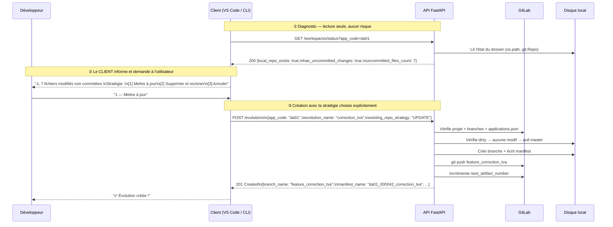
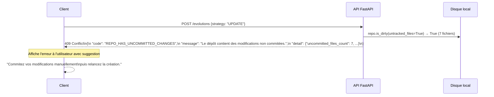
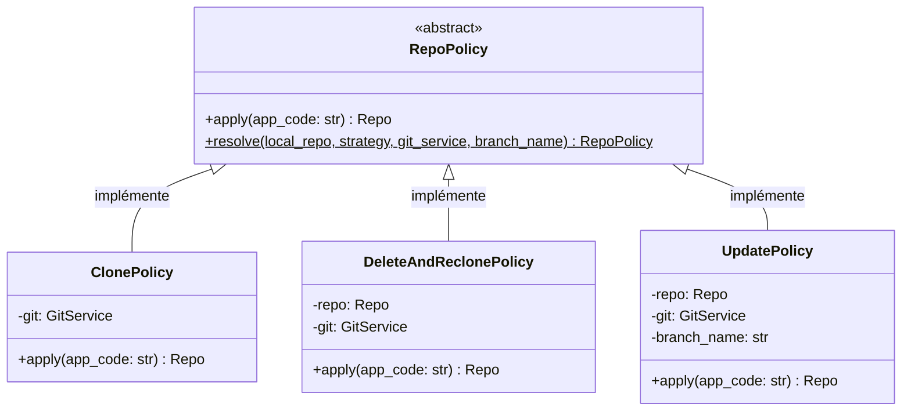

# Cas concret — `POST /api/v1/evolutions`

> Ce document applique les principes posés dans
> [Architecture générale](architecture-generale.md) au premier endpoint réel du projet :
> la **création d'une évolution**. Chaque règle de gestion de la spécification est passée
> au crible des bonnes pratiques REST, avec du vrai code FastAPI annoté.

---

## 1. Analyse des règles de gestion (RG-01 à RG-12)

La spécification originale définit 12 règles de gestion issues du plugin Eclipse. Voici
leur critique architecturale une par une.

### RG-01 — Validation du format du code application

**Spécification :** `app_code` doit respecter `^d[ay][a-z0-9]{2}$`.

✅ **Conforme** — C'est exactement le rôle de la couche Model (Pydantic). La validation
se fait **avant** que le router soit appelé, via un `@field_validator`.

```python
@field_validator("app_code")
@classmethod
def validate_app_code(cls, v: str) -> str:
    if not re.match(r"^d[ay][a-z0-9]{2}$", v):
        raise ValueError(v)   # Pydantic transforme en 422 automatiquement
    return v
```

---

### RG-02 — Validation du format du nom d'évolution

**Spécification :** `evolution_name` alphanumérique + `_`, sans espaces, sans préfixe
`feature`, longueur 1–100.

✅ **Conforme** — Même approche Pydantic. Les trois cas d'erreur (espaces, caractères
interdits, préfixe) sont distingués avec des codes machine différents, ce qui permet au
client de formuler un message précis à l'utilisateur.

---

### RG-03 — Vérification de l'existence dans GitLab

**Spécification :** `GET /api/v4/projects/<group>%2F<app_code>` — retourne 404 si absent.

✅ **Conforme** — Délégation propre à `GitLabService.get_project()`. Le 502 en cas
d'erreur réseau est sémantiquement juste (le problème vient de GitLab, pas de notre API).

---

### RG-04 — Vérification d'unicité de la branche

**Spécification :** liste les branches du dépôt et vérifie que `feature_<nom>` n'existe pas.

✅ **Conforme** — Retourner `409 Conflict` avec le code `EVOLUTION_ALREADY_EXISTS` est
la réponse REST correcte pour un conflit d'état.

---

### RG-05 — Vérification dans `applications.json`

**Spécification :** lecture du fichier de référence hébergé dans GitLab pour vérifier que
l'application est autorisée et récupérer le numéro d'artefact suivant.

✅ **Conforme** — Délégation à `GitLabService.get_applications_json()`. Le `404` avec
`APP_NOT_IN_REGISTRY` est précis et actionnable.

---

### RG-06 — Détermination de l'état du dépôt local

**Spécification :** vérifie si `<WORKSPACE_BASE_PATH>/<app_code>/` existe et contient un
dépôt Git valide.

✅ **Conforme** — Pure lecture de l'état du disque, sans modification. Branching propre
selon le résultat. Ce type de détection d'état est exactement ce que l'API doit faire avant
d'agir.

---

### RG-07 — Clone depuis GitLab (dépôt absent)

**Spécification :** clone le dépôt, configure l'auteur Git, installe le hook
`pre-commit`, crée et checkout la branche, écrit le manifest, commite, pousse.

✅ **Conforme** — Séquence bien définie avec des erreurs typées à chaque étape (`CLONE_FAILED`,
`COMMIT_FAILED`, `PUSH_FAILED`). L'URL de clone avec le token dans l'URL est la pratique
standard pour gitpython — **ne jamais loguer cette URL**.

---

### RG-07-HOOKS — Installation du hook de protection de `master`

**Spécification :** après le clone, créer `.git/hooks/pre-commit` avec un script qui
empêche tout commit direct sur `master`, puis le rendre exécutable (`chmod +x`).

✅ **Conforme** — C'est une bonne pratique Git. Le hook protège localement contre les
commits accidentels sur la branche principale pendant le développement. La création du
hook appartient à `GitService.install_master_hook()`, pas au service métier — c'est
une opération Git locale, pas une règle métier.

```bash
#!/bin/bash
set -euo pipefail
branch=$(git rev-parse --abbrev-ref HEAD)
if [ "$branch" = "master" ]; then
  echo "ERREUR : les commits directs sur master sont interdits."
  echo "Créez une branche feature_ pour vos modifications."
  exit 1
fi
```

!!! tip "Cohérence avec la gestion des droits GitLab"
    Ce hook local complète les protections de branche côté GitLab (branch protection rules).
    Les deux niveaux sont indépendants — l'un protège le dépôt local, l'autre le dépôt distant.

---

### RG-08a — Stratégie `DELETE_AND_RECREATE` (dépôt existant)

**Spécification :** `shutil.rmtree(répertoire)` puis clone.

!!! danger "⚠️ Règle problématique — Risque de perte de données"
    La spec ordonne de supprimer le dossier *sans vérifier* s'il contient des modifications
    non commitées. Si un développeur a du code en cours depuis 3 jours, non commité, non
    poussé : **il est perdu sans avertissement**.

**Correction recommandée :** avant toute suppression, vérifier l'état du dépôt.
Si des modifications existent, retourner un `409` informatif **au lieu de supprimer**.

```python
def handle_delete_and_recreate(
    self, repo: git.Repo, local_path: str, branch_name: str
) -> git.Repo:
    # Vérification de sécurité AVANT toute action destructive
    if repo.is_dirty(untracked_files=True):
        raise RepoHasUncommittedChangesError(
            code="REPO_HAS_UNCOMMITTED_CHANGES",
            message=(
                f"Le dépôt local '{local_path}' contient des modifications non commitées. "
                "La stratégie DELETE_AND_RECREATE les détruirait définitivement."
            ),
            detail=str(self._get_workspace_status(local_path)),
        )
    # Seulement si le dépôt est propre, on supprime et on reclone
    shutil.rmtree(local_path)
    return self.clone_repo(...)
```

!!! tip "Principe directeur"
    **L'API refuse d'être destructive par surprise.** Elle peut l'être si le client le
    demande en connaissance de cause (après avoir appelé `GET /workspaces/status` et affiché
    un avertissement à l'utilisateur).

---

### RG-08b — Stratégie `UPDATE` (dépôt existant)

**Spécification :** si le dépôt est "dirty" (modifié), commiter automatiquement toutes
les modifications avec le message *"Sauvegarde automatique avant création de l'évolution"*,
puis `git pull master`.

!!! warning "⚠️ Règle problématique — Auto-commit non consenti"
    L'auto-commit crée un commit **au nom du développeur**, avec un message qu'il n'a pas
    écrit, regroupant potentiellement des fichiers sans rapport entre eux. Le développeur
    découvrira ce commit plus tard dans son historique Git sans comprendre d'où il vient.
    Ce n'est pas une "sauvegarde" — c'est une modification du travail sans consentement.

**Correction recommandée :** si le dépôt est "dirty", retourner un `409` qui décrit la
situation. Le client affiche l'avertissement à l'utilisateur qui peut alors commiter
manuellement (avec son propre message) avant de relancer la création d'évolution.

```python
def handle_update(self, repo: git.Repo, branch_name: str) -> None:
    # Refus propre si des modifications existent
    if repo.is_dirty(untracked_files=True):
        raise RepoHasUncommittedChangesError(
            code="REPO_HAS_UNCOMMITTED_CHANGES",
            message=(
                "Le dépôt local contient des modifications non commitées. "
                "Commitez-les manuellement avant de créer une nouvelle évolution."
            ),
        )
    repo.git.checkout("master")
    try:
        repo.remotes.origin.pull("master")
    except git.GitCommandError as e:
        # Distinguer un conflit (état métier) d'une erreur réseau (erreur technique)
        if "conflict" in str(e).lower() or "merge" in str(e).lower():
            raise PullConflictError(
                code="PULL_CONFLICT",
                message="Des conflits empêchent la mise à jour de master.",
                detail=str(e),
            )
        raise PullFailedError(code="PULL_FAILED", message="Échec du pull.", detail=str(e))
```

---

### RG-09 — Écriture du fichier manifest

**Spécification :** crée `META-INF/<app_code>_<nom>.mf.json` avec le contenu défini.

✅ **Conforme** — Opération de fichier pure, bien isolée dans `GitService`.

!!! info "Note sur `dependancies`"
    Le champ s'appelle `dependancies` (avec une faute d'orthographe) par convention fossilisée
    du système de production LCL. **Ne pas corriger** — le schéma de production attend cette
    orthographe exacte.

---

### RG-10 — Commit initial du manifest

**Spécification :** `git add -A` + `git commit` avec message conventionnel.

✅ **Conforme** — Le message `feat: initialisation de l'évolution {branch_name}` respecte
la convention *Conventional Commits*.

---

### RG-11 — Push de la branche vers GitLab

**Spécification :** push avec vérification des flags `PushInfo`.

✅ **Conforme** — La vérification des flags (`ERROR`, `REJECTED`) est bonne pratique :
gitpython ne lève pas d'exception sur un push rejeté par défaut.

---

### RG-12 — Mise à jour de `applications.json`

**Spécification :** incrémente `next_artifact_number` dans GitLab via l'API PUT. Si
l'opération échoue, loguer en WARNING mais ne pas faire échouer la réponse.

!!! abstract "Rôle de `next_artifact_number`"
    Ce compteur n'est pas un simple identifiant d'affichage. Il sert à **tagger le load
    module** produit par Jenkins lors du build : chaque build estampille le load avec ce
    numéro, créant une **bijection stricte** entre un source (le manifest) et son load
    module en production. Cette traçabilité est indispensable pour les audits et la gestion
    des promotions.

**Décision 1 — Ne pas faire échouer la réponse sur erreur d'incrémentation**

✅ **Acceptable** — À ce stade du workflow, la branche et le manifest sont déjà créés et
poussés dans GitLab. L'incrémentation du compteur est la dernière opération, et son échec
ne remet pas en cause la création de l'évolution. Ce comportement est conservé à l'identique
du plugin Java existant.

Le `WARNING` dans les logs reste **obligatoire** — cette situation doit être visible des
équipes ops, car l'absence d'incrémentation signifie que le prochain numéro sera identique.

**Décision 2 — Race condition non corrigée en V1**

!!! danger "Risque connu — Rupture de bijection source ↔ load"
    Si deux développeurs créent simultanément une évolution pour la même application
    (`da42`, `dy03`…), ils lisent tous les deux le même `next_artifact_number` avant
    que l'un d'eux l'incrémente. Résultat : deux manifests distincts portent le même
    numéro d'artefact.

    Jenkins produit alors deux loads taggés avec le même numéro : **la bijection est
    cassée**. Il est impossible de savoir, a posteriori, quel source a produit quel load.

    **Probabilité réelle :** dans un contexte de 300 développeurs répartis en squads,
    plusieurs personnes travaillent sur la même application aux mêmes périodes (début de
    sprint, urgences). Ce scénario n'est pas théorique.

    Ce risque est **assumé en V1**. Voir [ADR-001](adr-001-next-artifact-number.md) pour
    l'analyse complète, le niveau de risque et les options de correction en V2.

---

## 2. Nouveau endpoint : `GET /api/v1/workspaces/status`

Ce endpoint est **essentiel à l'architecture** : il permet au client de connaître l'état
du workspace local **avant** de prendre une décision. Il est en lecture seule — il ne
modifie rien.

### Contrat complet

```
GET /api/v1/workspaces/status?app_code=da01
```

**Paramètre de requête :**

| Paramètre | Type | Obligatoire | Description |
|---|---|---|---|
| `app_code` | `str` | Oui | Code de l'application (ex: `da01`) |

**Réponse succès — `200 OK` :**

```json
{
  "app_code": "da01",
  "local_repo_path": "/home/dev/workspace/da01",
  "local_repo_exists": true,
  "is_valid_git_repo": true,
  "current_branch": "feature_ancienne_evolution",
  "has_uncommitted_changes": true,
  "uncommitted_files_count": 7,
  "last_commit_date": "2025-05-10T14:32:00Z",
  "last_commit_message": "feat: ajout calcul TVA partielle"
}
```

**Réponse si le dossier n'existe pas — `200 OK` :**

```json
{
  "app_code": "da01",
  "local_repo_path": "/home/dev/workspace/da01",
  "local_repo_exists": false,
  "is_valid_git_repo": false,
  "current_branch": null,
  "has_uncommitted_changes": false,
  "uncommitted_files_count": 0,
  "last_commit_date": null,
  "last_commit_message": null
}
```

!!! info "Pourquoi 200 et pas 404 quand le dossier n'existe pas ?"
    Ce endpoint rapporte l'*état* du workspace, pas l'existence d'une ressource. Un dossier
    absent est un état valide et attendu (cas nominal du premier clone). Retourner `404`
    ferait croire au client que le endpoint lui-même n'existe pas.

---

## 3. Workflow complet sans blocage

Voici le workflow recommandé en deux temps : diagnostic puis action.



### Scénario de conflit (UPDATE sur dépôt dirty)



---

## 4. Code FastAPI réel et annoté

### 4.1 Modèles Pydantic — `models/evolution.py`

```python
"""Modèles de données pour la gestion des évolutions.

Pydantic v2 valide automatiquement les données à la désérialisation.
Si une règle n'est pas respectée, FastAPI retourne 422 avant d'appeler le router.
"""

from __future__ import annotations

import re
from enum import Enum

from pydantic import BaseModel, Field, field_validator


class ComponentType(str, Enum):
    BATCH = "BATCH"
    TP = "TP"


class ExistingRepoStrategy(str, Enum):
    DELETE_AND_RECREATE = "DELETE_AND_RECREATE"
    UPDATE = "UPDATE"


class CreateEvolutionRequest(BaseModel):
    """Corps attendu pour POST /api/v1/evolutions."""

    app_code: str = Field(
        ...,
        description="Code application : 4 caractères commençant par 'da' ou 'dy'",
        examples=["da01", "dyab"],
    )
    evolution_name: str = Field(
        ...,
        min_length=1,
        max_length=100,
        description="Nom de l'évolution, sans préfixe 'feature_'",
        examples=["correction_calcul_tva"],
    )
    description: str = Field(..., min_length=1, description="Description libre")
    component_type: ComponentType
    existing_repo_strategy: ExistingRepoStrategy = ExistingRepoStrategy.UPDATE

    @field_validator("app_code")
    @classmethod
    def validate_app_code(cls, v: str) -> str:
        """Valide le format du code application avant tout appel réseau (RG-01)."""
        if not re.match(r"^d[ay][a-z0-9]{2}$", v):
            raise ValueError(
                f"Le code doit commencer par 'da'/'dy' + 2 car. alphanumériques. Reçu : '{v}'"
            )
        return v

    @field_validator("evolution_name")
    @classmethod
    def validate_evolution_name(cls, v: str) -> str:
        """Valide le nom d'évolution (RG-02)."""
        if " " in v:
            raise ValueError("Le nom ne doit pas contenir d'espace")
        if not re.match(r"^[a-zA-Z0-9_]+$", v):
            raise ValueError("Seuls les caractères alphanumériques et '_' sont autorisés")
        if v.startswith("feature"):
            raise ValueError("Le nom ne doit pas commencer par 'feature' (préfixe ajouté automatiquement)")
        return v


class CreateEvolutionResponse(BaseModel):
    """Corps retourné en cas de succès (201 Created)."""

    branch_name: str = Field(description="Nom complet de la branche créée")
    manifest_path: str = Field(description="Chemin relatif du manifest dans le dépôt")
    local_repo_path: str = Field(description="Chemin absolu du dépôt sur le serveur")
    manifest_name: str = Field(description="Identifiant unique de l'évolution")
    artifact_number: int = Field(description="Numéro d'artefact assigné")
    warnings: list[str] = Field(default_factory=list, description="Avertissements non bloquants")


class WorkspaceStatusResponse(BaseModel):
    """Corps retourné par GET /api/v1/workspaces/status."""

    app_code: str
    local_repo_path: str
    local_repo_exists: bool
    is_valid_git_repo: bool
    current_branch: str | None
    has_uncommitted_changes: bool
    uncommitted_files_count: int
    last_commit_date: str | None
    last_commit_message: str | None


class ErrorResponse(BaseModel):
    """Format uniforme pour toutes les réponses d'erreur."""

    code: str = Field(description="Code machine (ex: 'APP_NOT_FOUND')")
    message: str = Field(description="Message lisible par l'utilisateur")
    detail: str | dict | None = None
```

### 4.2 Exceptions métier — `exceptions.py`

```python
"""Hiérarchie d'exceptions métier.

Chaque exception est typée pour permettre un traitement précis dans l'exception handler
global (main.py). Le router et les services n'ont jamais besoin de connaître les codes
HTTP — c'est la responsabilité du handler.
"""


class ZDevOpsError(Exception):
    """Exception de base pour toutes les erreurs métier de l'API."""

    def __init__(self, code: str, message: str, detail: str | dict | None = None) -> None:
        self.code = code
        self.message = message
        self.detail = detail
        super().__init__(message)


# Erreurs de validation (→ 422)
class InvalidAppCodeError(ZDevOpsError): ...
class InvalidEvolutionNameError(ZDevOpsError): ...

# Erreurs "ressource introuvable" (→ 404)
class AppNotFoundInGitlabError(ZDevOpsError): ...
class AppNotInRegistryError(ZDevOpsError): ...

# Erreurs de conflit d'état (→ 409)
class EvolutionAlreadyExistsError(ZDevOpsError): ...
class RepoHasUncommittedChangesError(ZDevOpsError): ...
class PullConflictError(ZDevOpsError): ...

# Erreurs techniques internes (→ 500)
class CloneFailedError(ZDevOpsError): ...
class PullFailedError(ZDevOpsError): ...
class CommitFailedError(ZDevOpsError): ...
class PushFailedError(ZDevOpsError): ...

# Dépendances externes (→ 502)
class GitlabUnreachableError(ZDevOpsError): ...
```

### 4.3 Router — `routers/evolutions.py`

```python
"""Router FastAPI pour la gestion des évolutions.

Ce module est volontairement minimal : il ne contient aucune logique métier.
Son rôle se limite à :
  1. Recevoir la requête HTTP et valider le format via Pydantic (automatique)
  2. Appeler le service métier
  3. Retourner la réponse HTTP
"""

import logging

from fastapi import APIRouter, Depends

from zdevops_api.models.evolution import (
    CreateEvolutionRequest,
    CreateEvolutionResponse,
    WorkspaceStatusResponse,
)
from zdevops_api.services.evolution_service import EvolutionService, get_evolution_service
from zdevops_api.services.git_service import GitService, get_git_service

logger = logging.getLogger(__name__)

router = APIRouter(prefix="/api/v1", tags=["evolutions"])


@router.post(
    "/evolutions",
    status_code=201,          # 201 Created : une ressource a été créée
    response_model=CreateEvolutionResponse,
    summary="Créer une évolution",
    description=(
        "Crée une branche Git feature_ et son manifest dans le dépôt de l'application. "
        "Si le dépôt local existe déjà, le comportement est défini par `existing_repo_strategy`."
    ),
)
async def create_evolution(
    req: CreateEvolutionRequest,
    # FastAPI instancie EvolutionService via la chaîne de Depends définie dans
    # get_evolution_service — le router ne sait pas comment il est construit.
    service: EvolutionService = Depends(get_evolution_service),
) -> CreateEvolutionResponse:
    logger.info("Création de l'évolution '%s' pour l'application '%s'", req.evolution_name, req.app_code)
    return await service.create(req)


@router.get(
    "/workspaces/status",
    response_model=WorkspaceStatusResponse,
    summary="Vérifier l'état du workspace local",
    description=(
        "Retourne l'état du dépôt local pour une application donnée. "
        "Opération en lecture seule — ne modifie rien. "
        "À appeler avant POST /evolutions pour informer l'utilisateur."
    ),
)
async def get_workspace_status(
    app_code: str,
    git_service: GitService = Depends(get_git_service),
) -> WorkspaceStatusResponse:
    logger.info("Consultation du statut workspace pour '%s'", app_code)
    return git_service.get_workspace_status(app_code)
```

### 4.4 Service métier — `services/evolution_service.py`

!!! note "Refactoring possible"
    La gestion du dépôt local (le bloc `if/elif/else` en RG-06) peut être extraite via
    le **Policy Pattern** présenté en [section 6](#6-pour-aller-plus-loin-le-policy-pattern).
    Le code ci-dessous montre la version directe ; la section 6 montre comment la
    simplifier à deux lignes avec `RepoPolicy.resolve()`.

```python
"""Service métier pour la création d'évolutions.

Ce module contient toute la logique de création d'une évolution (RG-01 à RG-12).
Il est complètement indépendant de FastAPI : aucune référence à HTTPException,
Request, Response, etc. Cela le rend testable sans lancer de serveur HTTP.
"""

import logging
from typing import TYPE_CHECKING

from zdevops_api.exceptions import (
    AppNotInRegistryError,
    CloneFailedError,
    CommitFailedError,
    EvolutionAlreadyExistsError,
    PullConflictError,
    PushFailedError,
    RepoHasUncommittedChangesError,
)
from zdevops_api.models.evolution import (
    CreateEvolutionRequest,
    CreateEvolutionResponse,
    ExistingRepoStrategy,
)

if TYPE_CHECKING:
    from zdevops_api.services.git_service import GitService
    from zdevops_api.services.gitlab_service import GitLabService

logger = logging.getLogger(__name__)


class EvolutionService:
    """Orchestre la création d'une évolution (RG-01 à RG-12)."""

    def __init__(self, gitlab: "GitLabService", git: "GitService") -> None:
        # Injection des adapters — le service ne sait pas si ce sont des vrais
        # ou des mocks. C'est FastAPI (via Depends) qui décide.
        self.gitlab = gitlab
        self.git = git

    async def create(self, req: CreateEvolutionRequest) -> CreateEvolutionResponse:
        """Exécute le workflow complet de création d'une évolution.

        L'ordre des opérations est défini par la spécification (RG-01 à RG-12).
        Toute règle échouée lève une exception qui interrompt le traitement.
        L'exception handler global dans main.py la convertit en réponse HTTP.

        Args:
            req: Données validées de la requête (app_code, evolution_name, etc.).

        Returns:
            Réponse avec le nom de la branche, du manifest, et le numéro d'artefact.
        """
        branch_name = f"feature_{req.evolution_name}"

        # RG-03 : vérifier que le projet existe dans GitLab
        logger.info("[RG-03] Vérification du projet GitLab '%s'", req.app_code)
        await self.gitlab.assert_project_exists(req.app_code)

        # RG-04 : vérifier que la branche n'existe pas déjà
        logger.info("[RG-04] Vérification d'unicité de la branche '%s'", branch_name)
        branches = await self.gitlab.list_branches(req.app_code)
        if branch_name in branches:
            raise EvolutionAlreadyExistsError(
                code="EVOLUTION_ALREADY_EXISTS",
                message=f"L'évolution '{branch_name}' existe déjà dans le dépôt distant",
            )

        # RG-05 : lire applications.json et récupérer le numéro d'artefact
        logger.info("[RG-05] Lecture de applications.json")
        applications = await self.gitlab.get_applications_json()
        if req.app_code not in applications:
            raise AppNotInRegistryError(
                code="APP_NOT_IN_REGISTRY",
                message=f"Le code application '{req.app_code}' n'est pas référencé dans applications.json",
            )
        artifact_number = applications[req.app_code]["next_artifact_number"]

        # RG-06 : déterminer l'état du dépôt local
        logger.info("[RG-06] Vérification de l'état du dépôt local")
        local_repo = self.git.get_local_repo_if_exists(req.app_code)

        if local_repo is None:
            # Cas A — dépôt absent : clone nominal
            logger.info("[RG-07] Clone du dépôt (dépôt absent)")
            repo = await self.git.clone_repo(req.app_code)
        elif req.existing_repo_strategy == ExistingRepoStrategy.DELETE_AND_RECREATE:
            # Cas B1 — dépôt présent + stratégie DELETE
            # Vérification de sécurité AVANT toute action destructive (correction RG-08a)
            logger.info("[RG-08a] Stratégie DELETE_AND_RECREATE")
            if local_repo.is_dirty(untracked_files=True):
                raise RepoHasUncommittedChangesError(
                    code="REPO_HAS_UNCOMMITTED_CHANGES",
                    message=(
                        f"Le dépôt local '{req.app_code}' contient des modifications non commitées. "
                        "La stratégie DELETE_AND_RECREATE les détruirait définitivement."
                    ),
                    detail={"suggestion": "Appelez GET /api/v1/workspaces/status pour inspecter l'état."},
                )
            repo = await self.git.delete_and_reclone(req.app_code)
        else:
            # Cas B2 — dépôt présent + stratégie UPDATE (correction RG-08b)
            logger.info("[RG-08b] Stratégie UPDATE")
            if local_repo.is_dirty(untracked_files=True):
                # Refus propre : l'auto-commit silencieux est supprimé (cf. analyse RG-08b)
                raise RepoHasUncommittedChangesError(
                    code="REPO_HAS_UNCOMMITTED_CHANGES",
                    message=(
                        f"Le dépôt local '{req.app_code}' contient des modifications non commitées. "
                        "Commitez-les manuellement avant de créer une nouvelle évolution."
                    ),
                )
            repo = await self.git.update_and_checkout(local_repo, req.app_code, branch_name)

        # RG-09 : écrire le manifest
        logger.info("[RG-09] Écriture du manifest")
        application_type = "STD" if req.app_code.startswith("da") else "CRF"
        manifest_path = self.git.write_manifest(
            repo=repo,
            app_code=req.app_code,
            evolution_name=req.evolution_name,
            description=req.description,
            component_type=req.component_type,
            application_type=application_type,
            artifact_number=artifact_number,
        )

        # RG-10 : commit du manifest
        logger.info("[RG-10] Commit initial du manifest")
        self.git.commit_manifest(repo, branch_name)

        # RG-11 : push vers GitLab
        logger.info("[RG-11] Push de la branche '%s'", branch_name)
        self.git.push_branch(repo, branch_name)

        # RG-12 : incrémentation du compteur d'artefact (non bloquant en cas d'échec)
        warnings: list[str] = []
        try:
            logger.info("[RG-12] Incrémentation du compteur d'artefact pour '%s'", req.app_code)
            await self.gitlab.increment_artifact_number(applications, req.app_code, branch_name)
        except Exception as e:
            # Dégradation gracieuse : la branche et le manifest sont créés,
            # l'incrémentation du compteur est secondaire.
            warning_msg = f"Le compteur d'artefact n'a pas pu être mis à jour : {e}"
            logger.warning(warning_msg)
            warnings.append(warning_msg)

        manifest_name = f"{req.app_code}_{str(artifact_number).zfill(6)}_{req.evolution_name}"
        local_repo_path = self.git.get_local_path(req.app_code)

        return CreateEvolutionResponse(
            branch_name=branch_name,
            manifest_path=manifest_path,
            local_repo_path=local_repo_path,
            manifest_name=manifest_name,
            artifact_number=artifact_number,
            warnings=warnings,
        )


def get_evolution_service(
    gitlab: GitLabService = Depends(get_gitlab_service),
    git: GitService = Depends(get_git_service),
) -> EvolutionService:
    """Fabrique le service — appelée via Depends dans le router.

    Note : cette fonction utilise Depends de FastAPI. Pour garder le module
    service exempt de toute dépendance FastAPI, elle peut être déplacée dans
    un fichier dédié `dependencies.py`.
    """
    return EvolutionService(gitlab=gitlab, git=git)
```

### 4.5 Application et handler global — `main.py`

```python
"""Point d'entrée de l'API zDevOps.

Configure l'application FastAPI, enregistre les routers et les exception handlers.
"""

import logging

from fastapi import FastAPI, Request
from fastapi.responses import JSONResponse

from zdevops_api.exceptions import ZDevOpsError
from zdevops_api.models.evolution import ErrorResponse
from zdevops_api.routers import evolutions

logging.basicConfig(level=logging.INFO)

app = FastAPI(
    title="zDevOps API",
    version="1.0.0",
    description="API REST pour le workflow de développement mainframe LCL (remplaçant du plugin Eclipse IDz).",
)

app.include_router(evolutions.router)

# Correspondance code d'erreur métier → code HTTP
# Définie ici (couche HTTP) et non dans les services (couche métier).
_STATUS_MAP: dict[str, int] = {
    "INVALID_APP_CODE_FORMAT":      422,
    "INVALID_EVOLUTION_NAME_SPACES": 422,
    "INVALID_EVOLUTION_NAME_CHARS": 422,
    "INVALID_EVOLUTION_NAME_PREFIX": 422,
    "APP_NOT_FOUND_IN_GITLAB":      404,
    "APP_NOT_IN_REGISTRY":          404,
    "EVOLUTION_ALREADY_EXISTS":     409,
    "REPO_HAS_UNCOMMITTED_CHANGES": 409,
    "PULL_CONFLICT":                409,
    "CLONE_FAILED":                 500,
    "PULL_FAILED":                  500,
    "COMMIT_FAILED":                500,
    "PUSH_FAILED":                  500,
    "GITLAB_UNREACHABLE":           502,
}


@app.exception_handler(ZDevOpsError)
async def zdevops_handler(request: Request, exc: ZDevOpsError) -> JSONResponse:
    """Convertit toute exception métier en réponse HTTP JSON structurée.

    Ce handler unique remplace les blocs try/except dans chaque endpoint.
    Les services lèvent des exceptions typées ; ce handler les traduit en HTTP.
    """
    return JSONResponse(
        status_code=_STATUS_MAP.get(exc.code, 500),
        content=ErrorResponse(
            code=exc.code,
            message=exc.message,
            detail=exc.detail,
        ).model_dump(),
    )
```

---

## 5. Stratégie de tests

### 5.1 Tests unitaires — sans appel réseau

Les tests unitaires testent **le service métier en isolation**, avec des mocks à la
place des adapters réels. Le serveur HTTP n'est pas démarré.

```python
# tests/test_evolution_service.py
import pytest
from unittest.mock import AsyncMock, MagicMock

from zdevops_api.models.evolution import ComponentType, CreateEvolutionRequest, ExistingRepoStrategy
from zdevops_api.exceptions import EvolutionAlreadyExistsError, RepoHasUncommittedChangesError
from zdevops_api.services.evolution_service import EvolutionService


def make_request(**kwargs) -> CreateEvolutionRequest:
    """Fabrique un objet de requête valide avec des valeurs par défaut."""
    defaults = {
        "app_code": "da01",
        "evolution_name": "correction_tva",
        "description": "Correction TVA",
        "component_type": ComponentType.BATCH,
        "existing_repo_strategy": ExistingRepoStrategy.UPDATE,
    }
    return CreateEvolutionRequest(**(defaults | kwargs))


@pytest.fixture
def mock_gitlab():
    """Adapter GitLab factice — aucun appel réseau."""
    m = AsyncMock()
    m.list_branches.return_value = []                     # Aucune branche existante
    m.get_applications_json.return_value = {
        "da01": {"next_artifact_number": 42, "description": "App test"}
    }
    return m


@pytest.fixture
def mock_git():
    """Adapter Git factice — aucune écriture disque."""
    m = MagicMock()
    m.get_local_repo_if_exists.return_value = None        # Dépôt absent = clone
    m.write_manifest.return_value = "META-INF/da01_correction_tva.mf.json"
    m.get_local_path.return_value = "/workspace/da01"
    return m


@pytest.fixture
def service(mock_gitlab, mock_git) -> EvolutionService:
    return EvolutionService(gitlab=mock_gitlab, git=mock_git)


# ─── Tests nominaux ───────────────────────────────────────────────────────────

@pytest.mark.asyncio
async def test_create_evolution_nominal(service, mock_git):
    """Cas nominal : dépôt absent → clone + création de branche."""
    result = await service.create(make_request())

    assert result.branch_name == "feature_correction_tva"
    assert result.artifact_number == 42
    assert result.manifest_name == "da01_000042_correction_tva"
    mock_git.clone_repo.assert_called_once_with("da01")   # Le clone a bien été appelé


@pytest.mark.asyncio
async def test_manifest_name_zero_padding(service):
    """Le numéro d'artefact est formaté sur 6 chiffres (ex: 5 → 000005)."""
    result = await service.create(make_request())
    assert "000042" in result.manifest_name


# ─── Tests de conflits d'état (409) ───────────────────────────────────────────

@pytest.mark.asyncio
async def test_branch_already_exists_raises_409(service, mock_gitlab):
    """La branche existe déjà → 409 EVOLUTION_ALREADY_EXISTS."""
    mock_gitlab.list_branches.return_value = ["feature_correction_tva"]

    with pytest.raises(EvolutionAlreadyExistsError) as exc_info:
        await service.create(make_request())

    assert exc_info.value.code == "EVOLUTION_ALREADY_EXISTS"


@pytest.mark.asyncio
async def test_update_strategy_dirty_repo_raises_409(service, mock_git):
    """Stratégie UPDATE + dépôt sale → 409 REPO_HAS_UNCOMMITTED_CHANGES (plus d'auto-commit)."""
    dirty_repo = MagicMock()
    dirty_repo.is_dirty.return_value = True
    mock_git.get_local_repo_if_exists.return_value = dirty_repo

    with pytest.raises(RepoHasUncommittedChangesError) as exc_info:
        await service.create(make_request(existing_repo_strategy=ExistingRepoStrategy.UPDATE))

    assert exc_info.value.code == "REPO_HAS_UNCOMMITTED_CHANGES"
    # Vérifier que l'auto-commit n'a PAS été appelé (correction RG-08b)
    dirty_repo.git.add.assert_not_called()
    dirty_repo.index.commit.assert_not_called()


@pytest.mark.asyncio
async def test_delete_strategy_dirty_repo_raises_409(service, mock_git):
    """Stratégie DELETE + dépôt sale → 409 (protection contre la perte de données)."""
    dirty_repo = MagicMock()
    dirty_repo.is_dirty.return_value = True
    mock_git.get_local_repo_if_exists.return_value = dirty_repo

    with pytest.raises(RepoHasUncommittedChangesError):
        await service.create(make_request(existing_repo_strategy=ExistingRepoStrategy.DELETE_AND_RECREATE))

    # Vérifier que le rmtree n'a PAS été appelé (aucune suppression si dépôt sale)
    mock_git.delete_and_reclone.assert_not_called()


# ─── Tests de validation du format (422) ──────────────────────────────────────

def test_invalid_app_code_format():
    """Codes invalides → 422 via Pydantic, avant même d'appeler le service."""
    invalid_codes = ["abcd", "da", "da001", "da0!", "DA01", "dy0 1"]
    for code in invalid_codes:
        with pytest.raises(Exception):   # Pydantic ValidationError
            make_request(app_code=code)


def test_evolution_name_with_space():
    """Espace dans le nom d'évolution → refusé par Pydantic."""
    with pytest.raises(Exception):
        make_request(evolution_name="ma correction")


def test_evolution_name_with_feature_prefix():
    """Préfixe 'feature' dans le nom → refusé par Pydantic."""
    with pytest.raises(Exception):
        make_request(evolution_name="feature_tva")
```

### 5.2 Tableau des cas de tests obligatoires

| Catégorie | Test | Code HTTP attendu | Pourquoi ce test est important |
|---|---|---|---|
| **Format** | `app_code` invalide (`abcd`, `DA01`) | 422 | Première barrière de protection |
| **Format** | `evolution_name` avec espace | 422 | Évite les noms de branches Git invalides |
| **Format** | `evolution_name` avec préfixe `feature` | 422 | Double préfixe `feature_feature_` interdit |
| **Format** | Caractères spéciaux dans le nom (`-`, `!`) | 422 | Seuls `[a-zA-Z0-9_]` sont valides |
| **Métier** | Application absente de GitLab | 404 | Cas fréquent : erreur de frappe du code |
| **Métier** | Branche déjà existante | 409 | Évolution déjà en cours |
| **Métier** | Application absente de `applications.json` | 404 | Application non autorisée |
| **Sécurité** | UPDATE sur dépôt dirty → pas d'auto-commit | 409 | Correction comportement RG-08b |
| **Sécurité** | DELETE sur dépôt dirty → pas de suppression | 409 | Correction comportement RG-08a |
| **Sécurité** | UPDATE sur dépôt propre → fonctionne | 201 | Cas nominal UPDATE |
| **Données** | Numéro artefact = 5 → `manifest_name` contient `000005` | 201 | Zéro-padding sur 6 chiffres |
| **Données** | Code `da01` → `application_type` = `STD` | 201 | Déduction du type selon le préfixe |
| **Données** | Code `dy01` → `application_type` = `CRF` | 201 | Déduction du type selon le préfixe |
| **Hook** | Fichier `.git/hooks/pre-commit` créé et exécutable | — | Protection de master |
| **Résilience** | Échec RG-12 → avertissement dans `warnings`, pas d'échec | 201 | Dégradation gracieuse |

---

## 6. Pour aller plus loin — Le Policy Pattern

### 6.1 Le symptôme : un `if/elif/else` qui grossit

Dans le service (section 4.4), la gestion du dépôt local ressemble à ceci :

```python
if local_repo is None:
    repo = await self.git.clone_repo(req.app_code)
elif req.existing_repo_strategy == ExistingRepoStrategy.DELETE_AND_RECREATE:
    if local_repo.is_dirty(untracked_files=True):
        raise RepoHasUncommittedChangesError(...)
    repo = await self.git.delete_and_reclone(req.app_code)
else:
    if local_repo.is_dirty(untracked_files=True):
        raise RepoHasUncommittedChangesError(...)
    repo = await self.git.update_and_checkout(local_repo, req.app_code, branch_name)
```

Ce code fonctionne. Mais si on ajoute une troisième stratégie (`STASH_AND_UPDATE`,
`FORCE_RESET`…), le `elif` s'allonge, les gardes se dupliquent, et le service devient
difficile à lire et à tester en isolation.

C'est exactement le signal que le **Policy Pattern** s'applique.

!!! info "Qu'est-ce que le Policy Pattern ?"
    Le Policy Pattern (ou Strategy Pattern) consiste à **encapsuler chaque comportement
    variable dans une classe distincte** qui implémente une interface commune. Le code
    appelant ne sait pas quelle politique est active — il appelle simplement `policy.apply()`.
    Voir aussi : [Policy Pattern — documentation générale](../../developpement/python/patterns/policy-pattern.md)

### 6.2 Hiérarchie des politiques



La méthode de classe `resolve()` joue le rôle de **fabrique** : elle choisit la politique
appropriée selon l'état du dépôt et la stratégie demandée. C'est le seul endroit où la
logique de sélection est concentrée.

### 6.3 Code — `services/repo_policies.py`

```python
"""Politiques de gestion du dépôt local (Policy Pattern).

Chaque politique encapsule :
  - sa garde (vérification de sécurité avant d'agir)
  - son action (clone, suppression+reclone, ou pull)

Le service EvolutionService n'a plus de if/elif : il délègue à la politique
retournée par RepoPolicy.resolve().
"""

from __future__ import annotations

from abc import ABC, abstractmethod
from typing import TYPE_CHECKING

import git

from zdevops_api.exceptions import RepoHasUncommittedChangesError
from zdevops_api.models.evolution import ExistingRepoStrategy

if TYPE_CHECKING:
    from zdevops_api.services.git_service import GitService


class RepoPolicy(ABC):
    """Interface commune pour toutes les stratégies de gestion du dépôt local."""

    @abstractmethod
    async def apply(self, app_code: str) -> git.Repo:
        """Applique la politique et retourne le dépôt prêt pour la nouvelle branche."""
        ...

    @classmethod
    def resolve(
        cls,
        local_repo: git.Repo | None,
        strategy: ExistingRepoStrategy,
        git_service: GitService,
        branch_name: str,
    ) -> RepoPolicy:
        """Fabrique : sélectionne la politique appropriée selon l'état du dépôt.

        C'est ici que se concentre toute la logique de sélection — nulle part ailleurs.

        Args:
            local_repo: Le dépôt local s'il existe, None sinon.
            strategy: La stratégie demandée par le client.
            git_service: L'adapter Git injecté par le service parent.
            branch_name: Nom de la branche à créer (passé à UpdatePolicy qui en a besoin).

        Returns:
            L'instance de politique à appliquer.
        """
        if local_repo is None:
            return ClonePolicy(git_service)
        if strategy == ExistingRepoStrategy.DELETE_AND_RECREATE:
            return DeleteAndReclonePolicy(local_repo, git_service)
        return UpdatePolicy(local_repo, git_service, branch_name)


class ClonePolicy(RepoPolicy):
    """Politique nominale : le dépôt est absent, on clone depuis GitLab (RG-07)."""

    def __init__(self, git_service: GitService) -> None:
        self._git = git_service

    async def apply(self, app_code: str) -> git.Repo:
        return await self._git.clone_repo(app_code)


class DeleteAndReclonePolicy(RepoPolicy):
    """Politique DELETE_AND_RECREATE : supprime le dépôt et reclone (RG-08a corrigé).

    Garde de sécurité : refuse si le dépôt contient des modifications non commitées.
    """

    def __init__(self, repo: git.Repo, git_service: GitService) -> None:
        self._repo = repo
        self._git = git_service

    async def apply(self, app_code: str) -> git.Repo:
        # Garde obligatoire : toute suppression sur un dépôt sale est refusée
        if self._repo.is_dirty(untracked_files=True):
            raise RepoHasUncommittedChangesError(
                code="REPO_HAS_UNCOMMITTED_CHANGES",
                message=(
                    f"Le dépôt local '{app_code}' contient des modifications non commitées. "
                    "La stratégie DELETE_AND_RECREATE les détruirait définitivement."
                ),
                detail={"suggestion": "Appelez GET /api/v1/workspaces/status pour inspecter l'état."},
            )
        return await self._git.delete_and_reclone(app_code)


class UpdatePolicy(RepoPolicy):
    """Politique UPDATE : met à jour master et crée la branche (RG-08b corrigé).

    Garde de sécurité : refuse si le dépôt contient des modifications non commitées.
    L'auto-commit silencieux de la spec originale est supprimé.
    """

    def __init__(self, repo: git.Repo, git_service: GitService, branch_name: str) -> None:
        self._repo = repo
        self._git = git_service
        self._branch_name = branch_name  # nécessaire pour update_and_checkout

    async def apply(self, app_code: str) -> git.Repo:
        if self._repo.is_dirty(untracked_files=True):
            raise RepoHasUncommittedChangesError(
                code="REPO_HAS_UNCOMMITTED_CHANGES",
                message=(
                    f"Le dépôt local '{app_code}' contient des modifications non commitées. "
                    "Commitez-les manuellement avant de créer une nouvelle évolution."
                ),
            )
        return await self._git.update_and_checkout(self._repo, app_code, self._branch_name)
```

### 6.4 Impact sur le service — avant / après

=== "Avant (if/elif)"

    ```python
    # Dans EvolutionService.create() — logique de sélection mélangée au workflow
    local_repo = self.git.get_local_repo_if_exists(req.app_code)

    if local_repo is None:
        repo = await self.git.clone_repo(req.app_code)
    elif req.existing_repo_strategy == ExistingRepoStrategy.DELETE_AND_RECREATE:
        if local_repo.is_dirty(untracked_files=True):
            raise RepoHasUncommittedChangesError(...)
        repo = await self.git.delete_and_reclone(req.app_code)
    else:
        if local_repo.is_dirty(untracked_files=True):
            raise RepoHasUncommittedChangesError(...)
        repo = await self.git.update_and_checkout(local_repo, req.app_code, branch_name)
    ```

=== "Après (Policy Pattern)"

    ```python
    # Dans EvolutionService.create() — une seule ligne, intention claire
    local_repo = self.git.get_local_repo_if_exists(req.app_code)

    policy = RepoPolicy.resolve(local_repo, req.existing_repo_strategy, self.git)
    repo = await policy.apply(req.app_code)
    ```

Le service exprime **l'intention** (`resolve` + `apply`). Chaque politique gère sa propre
garde. Ajouter une nouvelle stratégie = écrire une nouvelle classe, sans toucher au service.

### 6.5 Impact sur les tests — isolation parfaite

Le Policy Pattern permet de tester chaque politique **complètement en dehors du service**,
sans avoir à simuler GitLab, les branches, ou `applications.json`.

```python
# tests/test_repo_policies.py
import pytest
from unittest.mock import AsyncMock, MagicMock

from zdevops_api.exceptions import RepoHasUncommittedChangesError
from zdevops_api.models.evolution import ExistingRepoStrategy
from zdevops_api.services.repo_policies import (
    ClonePolicy,
    DeleteAndReclonePolicy,
    RepoPolicy,
    UpdatePolicy,
)


@pytest.fixture
def clean_repo():
    repo = MagicMock()
    repo.is_dirty.return_value = False
    return repo


@pytest.fixture
def dirty_repo():
    repo = MagicMock()
    repo.is_dirty.return_value = True
    return repo


@pytest.fixture
def git_svc():
    return AsyncMock()


# ─── Tests de la fabrique resolve() ───────────────────────────────────────────

def test_resolve_returns_clone_when_no_local_repo(git_svc):
    """Aucun dépôt local → ClonePolicy, quelle que soit la stratégie."""
    policy = RepoPolicy.resolve(None, ExistingRepoStrategy.UPDATE, git_svc)
    assert isinstance(policy, ClonePolicy)


def test_resolve_returns_delete_policy(clean_repo, git_svc):
    policy = RepoPolicy.resolve(
        clean_repo, ExistingRepoStrategy.DELETE_AND_RECREATE, git_svc
    )
    assert isinstance(policy, DeleteAndReclonePolicy)


def test_resolve_returns_update_policy(clean_repo, git_svc):
    policy = RepoPolicy.resolve(clean_repo, ExistingRepoStrategy.UPDATE, git_svc)
    assert isinstance(policy, UpdatePolicy)


# ─── Tests de ClonePolicy ─────────────────────────────────────────────────────

@pytest.mark.asyncio
async def test_clone_policy_calls_clone(git_svc):
    await ClonePolicy(git_svc).apply("da01")
    git_svc.clone_repo.assert_called_once_with("da01")


# ─── Tests de DeleteAndReclonePolicy ──────────────────────────────────────────

@pytest.mark.asyncio
async def test_delete_policy_clean_repo_calls_reclone(clean_repo, git_svc):
    """Dépôt propre → la suppression est autorisée."""
    await DeleteAndReclonePolicy(clean_repo, git_svc).apply("da01")
    git_svc.delete_and_reclone.assert_called_once_with("da01")


@pytest.mark.asyncio
async def test_delete_policy_dirty_repo_raises(dirty_repo, git_svc):
    """Dépôt sale → refus sans supprimer (sécurité RG-08a)."""
    with pytest.raises(RepoHasUncommittedChangesError):
        await DeleteAndReclonePolicy(dirty_repo, git_svc).apply("da01")
    git_svc.delete_and_reclone.assert_not_called()


# ─── Tests de UpdatePolicy ────────────────────────────────────────────────────

@pytest.mark.asyncio
async def test_update_policy_clean_repo_calls_update(clean_repo, git_svc):
    """Dépôt propre → mise à jour autorisée."""
    await UpdatePolicy(clean_repo, git_svc).apply("da01")
    git_svc.update_and_checkout.assert_called_once()


@pytest.mark.asyncio
async def test_update_policy_dirty_repo_raises_no_autocommit(dirty_repo, git_svc):
    """Dépôt sale → refus sans auto-commit (correction RG-08b)."""
    with pytest.raises(RepoHasUncommittedChangesError):
        await UpdatePolicy(dirty_repo, git_svc).apply("da01")
    git_svc.update_and_checkout.assert_not_called()
```

!!! tip "Ce que le Policy Pattern apporte aux tests"
    Chaque test ne vérifie qu'**une seule chose** dans **un seul contexte**. Plus besoin
    de monter un service complet avec GitLab mocké pour tester si la garde dirty fonctionne.
    La politique est testée seule, comme une unité autonome.
