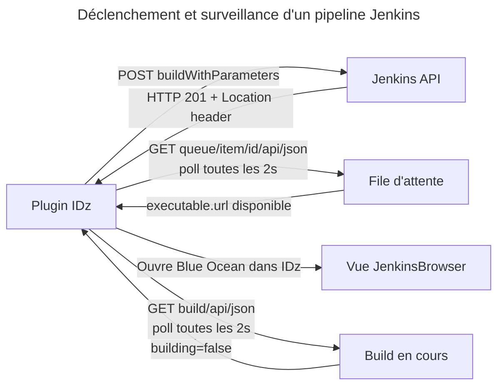

# Infrastructure Jenkins — FabCI

Le plugin IDz délègue **intégralement** la compilation, le déploiement et l'audit à des pipelines Jenkins FabCI (Fabrique CI/CD LCL). Cette page documente l'infrastructure, les pipelines, le protocole d'appel et les paramètres transmis.

---

## Principe de délégation

!!! danger "Le plugin ne compile pas"
    Le plugin IDz zDevOps ne contient **aucune logique de compilation COBOL, de déploiement ou d'analyse qualité**. Il se contente de :

    1. Préparer les paramètres (nom du manifest ou JSON du composant)
    2. Déclencher le pipeline Jenkins via l'API REST
    3. Surveiller la progression du job
    4. Afficher les logs dans la vue Blue Ocean intégrée à IDz

---

## Pipelines FabCI

| Fonction IDz | Pipeline Jenkins | Paramètre | Type |
|---|---|---|---|
| Builder (`Ctrl+0`) | `BuildAndPush` | `NomManifest` | Manifest complet |
| Déployer (`Ctrl+B`) | `ProxyCD` | `NomManifest` | Manifest complet |
| Audit (`Ctrl+6`) | `auditEtQualite` | `NomManifest` | Manifest complet |
| Promote Unitaire | `PromoteUnitaire` | `commande` | JSON composant |
| Clean Unitaire | `CleanUnitaire` | `commande` | JSON composant |

### Paramètre `NomManifest`

Nom du fichier `.mf.json` présent dans `META-INF/`, **sans l'extension**.

```text
Fichier : da01_correction_bug_42.mf.json
Paramètre envoyé : da01_correction_bug_42
```

### Paramètre `commande` (Promote / Clean Unitaire)

Objet JSON décrivant le composant à traiter :

```json
{
  "appName": "da01",
  "version": "20250401-001",
  "site": "DEV",
  "couloir": "STDA",
  "environment": "TU",
  "componentType": ["LOD", "BGB", "DBR"],
  "component": "MONPROG"
}
```

| Champ | Source | Exemple |
|---|---|---|
| `appName` | `application_code` du manifest | `da01` |
| `version` | `manifest_number` du manifest | `20250401-001` |
| `site` | `deploy.site.name` du toolchain | `DEV`, `DEVI` |
| `couloir` | Déduit de `application_type` | `STD`→`STDA`, `CRF`→`CRFA` |
| `environment` | Valeur fixe | Toujours `TU` |
| `componentType` | Répertoire du fichier | `src`→`["LOD","BGB","DBR"]` |
| `component` | Nom du fichier sans extension en majuscules | `MONPROG` |

**Correspondance répertoire → `componentType` :**

| Répertoire | `componentType` |
|---|---|
| `src` | `["LOD", "BGB", "DBR"]` |
| `srt` | `["LOT", "BGT", "DBR"]` |
| Tout autre | `["<REPERTOIRE_MAJ>"]` (ex. `["ASM"]`, `["SKL"]`) |

---

## Instances FabCI par toolchain

L'environnement cible est sélectionné dans `zdevops.ini` (`zdevops.toolchain=dev`).

| Toolchain | URL Jenkins (API) | URL Blue Ocean |
|---|---|---|
| `dev` | `https://fabci.ci.lcl.group.gca/api/json` | `https://fabci.ci.lcl.group.gca` |
| `rec` | `https://fabci-rct.ci.lcl.group.gca/api/json` | `https://fabci-rct.ci.lcl.group.gca` |
| `frm` | `https://formation.ci.lcl.group.gca/api/json` | `https://formation.ci.lcl.group.gca` |
| `prd` | `https://fabci-prd.ci.lcl.group.gca/api/json` | `https://fabci-prd.ci.lcl.group.gca` |

---

## Protocole d'appel REST Jenkins

Le plugin utilise le **client HTTP Java 11** (`java.net.http.HttpClient`) avec l'authentification **HTTP Basic Auth**.

### Authentification

```text
Authorization: Basic <Base64("<login_windows>@id.fr.cly:<token_jenkins>")>
```

Le login est déduit automatiquement de `System.getProperty("user.name")`.

### Séquence en 3 étapes



**Étape 1 — Déclenchement**

```text
POST <jenkins_url>/job/<pipeline>/buildWithParameters?<param>=<valeur>
→ HTTP 201
→ Header Location: <jenkins_url>/queue/item/<id>/
```

**Étape 2 — Attente du démarrage** (max 60 secondes / 30 tentatives)

```text
GET <queue_url>/api/json  (toutes les 2 secondes)
→ Attendre que "executable.url" soit présent dans la réponse
→ Récupérer l'URL du build : <jenkins_url>/job/<pipeline>/<num>/
```

**Étape 3 — Surveillance du build**

```text
GET <build_url>/api/json  (toutes les 2 secondes)
→ Surveiller le champ "building"
→ Quand building=false : build terminé
```

### Vue Blue Ocean intégrée

Dès le démarrage du build, la vue **Jenkins Browser** s'ouvre automatiquement dans IDz sur l'interface Blue Ocean :

```text
<jenkins_base>/blue/organizations/jenkins/<pipeline>/detail/<pipeline>/<num>/pipeline/
```

!!! note "Mode maximisé pour ProxyCD"
    Quand le pipeline est `ProxyCD` (déploiement), la vue Blue Ocean est affichée en **mode maximisé** automatiquement.

---

## Configuration par toolchain

Les noms des pipelines et URLs sont stockés dans les fichiers `.properties` embarqués dans le plugin :

```text
plugin/src/fr/lcl/zdevops/idz/plugin/config/
├── dev.properties
├── rec.properties
├── frm.properties
└── prd.properties
```

Extrait de `prd.properties` :

```properties
jenkins.url.base=https://fabci-prd.ci.lcl.group.gca/api/json
jenkins.pipeline.build=BuildAndPush
jenkins.pipeline.deploy=ProxyCD
jenkins.pipeline.audit.qualite=auditEtQualite
jenkins.pipeline.promote.unitaire=PromoteUnitaire
deploy.site.name=DEV
toolchain.name=prd
```

!!! warning "CleanUnitaire non configuré dans les properties"
    Le pipeline `CleanUnitaire` utilise la valeur `"CleanUnitaire"` codée en dur dans le handler Java (`DeployHandler`), pas dans les fichiers `.properties`.
