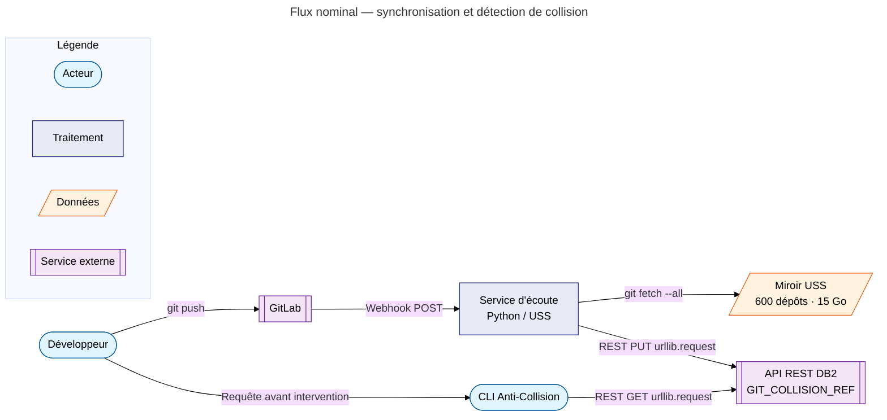
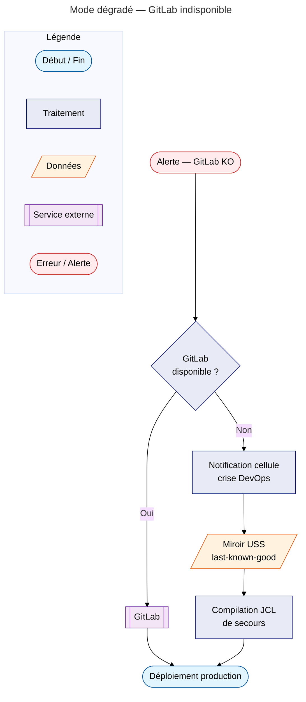
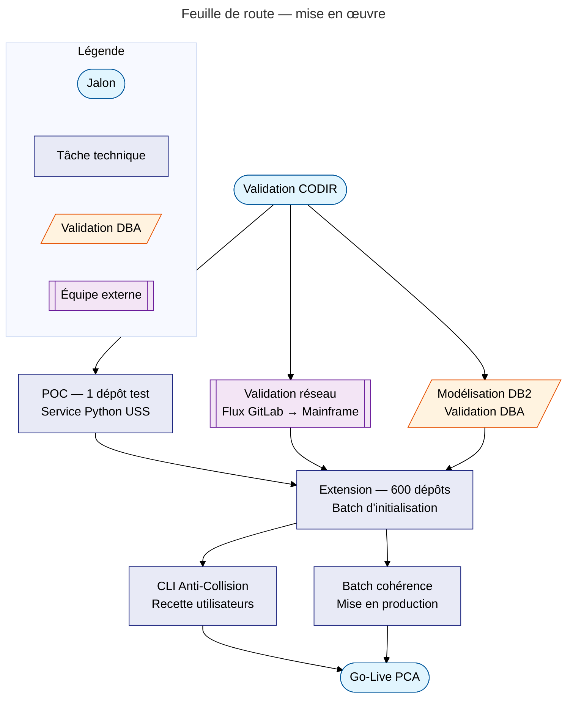

# PCA & Gouvernance du Patrimoine Git-Mainframe

> Dossier d'Analyse Technique et Fonctionnelle destiné à l'équipe support pour validation de la faisabilité et chiffrage en vue du CODIR.

---

## 1. Contexte et Enjeux

L'entreprise gère ses sources Mainframe (COBOL, Java, Python, Node.js) via GitLab. La chaîne CI/CD repose entièrement sur la disponibilité de cette forge logicielle.

**Risque identifié :** une indisponibilité prolongée de GitLab paralyserait toute capacité de correction urgente ou de déploiement en production.

**Objectifs du projet :**

| # | Objectif | Description |
|---|----------|-------------|
| 1 | **Résilience** | Miroir local du patrimoine (~15 Go, ~600 dépôts) sur z/OS USS |
| 2 | **Gouvernance** | Détection en temps réel des collisions de développement |
| 3 | **Hétérogénéité** | Support du COBOL et des langages de modernisation |

!!! warning "Périmètre du document"
    La partie « procédures de compilation dégradées » (JCL et scripts de build en mode secours) est traitée en section 6 sous forme de cadre. Un volet technique détaillé sera produit séparément par l'équipe infrastructure Mainframe.

---

## 2. Architecture de la Solution

### 2.1. Flux nominal



### 2.2. Mode dégradé (PCA)



---

## 3. Composants Principaux

### 3.1. Le Miroir USS (Shadow Repository)

Le miroir est hébergé sur le système de fichiers **USS (Unix System Services)** du Mainframe.

| Attribut | Valeur |
|----------|--------|
| Volume estimé | ~15 Go |
| Nombre de dépôts | ~600 |
| Granularité | Groupe principal + sous-groupes GitLab |
| Synchronisation | Webhook GitLab → `git fetch --all --prune` |
| Disponibilité PCA | Accès direct depuis TSO/USS en cas de coupure GitLab |

**Mécanisme de synchronisation (extrait illustratif) :**

!!! info "Contrainte d'environnement"
    Le service Python s'appuie exclusivement sur la **bibliothèque standard** (stdlib). Aucun paquet externe (`flask`, `requests`, `gitpython`, `ibm_db`…) n'est installé sur USS. L'accès à DB2 se fait via son **API REST HTTP** native, appelée avec `urllib.request`.

```python
from http.server import BaseHTTPRequestHandler, HTTPServer
from urllib.request import urlopen, Request
import json, subprocess, os, ssl

MIRRORS_ROOT  = "/u/gitops/mirrors"
DB2_REST_URL  = "https://db2-api.mainframe.local/v1/gitops/collision"
GITLAB_SECRET = os.environ["GITLAB_WEBHOOK_SECRET"]

class WebhookHandler(BaseHTTPRequestHandler):
    def do_POST(self):
        if self.headers.get("X-Gitlab-Token") != GITLAB_SECRET:
            self.send_response(403); self.end_headers(); return
        length  = int(self.headers.get("Content-Length", 0))
        payload = json.loads(self.rfile.read(length))
        repo_path  = payload["project"]["path_with_namespace"]
        local_path = os.path.join(MIRRORS_ROOT, repo_path)
        subprocess.run(
            ["git", "-C", local_path, "fetch", "--all", "--prune"],
            check=True
        )
        _index_delta(payload)
        self.send_response(204); self.end_headers()

def _index_delta(payload):
    data = json.dumps({
        "repo":    payload["project"]["path_with_namespace"],
        "branch":  payload["ref"].removeprefix("refs/heads/"),
        "user_id": payload["user_username"],
        "commits": payload.get("commits", []),
    }).encode()
    req = Request(DB2_REST_URL, data=data, method="PUT")
    req.add_header("Content-Type", "application/json")
    req.add_header("Authorization", f"Bearer {os.environ['DB2_API_TOKEN']}")
    ctx = ssl.create_default_context()
    with urlopen(req, context=ctx):
        pass
```

!!! info "Initialisation des miroirs"
    Le premier clonage de chaque dépôt doit être réalisé manuellement via `git clone --mirror` ou via un script batch d'initialisation, **avant** la mise en production du service webhook.

### 3.2. L'Indexeur de Métadonnées (DB2 for z/OS)

Une table **DB2** centralise l'état du parc multi-dépôts, compensant l'absence de vision transverse native dans Git.

**Choix de DB2 vs SQLite :**

| Critère | DB2 for z/OS | SQLite |
|---------|-------------|--------|
| Accessibilité | TSO, SPUFI, Python, API REST | Python uniquement |
| Sécurité | RACF natif | Permissions fichier Unix |
| Robustesse | ACID avec journalisation IBM | ACID, sans journal dédié |
| Intégration Python | API REST HTTP — `urllib.request` (stdlib) | Module `sqlite3` standard |

---

## 4. Architecture Technique

### 4.1. Schéma de données DB2

```sql
CREATE TABLE GIT_COLLISION_REF (
    OBJ_NAME     VARCHAR(255)  NOT NULL,   -- Nom du membre/fichier
    OBJ_TYPE     VARCHAR(20)   NOT NULL,   -- COBOL, JAVA, PY, SH, YAML, etc.
    REPO_NAME    VARCHAR(128)  NOT NULL,   -- Dépôt Git d'origine
    BRANCH_NAME  VARCHAR(128)  NOT NULL,   -- Branche (main, feature/*, fix/*)
    FILE_PATH    VARCHAR(1024),            -- Chemin complet USS
    LAST_COMMIT  CHAR(40),                 -- SHA-1 du dernier commit indexé
    LAST_UPDATE  TIMESTAMP     NOT NULL,   -- Horodatage du dernier push
    USER_ID      VARCHAR(8)    NOT NULL,   -- ID RACF de l'auteur du commit
    PRIMARY KEY (OBJ_NAME, REPO_NAME, BRANCH_NAME)
) IN DB_NAME.TS_NAME;

-- Recherche par nom d'objet seul (cas d'usage principal : anti-collision)
CREATE INDEX GIT_COLL_IDX1
    ON GIT_COLLISION_REF (OBJ_NAME ASC);

-- Recherche par développeur pour audit et tableau de bord
CREATE INDEX GIT_COLL_IDX2
    ON GIT_COLLISION_REF (USER_ID ASC, LAST_UPDATE DESC);
```

!!! tip "Évolutions par rapport au schéma initial"
    - `OBJ_TYPE NOT NULL` — renforce l'intégrité de la donnée.
    - `LAST_COMMIT CHAR(40)` — évite les ré-indexations inutiles : si le SHA est inchangé, la mise à jour DB2 est ignorée.
    - Deux index secondaires dimensionnés sur les requêtes les plus fréquentes.

### 4.2. Requête Anti-Collision (exemple)

La CLI interroge l'API REST DB2 via `urllib.request` (stdlib) :

```python
from urllib.request import urlopen, Request
from urllib.parse import urlencode
import json, ssl, os

DB2_REST_URL = "https://db2-api.mainframe.local/v1/gitops/collision"

def check_collision(obj_name: str) -> None:
    params = urlencode({"obj_name": obj_name, "exclude_branch": "main"})
    req = Request(f"{DB2_REST_URL}?{params}")
    req.add_header("Authorization", f"Bearer {os.environ['DB2_API_TOKEN']}")
    ctx = ssl.create_default_context()
    with urlopen(req, context=ctx) as resp:
        rows = json.loads(resp.read())
    if not rows:
        print(f"{obj_name} : aucune collision détectée.")
        return
    for row in rows:
        print(f"  {row['REPO_NAME']} / {row['BRANCH_NAME']}"
              f"  — {row['USER_ID']} ({row['LAST_UPDATE']})")
```

Résultat attendu : liste de toutes les branches de développement actives pour ce composant, avec l'identifiant du développeur concerné et la date de dernière modification.

Le SQL sous-jacent reste inchangé — il est exécuté côté API REST DB2 :

```sql
SELECT REPO_NAME, BRANCH_NAME, USER_ID, LAST_UPDATE
FROM   GIT_COLLISION_REF
WHERE  OBJ_NAME    = :obj_name
  AND  BRANCH_NAME <> :exclude_branch
ORDER  BY LAST_UPDATE DESC;
```

### 4.3. Types de sources supportés

L'inventaire est exhaustif et ne se limite pas au COBOL :

| Catégorie | Extensions indexées |
|-----------|-------------------|
| **Legacy** | `.cbl`, `.cob`, `.cpy` (COBOL, Copybooks) |
| **Modernisation batch/web** | `.java`, `.py`, `.js`, `.ts` |
| **Infrastructure** | `.sh`, `.jcl` |
| **Intégration z/OS Connect** | `.yaml`, `.json` |

### 4.4. Service d'écoute Python — déploiement sur USS

**Aucune dépendance externe.** Le service n'utilise que la bibliothèque standard Python :

| Module stdlib | Rôle |
|--------------|------|
| `http.server` | Serveur HTTP pour recevoir les webhooks GitLab |
| `urllib.request` | Appels REST vers l'API DB2 et l'API GitLab |
| `subprocess` | Exécution des commandes `git` |
| `json` | Sérialisation / désérialisation des payloads |
| `ssl` | Connexions HTTPS (mTLS vers l'API DB2) |

**Script de démarrage (`start.sh`) :**

```bash
#!/bin/sh
export PYTHONPATH=/u/gitops/src
nohup python3 /u/gitops/src/webhook_listener.py \
    --port 8443 \
    --ssl-cert /u/gitops/tls/server.crt \
    --ssl-key  /u/gitops/tls/server.key \
    >> /var/log/gitops/webhook.log 2>&1 &
echo $! > /var/run/gitops/webhook.pid
```

!!! warning "Ouverture de flux réseau"
    GitLab doit pouvoir contacter le Mainframe (USS) sur le port d'écoute (ex. 8443). Cette ouverture de flux doit être validée par l'équipe réseau **avant le POC** et formalisée dans le dossier de sécurité.

---

## 5. Sécurité et Exploitation

### 5.1. Authentification et contrôle d'accès

| Composant | Mécanisme |
|-----------|-----------|
| CLI/TUI Anti-Collision | Authentification RACF (identifiant courant de la session TSO) |
| API REST d'interrogation | Token RACF + HTTPS mutuel (mTLS) |
| Service Webhook | Validation du secret GitLab (`X-Gitlab-Token`) + mTLS |
| Accès DB2 | Plan d'accès RACF par profil `DB2.*` dédié |

### 5.2. Volumes et capacité

| Ressource | Estimation |
|-----------|------------|
| Miroir USS (sources) | ~15 Go (600 dépôts) |
| Table DB2 (index) | < 500 Mo (quelques millions de lignes) |
| Logs webhook | ~100 Mo/mois (rotation hebdomadaire recommandée) |

### 5.3. Batch nocturne de cohérence

Un job JCL s'exécute quotidiennement pour :

1. Comparer la liste des dépôts du miroir USS avec l'API GitLab Groups.
2. Détecter les dépôts manquants ou désynchronisés (`HEAD` USS ≠ `HEAD` GitLab).
3. Déclencher un `git fetch --all` correctif sur les écarts détectés.
4. Vérifier la cohérence entre la table DB2 et les branches effectivement présentes dans le miroir.
5. Émettre un rapport de cohérence par e-mail ou notification SIEM.

```jcl
//GITBATCH  JOB (ACCT),'GIT COHERENCE CHECK',CLASS=A,MSGCLASS=X
//STEP010   EXEC PGM=BPXBATCH
//STDOUT    DD SYSOUT=*
//STDERR    DD SYSOUT=*
//STD       DD *
sh /u/gitops/bin/coherence_check.sh
/*
```

---

## 6. Procédures de Compilation Dégradées (PCA)

!!! warning "Section à compléter"
    Ce volet est en cours de rédaction par l'équipe JCL/Build. La présente section en pose le cadre fonctionnel.

### 6.1. Principes généraux

En mode dégradé (GitLab indisponible), les sources de référence sont celles du miroir USS. La chaîne de compilation s'appuie exclusivement sur des ressources locales Mainframe.

**Règles :**

- Le miroir USS est en **lecture seule** — aucune modification directe n'est autorisée.
- Toute correction urgente est appliquée sur une copie de travail locale, puis validée dans GitLab dès son retour en ligne.
- Chaque build en mode dégradé est tracé : un fichier `BUILD_PCA_<AAAAMMJJ>.log` est déposé dans `/u/gitops/pca_logs/`.

### 6.2. JCL de compilation de secours (modèle COBOL)

```jcl
//PCABUILD  JOB (ACCT),'PCA COBOL BUILD',CLASS=A,MSGCLASS=X
//STEP010   EXEC IGYWCL,
//          PARM.COBOL='LIB,APOST,RENT,NODYNAM'
//COBOL.SYSIN  DD PATH='/u/gitops/mirrors/MYGROUP/MYREPO/src/CBL001.cbl',
//             PATHOPTS=(ORDONLY)
//LKED.SYSLMOD DD DSN=SYS3.LOAD(CBL001),DISP=SHR
//
```

!!! info "Note"
    Ce modèle est à adapter selon les procédures cataloguées en place. Les paramètres `IGYWCL`, les bibliothèques système et les DSN de sortie sont à valider avec l'équipe infrastructure Mainframe.

---

## 7. Bénéfices pour le CODIR

| Axe | Bénéfice |
|-----|---------|
| **Résilience** | Déploiement possible 24h/24, même en cas d'indisponibilité de GitLab |
| **Productivité** | Élimination des écrasements accidentels grâce à la visibilité transverse des branches |
| **Traçabilité** | Audit complet des interventions (qui, quoi, quand) via DB2 et RACF |
| **Modernisation** | Gouvernance unifiée COBOL + langages open source sous un même outil |
| **Conformité** | Alignement avec les exigences de continuité d'activité (DORA, PCI-DSS si applicable) |

---

## 8. Feuille de Route



---

*Document maintenu par l'équipe zDevOps — dernière mise à jour : avril 2026.*
