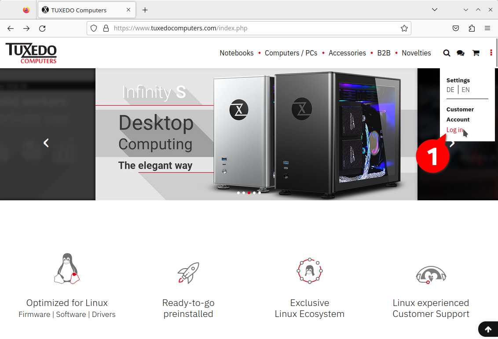
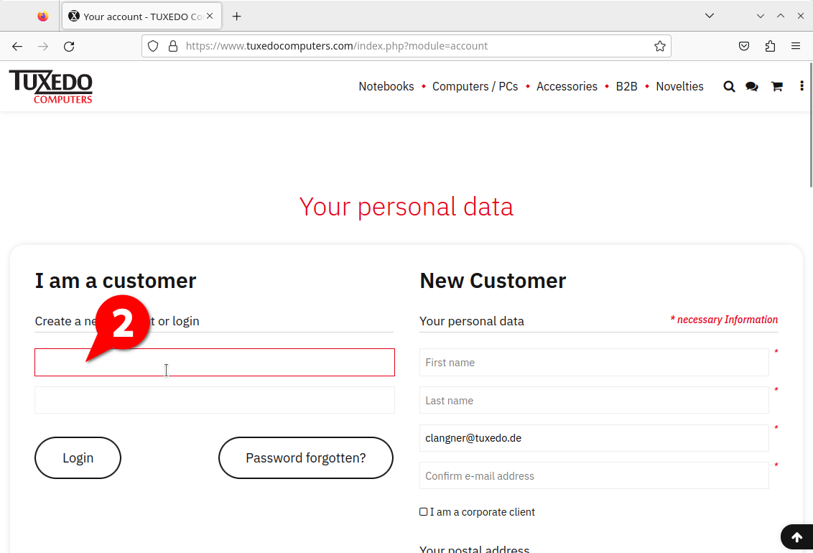
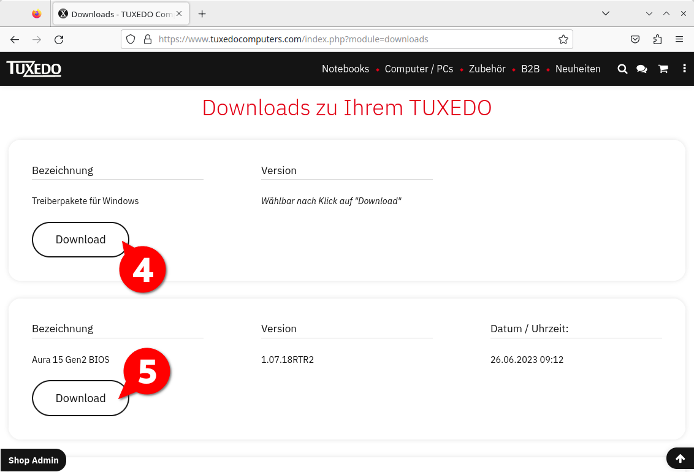
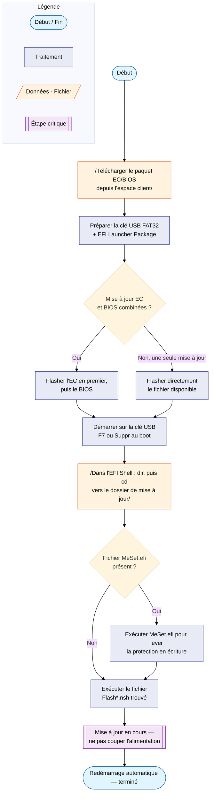
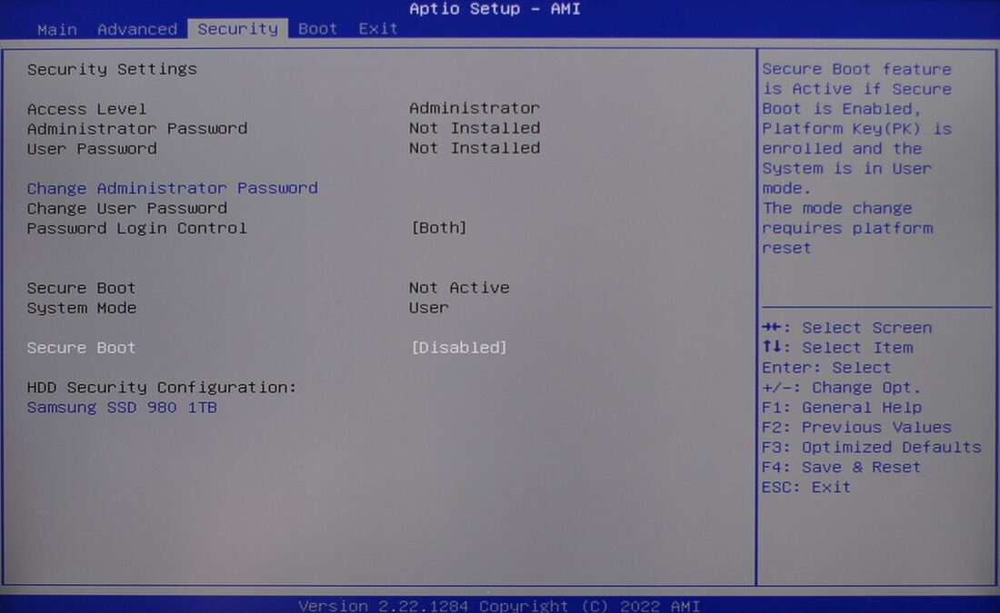
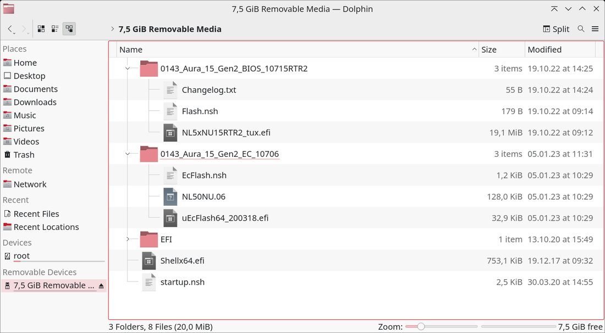
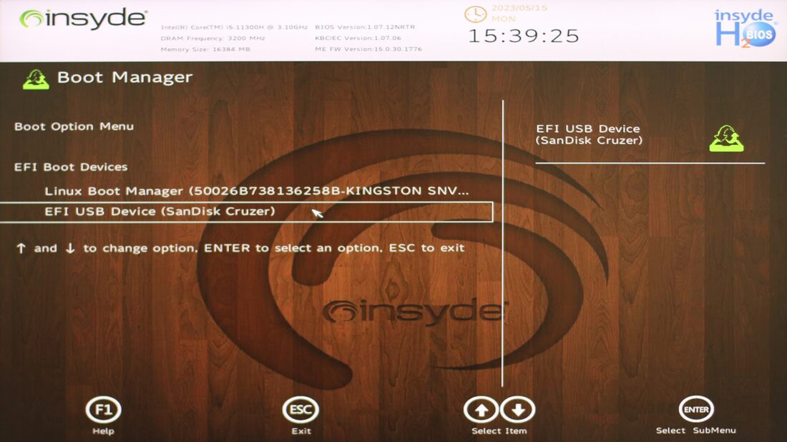
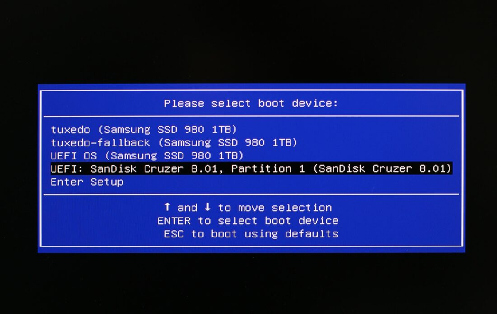
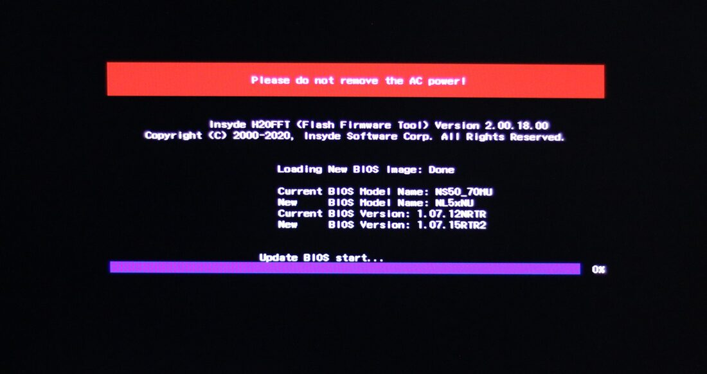
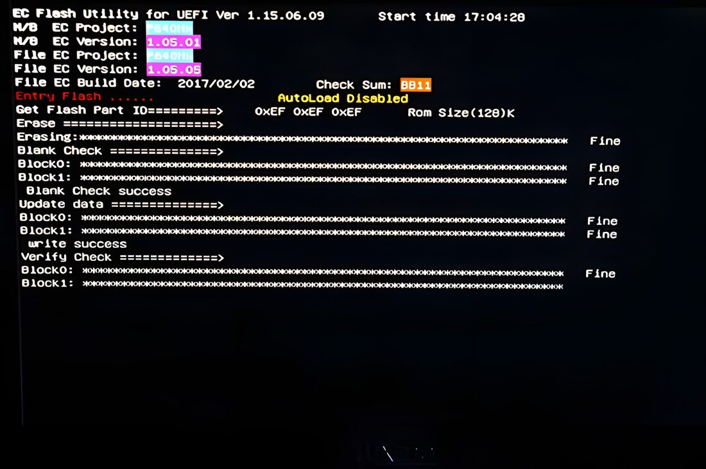

# Mise à jour du BIOS/UEFI et de l'EC (TUXEDO)

!!! info "Prérequis"
    - Une clé USB vide, formatée en FAT32 (partition de 32 Go maximum).
    - Un compte client sur le site TUXEDO, pour télécharger le bon paquet
      de mise à jour pour le modèle exact de la machine — voir
      [Où trouver les mises à jour ?](#ou-trouver-les-mises-a-jour-acceder-aux-fichiers-depuis-le-compte-client).
    - Le secteur connecté (pas un simple chargeur USB-C) et la batterie
      chargée à au moins 30 %.
    - Voir aussi la page [Matériel](materiel.md) pour le détail de la
      configuration concernée (TUXEDO InfinityBook Pro 14 — Gen10 AMD).

Procédure officielle TUXEDO pour mettre à jour le BIOS/UEFI et l'EC
(*Embedded Controller*) d'un ordinateur portable TUXEDO, traduite et
clarifiée à partir de la documentation constructeur.

## EC et BIOS, de quoi parle-t-on ?

| Composant | Rôle |
|---|---|
| **EC** (*Embedded Controller*) | Micro-contrôleur indépendant du CPU, responsable des tâches de bas niveau : clavier, charge de la batterie, gestion des ventilateurs. TUXEDO l'optimise pour assurer la compatibilité avec ses pilotes et le TUXEDO Control Center. |
| **BIOS/UEFI** | Micrologiciel (*firmware*) lancé au démarrage pour initialiser le matériel, avant le chargement du système d'exploitation. Aujourd'hui désigné UEFI (*Unified Extensible Firmware Interface*), mais encore couramment appelé « BIOS » par habitude. |

Une mise à jour de l'un ou l'autre peut être nécessaire pour corriger un
bug ou améliorer la compatibilité matérielle. La procédure de mise à jour
est quasiment identique pour les deux composants.

## Où trouver les mises à jour ? Accéder aux fichiers depuis le compte client

Si la machine tourne sous TUXEDO OS, aucun pilote n'a besoin d'être installé
séparément. En revanche, pour une mise à jour du BIOS/EC — ou pour installer
Windows par la suite — tous les téléchargements correspondant aux appareils
achetés se trouvent dans l'espace client TUXEDO.

Traduction du guide officiel
[BIOS files in your customer account](https://www.tuxedocomputers.com/en/Infos/Help-Support/Instructions/BIOS-files-in-your-customer-account.tuxedo).

1. Se connecter à son compte client depuis la page d'accueil TUXEDO.

    

    *En tant que client, un compte existe généralement déjà.*

    

2. Une fois connecté, cliquer sur les trois points verticaux dans la barre
   de menu supérieure du site pour ouvrir le menu utilisateur, puis
   sélectionner **Downloads** (Téléchargements) — cette rubrique liste les
   commandes, les offres en cours et les téléchargements correspondant aux
   appareils achetés chez TUXEDO Computers.

    

    *Après connexion, rouvrir le menu et aller dans Téléchargements.*

3. La liste de tous les téléchargements correspondant aux achats effectués
   s'affiche. Cliquer sur **Download** pour récupérer le pilote ou le
   fichier BIOS/EC concerné sous forme d'archive ZIP.

    

    *En fonction des achats précédents, les mises à jour BIOS et pilotes
    correspondants apparaissent ici.*

4. Extraire l'archive ZIP puis suivre la procédure de mise à jour du BIOS
   décrite plus bas sur cette page.

!!! note "Achat non effectué directement chez TUXEDO"
    Si l'appareil n'a pas été acheté directement auprès de TUXEDO, il faut
    d'abord créer un compte, puis envoyer un e-mail au support pour
    demander l'accès aux téléchargements — l'équipe support recontacte
    ensuite pour récupérer les informations nécessaires.

!!! tip "Autre source d'information"
    TUXEDO communique aussi sur les nouvelles versions disponibles via sa
    newsletter.

## Vue d'ensemble de la procédure



## Avant de commencer

!!! danger "Points de vigilance impératifs"
    - **Aucune garantie en cas d'échec.** Une mise à jour EC/BIOS ratée
      n'est pas couverte par la garantie constructeur — suivre chaque
      étape précisément.
    - **Vérifier que les fichiers correspondent exactement au modèle.**
      Des fichiers incorrects peuvent endommager la machine de façon
      permanente.
    - **Contrôler le contenu du dossier téléchargé.** Des fichiers comme
      `README.txt` ou `LIESMICH.txt` doivent être lus s'ils sont présents.
    - **Brancher l'alimentation secteur** (pas un chargeur USB-C
      générique) et s'assurer que la batterie est chargée à au moins
      30 % — une coupure de courant pendant la mise à jour peut
      endommager l'appareil.
    - **Réinitialiser le BIOS à ses valeurs par défaut** avant la mise à
      jour et vérifier que **Secure Boot** est désactivé. Après la mise à
      jour, revérifier l'état de Secure Boot : s'il a été réactivé
      automatiquement et qu'aucun shim signé n'est utilisé, le désactiver
      à nouveau — sinon TUXEDO OS refusera de redémarrer. Si l'option
      Secure Boot disparaît temporairement après la mise à jour, éteindre
      complètement la machine puis la redémarrer : l'option redevient
      visible.

!!! tip "Clavier en QWERTY pendant la procédure"
    Pendant toute la procédure de mise à jour (BIOS, EFI Shell), le
    clavier utilisé est en disposition **anglaise QWERTY**, et non
    AZERTY : les touches **Y** et **Z** sont inversées.



*Après une remise aux valeurs par défaut de l'UEFI, l'option **Secure
Boot** peut nécessiter d'être désactivée à nouveau.*

## Étape 1 — Télécharger la mise à jour

Dans l'espace client TUXEDO, section *Downloads for your TUXEDO*,
télécharger le paquet EC/BIOS correspondant exactement au modèle de la
machine, puis extraire son contenu sur une clé USB vide, **formatée en
FAT32** (partition de 32 Go maximum).

Si une mise à jour EC et une mise à jour BIOS/UEFI sont toutes deux
disponibles, les deux peuvent être extraites sur la même clé.

## Étape 2 — Préparer la clé USB

Copier le contenu des archives extraites sur la clé USB, puis télécharger
le **EFI Launcher Package** et l'extraire également sur la clé. La
structure de dossiers attendue est la suivante :

| Élément | Description |
|---|---|
| `XXX` (un ou deux dossiers) | Nommés d'après les fichiers téléchargés (EC, BIOS) |
| `EFI/` | Issu de l'archive `EFI-launcher.zip` |
| `Shellx64.efi` | Issu de l'archive `EFI-launcher.zip` |
| `startup.nsh` | Issu de l'archive `EFI-launcher.zip` |



*Copier le contenu des archives extraites sur une clé USB formatée en
FAT32.*

!!! warning "Mises à jour combinées EC + BIOS"
    Sur certains modèles, une mise à jour combinée impose un **ordre
    précis** : l'EC doit être mis à jour avant le BIOS. Sur les modèles
    plus anciens, vérifier qu'au moins un fichier `.nsh` est présent dans
    chaque dossier de mise à jour téléchargé — son absence indique qu'une
    étape de préparation manuelle est nécessaire (voir l'espace client ou
    le support TUXEDO).

## Étape 3 — Démarrer sur la clé USB

S'assurer que la machine est branchée sur son adaptateur secteur
d'origine (pas un chargeur USB-C générique), insérer la clé USB, puis
allumer l'ordinateur.

**Dès la mise sous tension**, presser de façon répétée la touche **F7**
(ou **Suppr**) jusqu'à l'apparition du menu de démarrage — l'apparence du
menu varie selon le modèle.

!!! note "Mot de passe BIOS demandé ?"
    Les machines TUXEDO sont livrées sans mot de passe BIOS par défaut.
    Si un mot de passe a été défini puis oublié, le support TUXEDO
    (centre de développement à Augsbourg) peut restaurer le BIOS par
    écriture directe sur la puce.

Dans le menu de démarrage, sélectionner la clé USB avec les flèches puis
valider avec **Entrée**.





*Dans le menu de démarrage, choisir le périphérique souhaité avec les
flèches puis démarrer dessus avec Entrée.*

## Étape 4 — Exécuter la mise à jour via l'EFI Shell

Le **shell EFI** (interpréteur de commandes minimal lancé avant l'OS)
s'ouvre. Taper `dir` puis **Entrée** pour afficher le contenu de la clé
USB :


*La commande `dir` liste le contenu d'un dossier ; `cd` permet de
changer de dossier.*

Naviguer ensuite vers le dossier de mise à jour avec `cd` suivi du nom du
dossier, par exemple :

```text
cd 0143_Aura_15_Gen2_BIOS_10715RTR2
```

!!! tip "Autocomplétion"
    Inutile de taper le nom complet : entrer les deux ou trois premiers
    caractères puis presser **Tab**, comme dans un shell Linux.

### Étape 4a — Étape intermédiaire (selon le modèle)

Vérifier si un fichier nommé `MeSet.efi` est présent dans le dossier de
mise à jour du BIOS.

- **Absent** : passer directement à la suite.
- **Présent** : l'exécuter (taper `MeSet.efi` puis **Entrée**). Ce
  fichier lève la protection en écriture du BIOS, indispensable pour
  installer la mise à jour. La machine redémarre ensuite automatiquement.
  Si l'exécution a réussi, les ventilateurs tournent à 100 % ; sinon,
  relancer `MeSet.efi`, puis revenir au dossier de mise à jour sur la clé
  USB.

Dans le dossier de mise à jour, lister son contenu avec `ls`. Selon le
modèle, le fichier à exécuter peut s'appeler `F.nsh`, `Flash.nsh`,
`Flashme.nsh` ou `ECFlash.nsh`. Si `Flashme.nsh` **et** `Flash.nsh` sont
tous deux présents, utiliser `Flashme.nsh`. Une fois le bon fichier
identifié, taper son nom et presser **Entrée**.


*Démarrer la mise à jour EC/BIOS en exécutant le fichier flash approprié
— ici `Flash.nsh`.*

## Étape 5 — Terminé !

La mise à jour démarre : les anciens fichiers EC ou BIOS sont supprimés
et remplacés par la nouvelle version. La machine redémarre ensuite
automatiquement pour finaliser l'opération. Si ce n'est pas le cas,
retirer la clé USB et redémarrer manuellement.

!!! danger "Ne pas couper l'alimentation pendant la mise à jour"
    Le message **« Please do not remove the AC power! »** s'affiche
    pendant le flashage — ne jamais éteindre la machine ni débrancher le
    secteur à ce moment, sous peine de rendre la carte mère inutilisable.



*Ne pas éteindre l'ordinateur pendant la mise à jour EC/BIOS et
s'assurer que l'alimentation reste stable.*



*La routine de mise à jour affiche sa progression bloc par bloc
(effacement, écriture, vérification) et confirme la réussite de
l'opération.*

### Étape 5a — Réinitialiser l'ordre de démarrage (selon le modèle)

Sur certains modèles, la clé USB se retrouve placée en tête de l'ordre de
démarrage après la mise à jour : la machine redémarre alors directement
sur le shell EFI au lieu du système installé. Si c'est le cas :

1. Tant que seul le shell EFI est ouvert (et que la mise à jour n'a pas
   été relancée manuellement), éteindre la machine sans risque en
   maintenant le bouton d'alimentation enfoncé quelques secondes.
2. Retirer la clé USB et redémarrer.
3. Presser de façon répétée **F2** ou **Échap** (selon le modèle) pour
   accéder au BIOS, aller dans le menu **Boot**, remettre le disque
   système interne en première position (*Boot Option* ou *Priority*),
   puis quitter en sauvegardant via **Save Changes and Reset** (ou
   équivalent).
