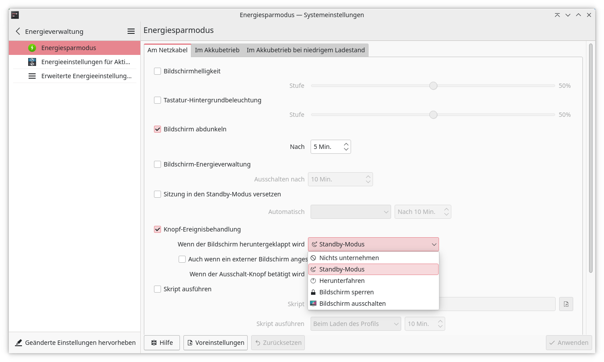

# Le PC bascule en veille de façon aléatoire

!!! info "Points importants"
    - Cause la plus fréquente : un **objet magnétique** (bracelet connecté,
      montre, chargeur MagSafe...) qui déclenche le **capteur à effet Hall**
      situé à l'avant du châssis, censé détecter la fermeture du couvercle.
    - **Solution simple** : garder tout objet magnétique à au moins 5 cm du
      bord avant du portable.
    - **Solution définitive sous Linux** : désactiver l'action associée à
      la fermeture du couvercle — voir
      [Désactiver la mise en veille à la fermeture du couvercle](#comment-empecher-le-pc-de-se-mettre-en-veille-a-la-fermeture-du-couvercle).
    - Voir aussi [Utilisation avec le couvercle fermé](couvercle-ferme.md)
      pour les bonnes pratiques de transport.

Traduction de l'article officiel TUXEDO
[Notebook switches to standby sleep mode randomly](https://www.tuxedocomputers.com/en/Notebook-switches-to-standby-sleep-mode-randomly.tuxedo).

## Pourquoi mon TUXEDO bascule-t-il en veille de façon aléatoire en tapant ?

Pas d'inquiétude : cela n'indique pas nécessairement une panne matérielle,
mais peut avoir une cause étonnamment simple et banale — un **bracelet
magnétique**, par exemple celui d'une smartwatch ou d'un tracker d'activité.

À l'avant de la plupart des portables (TUXEDO ou non) se trouve un capteur
dit « à effet Hall », déclenché magnétiquement, destiné à détecter la
fermeture ou l'ouverture du couvercle afin d'exécuter une action
prédéfinie — par exemple, basculer en veille.

Si un bracelet magnétique (bracelet fitness, smartwatch ou similaire) est
porté en travaillant sur le portable, il peut activer accidentellement ce
capteur situé à l'avant de l'appareil, déclenchant ainsi l'action
prédéfinie et faisant basculer l'écran en veille.

!!! note "Autres objets magnétiques concernés"
    D'autres objets magnétiques situés très près du bord avant du
    portable, comme les chargeurs MagSafe des iPhone récents, peuvent
    également déclencher le capteur.

## Comment résoudre le problème

Dans la mesure du possible, garder les objets magnétiques à au moins 5 cm
du bord avant du portable — cela exclut bien sûr le port d'un bracelet
magnétique en travaillant sur la machine.

Si ce n'est pas envisageable, deux alternatives :

- travailler avec un clavier externe, ou
- désactiver la fonction de mise en veille associée au capteur Hall.

Il est aussi possible de déplacer la fonction de mise en veille sur le
bouton d'alimentation, de sorte qu'une pression brève dessus mette le
TUXEDO en veille.

## Comment empêcher le PC de se mettre en veille à la fermeture du couvercle ?

La procédure diffère selon la distribution Linux — ou plus précisément
selon l'environnement de bureau.

**Environnements basés sur GNOME** (par exemple sous Ubuntu 22.04) :
installer l'extension gratuite **GNOME Tweaks**, disponible dans le
gestionnaire de logiciels. Dans cet outil, désactiver l'action exécutée à
la fermeture du couvercle.

**Bureau KDE Plasma** (également utilisé par TUXEDO OS 1) : dans les
paramètres, menu **Gestion de l'énergie**, choisir dans le menu déroulant
l'action à exécuter à la fermeture du couvercle. Dans la même fenêtre, il
est aussi possible de configurer la mise en veille au moyen du bouton
d'alimentation.



**Via le terminal**, quel que soit l'environnement de bureau :

```bash
sudo nano /etc/systemd/logind.conf
```

Dans le fichier de configuration qui s'ouvre, rechercher (Ctrl+F) la ligne
`HandleLidSwitch=suspend`, remplacer `suspend` par `ignore`, puis
enregistrer (Ctrl+S, ou Fichier › Enregistrer). Revenir ensuite au terminal
et appliquer le changement :

```bash
sudo systemctl restart systemd-logind
```

!!! note "Coquille corrigée par rapport à l'article source"
    L'article original TUXEDO indique par erreur `systemd-login` (nom de
    service invalide) au lieu de `systemd-logind` — corrigé ci-dessus.

---

Source : [Notebook switches to standby sleep mode randomly — TUXEDO Computers](https://www.tuxedocomputers.com/en/Notebook-switches-to-standby-sleep-mode-randomly.tuxedo)
