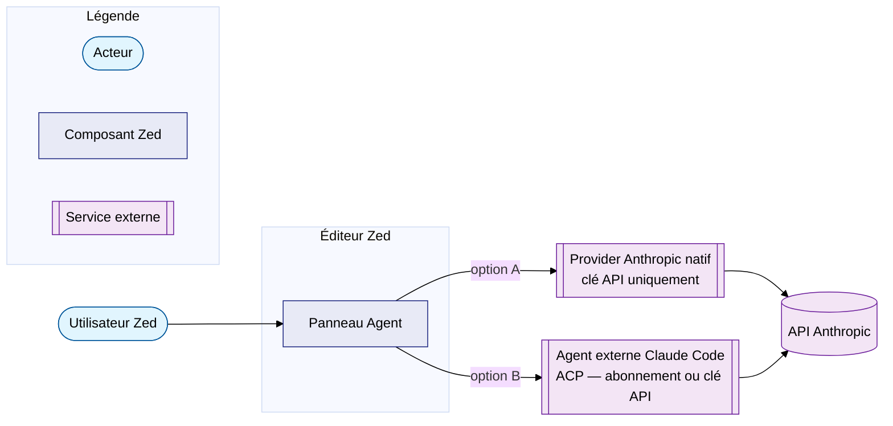

# Claude Code & Zed

Cette page explique comment souscrire à un abonnement **Claude Pro**, installer
**Claude Code** dans le terminal, configurer **Zed** pour utiliser Claude
(provider natif et agent externe via ACP), et basculer entre l'abonnement et
l'API payante d'Anthropic.

## Références

- [Tarification Claude](https://claude.com/pricing)
- [Documentation Claude Code — installation](https://code.claude.com/docs/en/setup)
- [Documentation Claude Code — authentification](https://code.claude.com/docs/en/authentication)
- [Console Anthropic (clés API)](https://console.anthropic.com)
- [Zed — agents externes (ACP)](https://zed.dev/docs/ai/external-agents)
- [Zed — fournisseurs de modèles](https://zed.dev/docs/ai/llm-providers)
- [zed-industries/claude-agent-acp](https://github.com/zed-industries/claude-agent-acp)

---

## 1. Comprendre les deux modes de facturation

Anthropic propose deux modèles de facturation totalement distincts pour utiliser
Claude. Il faut bien les distinguer avant toute configuration.

| Mode | Adapté à | Facturation | Authentification |
| --- | --- | --- | --- |
| **Abonnement Claude Pro / Max** | Usage régulier, prix fixe | Forfait mensuel (limites de messages) | OAuth via `/login` |
| **API Console** | Usage ponctuel, automatisation, scripts | À l'usage (par jeton) | Clé API `sk-ant-…` |

!!! info "Choix par défaut"
    Pour un usage interactif quotidien dans le terminal et Zed,
    l'**abonnement Pro ou Max** est généralement le plus économique.
    L'**API** reste utile pour les scripts, l'intégration CI ou pour profiter
    d'un budget de jetons indépendant.

### Souscription Claude Pro

1. Se rendre sur <https://claude.com/pricing>.
2. Choisir **Pro** (offre individuelle) ou **Max** (limites élargies).
3. Régler l'abonnement avec une carte bancaire ou un autre moyen accepté.

L'abonnement Pro/Max **inclut l'accès à Claude Code** (l'offre gratuite
Claude.ai ne permet pas d'utiliser Claude Code).

---

## 2. Installer Claude Code sur Ubuntu

La méthode officielle recommandée est **l'installateur natif** : il fournit un
binaire qui se met à jour automatiquement en arrière-plan.

```bash
curl -fsSL https://claude.ai/install.sh | bash
```

Le binaire est placé dans `~/.local/bin/claude`. S'assurer que ce répertoire
est dans le `PATH`.

Vérifier l'installation :

```bash
claude --version
claude doctor
```

??? details "Autres méthodes d'installation"
    **Dépôt apt signé (Debian/Ubuntu)** — pas de mise à jour automatique :

    ```bash
    sudo install -d -m 0755 /etc/apt/keyrings
    sudo curl -fsSL https://downloads.claude.ai/keys/claude-code.asc \
      -o /etc/apt/keyrings/claude-code.asc
    echo "deb [signed-by=/etc/apt/keyrings/claude-code.asc] \
      https://downloads.claude.ai/claude-code/apt/stable stable main" \
      | sudo tee /etc/apt/sources.list.d/claude-code.list
    sudo apt update
    sudo apt install claude-code
    ```

    **npm** (nécessite Node.js 18+) :

    ```bash
    npm install -g @anthropic-ai/claude-code
    ```

    Ne **jamais** utiliser `sudo npm install -g`.

---

## 3. Authentification dans le terminal

### Première connexion avec un abonnement Pro/Max

Lancer simplement :

```bash
claude
```

Au premier démarrage, Claude Code ouvre le navigateur et propose plusieurs
options de connexion. Choisir **Claude.ai (Pro/Max subscription)**, puis valider
dans le navigateur. Les jetons OAuth sont enregistrés localement dans :

```
~/.claude/.credentials.json   (permissions 0600)
```

Commandes utiles :

```bash
claude /login    # (re)connexion ou changement de compte
claude /logout   # déconnexion
claude /status   # affiche le compte et le mode d'authentification actifs
claude /config   # menu de configuration (modèle, canal de mise à jour, etc.)
claude /model    # changer de modèle au sein d'une session
```

### Connexion via clé API Anthropic

1. Créer une clé sur <https://console.anthropic.com> (rubrique *API Keys*).
2. Exporter la variable d'environnement avant de lancer Claude Code :

    ```bash
    export ANTHROPIC_API_KEY="sk-ant-…"
    claude
    ```

Au premier lancement avec une clé en environnement, Claude Code demande une
**approbation interactive** pour l'utiliser ; la décision est mémorisée.

!!! warning "Précédence des authentifications"
    Si plusieurs méthodes sont présentes, Claude Code les évalue dans cet ordre
    précis :

    1. Identifiants cloud (`CLAUDE_CODE_USE_BEDROCK`, `…_VERTEX`, `…_FOUNDRY`)
    2. `ANTHROPIC_AUTH_TOKEN` (jetons bearer pour proxies)
    3. **`ANTHROPIC_API_KEY`** (prend le pas sur l'abonnement après approbation)
    4. Script `apiKeyHelper`
    5. `CLAUDE_CODE_OAUTH_TOKEN` (CI)
    6. Identifiants OAuth de l'abonnement (`/login`)

    En clair : tant que `ANTHROPIC_API_KEY` est définie et approuvée, c'est elle
    qui est facturée — **pas l'abonnement**.

---

## 4. Basculer entre abonnement et clé API

### Méthode manuelle

```bash
# Utiliser l'abonnement Pro/Max
unset ANTHROPIC_API_KEY
claude

# Utiliser la clé API
export ANTHROPIC_API_KEY="sk-ant-…"
claude
```

### Script de bascule

Voici un script `claude-switch` qui mémorise le mode actif et lance Claude Code
avec la bonne authentification.

Créer le fichier `~/.local/bin/claude-switch` :

```bash
#!/usr/bin/env bash
# Bascule l'authentification de Claude Code entre abonnement Pro/Max et clé API.
#
# Usage :
#   claude-switch sub    # force l'abonnement (unset ANTHROPIC_API_KEY)
#   claude-switch api    # force la clé API (charge ~/.config/claude/api.env)
#   claude-switch        # affiche le mode actif et lance `claude`

set -euo pipefail

API_ENV_FILE="${HOME}/.config/claude/api.env"
STATE_FILE="${HOME}/.config/claude/mode"
mkdir -p "$(dirname "${STATE_FILE}")"

mode="${1:-}"

case "${mode}" in
  sub|subscription)
    echo "sub" > "${STATE_FILE}"
    echo "Mode : abonnement Pro/Max."
    ;;
  api)
    if [[ ! -f "${API_ENV_FILE}" ]]; then
      echo "Erreur : ${API_ENV_FILE} introuvable." >&2
      echo "Créer ce fichier avec : ANTHROPIC_API_KEY=sk-ant-…" >&2
      exit 1
    fi
    echo "api" > "${STATE_FILE}"
    echo "Mode : clé API Console."
    ;;
  "" )
    : # pas de changement, on lance simplement claude
    ;;
  *)
    echo "Usage : claude-switch [sub|api]" >&2
    exit 2
    ;;
esac

current="$(cat "${STATE_FILE}" 2>/dev/null || echo sub)"

if [[ "${current}" == "api" ]]; then
  # shellcheck disable=SC1090
  set -a; source "${API_ENV_FILE}"; set +a
  echo "→ Lancement de Claude Code avec la clé API."
else
  unset ANTHROPIC_API_KEY ANTHROPIC_AUTH_TOKEN
  echo "→ Lancement de Claude Code avec l'abonnement."
fi

exec claude "$@"
```

Rendre le script exécutable et créer le fichier de clé API :

```bash
chmod +x ~/.local/bin/claude-switch

mkdir -p ~/.config/claude
cat > ~/.config/claude/api.env <<'EOF'
ANTHROPIC_API_KEY=sk-ant-VOTRE_CLE_ICI
EOF
chmod 600 ~/.config/claude/api.env
```

Utilisation :

```bash
claude-switch sub    # bascule en mode abonnement (et lance claude)
claude-switch api    # bascule en mode API (et lance claude)
claude-switch        # relance avec le dernier mode mémorisé
```

!!! note "Pourquoi un fichier .env séparé ?"
    Stocker la clé API dans un fichier en mode `0600` évite de la coller dans
    `.bashrc` ou `.zshrc`, où elle serait exportée pour **tous** les processus.
    Le script ne la charge qu'au moment d'exécuter `claude`.

---

## 5. Configuration de Zed

Zed propose **deux intégrations Claude différentes**. Il est important de
comprendre laquelle correspond à votre besoin.



| Intégration | Authentification | Avantages | Limites |
| --- | --- | --- | --- |
| **Provider Anthropic natif** | Clé API uniquement | Réponses rapides, modèles directement sélectionnables | Pas d'agent autonome, pas d'outils Claude Code |
| **Claude Code via ACP** | Abonnement Pro/Max **ou** clé API | Vrais outils d'agent (lecture/écriture fichiers, bash, MCP) | Démarrage légèrement plus lent |

Le fichier de configuration Zed sur Linux se trouve à :

```
~/.config/zed/settings.json
```

### A. Provider Anthropic natif

Pour un usage simple « LLM dans l'éditeur », sans capacités d'agent.

**Saisir la clé API via l'interface** (recommandé — la clé est stockée dans le
trousseau du système, pas en clair) :

1. Ouvrir le panneau Agent : ++ctrl+question++.
2. Menu **agent: open settings**.
3. Coller la clé Anthropic dans le champ prévu.

!!! warning "Stockage de la clé"
    La documentation Zed précise : *« API keys are not stored as plain text in
    your settings file, but rather in your OS's secure credential storage. »*
    Préférer la saisie via l'UI à `language_models.anthropic.api_key` dans
    `settings.json`.

Choisir explicitement les modèles disponibles dans `settings.json` :

```json
{
  "language_models": {
    "anthropic": {
      "available_models": [
        {
          "name": "claude-opus-4-7",
          "display_name": "Claude Opus 4.7",
          "max_tokens": 200000,
          "max_output_tokens": 8192
        },
        {
          "name": "claude-sonnet-4-6",
          "display_name": "Claude Sonnet 4.6",
          "max_tokens": 200000,
          "max_output_tokens": 8192
        },
        {
          "name": "claude-sonnet-4-6",
          "display_name": "Claude Sonnet 4.6 (Thinking)",
          "max_tokens": 200000,
          "max_output_tokens": 8192,
          "mode": {
            "type": "thinking",
            "budget_tokens": 4096
          }
        }
      ]
    }
  }
}
```

### B. Claude Code comme agent externe (ACP)

C'est la voie qui permet d'utiliser **l'abonnement Pro/Max** directement dans
Zed, et qui donne accès aux outils complets de Claude Code (édition de
fichiers, exécution de commandes, MCP).

Dans `~/.config/zed/settings.json` :

```json
{
  "agent_servers": {
    "claude-acp": {
      "type": "registry"
    }
  }
}
```

Au premier démarrage d'un *thread* Claude Agent, Zed télécharge et installe
automatiquement le paquet
[`@zed-industries/claude-agent-acp`](https://github.com/zed-industries/claude-agent-acp).
Aucune installation manuelle n'est nécessaire.

!!! info "Authentification ACP — totalement séparée"
    L'authentification de l'agent **n'utilise pas** la clé API saisie dans le
    provider natif. Il faut se connecter dans le thread lui-même :

    1. Ouvrir un nouveau thread Claude Agent.
    2. Taper `/login` dans le thread.
    3. Choisir entre :
        - **Log in with Claude Code** (utilise l'abonnement Pro/Max via OAuth) ;
        - **API key** (saisir une clé `sk-ant-…`).

#### Lancer un thread Claude Agent

- ++ctrl+question++ : ouvrir le panneau Agent.
- Cliquer sur **+** en haut à droite, choisir **Claude Agent**.

Raccourci personnalisé dans `~/.config/zed/keymap.json` :

```json
[
  {
    "bindings": {
      "ctrl-alt-c": [
        "agent::NewExternalAgentThread",
        { "agent": { "custom": { "name": "claude-acp" } } }
      ]
    }
  }
]
```

#### Forcer un binaire `claude` particulier

Utile si plusieurs versions de Claude Code coexistent (par exemple pour tester
un canal `latest` à côté du canal `stable`) :

```json
{
  "agent_servers": {
    "claude-acp": {
      "type": "registry",
      "env": {
        "CLAUDE_CODE_EXECUTABLE": "/home/galan/.local/bin/claude"
      }
    }
  }
}
```

---

## 6. Tableau récapitulatif des fichiers et variables

| Élément | Emplacement / nom |
| --- | --- |
| Binaire Claude Code | `~/.local/bin/claude` |
| Identifiants OAuth (abonnement) | `~/.claude/.credentials.json` (mode `0600`) |
| Configuration utilisateur Claude Code | `~/.claude.json`, `~/.claude/` |
| Variable d'environnement clé API | `ANTHROPIC_API_KEY` |
| Variable jeton OAuth (CI) | `CLAUDE_CODE_OAUTH_TOKEN` |
| Configuration Zed | `~/.config/zed/settings.json` |
| Raccourcis Zed | `~/.config/zed/keymap.json` |
| Script de bascule (proposé) | `~/.local/bin/claude-switch` |
| Fichier clé API (proposé) | `~/.config/claude/api.env` (mode `0600`) |

---

## 7. Bonnes pratiques

- **Ne jamais committer** la clé API dans un dépôt Git, même privé.
  Le fichier `~/.config/claude/api.env` doit rester en mode `0600`.
- Vérifier régulièrement le mode actif : `claude /status` indique clairement si
  la session utilise un abonnement ou une clé API.
- Préférer la saisie de la clé via l'**UI de Zed** (trousseau système) plutôt
  que le champ `api_key` en clair dans `settings.json`.
- Pour les longues sessions interactives, l'**abonnement** est presque toujours
  plus économique. Garder la clé API pour les scripts et l'automatisation.
- Le canal `stable` de Claude Code (`autoUpdatesChannel: "stable"`) évite les
  régressions des versions fraîches — utile en environnement professionnel.
