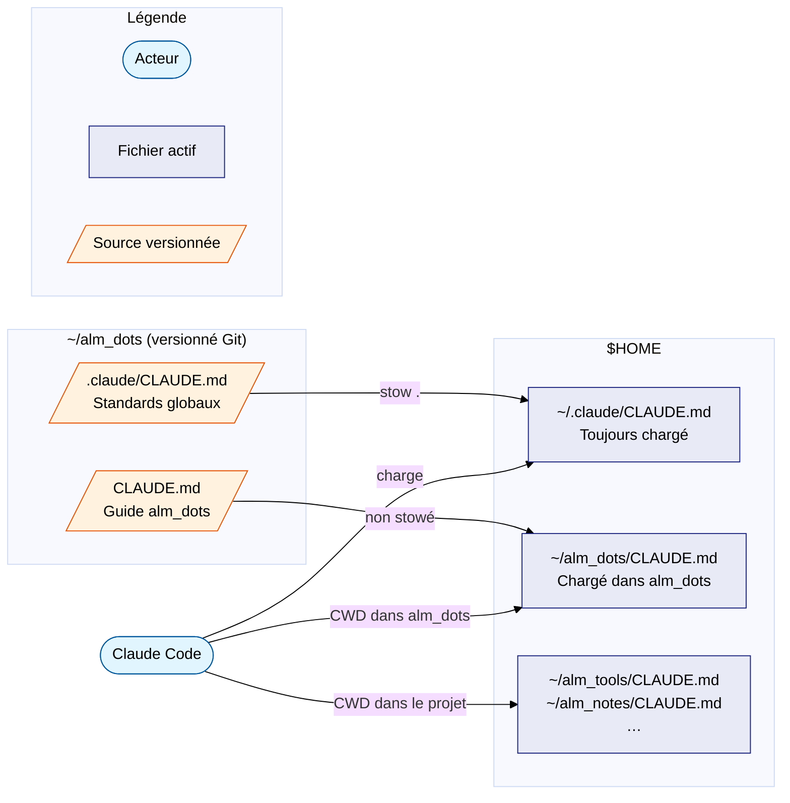

# Configuration

Claude Code charge des **instructions contextuelles** depuis des fichiers
`CLAUDE.md` selon une hiérarchie précise, et gère les **permissions** par
projet via `settings.local.json`.

---

## Hiérarchie des CLAUDE.md

Claude Code charge les fichiers `CLAUDE.md` de façon additive — le global
est toujours présent, le projet vient compléter :

| Fichier | Portée | Chargement |
|---------|--------|------------|
| `~/.claude/CLAUDE.md` | Tous les projets | Toujours chargé |
| `<projet>/CLAUDE.md` | Ce projet uniquement | Si le CWD est dans ce projet |
| `<parent>/CLAUDE.md` | Tous les sous-projets | Remontée de l'arborescence vers `$HOME` |

!!! warning "`.claude/CLAUDE.md` dans un projet n'est pas chargé automatiquement"
    Claude Code ne charge **pas** `<projet>/.claude/CLAUDE.md`. Le dossier
    `.claude/` est réservé aux fichiers de configuration (`settings.json`,
    `settings.local.json`). Seul `~/.claude/CLAUDE.md` est traité spécialement
    au niveau utilisateur.

---

## Architecture avec alm_dots (GNU Stow)

Les fichiers CLAUDE.md sont **versionnés dans `alm_dots`** et déployés via
GNU Stow :

```
alm_dots/.claude/CLAUDE.md  ──stow──►  ~/.claude/CLAUDE.md   (GLOBAL)
alm_dots/CLAUDE.md               ──►  ~/alm_dots/CLAUDE.md   (PROJET)
```



**Contenu de `~/.claude/CLAUDE.md` (global)** : langue (français), standards
Python/Shell/MkDocs, conventions de nommage, initialisation projets, palette
Mermaid.

**Contenu de `~/alm_dots/CLAUDE.md` (projet)** : objectif du dépôt (GNU Stow,
Ubuntu 20.04), contraintes de compatibilité, structure et patterns clés.

---

## Déploiement du CLAUDE.md global via Stow

Le fichier `~/.claude/CLAUDE.md` est un **symlink stow**, pas un fichier
éditable directement.

### Prérequis — `~/.claude/` doit exister avant de stower

Si `~/.claude/` n'existe pas, Stow crée un **symlink sur le dossier entier**
(`~/.claude/ → alm_dots/.claude/`), ce qui écraserait `.credentials.json`
et `settings.local.json`.

Claude Code crée `~/.claude/` au premier lancement. Sur une machine fraîche :

```bash
mkdir -p ~/.claude
stow .
```

### Workflow de mise à jour

```bash
# 1. Éditer la source dans alm_dots
zed ~/alm_dots/.claude/CLAUDE.md

# 2. Le symlink est immédiatement actif — pas besoin de re-stower

# 3. Committer
cd ~/alm_dots
git add .claude/CLAUDE.md
git commit -m "docs: update global Claude Code instructions"
```

### Vérifier les symlinks

```bash
ls -la ~/.claude/CLAUDE.md
# ~/.claude/CLAUDE.md -> ../alm_dots/.claude/CLAUDE.md  ✓
```

Si `~/CLAUDE.md` existe (ancien symlink de l'architecture précédente) :

```bash
rm ~/CLAUDE.md
```

---

## CLAUDE.md par projet

Chaque dépôt dispose de son propre `CLAUDE.md` à la racine. Les standards
globaux sont automatiquement hérités — ne pas les répéter.

**Initialiser rapidement avec les alias `alm_dots` :**

```bash
claude-open   # copie CLAUDE_Open.md comme CLAUDE.md dans le projet courant
claude-z      # copie CLAUDE_Mainframe.md (contexte IBM z/OS)
```

**Structure minimale d'un `CLAUDE.md` projet :**

```markdown
# CLAUDE.md

This file provides guidance to Claude Code (claude.ai/code) when working
with code in this repository.

## Project

Description courte du projet et de son contexte.

## Commands

\`\`\`bash
make install   # installer les dépendances
make test      # lancer les tests
make lint      # linter
\`\`\`

## Architecture

Points non-évidents sur la structure ou les patterns du projet.
```

---

## Permissions locales — `settings.local.json`

**Emplacement :** `<projet>/.claude/settings.local.json`

Pré-autorise des outils et commandes spécifiques au projet, évitant les
prompts de confirmation répétitifs.

```json
{
  "permissions": {
    "allow": [
      "Bash(git *)",
      "Bash(make *)",
      "Read(/home/galan/**)",
      "WebSearch"
    ]
  }
}
```

- Portée **locale uniquement** — ne s'applique qu'au projet courant
- Géré via le skill `/fewer-permission-prompts` ou manuellement
- **Ne pas stower** : contient des données spécifiques à la machine
- Complète (sans remplacer) `~/.claude/settings.json`

---

## Résumé de la hiérarchie

```
~/.claude/CLAUDE.md                    ← instructions globales (stowé)
~/.claude/settings.json                ← permissions globales
    +
<projet>/CLAUDE.md                     ← instructions projet
<projet>/.claude/settings.local.json   ← permissions projet
```

---

## Bonnes pratiques

- Ne jamais committer `ANTHROPIC_API_KEY` dans Git — même dans un dépôt privé
- Vérifier régulièrement le mode actif : `claude /status`
- Préférer la saisie de clé via l'**UI Zed** (trousseau système) plutôt que
  `api_key` en clair dans `settings.json`
- Canal `stable` (`autoUpdatesChannel: "stable"`) recommandé en environnement professionnel
