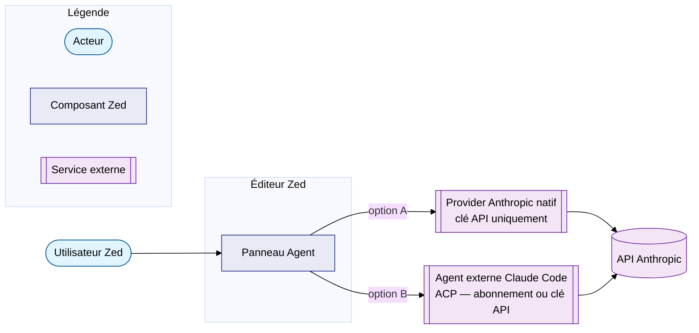

# Intégration Zed

Zed propose **deux intégrations Claude distinctes**. Il est important de
comprendre laquelle correspond à votre besoin avant de configurer.



| Intégration | Authentification | Avantages | Limites |
|-------------|-----------------|-----------|---------|
| **Provider natif** | Clé API uniquement | Réponses rapides, modèles sélectionnables | Pas d'agent autonome, pas d'outils Claude Code |
| **Claude Code via ACP** | Abonnement **ou** clé API | Outils complets (fichiers, bash, MCP) | Démarrage légèrement plus lent |

Le fichier de configuration Zed sur Linux : `~/.config/zed/settings.json`

!!! success "Configuration en place sur cette machine (juillet 2026, Zed 1.9.0)"
    Les **deux** intégrations sont configurées dans
    `~/.config/zed/settings.json` : le provider natif Anthropic (Opus 4.8,
    Sonnet 5, Sonnet 5 Thinking, Fable 5 — bloc `language_models` identique à
    l'exemple ci-dessous) et l'agent externe `claude-acp` installé depuis le
    registre ACP (bloc `agent_servers`).

---

## Option A — Provider Anthropic natif

Pour un usage « LLM dans l'éditeur » sans capacités d'agent.

**Saisir la clé via l'UI** (recommandé — stockée dans le trousseau système) :

1. Ouvrir le panneau Agent : ++ctrl+question++
2. Menu **agent: open settings**
3. Coller la clé Anthropic dans le champ prévu

!!! warning "Ne pas mettre la clé en clair dans `settings.json`"
    Préférer la saisie via l'UI : la clé est stockée dans le trousseau du
    système (keyring), pas en texte brut.

Déclarer les modèles disponibles dans `settings.json` :

```json
{
  "language_models": {
    "anthropic": {
      "available_models": [
        {
          "name": "claude-opus-4-8",
          "display_name": "Claude Opus 4.8",
          "max_tokens": 200000,
          "max_output_tokens": 8192
        },
        {
          "name": "claude-sonnet-5",
          "display_name": "Claude Sonnet 5",
          "max_tokens": 200000,
          "max_output_tokens": 8192
        },
        {
          "name": "claude-sonnet-5",
          "display_name": "Claude Sonnet 5 (Thinking)",
          "max_tokens": 200000,
          "max_output_tokens": 8192,
          "mode": {
            "type": "thinking",
            "budget_tokens": 4096
          }
        },
        {
          "name": "claude-fable-5",
          "display_name": "Claude Fable 5",
          "max_tokens": 200000,
          "max_output_tokens": 8192
        }
      ]
    }
  }
}
```

!!! info "Fable 5 réfléchit toujours"
    Contrairement à Opus et Sonnet, Fable 5 utilise en permanence la
    réflexion étendue (*extended thinking*) — pas besoin d'une entrée
    `(Thinking)` séparée avec `mode.type: "thinking"` comme pour Sonnet.

---

## Option B — Claude Code comme agent externe (ACP)

Permet d'utiliser l'**abonnement Pro/Max** directement dans Zed, avec accès
aux outils complets de Claude Code (édition de fichiers, exécution bash, MCP).

**Méthode recommandée — via l'UI (registre ACP)** : palette de commandes
(++ctrl+shift+p++) → `zed: acp registry`, ou **Agent Settings**
(`agent: open settings`) → **Add Agent** → **Install from Registry**. Zed
gère alors l'installation et les mises à jour du paquet.

**Méthode manuelle — équivalent en JSON**, dans
`~/.config/zed/settings.json` :

```json
{
  "agent_servers": {
    "claude-acp": {
      "type": "registry"
    }
  }
}
```

Au premier démarrage d'un thread Claude Agent, Zed télécharge automatiquement
le paquet [`@zed-industries/claude-agent-acp`](https://github.com/zed-industries/claude-agent-acp).

!!! note "Les menus Zed changent fréquemment"
    Zed est un projet qui évolue vite ; les intitulés de menu ci-dessus
    peuvent se déplacer d'une version à l'autre. La palette de commandes
    (++ctrl+shift+p++) reste le point d'entrée le plus stable — chercher
    `acp` ou `agent` y retrouve toujours les actions courantes.

!!! info "Authentification ACP — totalement séparée du provider natif"
    Se connecter dans le thread lui-même :

    1. Ouvrir un nouveau thread Claude Agent
    2. Taper `/login` dans le thread
    3. Choisir : **Log in with Claude Code** (abonnement OAuth) ou **API key**

### Ouvrir un thread Claude Agent

- ++ctrl+question++ → cliquer sur **+** → choisir **Claude Agent**

Raccourci personnalisé dans `~/.config/zed/keymap.json` :

```json
[
  {
    "bindings": {
      "ctrl-alt-c": [
        "agent::NewExternalAgentThread",
        { "agent": { "custom": { "name": "claude-acp" } } }
      ]
    }
  }
]
```

### Forcer un binaire `claude` particulier

```json
{
  "agent_servers": {
    "claude-acp": {
      "type": "registry",
      "env": {
        "CLAUDE_CODE_EXECUTABLE": "/home/galan/.local/bin/claude"
      }
    }
  }
}
```

Utile si plusieurs versions de Claude Code coexistent (canal `latest` vs `stable`).

---

## Références

- [Zed — agents externes (ACP)](https://zed.dev/docs/ai/external-agents)
- [Zed — fournisseurs de modèles](https://zed.dev/docs/ai/llm-providers)
- [zed-industries/claude-agent-acp](https://github.com/zed-industries/claude-agent-acp)
