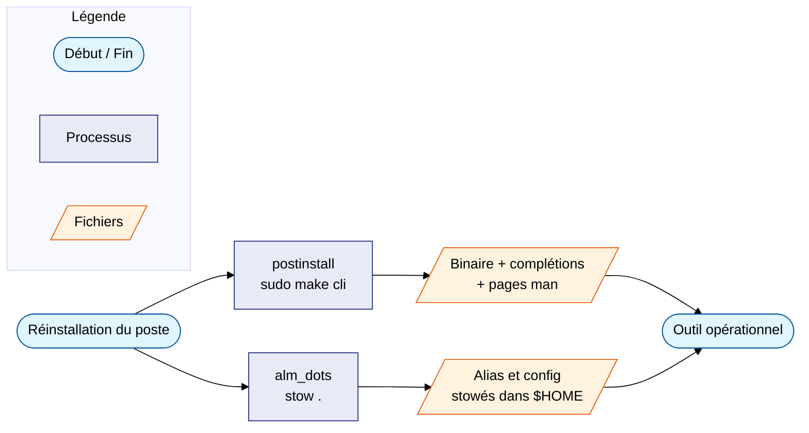

# CLI modernes

Remplaçants modernes des commandes Unix classiques — pour la plupart écrits
en Rust : plus rapides, sortie colorée, intégration Git native, options
pensées pour l'usage interactif.

---

## Cycle de vie commun

Chaque outil de cette section suit le même cycle de vie sur le poste :

1. **Installation** par le process de post-installation
   ([alm_tools/postinstall](../../systeme/ubuntu/alm_tools/postinstall/index.md)) —
   dépôts APT officiels des projets quand ils existent, binaire à jour.
2. **Configuration** (alias, variables) versionnée dans
   [alm_dots](../../systeme/ubuntu/alm_dots/index.md) et déployée par GNU Stow.
   Chaque bloc est **gardé** par `command -v <outil>` : si l'outil n'est pas
   installé, aucun alias n'est défini et le shell reste sain.
3. **Documentation** : une page par outil dans cette section, avec les alias
   en place et des exemples d'usage réels.

---

## Pages

-   :material-format-list-bulleted: **[eza](eza.md)**

    Remplacement de `ls` : couleurs, icônes Nerd Font, statut Git,
    arborescence. Alias `ls`, `ll`, `la`, `lt`…

-   :material-magnify: **[ripgrep](ripgrep.md)**

    Remplacement de `grep` : recherche récursive ultra-rapide, respecte
    `.gitignore`. Config `RIPGREP_CONFIG_PATH`, alias `rgf`, `rgt`, `rgu`…

-   :material-file-eye-outline: **[bat](bat.md)**

    `cat` avec coloration syntaxique : alias `cat`, pages man colorées,
    thème assorti au terminal, previewer de fzf.

-   :material-magnify-scan: **[fzf](fzf.md)**

    Recherche floue interactive : ++ctrl+r++, ++ctrl+t++, ++alt+c++,
    complétion `**`, alias `fz`, `fs`, `fcd`…

-   :material-folder-arrow-right-outline: **[zoxide](zoxide.md)**

    Le `cd` qui apprend : `cd motif` saute au dossier fréquent
    correspondant, `cdi` pour choisir via fzf.

-   :material-nodejs: **[fnm](fnm.md)**

    Gestionnaire de versions Node.js : bascule automatique par projet
    (`.nvmrc`, `package.json`), contrôle LTS quotidien.

-   :material-check-decagram-outline: **[hashdeep](hashdeep.md)**

    Empreintes récursives et audit d'intégrité : manifestes SHA-256,
    vérification de copies, détection de bitrot.

-   :material-chart-line: **[pv](pv.md)**

    Progression dans les pipes : `dd`, `tar`, compression, limitation de
    débit, suivi d'un processus déjà lancé.

