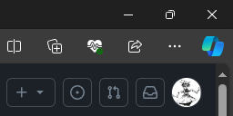
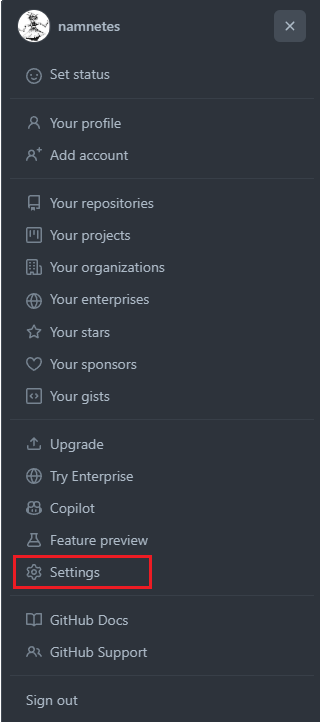
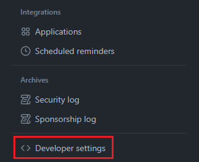
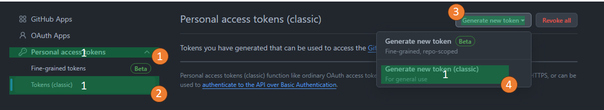
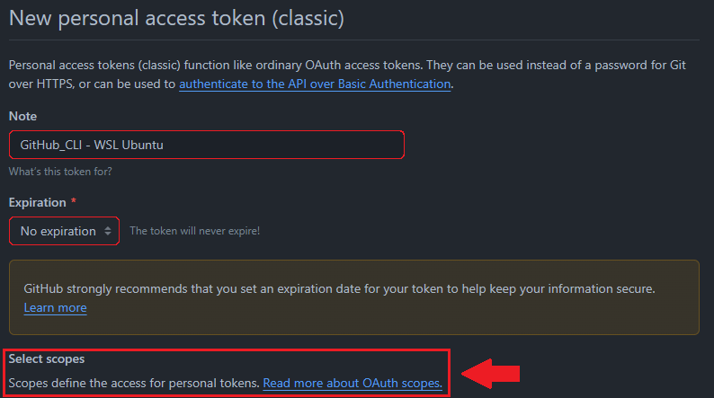
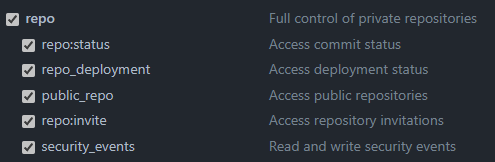
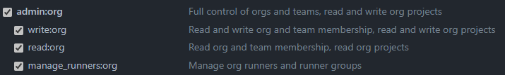

# GitHub CLI

## Références

- [Site officiel](https://github.com/cli/cli)
- [Installation sur Linux et BSD](https://github.com/cli/cli/blob/trunk/docs/install_linux.md)

---

## Installation

Pour Debian, Ubuntu, Raspberry Pi OS :

```bash
# Créer le répertoire des clés GPG s'il n'existe pas
sudo mkdir -p /etc/apt/keyrings

# Télécharger la clé GPG GitHub CLI
wget -qO- https://cli.github.com/packages/githubcli-archive-keyring.gpg | sudo tee /etc/apt/keyrings/githubcli-archive-keyring.gpg > /dev/null

# Appliquer les permissions de lecture
sudo chmod go+r /etc/apt/keyrings/githubcli-archive-keyring.gpg

# Ajouter le dépôt GitHub CLI
echo "deb [arch=$(dpkg --print-architecture) signed-by=/etc/apt/keyrings/githubcli-archive-keyring.gpg] https://cli.github.com/packages stable main" | sudo tee /etc/apt/sources.list.d/github-cli.list > /dev/null

# Mettre à jour et installer
sudo apt update
sudo apt install gh -y
```

Vérification :

```bash
gh --version
gh version 2.50.0 (2024-05-29)
https://github.com/cli/cli/releases/tag/v2.50.0
```

---

## Générer un jeton d'authentification

Connectez-vous à GitHub et cliquez sur votre photo de profil en haut à droite :



Cliquez sur **Settings** :



Dans le menu de gauche, tout en bas, cliquez sur **Developer settings** :



Cliquez sur **Personal access tokens** :



Ajoutez un commentaire, définissez la date d'expiration, sélectionnez les options d'administration :



Deux options sont obligatoires :

|  |  |
| --- | --- |

Cliquez sur **Generate** en bas de la page :


---

## Connexion aux services GitHub

```bash
gh auth login
? What account do you want to log into? GitHub.com
? What is your preferred protocol for Git operations on this host? SSH
? Upload your SSH public key to your GitHub account? Skip
? How would you like to authenticate GitHub CLI? Paste an authentication token
Tip: you can generate a Personal Access Token here https://github.com/settings/tokens
The minimum required scopes are 'repo', 'read:org'.
? Paste your authentication token: ****************************************
- gh config set -h github.com git_protocol ssh
✓ Configured git protocol
! Authentication credentials saved in plain text
✓ Logged in as namnetes
```

Points à noter :

- **SSH** : la clé SSH est déjà enregistrée dans GitHub — aucun téléversement nécessaire.
- **Token** : le jeton est celui généré à l'étape précédente.
- **Texte clair** : les informations d'authentification sont stockées en clair sur le système. Restreignez l'accès aux fichiers de configuration concernés.

---

## Lister les dépôts et gists

```bash
gh repo list

Showing 8 of 8 repositories in @namnetes

NAME                     DESCRIPTION                                                                                                                                INFO    UPDATED           
namnetes/tiddlywiki                                                                                                                                                 public  about 1 minute ago
namnetes/dotfiles        Mes fichiers de configurations                                                                                                             public  about 1 hour ago
namnetes/vlm_c           Analyse des VLM FileManager                                                                                                                public  about 16 days ago
namnetes/c_sandbox                                                                                                                                                  public  about 18 days ago
namnetes/jni                                                                                                                                                        public  about 21 days ago
namnetes/vlm             Utilitaire mettant en forme de manière claire le fichier de résultats issu de l'analyse des Load Module IBM Mainframe produit par la f...  public  about 1 month ago
namnetes/ytDownloader    Script Python de téléchargement de vidéo YouTube                                                                                           public  about 5 months ago
namnetes/ViewLoadModule  VLM stands for "View Load Module" in IBM File Manager for z/OS ```
```

```bash
gh gist list

ID                                DESCRIPTION                                                       FILES   VISIBILITY  UPDATED           
90140eb7b88f2f4f913485f2c7b2858c  Imprimez un motif de test en 256 couleurs dans le terminal Linux  1 file  public      about 5 months ago
```

---

## Cloner un dépôt

```bash
gh repo clone git@github.com:namnetes/vlm.git
```
