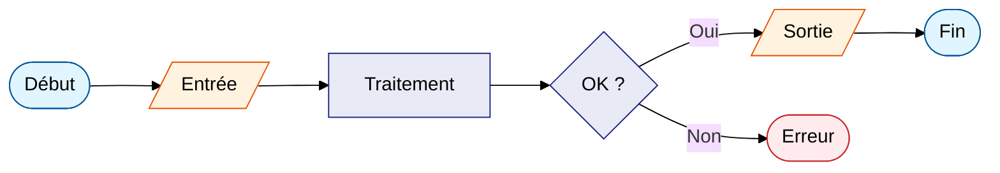

# Écrire du contenu Markdown

## Syntaxe de base

```markdown
# Titre de niveau 1 (une seule fois par page)
## Titre de niveau 2 (apparaît dans la table des matières)
### Titre de niveau 3

Paragraphe normal. Deux espaces en fin de ligne  
forcent un retour à la ligne.

**gras**, *italique*, `code inline`, ~~barré~~

- liste à puces
- deuxième élément
  - sous-élément (indentation 2 espaces)

1. liste numérotée
2. deuxième point
```

---

## Liens

### Lien externe

```markdown
[Texte du lien](https://exemple.com)
```

### Lien interne entre pages

Le chemin est **relatif au fichier source**, pas à la racine du projet.

```markdown
[Voir la page d'installation](installation.md)
[Voir la configuration](../config/configuration.md)
```

| Situation | Exemple |
|---|---|
| Même répertoire | `[Installation](installation.md)` |
| Sous-répertoire | `[Référence](api/reference.md)` |
| Répertoire parent | `[Accueil](../index.md)` |
| Avec ancre | `[Section précise](installation.md#installer-uv)` |

!!! tip "Ancres générées automatiquement"
    MkDocs génère une ancre pour chaque titre. La règle : tout en minuscules,
    espaces remplacés par des tirets, accents retirés.
    `## Installer uv` → `#installer-uv`
    `## Dépendances système` → `#dependances-systeme`

---

---

## Images

### Où placer les images

Par convention, **toutes les images vont dans `docs/assets/images/`**. Ne
créez pas de sous-dossiers d'images dans les répertoires de sections — les
chemins relatifs deviennent difficiles à maintenir.

```
docs/
├── assets/
│   └── images/
│       ├── architecture.png
│       └── capture-ecran.png
├── guide.md
└── api/
    └── reference.md
```

### Insérer une image

```markdown

```

Le **texte alternatif** (entre `[]`) est obligatoire : il est lu par les
lecteurs d'écran et s'affiche si l'image ne charge pas.

### Chemin selon la position du fichier

Le chemin est relatif au fichier `.md`, pas à la racine du projet.

| Fichier source | Chemin vers `docs/assets/images/mon-image.png` |
|---|---|
| `docs/guide.md` | `assets/images/mon-image.png` |
| `docs/api/reference.md` | `../assets/images/mon-image.png` |
| `docs/api/v2/detail.md` | `../../assets/images/mon-image.png` |

### Contrôler la largeur (extension `attr_list`)

```markdown
{ width="600" }
```

Nécessite l'extension `attr_list` dans `mkdocs.yml` (incluse dans la
configuration standard).

---

## Blocs de code avec coloration syntaxique

````markdown
```python
def bonjour(nom: str) -> str:
    return f"Bonjour, {nom} !"
```

```bash
#!/usr/bin/env bash
set -euo pipefail
echo "Hello, world!"
```

```toml
[settings]
clé = "valeur"
```
````

---

## Tableaux

```markdown
| Colonne 1 | Colonne 2 | Colonne 3 |
|---|---|---|
| A | B | C |
| D | E | F |

# Alignement
| Gauche | Centre | Droite |
|:-------|:------:|-------:|
| x      |   y    |      z |
```

---

## Admonitions (boîtes colorées)

Les admonitions sont des boîtes mises en valeur. Nécessitent l'extension
`admonition` dans `mkdocs.yml`.

```markdown
!!! note "Titre de la note"
    Contenu de la note.
    L'indentation de 4 espaces est obligatoire.
    Le titre entre guillemets est optionnel.
```

**Types disponibles :**

| Type | Couleur | Usage |
|---|---|---|
| `note` | Bleu | Information complémentaire |
| `info` | Bleu clair | Précision utile |
| `tip` | Vert | Conseil, bonne pratique |
| `success` | Vert | Résultat attendu, validation |
| `warning` | Orange | Avertissement |
| `danger` | Rouge | Action irréversible, risque |
| `bug` | Rouge | Problème connu |
| `example` | Violet | Exemple concret |
| `quote` | Gris | Citation |

```markdown
!!! tip "Conseil"
    Préférez `uv run mkdocs serve` à `mkdocs serve`.

!!! warning "Attention"
    Ne versionnez pas le répertoire `site/`.

!!! danger "Irréversible"
    `git reset --hard` supprime toutes les modifications non commitées.
```

---

## Volets repliables (details)

Un volet repliable se comporte comme une admonition, mais l'utilisateur
peut l'ouvrir ou le fermer. Nécessite `pymdownx.details` dans `mkdocs.yml`.

| Syntaxe | Comportement |
|---|---|
| `!!! note` | Toujours visible, non repliable |
| `??? note` | Replié par défaut, s'ouvre au clic |
| `???+ note` | Ouvert par défaut, peut être replié |

```markdown
??? "Afficher le détail technique"
    Cette section est cachée au chargement de la page.

???+ tip "Astuce avancée"
    Cette section est visible au chargement, mais peut être refermée.
```

**Quand utiliser les volets repliables ?**

- Cacher des explications longues ou des détails techniques secondaires.
- Proposer des exemples complets sans alourdir la page.
- FAQ : masquer les réponses par défaut.

---

## Onglets dans le contenu

Présenter plusieurs variantes d'un même contenu. Nécessite `pymdownx.tabbed`
avec `alternate_style: true` dans `mkdocs.yml`.

```markdown
=== "Ubuntu / Debian"

    ```bash
    sudo apt install jq
    ```

=== "Arch Linux"

    ```bash
    sudo pacman -S jq
    ```

=== "macOS"

    ```bash
    brew install jq
    ```
```

**Règles de syntaxe :**

- `===` suivi du nom entre `"..."`.
- Une **ligne vide** obligatoire entre `=== "..."` et le contenu.
- Contenu indenté de **4 espaces**.
- Les onglets doivent se suivre sans ligne vide entre eux.

**Quand utiliser les onglets ?**

- Même procédure sur plusieurs systèmes (Linux, macOS, Windows).
- Même exemple dans plusieurs langages.
- Version simple vs version avancée d'une configuration.

---

## Diagrammes Mermaid

MkDocs Material intègre le support natif de Mermaid via `pymdownx.superfences`.

````markdown

````

!!! note "Classes sémantiques"
    Toujours utiliser les classes `startStop`, `logic`, `data`, `error`,
    `external` définies dans `~/.claude/CLAUDE.md` pour garantir une
    palette cohérente sur tous les diagrammes.
