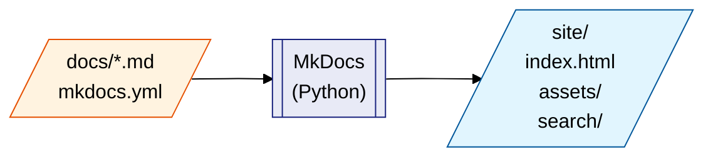

# MkDocs

> **MkDocs** transforme des fichiers Markdown en un site web HTML complet,
> navigable et consultable. Aucune connaissance en HTML ou CSS n'est requise.

---

## Qu'est-ce que MkDocs ?

### Le problème résolu

Écrire de la documentation directement en HTML est fastidieux : balises
verbeux, mise en forme répétitive, fichiers difficiles à lire et à maintenir.
MkDocs résout ce problème en vous laissant écrire en **Markdown** — un format
texte simple et lisible — et en générant automatiquement un site HTML propre.

```
Vous écrivez ça :         MkDocs génère ça :

## Mon titre              <h2>Mon titre</h2>
                          <p>Un paragraphe ordinaire
Un paragraphe             en HTML bien formé.</p>
ordinaire.
                          <pre><code>print("hello")
    print("hello")        </code></pre>
```

### Positionnement parmi les outils similaires

| Outil | Langage | Points forts |
|---|---|---|
| **MkDocs** | Python | Simple, rapide, thème Material excellent |
| Sphinx | Python | Référence absolue pour les APIs Python |
| Jekyll | Ruby | Intégré à GitHub Pages |
| Hugo | Go | Très rapide, polyvalent |
| Docusaurus | Node.js | Riche en fonctionnalités React |

MkDocs est le meilleur choix quand vous voulez quelque chose qui marche
en 10 minutes, que votre équipe utilise Python et que vous voulez un thème
professionnel sans configuration excessive.

---

## Documentation par projet vs espace centralisé

### Le principe : la doc vit avec le code

Avec MkDocs, chaque projet embarque sa documentation dans le même dépôt Git.
C'est un choix délibéré, à l'opposé d'un espace centralisé (Confluence,
Notion, SharePoint…).

### Avantages

| Avantage | Ce que ça change concrètement |
|---|---|
| **Toujours retrouvable** | La doc du projet X est dans le dépôt X. Fini la chasse dans Confluence pour savoir si la page existe, dans quel espace elle se trouve, sous quel nom elle a été créée. |
| **Synchronisée avec le code** | La doc est dans le même commit que le code qu'elle décrit. Impossible de livrer une fonctionnalité sans mettre à jour la doc correspondante dans la même PR. |
| **Versionnée avec Git** | `git log docs/` montre qui a changé quoi et quand. La doc suit les branches et les tags — on peut consulter la doc de la v1.2 même si la v2.0 est sortie. |
| **Review intégrée** | Une PR qui change le code peut modifier la doc dans le même diff. Le relecteur voit les deux ensemble. |
| **Zéro infrastructure** | Site 100 % statique : GitHub Pages, un serveur Nginx, ou même `file://` dans un navigateur. Pas de base de données, pas de licence, pas de compte. |
| **Portable** | Un développeur qui clone le dépôt a la doc. Elle fonctionne hors ligne, sans VPN, sur n'importe quelle machine. |

### Inconvénients

| Inconvénient | Quand ça pose problème |
|---|---|
| **Pas de collaboration temps réel** | Impossible de laisser un commentaire inline comme dans Confluence ou Google Docs. La review passe par une PR. |
| **Pas de recherche globale** | Confluence indexe toute la documentation de l'organisation. MkDocs cherche uniquement dans le projet courant. |
| **Accès conditionné au dépôt** | Un non-développeur ne peut pas lire la doc s'il n'a pas accès au dépôt Git ou à un site déployé. |
| **Pas de notifications** | Confluence peut alerter par e-mail si une page est modifiée. Avec Git, il faut surveiller les commits manuellement ou configurer un webhook. |

### En résumé

!!! tip "La règle d'or"
    **La doc du projet X est dans le dépôt X.**
    Cette règle triviale rend la documentation triviale à retrouver — ce qui
    est la principale cause d'échec des espaces Confluence : une documentation
    difficile à localiser est une documentation que personne ne lit.

MkDocs par projet est adapté à la documentation **technique** : guides
d'installation, référence d'API, décisions d'architecture (ADR), procédures
d'exploitation. Pour la documentation **organisationnelle** (onboarding RH,
processus transverses, décisions stratégiques), un espace centralisé reste
pertinent — les deux approches ne s'excluent pas.

---

### Architecture de haut niveau



Le répertoire `site/` généré est un site **entièrement statique** : aucun
serveur applicatif n'est nécessaire pour l'héberger. Il peut être déposé sur
Apache, Nginx, GitHub Pages, ou consulté directement depuis le disque.

---

## Prérequis système

| Composant | Version minimale | Rôle |
|---|---|---|
| Ubuntu | 24.04 LTS | Système d'exploitation |
| Python | 3.11+ | Nécessaire pour exécuter MkDocs |
| uv | Dernière version | Gestionnaire de paquets Python |
| Git | 2.x | Versionner la documentation |

!!! note "Python sur Ubuntu 24.04"
    Ubuntu 24.04 livre Python **3.12** par défaut, ce qui est suffisant.
    Si votre projet impose une version plus récente, `uv` peut l'installer
    et la gérer indépendamment du Python système.

**Vérifier votre environnement :**

```bash
lsb_release -d        # → Ubuntu 24.04.x LTS
python3 --version     # → Python 3.12.x
git --version         # → git version 2.x.x
```

---

## Pages de ce guide

| Page | Contenu |
|---|---|
| [Installation](installation.md) | Dépendances système, `uv`, stack complet des plugins recommandés |
| [Configuration](configuration.md) | Structure de projet, `mkdocs.yml` annoté, `navigation.indexes` |
| [Contenu Markdown](contenu.md) | Syntaxe de base, liens, images, admonitions, onglets, Mermaid |
| [Commandes](commandes.md) | `serve`, `build`, mode strict, Makefile avec détection de port |
| [Script Bash & CI](bash.md) | Automatisation, GitHub Actions, vérification de liens |
| [Personnalisations](personnalisation.md) | CSS 100% largeur, sidebars, dropdown nav, MathJax, Makefile |
| [Dépannage](depannage.md) | Erreurs courantes et solutions |
