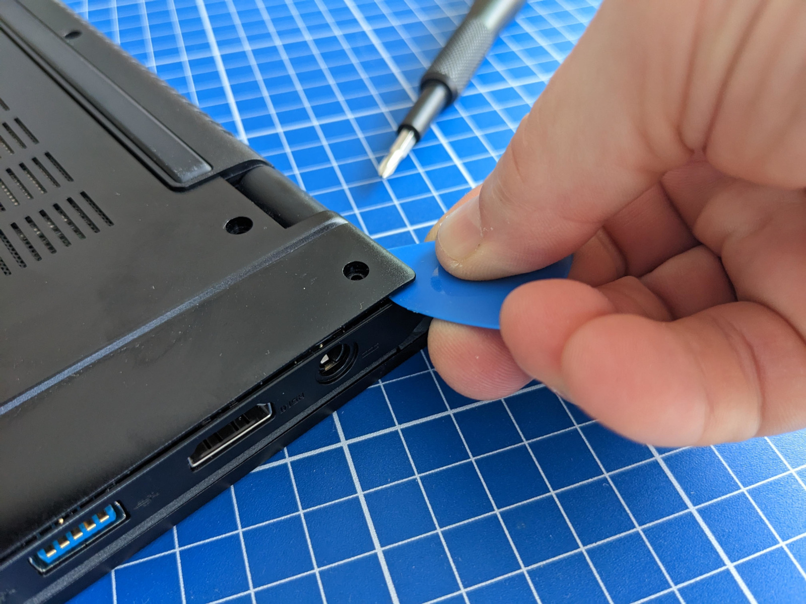

# Instructions pour ouvrir le boîtier

!!! info "Points importants"
    - Ouverture du panneau inférieur **autorisée par la garantie** TUXEDO
      pour l'entretien (nettoyage des ventilateurs, remplacement de la
      batterie...).
    - **Un simple tournevis cruciforme standard** suffit — TUXEDO évite les
      vis exotiques.
    - Utiliser un **objet en plastique non métallique** (médiator, spatule,
      carte plastique) pour décrocher les parties clipsées — jamais un
      tournevis métallique.
    - Voir la procédure complète de mise à niveau (RAM, SSD, Wi-Fi,
      ventilateurs...) sur la page
      [Entretien et mise à niveau](entretien-et-mise-a-niveau.md), et la
      fiche [Châssis](materiel.md#chassis) sur la page Matériel.

Traduction de l'article officiel TUXEDO
[Instructions for opening the device](https://www.tuxedocomputers.com/en/Infos/Help-Support/Frequently-asked-questions/Instructions-for-opening-the-device.tuxedo).

En règle générale, le panneau inférieur des portables TUXEDO se retire en
quelques étapes seulement. Cela permet, entre autres, le nettoyage des
ventilateurs ou le remplacement de la batterie. Les conditions de garantie
TUXEDO précisent clairement que l'ouverture du boîtier à des fins
d'entretien est autorisée et n'entraîne **aucune perte des droits de
garantie**.

## Instructions pour ouvrir les appareils TUXEDO

- Pour ouvrir le boîtier, un tournevis adapté suffit généralement. TUXEDO
  utilise typiquement des vis cruciformes standard, donc aucun outil
  spécial n'est nécessaire — l'entreprise évite volontairement les têtes de
  vis exotiques qui compliqueraient l'ouverture du boîtier.

- Pour éviter tout dommage lié à une décharge électrostatique (ESD —
  *ElectroStatic Discharge*), il est recommandé d'utiliser un kit ESD, bracelet
  antistatique inclus. À défaut, se mettre à un potentiel de terre en
  touchant un objet relié à la terre, comme un radiateur, avant de
  commencer.

!!! warning "Ne jamais utiliser d'outil métallique pointu"
    Éviter d'utiliser un tournevis ou tout autre outil métallique pointu
    pour ouvrir les parties clipsées du boîtier. Utiliser à la place un
    outil d'ouverture en plastique dédié, un médiator de guitare, ou même
    une vieille carte plastique (comme une carte bancaire expirée).

*Un médiator de guitare permet d'ouvrir facilement les boîtiers clipsés.*

---

Source : [Instructions for opening the device — TUXEDO Computers](https://www.tuxedocomputers.com/en/Infos/Help-Support/Frequently-asked-questions/Instructions-for-opening-the-device.tuxedo)
