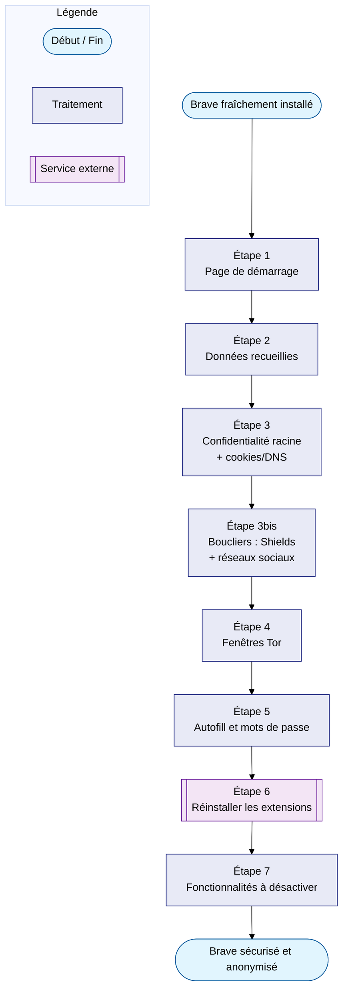

# Réinstallation du poste — reconfigurer Brave

Runbook pour remonter Brave après une réinstallation du poste, avec
deux objectifs tenus **ensemble**, pas l'un au détriment de l'autre :

- une **sécurité et un anonymat solides** ;
- une **expérience de navigation qui reste agréable au quotidien**.

Quand un réglage plus strict casserait des usages courants pour un
gain marginal, ce runbook le signale explicitement plutôt que
d'imposer le choix le plus extrême par défaut. Basé sur l'audit du
profil réalisé le 2026-07-07 sur Brave 150.1.92.134.

## L'essentiel — 6 réglages qui comptent le plus

Si tu ne devais retenir que six choses de toute cette page, ce sont
celles-ci. Elles ont un point commun : elles évitent une **fausse
impression de sécurité** — c'est-à-dire une situation où tu te crois
protégé alors qu'une fuite discrète existe encore.

1. **Politique WebRTC (Étape 3)** — Sans ce réglage, un site web peut
   découvrir ton adresse IP réelle **même si tu utilises un VPN**. La
   technologie WebRTC (utilisée pour les appels vidéo dans le
   navigateur) a un défaut de conception connu : par un mécanisme
   technique séparé du trafic normal, elle peut révéler l'IP de ta
   machine directement, en contournant le VPN. C'est le genre de fuite
   qu'on ne voit pas — le VPN a l'air de fonctionner, mais elle existe
   quand même.
2. **DNS sécurisé avec un vrai fournisseur, pas "OS par défaut"
   (Sécurité)** — Le DNS, c'est le carnet d'adresses d'Internet :
   chaque fois que tu tapes un site, ton navigateur demande "quelle
   est l'adresse de ce site ?" avant de s'y connecter. Sans DNS
   sécurisé configuré sur un résolveur choisi, c'est ton **fournisseur
   d'accès Internet** qui répond à cette question — et qui voit donc
   la liste de tous les sites que tu visites, même ceux en HTTPS.
3. **Autofill désactivé en navigation privée (Étape 5)** — Une fenêtre
   Tor est censée être "anonyme". Mais si le remplissage automatique
   reste actif dedans, Brave peut proposer ton nom, ton adresse ou tes
   infos de paiement réelles **dans cette même fenêtre** — reliant
   instantanément ton identité réelle à la session censée être
   anonyme. Ça annule tout l'intérêt de Tor.
4. **Applications en arrière-plan désactivées (Système)** — Beaucoup
   de gens pensent que fermer la fenêtre = fermer Brave. Si ce
   réglage reste activé, Brave continue de tourner discrètement même
   après la fermeture — et l'effacement automatique des données
   (point suivant) peut ne se déclencher que bien plus tard, voire
   jamais si le processus n'est jamais vraiment quitté.
5. **Effacer les données lors de la fermeture (Étape 3)** — C'est le
   réglage qui fait le plus gros du travail au quotidien : à chaque
   fermeture de Brave, l'historique, le cache et les données de
   saisie automatique sont effacés tout seuls, sans action manuelle à
   refaire à chaque fois.
6. **Shields sur "Agressif" (Boucliers)** — C'est le blocage des
   publicités et traqueurs. Déjà actif sur ce poste : c'est la
   fonctionnalité la plus visible de Brave, et celle qui bloque le
   plus grand nombre de mouchards au quotidien, sans réglage
   supplémentaire à faire.

Le reste du runbook détaille des dizaines d'autres réglages, mais ce
sont ces six-là qui changent vraiment la donne si le temps manque.

**Contexte propre à ce poste :**

- **Marque-pages** : non utilisés côté desktop — c'est
  [alm_dashboard](../../systeme/ubuntu/alm_dashboard.md) (Homer) qui
  joue ce rôle et sert de page de démarrage. Les favoris présents sur
  le Brave mobile sont indépendants de ce profil desktop (pas de Brave
  Sync connecté entre les deux) : hors scope de cette procédure.
- **Mots de passe** : gérés par [Proton Pass](../proton/ecosysteme.md), 0
  stocké dans Brave.

!!! info "Libellés vérifiés par capture d'écran le 2026-07-07"
    Les Étapes 2, 3 et 4 ci-dessous reprennent les libellés exacts de
    la page **Confidentialité et sécurité** de ce poste (`brave://settings/privacy`),
    vérifiés par capture d'écran. Les autres étapes (5, 6, 7) n'ont pas
    encore été vérifiées à l'écran et utilisent des URLs internes
    `brave://...` par prudence — à confirmer visuellement avant de s'y
    fier à 100 %.

!!! info "Prérequis"
    - Brave installé (module `apps` de
      [alm_tools/postinstall](../../systeme/ubuntu/alm_tools/postinstall/index.md))
    - [Proton Pass](../proton/ecosysteme.md) déjà accessible, pour se reconnecter
      à l'extension
    - Les URLs `brave://settings/...` ci-dessous sont stables d'une
      version mineure à l'autre : viser une version exacte de Brave
      n'est ni nécessaire ni possible à long terme (mises à jour
      forcées)

---

## Vue d'ensemble

---

## Avant de commencer

Rien à exporter côté marque-pages (voir contexte ci-dessus).

!!! warning "Le seed Brave Sync ne se régénère pas"
    Si Brave Sync a déjà été activé un jour sur ce profil, un seed
    résiduel peut rester présent dans les préférences même après
    déconnexion — si le profil venait à fuiter, ce seed permettrait à
    quelqu'un de rejoindre le groupe de synchronisation. Si Sync n'est
    pas utilisé : `brave://settings/` → rechercher "Sync" → réinitialiser
    le groupe de synchronisation avant réinstallation.

---

## Étape 1 — Page de démarrage

`brave://settings/onStartup` → choisir l'option "ouvrir une page
spécifique" et ajouter `http://localhost:8080/` (voir
[alm_dashboard](../../systeme/ubuntu/alm_dashboard.md) pour démarrer
le dashboard).

---

## Étape 2 — Données recueillies (télémétrie)

Page **Confidentialité et sécurité → Données recueillies** :

| Réglage | État constaté (2026-07-07) | Action |
|---|---|---|
| Autoriser l'analyse de produits respectueuse de la vie privée (P3A) | Désactivé | Laisser désactivé |
| Envoyer automatiquement un signal d'utilisation quotidienne à Brave | Désactivé | Laisser désactivé |
| Envoyer automatiquement les rapports de diagnostic | Désactivé | Laisser désactivé |

!!! warning "Ces trois réglages sont probablement activés par défaut sur une install neuve"
    L'état "tout désactivé" observé ici est le résultat d'une
    configuration déjà faite sur ce poste, pas le comportement d'usine
    de Brave. Après une réinstallation, revenir sur cette page et
    désactiver les trois.

---

## Étape 3 — Confidentialité et sécurité (réglages racine)

Toujours sur la page **Confidentialité et sécurité** :

| Réglage | État constaté | Action |
|---|---|---|
| Politique de gestion des adresses IP WebRTC | **Par défaut** | **À changer**, deux options selon l'usage (les 4 choix du menu : Par défaut, Interfaces publiques et privées par défaut, Interface publique par défaut uniquement, Désactiver l'UDP pas en proxy) — voir arbitrage ci-dessous |

!!! example "Arbitrage anonymat vs expérience : quelle option WebRTC choisir ?"
    - **"Désactiver l'UDP pas en proxy"** — la plus protectrice, mais
      peut **casser les appels vidéo dans le navigateur** (Google
      Meet, Discord Web, Whereby...) si aucun VPN/proxy n'est actif au
      moment de l'appel, car WebRTC n'a alors plus aucun chemin
      autorisé pour établir la connexion.
    - **"Interface publique par défaut uniquement"** — bon compromis :
      cache l'IP locale du réseau domestique tout en laissant WebRTC
      fonctionner normalement pour les appels vidéo.
    - Si les appels vidéo dans Brave sont rares : partir sur
      "Désactiver l'UDP pas en proxy" et repasser sur "Interface
      publique par défaut uniquement" ponctuellement en cas de souci.
      Si les appels vidéo sont fréquents : partir directement sur
      "Interface publique par défaut uniquement".
| Utiliser les services de Google de messagerie push | Désactivé | Laisser désactivé |
| Rediriger automatiquement les pages AMP | Activé | Laisser activé — préfère l'URL de l'éditeur à la version AMP |
| Rediriger automatiquement les URL de suivi | Activé | Laisser activé — contourne les redirections utilisées pour le pistage (*bounce tracking*) |
| Empêcher les sites de capturer mon empreinte numérique en fonction de mes préférences de langue | Activé | Laisser activé |
| Envoyer une requête "Do Not Track" avec votre trafic de navigation | Désactivé | **Laisser désactivé** (voir encart plus bas — l'activer serait contre-productif) |

### Effacer les données lors de la fermeture (anonymat fort)

Accessible depuis **Supprimer les données de navigation** → onglet
**"Effacer les données lors de la fermeture"** (distinct de l'onglet
d'effacement manuel, qui ne fait qu'exécuter une suppression
ponctuelle sur une plage de temps choisie — sans lien avec la
fermeture du navigateur).

| Donnée | Effacée à la fermeture ? | Action |
|---|---|---|
| Historique de navigation | ✅ Activé | Laisser activé |
| Cookies et autres données des sites | ❌ Désactivé | **Choix à faire** : laisser tel quel pour rester connecté d'une session à l'autre (confort), ou cocher pour un anonymat maximal — toutes les sessions/connexions sont alors perdues à chaque fermeture de Brave |
| Images et fichiers en cache | ✅ Activé | Laisser activé |
| Leo AI (historique des conversations) | ✅ Activé | Laisser activé |
| Historique des téléchargements | ✅ Activé | Laisser activé |
| Données de saisie automatique | ✅ Activé | Laisser activé |
| Paramètres du site et des boucliers | ❌ Désactivé | Laisser tel quel — évite de perdre les réglages Shields par site à chaque fermeture |
| Données d'application hébergée | ✅ Activé | Laisser activé |

!!! info "Tout est désormais vérifié"
    Les Shields globaux vivent en fait dans une entrée **dédiée du menu
    de gauche, "Boucliers"** — distincte de "Confidentialité et
    sécurité" et de "Paramètres du site et des boucliers". Ni une
    sous-page, ni un réglage par site : deux hypothèses précédentes de
    ce runbook, invalidées par capture. Voir plus bas.

### Sous-page Sécurité

`Confidentialité et sécurité → Sécurité` :

| Réglage | État constaté (2026-07-07) | Action |
|---|---|---|
| Navigation sécurisée | **"Protection standard"** sélectionnée | **Laisser tel quel** — Brave ne propose que 2 niveaux ici, "Protection standard" et "Aucune protection (non recommandé)". Il n'existe pas de niveau "renforcé" façon Chrome qui enverrait les URLs à Google : le choix binaire de Brave est déjà le compromis optimal |
| Utiliser un DNS sécurisé | Activé | Laisser activé |
| Sélectionner un fournisseur DNS | **"Valeur par défaut de l'OS (si disponible)"** | **À changer** → sélectionner Quad9 ou Cloudflare explicitement. Avec la valeur par défaut, le DNS peut rester résolu par le FAI (juste chiffré en transit vers le même résolveur) |
| Gérer l'optimisation et la sécurité JavaScript (moteur V8) | Activé (le paramètre l'indique explicitement : accélère les sites mais "rend Brave légèrement moins résistant aux attaques") | **Optionnel** — désactiver réduit la surface d'attaque du moteur JS au prix de performances/compatibilité dégradées sur certains sites. À évaluer selon le besoin, pas une recommandation par défaut |

### Sous-page Paramètres du site et des boucliers

`Confidentialité et sécurité → Paramètres du site et des boucliers` :

| Réglage | État constaté (2026-07-07) | Action |
|---|---|---|
| Bloquer les cookies | **"Cookies tiers bloqués"** | Déjà optimal — rien à faire |
| JavaScript / Images | Autorisés par défaut | Laisser tel quel (bloquer globalement casserait la majorité des sites) |
| Pop-ups et redirections | Bloqués par défaut | Laisser tel quel |
| Supprimer automatiquement les autorisations des sites inutilisés | Activé | Laisser activé |
| Position — comportement par défaut | "Les sites peuvent demander votre position" | "Ne pas autoriser" si pas d'usage régulier de sites géolocalisés (cartes, météo locale...) dans Brave — sinon laisser en "demande à chaque fois", qui reste un choix raisonnable |
| Caméra — comportement par défaut | "Les sites peuvent demander à utiliser votre caméra" | "Ne pas autoriser" si pas de visioconf régulière dans Brave — sinon laisser en "demande à chaque fois" |
| Micro — comportement par défaut | "Les sites peuvent demander à utiliser votre micro" | Même logique → "Ne pas autoriser" si pas d'usage régulier |
| Notifications — comportement par défaut | "Les sites peuvent vous demander l'autorisation d'envoyer des notifications" | Même logique → "Ne pas autoriser" si les notifications web ne sont pas utilisées |

!!! note "Pourquoi ce n'est pas du \"tout ou rien\""
    "Demande à chaque fois" (l'état actuel) n'est déjà **pas** une
    fuite — aucun site n'accède à ces informations sans clic explicite
    de validation. Passer sur "Ne pas autoriser" retire même la
    possibilité de demander, ce qui est plus strict mais empêche aussi
    des usages légitimes (partager sa position sur une carte, un appel
    vidéo ponctuel) sans repasser par les réglages. À faire selon
    l'usage réel, pas par réflexe.
| Comportements personnalisés (Position/Caméra/Micro/Notifications) | Aucun site en exception sur les 4 pages | Rien à faire |
| État des boucliers | "Aucun site ajouté" dans les 2 listes (Boucliers désactivés / Boucliers activés) | Aucune exception par site actuellement — comportement par défaut de Brave appliqué partout |

Exceptions cookies "toujours autoriser" à recréer manuellement (utile
pour certains flux de connexion malgré le blocage global des cookies
tiers) : `chatgpt.com`, `claude.com`, `github.com`, `google.com`.

## Étape 3bis — Boucliers (menu dédié, réglages globaux)

Entrée **Boucliers** du menu de gauche (distincte de "Confidentialité
et sécurité") — libellés vérifiés par capture le 2026-07-07 :

| Réglage | État constaté | Action |
|---|---|---|
| Bloquer les traqueurs et annonces | **Agressif** | Déjà optimal — rien à faire |
| Mettre à niveau les connexions vers HTTPS | **Standard** | **Laisser en Standard** — voir arbitrage ci-dessous |

!!! example "Arbitrage : pourquoi ne pas passer en Strict ici"
    Le mode Strict bloque purement et simplement l'accès à tout site
    qui ne propose pas HTTPS. Or ce poste utilise
    [alm_dashboard](../../systeme/ubuntu/alm_dashboard.md) en
    `http://127.0.0.1:8080` — du HTTP simple, sans certificat. Passer
    en Strict risquerait de bloquer l'accès à son propre dashboard.
    "Standard" met déjà à niveau vers HTTPS partout où c'est possible
    sans bloquer les exceptions locales — le bon compromis pour ce
    poste. Si l'accès au dashboard venait à être testé et confirmé
    fonctionnel malgré le mode Strict (Chromium exempte parfois
    `localhost`/`127.0.0.1`), ce choix pourrait être révisé.
| Bloquer les scripts | Désactivé | **Laisser désactivé** — casserait la majorité des sites (voir encart "Non recommandé" plus bas) |
| Bloquer la capture d'empreinte numérique (fingerprinting) | **Activé** | Déjà optimal — c'est un simple interrupteur, pas un choix Standard/Strict comme supposé initialement dans ce runbook |
| Bloquer les cookies | **"Bloquer les cookies tiers"** | Déjà optimal — cohérent avec la confirmation précédente sur la page Paramètres du site |
| M'oublier quand je ferme ce site | Désactivé | Optionnel, très agressif : efface cookies/données de **chaque site** dès la fermeture de son onglet (pas seulement à la fermeture de tout Brave). À activer seulement si tu acceptes de te reconnecter partout en permanence |
| Enregistrer les infos de contact pour signalements futurs | Désactivé | Laisser désactivé |
| Autoriser le blocage d'éléments dans les fenêtres de navigation privée | Désactivé | Laisser désactivé — évite qu'un filtre personnalisé persiste une trace dans une session censée être éphémère |

### Blocage des réseaux sociaux — déjà optimal

Même page **Boucliers** :

| Réglage | État constaté | Action |
|---|---|---|
| Autoriser les connexions Facebook et publications intégrées | Désactivé | Laisser désactivé |
| Autoriser les tweets intégrés de X | Désactivé | Laisser désactivé |
| Autoriser les publications LinkedIn intégrées | Désactivé | Laisser désactivé |

Les trois bloquent les widgets/SDK de réseaux sociaux embarqués sur
des sites tiers — un vecteur de tracking classique, déjà neutralisé.

### Filtres de contenu (listes communautaires)

Sous-menu **Boucliers → Filtrage du contenu → Filtres de contenu** :

| Liste | État constaté | Action |
|---|---|---|
| Cookie notice blocker (EasyList Cookie) | Activé | Laisser activé |
| Annoying distractions blocker | Désactivé | Optionnel — confort de navigation, pas un enjeu d'anonymat |
| AI suggestions blocker | Désactivé | Optionnel |
| Newsletter popup blocker | Désactivé | Optionnel |

!!! warning "Ne pas ajouter de liste de filtre personnalisée à la légère"
    Brave l'indique lui-même sur cette page : une liste personnalisée
    est vérifiée périodiquement par une requête réseau vers son URL,
    ce qui **révèle ton adresse IP** au serveur qui l'héberge. Ne
    s'abonner qu'à des sources de confiance.

### Préchargement des pages — emplacement non confirmé

N'apparaît sur aucune des pages capturées jusqu'ici (ni
Confidentialité et sécurité, ni Sécurité, ni Paramètres du site et
des boucliers) — probablement déplacé vers une page **Performance**
séparée dans cette version de Brave :

| Réglage | Action visée | Pourquoi |
|---|---|---|
| Préchargement des pages | "Never preload" si trouvé | Évite le chargement anticipé de pages avant le clic |

---

## Étape 3ter — Contenu (police, zoom)

Entrée **Contenu** du menu de gauche — libellés vérifiés par capture
le 2026-07-07 :

| Réglage | État constaté | Action | Pourquoi |
|---|---|---|---|
| Afficher l'invite Wayback Machine sur les pages 404 | Activé | **Désactiver** | Chaque page 404 déclenche une requête vers un service tiers (Internet Archive) pour proposer une version archivée — fuite d'URL non nécessaire |
| Taille de police / Zoom de la page | Moyenne (recommandé) / 100 % | Laisser tel quel | Pas d'enjeu d'anonymat |
| Polices personnalisées (standard/serif/sans serif/largeur fixe/math) | Times New Roman, Arial, Monospace, Latin Modern Math | Laisser tel quel | Polices très répandues, ne pas s'écarter des choix courants — une police exotique rendrait le profil plus unique (fingerprinting) |
| Dossiers (isolation par groupe d'onglets) | Désactivé | Optionnel | Fonctionnalité de compartimentage façon "conteneurs" — utile si besoin de séparer des identités dans des onglets, pas nécessaire par défaut |

---

## Étape 3quater — Système

Entrée **Système** du menu de gauche (hors raccourcis clavier,
volontairement omis) :

| Réglage | État constaté (2026-07-07) | Action | Pourquoi |
|---|---|---|---|
| Poursuivre l'exécution des applications en arrière-plan après la fermeture de Brave | Activé | **Désactiver** | Le plus important de cette page : si Brave continue de tourner en arrière-plan après fermeture de la fenêtre, l'effacement automatique à la fermeture (Étape 3) peut ne se déclencher qu'au moment où le processus quitte réellement — pas au simple clic sur la croix. Désactiver garantit que "fermer Brave" déclenche vraiment le nettoyage. Coût en confort : quasi nul — juste un relancement de Brave légèrement moins instantané, aucune fonctionnalité de navigation perdue |
| Utiliser l'accélération graphique si disponible | Activé | Laisser activé | Pas un enjeu d'anonymat prioritaire ; désactiver coûterait cher en performance pour un gain de sécurité marginal |
| Afficher un rappel en plein écran indiquant d'appuyer sur Esc pour quitter | Activé | Laisser activé | Protection anti-phishing intégrée — empêche un site malveillant de simuler l'interface du navigateur en plein écran sans avertissement |
| Économiseur de mémoire | Désactivé | Neutre | Fonctionnalité de performance, pas de vie privée |

---

## Étape 4 — Fenêtres Tor

Page **Confidentialité et sécurité → Fenêtres Tor** :

| Réglage | État constaté (2026-07-07) | Action |
|---|---|---|
| Fenêtre de navigation privée avec Tor | Activé | Laisser activé |
| Résoudre uniquement les adresses .onion dans les fenêtres Tor | Activé | Laisser activé |
| Se porter volontaire pour aider d'autres utilisateurs (Snowflake) | Désactivé | Neutre — activer seulement si tu veux prêter ta connexion pour aider des utilisateurs sous censure |
| Utiliser des ponts | Désactivé | Neutre — utile seulement si Tor est bloqué sur le réseau utilisé |

---

## Étape 5 — Saisie automatique et mots de passe (anonymat + sécurité)

Page **Confidentialité et sécurité → Saisie automatique et mots de
passe** (menu de gauche) — libellés vérifiés par capture le 2026-07-07 :

| Réglage | État constaté | Action | Pourquoi |
|---|---|---|---|
| Autoriser le remplissage automatique dans les fenêtres de navigation privée | Activé | **Désactiver** | Sans ça, les fenêtres Tor/privées peuvent se faire remplir avec des données liées à l'identité réelle — annule l'intérêt de l'isolation Tor |
| Suggestions pendant la frappe (barre d'adresse) | Non vérifié à l'écran | **Compromis** (`brave://settings/searchEngines` — à confirmer) — voir note ci-dessous | Chaque caractère tapé est sinon envoyé au moteur de recherche avant validation |

!!! note "Un vrai compromis confort/anonymat, pas un cas simple"
    Désactiver les suggestions ralentit la navigation au quotidien —
    plus d'autocomplétion en tapant une adresse familière. Le gain
    d'anonymat dépend aussi du moteur par défaut : avec **DuckDuckGo**
    (moteur recommandé ci-dessous), la fuite va vers un service
    spécifiquement conçu pour ne pas profiler ses utilisateurs — un
    risque bien moindre qu'avec Google. Avec DuckDuckGo comme moteur
    par défaut, garder les suggestions activées est un choix
    défendable pour le confort.

### Quel moteur de recherche par défaut ?

État actuel non vérifié à l'écran — comparatif général en attendant :

| Moteur | Respect de la vie privée | Remarque |
|---|---|---|
| **DuckDuckGo** | ✅ Bon | Choix recommandé — aucun profilage publicitaire, pas de conservation d'historique de recherche lié à un identifiant, indépendant de l'écosystème Brave/Google/Microsoft |
| **Brave Search** | ✅ Bon | Alternative solide, index indépendant, conçu par Brave — bon repli si DuckDuckGo déçoit sur certaines recherches |
| **Startpage** | 🟡 Correct | Sert des résultats Google via un proxy anonymisant — bonne qualité de résultats, mais société détenue par un groupe adtech (System1), à savoir |
| **Ecosia** | 🟡 Correct | S'appuie sur l'index Bing, pas orienté vie privée en priorité (son argument est écologique), suivi publicitaire modéré |
| **Bing** | ❌ Faible | Écosystème Microsoft, profilage similaire à Google |
| **Google** | ❌ Faible | Le plus intrusif du lot — profilage cross-site étendu, lié au compte Google si connecté |
| **Yandex** | ❌ À éviter | Moteur russe, collecte de données étendue, juridiction peu compatible avec un objectif d'anonymat |

**Recommandation** : passer **DuckDuckGo** en moteur par défaut
(`brave://settings/searchEngines`). C'est ce qui rend le compromis
"suggestions activées" ci-dessus acceptable — avec Google ou Bing en
moteur par défaut, désactiver les suggestions deviendrait beaucoup
plus important.

### Gestionnaire de mots de passe

| Réglage | État constaté | Action | Pourquoi |
|---|---|---|---|
| Proposer d'enregistrer les mots de passe et les clés d'accès | Activé | **Désactiver** | Garde Proton Pass comme unique source de vérité, évite qu'un mot de passe finisse stocké en double dans Brave |
| Créer automatiquement une clé d'accès pour se connecter plus vite (passkey) | Activé | **Désactiver** | Une passkey créée ici vit uniquement dans le profil Brave local — perdue à la moindre réinstallation, contrairement à Proton Pass |
| Connexion automatique | Activé | Désactiver | Cohérence avec la stratégie "Proton Pass uniquement" (impact nul tant qu'aucun mot de passe n'est stocké dans Brave) |
| Mots de passe enregistrés | **0** | Déjà optimal | Confirme que Proton Pass est bien la seule source utilisée |

### Modes de paiement

| Réglage | État constaté | Action |
|---|---|---|
| Enregistrer et préremplir les modes de paiement | Activé | Désactiver |
| Enregistrer les codes de sécurité (CVC) | Activé | Désactiver |
| Autoriser les sites à vérifier si un mode de paiement est enregistré | Activé | **Désactiver** — vecteur de fingerprinting connu (`canMakePayment`) |
| Modes de paiement enregistrés | **0** | Déjà optimal |

### Adresses et autres

| Réglage | État constaté | Action |
|---|---|---|
| Enregistrer et saisir automatiquement les adresses | Activé | Désactiver |
| Adresses enregistrées | **0** | Déjà optimal |

---

## Étape 6 — Réinstaller les extensions

Entrée **Extensions** du menu de gauche → **Gérer les extensions**
(confirmé équivalent à `brave://extensions`) :

| Extension | ID | Configuration |
|---|---|---|
| Proton Pass | `ghmbeldphafepmbegfdlkpapadhbakde` | Se connecter au compte Proton |
| New Tab Redirect | `icpgjfneehieebagbmdbhnlpiopdcmna` | Mode "Custom URL" → `localhost:8080` |

Vérifier la liste "Toutes les extensions" — rien d'autre ne devrait
être installé (confirmé le 2026-07-07 : exactement ces deux-là).

### Réglages Extensions — racine

| Réglage | État constaté (2026-07-07) | Action |
|---|---|---|
| Autoriser la connexion Google pour les extensions | Désactivé | Laisser désactivé |
| Extensions Manifest V2 (NoScript, uBlock Origin, uMatrix, AdGuard — hébergées par Brave) | Toutes désactivées | Laisser désactivées — Shields (déjà Agressif) couvre déjà le blocage pub/traqueurs ; inutile d'ajouter une extension de plus tant que le besoin ne s'en fait pas sentir, cohérent avec la philosophie "extensions minimales" de ce poste |

---

## Étape 7 — Fonctionnalités Brave à désactiver (anonymat)

Utiliser la barre de recherche en haut de `brave://settings/` (pas
d'URL directe fiable identifiée pour ces trois réglages) :

| Fonctionnalité | Mot-clé à rechercher | Action |
|---|---|---|
| Web Discovery Project | "Web Discovery" | Désactiver |
| Brave Rewards | — (page `brave://rewards`) | Laisser désactivé (déjà le cas) |
| AI Chat (Leo) — autocomplétion | "Leo" | Laisser désactivé (déjà le cas) |

---

## Langue et correcteur (anonymat)

`brave://settings/languages` → dictionnaire français local uniquement
— la vérification orthographique **cloud** (envoi du texte tapé à un
serveur externe) doit rester désactivée.

---

## Pour une session ponctuelle vraiment anonyme

Brave propose une fenêtre privée routée via **Tor**, accessible depuis
le menu principal (☰, en haut à droite). Pour un besoin ponctuel,
préférer cette fenêtre plutôt que de complexifier la configuration
permanente.

---

## Non recommandé malgré l'intuition

!!! warning "Ne pas activer Do Not Track"
    Moins de 20 % des utilisateurs l'activent et quasi aucun site ne
    le respecte : l'activer rend le profil **plus** unique, donc plus
    facile à suivre — l'inverse de l'effet recherché.

!!! warning "Ne pas bloquer tous les scripts par défaut"
    Casse la majorité des sites modernes. À faire au cas par cas via
    l'icône bouclier sur un site précis, jamais en réglage global.

!!! note "Navigation sécurisée : rester en Protection standard"
    Contrairement à Chrome, Brave ne propose que deux niveaux :
    "Protection standard" et "Aucune protection". Il n'y a pas de
    niveau "renforcé" qui enverrait les URLs visitées à Google en
    temps réel — "Protection standard" est donc déjà le meilleur
    compromis disponible, sans arbitrage à faire.

---

## Vérification finale

| Vérification | Où | Résultat attendu |
|---|---|---|
| Version | `brave://version` | Dernière stable |
| Extensions | `brave://extensions` | Proton Pass + New Tab Redirect, rien d'autre |
| Données recueillies | Confidentialité et sécurité → Données recueillies | Les 3 toggles désactivés |
| WebRTC | Confidentialité et sécurité, menu déroulant | "Désactiver l'UDP pas en proxy" |
| Fenêtres Tor | Confidentialité et sécurité → Fenêtres Tor | Fenêtre privée Tor + résolution .onion activées |
| Effacer à la fermeture | Supprimer les données de navigation → onglet fermeture | Historique/cache/Leo/téléchargements/autofill/apps hébergées cochés, cookies et Shields décochés |
| Safe Browsing | Sécurité | Protection standard |
| DNS sécurisé | Sécurité | Activé, fournisseur Quad9 ou Cloudflare (pas "OS par défaut") |
| Cookies tiers | Paramètres du site et des boucliers | Bloqués |
| Shields | Menu "Boucliers" | Agressif + fingerprinting activé + cookies tiers bloqués |
| HTTPS upgrade | Menu "Boucliers" | Strict *(à confirmer si l'option existe)* |
| Réseaux sociaux embarqués | Menu "Boucliers" | Facebook/X/LinkedIn tous désactivés |
| Invite Wayback Machine sur 404 | Menu "Contenu" | Désactivé |
| Applications en arrière-plan | Menu "Système" | Désactivé |
| Mots de passe / adresses / paiements stockés dans Brave | Saisie automatique et mots de passe | 0 partout |
| Autofill en navigation privée | Saisie automatique et mots de passe | Désactivé |
| Création automatique de passkey | Gestionnaire de mots de passe → Paramètres | Désactivé |
| Page de démarrage | relancer Brave | `localhost:8080` (dashboard Homer) |

---

## Références

- [Brave — Réglages de confidentialité](https://support.brave.com/hc/en-us/categories/360001059151-Privacy)
- [Brave Shields](https://support.brave.com/hc/en-us/articles/360022973451-How-do-I-use-Shields-while-browsing)
