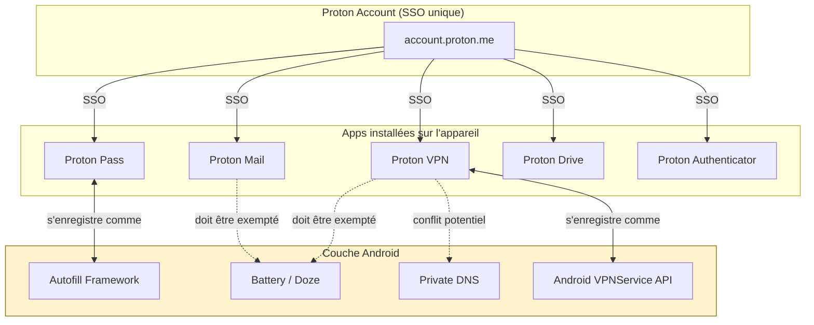
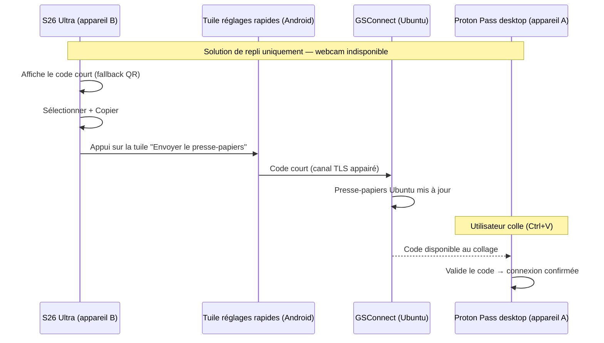
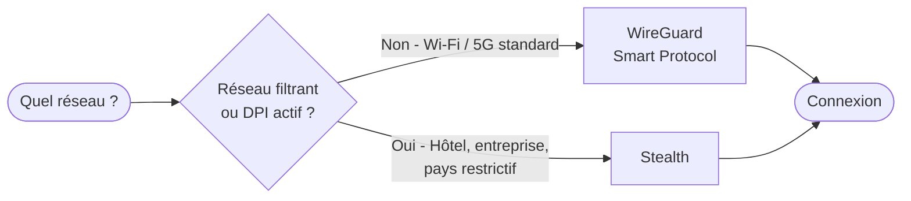
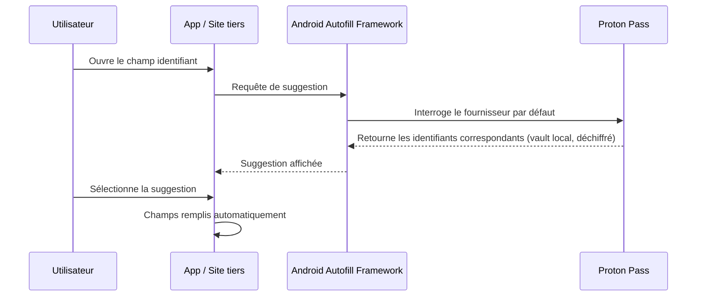
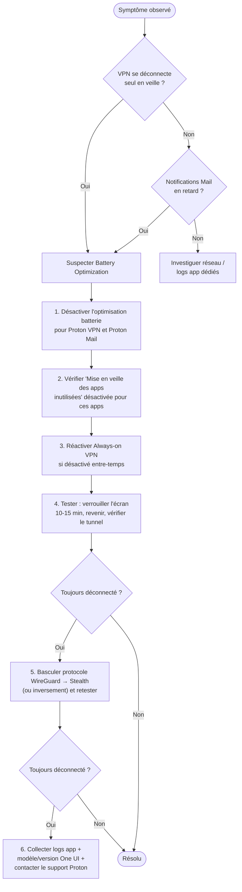

# Configuration Android — suite Proton

!!! abstract "Objectif du document"
    Ce runbook décrit la configuration recommandée de la suite logicielle
    **Proton** (VPN, Pass, Mail, Drive, Authenticator) sur **Android**, à
    partir d'une configuration testée sur un Galaxy S26 Ultra (One UI).

    Les sections ci-dessous sont **génériques Android** — valables sur
    n'importe quel appareil. Seule la section [Spécificités Samsung / One
    UI](#specificites-samsung-one-ui) est dépendante du constructeur et de sa
    surcouche : à revalider en cas de changement de téléphone.

    Sources : documentation officielle Proton (`protonvpn.com/support`,
    `proton.me/support`), consultée le 11 juillet 2026. Les captures d'écran
    et libellés de menus peuvent évoluer avec les versions d'app — ce
    document donne le *chemin logique*, pas des captures figées.

!!! info "Prérequis"
    - Un compte Proton (gratuit ou payant — certaines fonctionnalités
      listées ci-dessous, notamment *split tunneling* et *NetShield*,
      nécessitent un plan payant Proton VPN Plus / Proton Unlimited).
    - Apps installées **depuis le Play Store officiel** (ou APK signé Proton
      si vous évitez Google — voir [Téléchargements
      alternatifs](#telechargements-alternatifs)).

---

## Vue d'ensemble de l'architecture

La suite Proton repose sur un compte unique (Proton Account) partagé par tous
les produits. Chaque app est un client indépendant, mais l'authentification
et le chiffrement de bout en bout (E2EE) sont mutualisés.

!!! note "Agressivité variable selon le constructeur"
    La gestion de batterie en arrière-plan (nœud *Battery / Doze* ci-dessus)
    est plus ou moins agressive selon la surcouche constructeur (Samsung,
    Xiaomi, OnePlus, Huawei…) — c'est la cause n°1 des déconnexions VPN
    intempestives et des notifications Mail manquées. Le détail spécifique à
    Samsung/One UI est traité dans la [section
    dédiée](#specificites-samsung-one-ui) plus bas.

---

## Connexion initiale sans ressaisir le mot de passe (QR code)

Cas d'usage concret et récurrent : réinstaller les apps Proton sur ce
Galaxy S26 Ultra sans jamais taper le mot de passe maître (64 caractères)
sur le clavier tactile du téléphone.

Le mécanisme générique (appareil A déjà connecté / appareil B à connecter,
scan ou saisie manuelle du code) est décrit en détail dans [Runbook 1 — Se
connecter avec un QR
code](runbooks-recuperation.md#runbook-1-se-connecter-avec-un-qr-code). Ici,
uniquement le mapping concret pour ce poste.

**Mapping concret :**

- **Appareil A** (déjà connecté, scanne le QR code) : ce poste Ubuntu, via
  **Proton Pass desktop** et sa webcam.
- **Appareil B** (à connecter, affiche le QR code) : le Galaxy S26 Ultra,
  sur l'app Proton fraîchement réinstallée (Mail, Drive, VPN… n'importe
  laquelle affiche le même écran de connexion par QR code, l'authentification
  étant mutualisée au niveau du compte).

**Procédure (cas normal) :** suivez le Runbook 1 tel quel avec ce mapping —
Étape 1 sur le S26 Ultra pour afficher le QR code, Étape 2 sur Ubuntu/Proton
Pass desktop pour le scanner via la webcam du poste.

### Solution de repli — webcam indisponible

Si la webcam de ce poste est désactivée dans le BIOS, physiquement
obstruée, ou en panne (souci de pilote) au moment où vous en avez besoin, le
scan direct n'est pas utilisable. Repli : le fallback **« Saisir le code
manuellement »** du Runbook 1 (voir l'astuce correspondante), en tapant sur
Ubuntu le code court affiché sur le téléphone.

Si GSConnect est déjà appairé entre ce poste et le téléphone, il permet
d'éviter même cette recopie manuelle :

1. Sur le S26 Ultra, une fois le code court affiché, sélectionnez-le et
   copiez-le (**Copier**).
2. Depuis le volet de réglages rapides (glisser vers le bas depuis le haut
   de l'écran), appuyez sur la tuile **Envoyer le presse-papiers** (voir
   encadré ci-dessous si la tuile n'est pas encore ajoutée).
3. Sur Ubuntu, collez (`Ctrl+V`) dans le champ « Saisir le code
   manuellement » de Proton Pass desktop.

La synchronisation automatique téléphone → Ubuntu est connue pour être peu
fiable dans GSConnect ; l'appui sur cette tuile est le déclencheur manuel
fiable.

!!! info "Ajouter la tuile « Envoyer le presse-papiers » (une seule fois)"
    Sur Android 14+ (ce téléphone), ce bouton n'existe **pas** dans l'écran
    principal de l'app KDE Connect — c'est une tuile de réglages rapides à
    ajouter manuellement :

    1. Glissez vers le bas depuis le haut de l'écran pour ouvrir les
       réglages rapides.
    2. Appuyez sur l'icône crayon/**Modifier** (mode édition des tuiles).
    3. Repérez **« Envoyer le presse-papiers »** dans la liste des tuiles
       disponibles et glissez-la dans la zone active.

    Sur Android 10 à 13 (non applicable ici, mentionné pour référence),
    cette action se présente différemment : un bouton dans la notification
    persistante de KDE Connect plutôt qu'une tuile de réglages rapides.

!!! info "Prérequis GSConnect"
    Dans les préférences GSConnect sur Ubuntu, **Partage → Synchronisation
    du presse-papiers**, les **deux cases** doivent être cochées : **« Vers
    l'appareil »** et **« Depuis l'appareil »** — une seule case cochée ne
    suffit pas, la synchro échoue silencieusement dans le sens manquant.
    Appairage déjà en place sur ce poste.

#### Test de la synchronisation

Vérifiez les deux sens séparément avant d'en dépendre lors d'une vraie
réinstallation :

- **Téléphone → Ubuntu** : copiez un texte quelconque sur le S26 Ultra,
  appuyez sur la tuile **Envoyer le presse-papiers** (réglages rapides),
  puis `Ctrl+V` sur Ubuntu — le texte doit apparaître.
- **Ubuntu → téléphone** : `Ctrl+C` sur Ubuntu, puis appui long sur un champ
  de saisie du téléphone → **Coller** — fonctionne automatiquement, sans
  action d'envoi équivalente à effectuer côté Ubuntu.

!!! success "✅ Testé le 2026-07-11"
    Les deux sens confirmés fonctionnels sur ce poste — Ubuntu 24.04,
    GSConnect version 57 (visible dans « À propos » de l'extension),
    Galaxy S26 Ultra — une fois les deux cases de synchronisation cochées
    côté GSConnect. Si le comportement diverge sur une autre version de
    GSConnect, cette référence permet de savoir si la cause est un
    changement de version avant de tout redéboguer depuis zéro.

!!! note "Ce qui transite réellement dans le presse-papiers"
    Le code synchronisé via GSConnect est un **code de session éphémère à
    usage unique**, généré pour cette seule tentative de connexion et
    expirant rapidement — **jamais le mot de passe maître Proton**. Le
    canal GSConnect est lui-même chiffré (TLS 1.2, certificat échangé lors
    de l'appairage), mais la distinction importe indépendamment de ce
    chiffrement : un code de session intercepté ne donne accès qu'à cette
    seule tentative de connexion, pas au compte dans son ensemble.

---

## Proton VPN

### Installation et choix du protocole

!!! note "Recommandation officielle"
    Proton recommande l'usage de l'**app officielle** plutôt qu'une
    configuration manuelle (WireGuard natif ou OpenVPN natif), car l'app
    officielle seule donne accès à NetShield, Kill Switch avancé, Split
    Tunneling, Secure Core et à la sélection automatique de serveur.

**Procédure :**

1. Installer *Proton VPN* depuis le Play Store (ou F-Droid / APK signé pour
   une chaîne 100 % libre).
2. Se connecter avec le compte Proton.
3. Dans **Réglages → Connexion → Protocole**, laisser **Smart Protocol**
   (sélection automatique) sauf contrainte réseau spécifique (réseau
   d'entreprise filtrant, captive portal agressif) — dans ce cas, forcer
   **Stealth** (conçu pour contourner le DPI/blocage de VPN).
4. WireGuard est le protocole par défaut le plus performant sur mobile ;
   **OpenVPN n'est pas proposé nativement dans l'app Android** — sur
   l'ensemble des plateformes Proton VPN, OpenVPN n'est disponible que sur le
   client **Linux (GUI)**, WireGuard (UDP/TCP) et Stealth couvrant Android.

### Fonctionnalités avancées — navigation côté app Android

Définitions et détails de chaque fonctionnalité : voir [Proton VPN —
Fonctionnalités avancées](ecosysteme.md#fonctionnalites-avancees) dans
Écosystème et usage. Ici, uniquement les chemins de menu spécifiques à l'app
Android.

**Always-on VPN (niveau OS) :**

1. `Paramètres → Connexions → Plus de paramètres de connexion → VPN`
2. Icône ⚙️ à côté de *Proton VPN* → activer **VPN toujours actif**.
3. Optionnel mais recommandé pour un usage strict : activer **Bloquer les
   connexions sans VPN**.

**Kill Switch, Split Tunneling, NetShield (niveau app) :**

- Kill switch : `Proton VPN → Réglages → Fonctionnalités → Kill switch`
  (Standard activé par défaut, basculer sur Advanced au besoin).
- Split tunneling : `Réglages → Fonctionnalités → Split tunneling` — **penser
  à reconnecter le VPN** après toute modification, le changement n'est pas
  pris en compte à chaud.
- NetShield : `Réglages → Fonctionnalités → NetShield`.

!!! danger "Incompatibilité connue"
    Kill Switch et Split Tunneling **ne sont pas compatibles simultanément**
    sur la plupart des plateformes, Android inclus. Si vous activez le Split
    Tunneling, le Kill Switch doit être désactivé — et inversement.

---

## Proton Pass

### Activation de l'autofill Android

1. Installer *Proton Pass*, se connecter.
2. **Profil → Autofill** → activer.
3. Cela ouvre la page système *Service de saisie automatique Android* :
   sélectionner **Proton Pass** puis **+ Ajouter un service** → confirmer.

!!! tip "Biométrie"
    **Profil → Empreinte digitale** (ou équivalent biométrique) pour
    déverrouiller Pass via le capteur biométrique de l'appareil sans
    ressaisir le mot de passe maître à chaque usage.

### Utilisation

Une fois Proton Pass défini comme service d'autofill par défaut, taper sur un
champ identifiant/mot de passe dans n'importe quelle app ou site déclenche la
suggestion Android native, sans ouverture manuelle de l'app Proton Pass.

!!! note "Limite connue"
    L'autofill des **cartes bancaires** n'est pas encore supporté nativement
    (à la date de rédaction) : il faut copier/coller manuellement les
    champs depuis la fiche carte dans Proton Pass. Le presse-papiers est
    automatiquement vidé après un délai configurable (60 s par défaut,
    modifiable dans **Profil → Réglages → Presse-papiers**).

---

## Proton Mail

!!! warning "Pas de client tiers"
    Proton Mail **ne s'intègre pas** avec les clients mail tiers Android
    (Gmail app, K-9, etc.) : ces clients ne peuvent pas effectuer le
    chiffrement/déchiffrement E2EE requis. Seule l'app officielle Proton Mail
    (ou le webmail via navigateur) permet un accès complet côté mobile.

    Sur desktop uniquement, l'app **Proton Mail Bridge** ([voir
    ecosysteme.md](ecosysteme.md#proton-mail-bridge)) permet de connecter
    Outlook / Thunderbird / Apple Mail en local — non pertinent sur mobile.

1. Installer *Proton Mail*, se connecter avec le compte Proton.
2. **Auto-lock** (verrouillage applicatif indépendant du verrouillage OS) :
   Réglages → **Auto lock** → définir un code PIN + délai, activer la
   biométrie.
3. **Actions de balayage** (swipe) : Réglages → **Swipe actions** — par
   défaut archivage ; personnalisable (corbeille, spam, marquer lu/non lu…).
4. **Organisation** : Dossiers (menu hamburger → *Créer un dossier*, supporte
   les sous-dossiers) et Labels (menu hamburger → *Créer un label* —
   orthogonaux aux dossiers, utiles pour du tagging transverse).

---

## Proton Drive

### Sauvegarde photo automatique

1. Installer *Proton Drive*, se connecter.
2. Aller dans l'onglet dédié à la sauvegarde photo et l'activer : toutes les
   photos/vidéos du téléphone sont alors chiffrées de bout en bout et
   synchronisées vers le cloud Proton.
3. Les formats image/vidéo supportés et la configuration système minimale
   sont documentés officiellement — vérifier en cas d'échec de sauvegarde
   sur un format exotique (RAW propriétaire, par exemple).

!!! note "Fichiers vs photos"
    L'upload manuel de fichiers/dossiers (**Fichiers → Upload**) est une
    fonctionnalité séparée de la sauvegarde photo automatique — les deux
    peuvent être utilisées conjointement.

---

## Téléchargements alternatifs

Toutes les apps Proton sont disponibles en **APK signé** directement depuis
`protonapps.com`, hors Play Store, ainsi que sur **F-Droid** pour Proton VPN
et Proton Pass — utile pour une chaîne d'installation sans dépendance Google.

---

## Spécificités Samsung / One UI

!!! warning "Contenu dépendant de l'appareil"
    Tout ce qui suit est propre à Samsung/One UI (testé sur Galaxy S26
    Ultra) — libellés de menus et comportements à **revalider en cas de
    changement de téléphone** ou de montée de version majeure d'One UI.

C'est le point de friction le plus fréquemment rapporté par les utilisateurs
Samsung : One UI ferme agressivement les processus d'arrière-plan pour
préserver l'autonomie perçue, ce qui coupe le tunnel VPN et retarde/bloque
les notifications Mail.

### Battery optimization

!!! example "Étape 1 — Exempter les apps de l'optimisation batterie"
    1. `Paramètres → Applications → Proton VPN`
    2. **Batterie** → **Sans restriction** (ou "Non optimisée" selon la
       version One UI).
    3. Répéter pour **Proton Mail** (et Proton Pass si vous constatez des
       problèmes d'autofill après longue veille).

!!! example "Étape 2 — Désactiver la mise en veille automatique de l'app"
    Sur One UI, un mécanisme distinct de la battery optimization standard
    Android (Doze) peut remettre une app en "sommeil" après une période
    d'inactivité :

    1. `Paramètres → Applications → [voir tout] → menu ⋮ → Optimisation batterie`
       *(ou : Paramètres → Batterie → Limites d'utilisation en arrière-plan)*
    2. S'assurer que Proton VPN et Proton Mail **ne figurent pas** dans la
       liste des apps mises en veille / limitées / en veille profonde.

!!! example "Étape 3 — Vérifier la cohérence Always-on VPN"
    Après un changement de réglage batterie, Android désactive parfois
    silencieusement le VPN "toujours actif". Revérifier :
    `Paramètres → Connexions → Plus de paramètres de connexion → VPN → ⚙️ Proton VPN`.

!!! tip "Test de non-régression"
    Verrouiller l'écran, patienter 10 à 15 minutes (Doze mode s'active après
    ce délai d'inactivité sur écran verrouillé), déverrouiller, et vérifier
    dans l'app Proton VPN que le tunnel est resté actif (statut vert). Ce test
    est le critère de validation de la procédure — à documenter comme gate
    avant de considérer l'incident clos.

### Secure Folder (Knox)

Si vous utilisez le **Secure Folder** (conteneur Knox isolé) pour dupliquer
certaines apps Proton, sachez que chaque instance (normale vs Secure Folder)
a **ses propres réglages batterie et son propre état de connexion VPN** — les
deux environnements ne partagent pas le tunnel VPN par défaut. Documentez
clairement quelle instance est utilisée en cas de ticket support.

---

## Checklist de mise en production personnelle

| # | Élément | Statut attendu |
|---|---------|-----------------|
| 1 | Proton VPN — Always-on VPN | ✅ Activé |
| 2 | Proton VPN — Kill Switch | Standard ou Advanced (pas les deux avec Split Tunneling) |
| 3 | Proton VPN — Battery optimization *(Samsung/One UI)* | Sans restriction |
| 4 | Proton VPN — Private DNS Android | Automatique / désactivé |
| 5 | Proton Pass — Autofill | Défini comme service par défaut |
| 6 | Proton Pass — Biométrie | Activée |
| 7 | Proton Mail — Battery optimization *(Samsung/One UI)* | Sans restriction |
| 8 | Proton Mail — Auto-lock | Activé (PIN + biométrie) |
| 9 | Proton Drive — Sauvegarde photo | Activée si usage souhaité |
| 10 | Test Doze mode *(Samsung/One UI, §Battery optimization)* | Passé |

---

## Références

- [Setup guide for new users — Proton VPN](https://protonvpn.com/support/protonvpn-setup-guide)
- [How to use Proton VPN on Android — Proton VPN](https://protonvpn.com/support/best-android-vpn-app)
- [How to manually configure WireGuard on Android — Proton VPN](https://protonvpn.com/support/wireguard-manual-android)
- [Proton VPN for Android release notes](https://protonvpn.com/support/release-notes-android)
- [How to use kill switch — Proton VPN](https://protonvpn.com/support/what-is-kill-switch)
- [How to use advanced kill switch — Proton VPN](https://protonvpn.com/support/advanced-kill-switch)
- [How to use split tunneling — Proton VPN](https://protonvpn.com/support/protonvpn-split-tunneling)
- [Proton VPN Features overview](https://protonvpn.com/support/protonvpn-features)
- [How to stop Android from killing Proton VPN — Proton VPN](https://protonvpn.com/support/android-vpn-disconnect)
- [How to set up Proton Pass on Android — Proton](https://proton.me/support/pass-setup-android)
- [How to use Proton Pass on Android — Proton](https://proton.me/support/use-pass-android)
- [Using Proton Mail on Android — Proton](https://proton.me/support/mail-android)
- [How to set up Proton Drive — Proton](https://proton.me/support/set-up-proton-drive)
- [Mobile applications — Proton Drive](https://proton.me/support/drive/mobile-drive)
- [Download all Proton apps](https://protonapps.com/)
