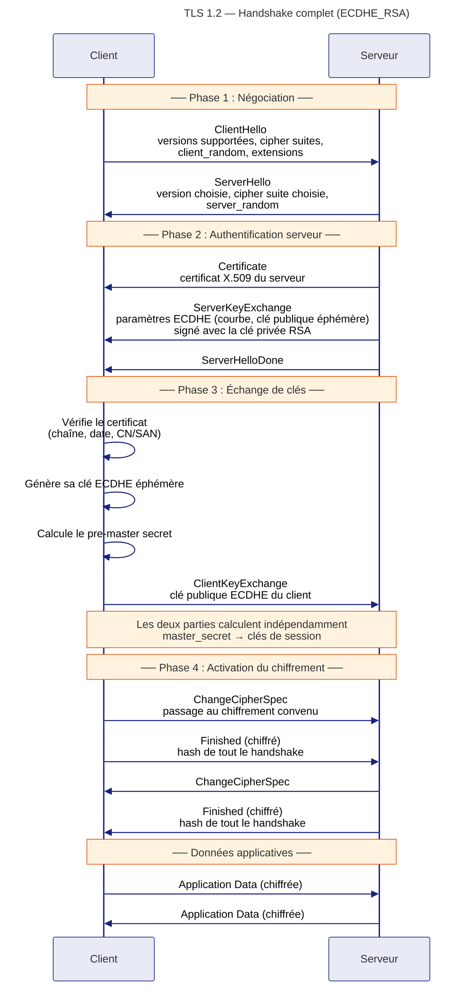
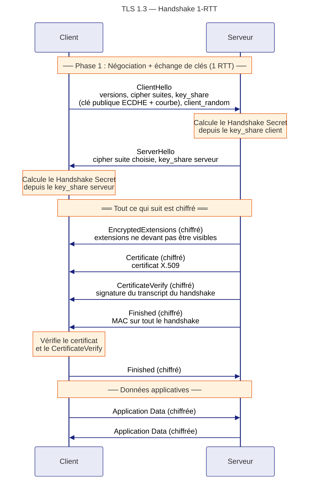
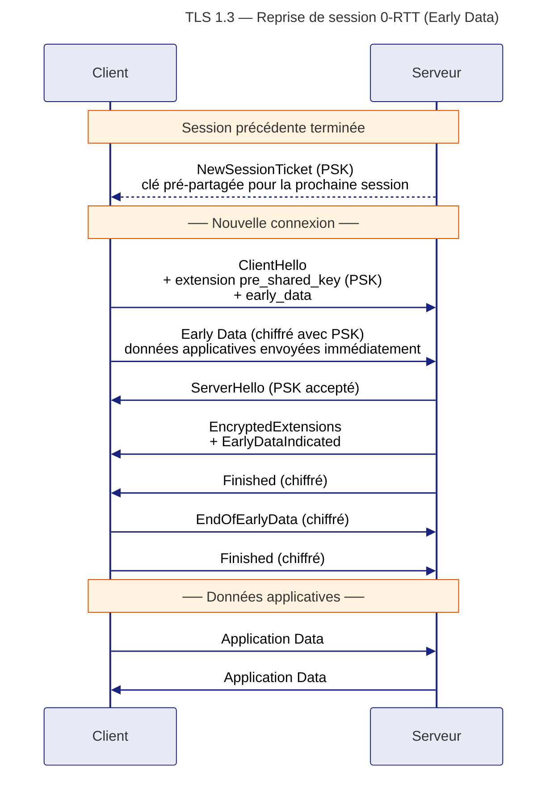
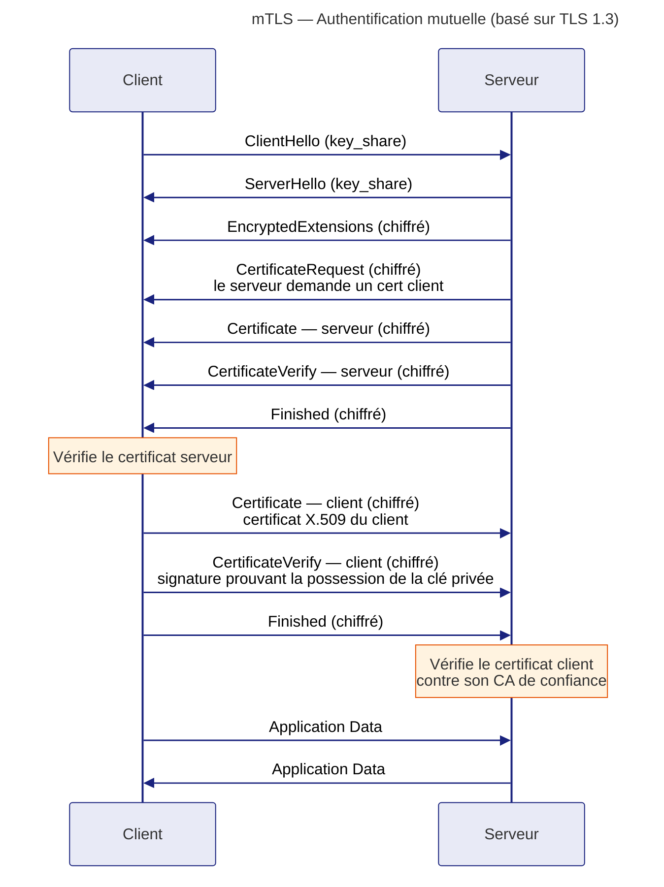
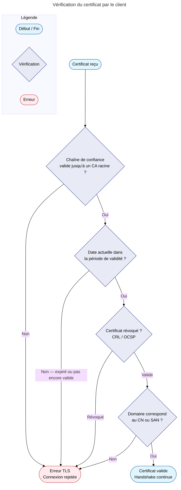

# Handshake TLS

Le handshake est la phase de négociation initiale entre client et serveur. Il établit :

- la version TLS et la suite cryptographique à utiliser
- le secret partagé (via échange de clés)
- l'identité du serveur (via son certificat)

---

## TLS 1.2 — Handshake complet



### Points clés TLS 1.2

- **2 allers-retours (2-RTT)** avant l'envoi des données applicatives
- Le `ClientKeyExchange` contient la clé publique ECDHE éphémère du client
- Le `ServerKeyExchange` est signé par la clé privée du serveur → authentification
- `ChangeCipherSpec` signale l'activation du chiffrement — **pas** un message chiffré lui-même
- `Finished` est le premier message chiffré ; il contient un hash de tous les messages du handshake pour détecter toute falsification

---

## TLS 1.3 — Handshake 1-RTT

TLS 1.3 fusionne plusieurs étapes et démarre le chiffrement beaucoup plus tôt.



### Ce qui change par rapport à TLS 1.2

| Aspect | TLS 1.2 | TLS 1.3 |
|--------|---------|---------|
| Allers-retours | 2-RTT | **1-RTT** |
| Début du chiffrement | Après ChangeCipherSpec | Dès le ServerHello |
| Certificat visible | Oui (en clair) | **Non (chiffré)** |
| ChangeCipherSpec | Obligatoire | Supprimé (maintenu pour compatibilité uniquement) |
| Paramètres ECDHE | Échangés après ServerHello | **Inclus dans ClientHello** |

---

## TLS 1.3 — Reprise de session (0-RTT)

Lorsqu'une session précédente existe, TLS 1.3 permet au client d'envoyer des données applicatives **dans le premier message**, sans attendre le handshake complet.



!!! warning "Risque de rejeu (Replay Attack) avec 0-RTT"
    Les données 0-RTT peuvent être rejouées par un attaquant qui a capturé le premier message. N'utilisez le 0-RTT que pour des **requêtes idempotentes** (GET, lectures) — jamais pour des opérations à effet de bord (paiement, modification de données).

---

## mTLS — Authentification mutuelle

Dans le TLS classique, seul le **serveur** s'authentifie. En mTLS (*mutual TLS*), le **client** présente également un certificat. C'est le standard pour les communications entre microservices, les API B2B et les VPN d'entreprise.



### Cas d'usage du mTLS

| Contexte | Exemple |
|----------|---------|
| Microservices | Service mesh (Istio, Linkerd) |
| API B2B | Partenaires bancaires (PSD2) |
| Accès VPN | Connexion à un réseau d'entreprise |
| Appareils IoT | Authentification d'un capteur auprès d'un serveur |
| CI/CD | Runner GitLab s'authentifiant auprès d'une API interne |

---

## Vérification du certificat

À chaque handshake, le client effectue plusieurs vérifications sur le certificat reçu :



### OCSP Stapling

Sans OCSP Stapling, le client interroge lui-même l'autorité de certification pour vérifier si le certificat a été révoqué — ce qui ajoute une requête réseau supplémentaire.

Avec OCSP Stapling, le **serveur** intègre directement la réponse OCSP (signée par le CA) dans le handshake TLS. Le client n'a plus besoin de contacter le CA.

```
# Nginx — activer OCSP Stapling
ssl_stapling on;
ssl_stapling_verify on;
resolver 1.1.1.1 8.8.8.8;
```
