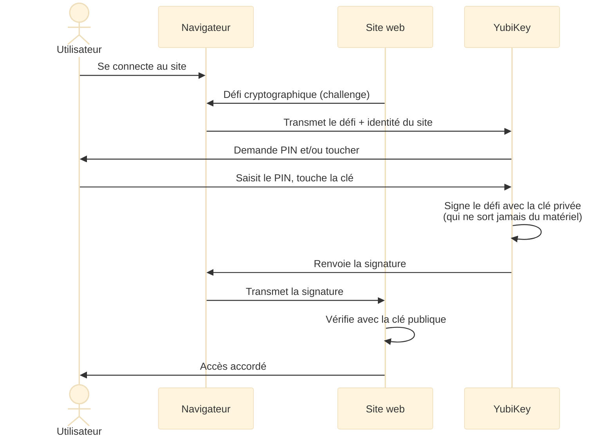

# YubiKey — Security Key C NFC

Une **clé de sécurité matérielle** est un petit appareil USB (ou NFC) qui
prouve votre identité lors d'une connexion. Contrairement à un mot de passe,
elle ne peut être ni devinée, ni volée par hameçonnage (*phishing*) : le
secret cryptographique ne quitte **jamais** la clé, et celle-ci vérifie
l'identité réelle du site avant de répondre.

Cette page documente la clé utilisée ici — la **Security Key C NFC** de
Yubico (la clé « bleue ») — puis explique comment l'exploiter au mieux, et
enfin ce qu'apporterait le modèle haut de gamme (YubiKey 5).

!!! info "Prérequis"
    Aucune connaissance préalable n'est nécessaire. Les notions utiles
    (FIDO2, passkey, credential…) sont expliquées au fil de la page.
    Pour les manipulations SSH, savoir ouvrir un terminal suffit.

## Tutoriels

<div class="grid cards" markdown>

-   :material-source-branch: **[Clé SSH matérielle et GitHub](ssh-github.md)**

    Génération pas à pas de la clé `ed25519-sk`, dépôt sur GitHub,
    et résolution des problèmes rencontrés (agent GNOME, PIN…).

-   :material-backup-restore: **[Réinstallation du poste](reinstallation.md)**

    Remonter Ubuntu de zéro en s'amorçant sur la YubiKey :
    restauration de la clé SSH, clone des dépôts, stow, postinstall.

</div>

---

## Caractéristiques de la clé

Résultat de `ykman info` avec la clé branchée :

| Caractéristique | Valeur |
|---|---|
| Modèle | Security Key C NFC (gamme « bleue ») |
| Firmware | 5.7.4 |
| Connectique | USB-C + NFC (sans contact) |
| Format | Porte-clés (*keychain*) |
| Protocoles | FIDO2 / WebAuthn et FIDO U2F **uniquement** |
| Passkeys stockables | 100 credentials résidents |
| PIN FIDO2 | Oui (8 essais avant blocage) |

### Applications disponibles

La gamme Security Key est volontairement limitée à FIDO. Les applications
« avancées » sont réservées à la gamme YubiKey 5 (voir
[la comparaison en fin de page](#differences-avec-une-yubikey-5)) :

| Application | Security Key (bleue) | Usage |
|---|:---:|---|
| FIDO2 / WebAuthn | :material-check: | Passkeys, 2FA web, SSH, sudo |
| FIDO U2F | :material-check: | 2FA web (ancien protocole) |
| OpenPGP | :material-close: | Signature/chiffrement GPG |
| PIV (carte à puce) | :material-close: | Certificats X.509, login AD |
| OATH (TOTP/HOTP) | :material-close: | Codes 2FA à 6 chiffres |
| Yubico OTP | :material-close: | Protocole propriétaire (obsolète) |

---

## Comprendre les notions clés

### FIDO2, WebAuthn, U2F — qui fait quoi ?

- **FIDO2** est le standard global d'authentification sans mot de passe,
  porté par l'alliance FIDO (*Fast IDentity Online*).
- **WebAuthn** (*Web Authentication*) est la partie « navigateur » de FIDO2 :
  l'API que les sites web utilisent pour dialoguer avec la clé.
- **U2F** (*Universal 2nd Factor*) est l'ancêtre de FIDO2, encore accepté
  par de nombreux sites comme simple second facteur.

### Le déroulement d'une connexion



Le point crucial : la clé vérifie **l'identité exacte du site** (son domaine)
avant de signer. Un site frauduleux imitant `github.com` n'obtiendra jamais
de signature valide — c'est ce qui rend la clé immunisée contre le phishing.

### Credential résident ou non ?

| Type | Stocké où ? | Limite | Usage typique |
|---|---|---|---|
| **Non-résident** | Chez le site (chiffré) | Illimité | 2FA classique |
| **Résident** (*passkey*) | Dans la clé | 100 slots | Connexion sans mot de passe, clé SSH portable |

Un credential **non-résident** ne consomme aucune place dans la clé : le
site stocke un « handle » chiffré que seule la clé sait déverrouiller. Un
credential **résident** vit dans la mémoire de la clé — c'est ce qui permet
de se connecter sans même taper d'identifiant, ou de récupérer sa clé SSH
sur une machine neuve.

!!! warning "Le PIN : 8 essais, pas plus"
    Après 8 saisies erronées, le module FIDO2 se **bloque**. Le seul
    déblocage possible est `ykman fido reset` — qui **efface tous les
    credentials** de la clé. Conserver le PIN dans un gestionnaire de
    mots de passe (Proton Pass, voir la page
    [Proton](../proton.md)).

---

## Exploiter la clé au mieux

### 1. Passkeys et 2FA sur les sites web

C'est l'usage principal, sans aucune configuration système : dans les
paramètres de sécurité de chaque compte, enregistrer la clé comme
« clé de sécurité » ou « passkey ».

Comptes prioritaires à protéger :

- **Messagerie** (Proton, Gmail…) — c'est la porte de récupération de tous
  les autres comptes
- **GitHub / GitLab** — accès au code
- **Gestionnaire de mots de passe** (Bitwarden, Proton Pass)
- **Comptes cloud** (Google, Microsoft, Apple)

!!! tip "NFC = téléphone aussi"
    La clé fonctionne sans contact sur Android et iPhone : approcher la
    clé du dos du téléphone quand le site le demande.

### 2. Clé SSH matérielle (`ed25519-sk`)

OpenSSH (≥ 8.2) sait créer une paire de clés dont la partie privée est
**liée à la YubiKey** : impossible de s'authentifier sans la clé physique
branchée et touchée. Le credential peut être stocké dans la clé elle-même
(*résident*) et récupéré sur toute nouvelle machine avec `ssh-keygen -K`.

La mise en place complète — génération, `~/.ssh/config`, dépôt sur
GitHub, test et résolution des problèmes (agent GNOME notamment) — est
détaillée dans le tutoriel
[Clé SSH matérielle et GitHub](ssh-github.md).

### 3. Signature des commits git (sans GPG)

La gamme bleue ne fait pas d'OpenPGP, mais GitHub accepte la **signature
SSH** des commits — même badge « Verified » qu'avec GPG :

```bash
git config --global gpg.format ssh
git config --global user.signingkey ~/.ssh/id_ed25519_sk.pub
git config --global commit.gpgsign true
```

Ajouter aussi la clé publique sur GitHub comme **Signing Key** (en plus de
l'entrée Authentication Key — ce sont deux déclarations distinctes).

### 4. `sudo` par toucher de clé (`libpam-u2f`)

Le module PAM (*Pluggable Authentication Modules*) `pam_u2f` permet de
valider `sudo` par un simple toucher de la clé, à la place du mot de passe.

```bash
sudo apt install libpam-u2f
mkdir -p ~/.config/Yubico
pamu2fcfg > ~/.config/Yubico/u2f_keys   # (1)!
```

1. Demande le PIN puis un toucher ; écrit la ligne d'enregistrement de la
   clé. Pour ajouter une **seconde clé** : `pamu2fcfg -n >> ~/.config/Yubico/u2f_keys`.

Puis ajouter en **première ligne** de `/etc/pam.d/sudo` :

```text
auth sufficient pam_u2f.so cue
```

`sufficient` = la clé suffit, mais le mot de passe reste accepté en son
absence. `cue` affiche un message invitant à toucher la clé.

!!! danger "Toujours garder une session root ouverte pendant le test"
    Une erreur dans un fichier PAM peut **verrouiller tout accès sudo**.
    Avant de modifier `/etc/pam.d/sudo` : ouvrir un second terminal avec
    `sudo -i` déjà validé, et ne le fermer qu'après avoir vérifié que
    `sudo` fonctionne dans un nouveau terminal.

### 5. Gérer la clé avec `ykman`

`ykman` (YubiKey Manager) est installé via le module
`postinstall/modules/apps/install_yubikey.sh` du dépôt `alm_tools`
(PPA `yubico/stable`).

| Commande | Effet |
|---|---|
| `ykman info` | Modèle, firmware, applications activées |
| `ykman fido info` | État du PIN, slots de passkeys restants |
| `ykman fido credentials list` | Liste les passkeys résidents (PIN requis) |
| `ykman fido credentials delete <id>` | Supprime un passkey résident |
| `ykman fido access change-pin` | Change le PIN FIDO2 |
| `ykman fido reset` | **Efface tout** le module FIDO2 (irréversible) |

---

## Bonnes pratiques

!!! tip "La règle d'or : deux clés"
    Une clé perdue **sans clé de secours** = comptes verrouillés.
    Acheter une seconde clé, l'enregistrer **partout** où la première
    l'est, et la ranger en lieu sûr. Chaque nouveau compte protégé =
    enregistrer les **deux** clés dans la foulée.

- **Noter le PIN** dans un gestionnaire de mots de passe — 8 essais avant
  blocage définitif du module FIDO2.
- **Conserver les codes de récupération** fournis par chaque site lors de
  l'activation de la 2FA — c'est le filet de sécurité indépendant de la clé.
- **Vérifier les slots** de temps en temps : `ykman fido info` indique le
  nombre de passkeys résidents restants (sur 100). La 2FA classique
  (non-résidente) ne consomme rien.
- **Ne jamais lancer `ykman fido reset`** « pour voir » : la commande efface
  tous les credentials, y compris les clés SSH résidentes.

---

## Différences avec une YubiKey 5

La **YubiKey 5** (la clé « noire », ex. *YubiKey 5C NFC*) est le modèle
complet de Yubico. Elle fait tout ce que fait la Security Key bleue —
même firmware, mêmes 100 slots de passkeys, même NFC — **plus** quatre
applications :

| Capacité | Security Key (bleue) | YubiKey 5 (noire) |
|---|:---:|:---:|
| Passkeys / 2FA web (FIDO2, U2F) | :material-check: | :material-check: |
| SSH `ed25519-sk` | :material-check: | :material-check: |
| `sudo` / login PAM | :material-check: | :material-check: |
| Déverrouillage LUKS (`systemd-cryptenroll`) | :material-check: | :material-check: |
| **OpenPGP** — GPG matériel (signature, chiffrement) | :material-close: | :material-check: |
| **OATH** — 32 à 64 codes TOTP (remplace l'app 2FA) | :material-close: | :material-check: |
| **PIV** — carte à puce, certificats X.509, mTLS | :material-close: | :material-check: |
| **Yubico OTP** — protocole historique | :material-close: | :material-check: |
| Prix indicatif | ~30 € | ~60 € |

Ce que la YubiKey 5 changerait concrètement :

=== "OpenPGP"
    Les clés privées GPG (signature, chiffrement, authentification) vivent
    dans la puce, inviolables : signature de commits **GPG** native,
    déchiffrement de fichiers conditionné à la présence physique de la clé,
    SSH via `gpg-agent`. Avec la clé bleue, l'équivalent pour git est la
    signature **SSH** (voir plus haut) — même badge « Verified ».

=== "OATH / TOTP"
    La clé stocke les secrets TOTP (codes à 6 chiffres) à la place d'une
    application de type Google Authenticator. Les codes s'affichent via
    `ykman oath accounts code` ou l'application *Yubico Authenticator*
    (PC et téléphone par NFC). Changer de téléphone ne casse plus la 2FA.

=== "PIV"
    Certificats X.509 pour l'authentification d'entreprise (Active
    Directory, VPN, mTLS). Rarement utile pour un usage personnel.

!!! note "Stratégie recommandée"
    Pour tout ce qui est web, SSH et PAM, la clé bleue est **aussi bonne**
    que la YubiKey 5. Si un besoin GPG ou TOTP matériel apparaît :
    acheter une YubiKey 5 comme clé principale et recycler la bleue en
    **clé de secours** FIDO2 enregistrée partout.

---

## Références

- [Documentation officielle Yubico](https://docs.yubico.com/)
- [ykman — guide CLI](https://docs.yubico.com/software/yubikey/tools/ykman/)
- [GitHub — clés SSH](https://docs.github.com/authentication/connecting-to-github-with-ssh)
- [GitHub — signature SSH des commits](https://docs.github.com/authentication/managing-commit-signature-verification/about-commit-signature-verification)
- [Yubico — pam_u2f](https://developers.yubico.com/pam-u2f/)
