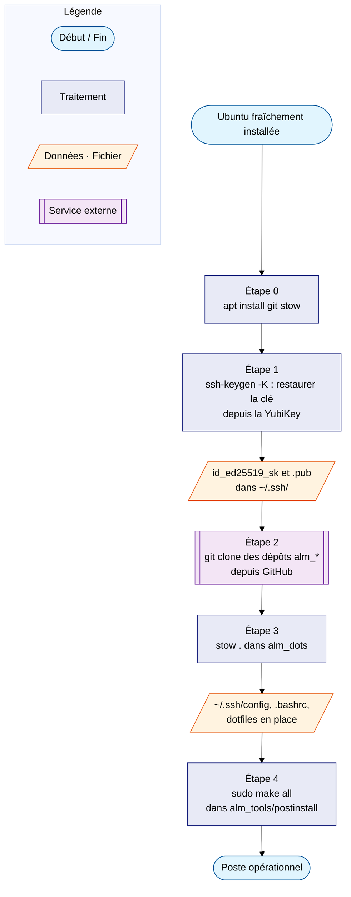

# Réinstallation du poste

Procédure complète pour remonter le poste après une réinstallation
d'Ubuntu, en repartant de **zéro fichier local** : la YubiKey sert de
point d'amorçage. Elle contient le credential SSH résident, ce qui
permet de cloner les dépôts personnels sans avoir restauré quoi que
ce soit au préalable.

!!! info "Prérequis"
    - La YubiKey (credential SSH résident créé selon le tutoriel
      [Clé SSH matérielle et GitHub](ssh-github.md)) et son **PIN**
    - Une Ubuntu fraîchement installée avec un accès Internet
    - Les dépôts `alm_dots`, `alm_tools` et `alm_notes` à jour sur
      GitHub (tout ce qui n'est pas poussé est perdu avec le disque)

---

## Vue d'ensemble



Le principe : sans la YubiKey, cloner les dépôts exigerait de
restaurer une clé SSH depuis une sauvegarde — l'œuf et la poule.
Avec un credential **résident**, la clé SSH renaît depuis le matériel
en une commande.

---

## Étape 0 — Installer git et stow

Sur une Ubuntu Desktop fraîche, OpenSSH et `libfido2` (le support
FIDO2) sont présents d'office, mais **pas** `git` ni `stow` :

```bash
sudo apt update && sudo apt install -y git stow
```

---

## Étape 1 — Restaurer la clé SSH depuis la YubiKey

```bash
mkdir -p ~/.ssh && chmod 700 ~/.ssh
cd ~/.ssh
ssh-keygen -K                              # (1)!
mv id_ed25519_sk_rk id_ed25519_sk          # (2)!
mv id_ed25519_sk_rk.pub id_ed25519_sk.pub
chmod 600 id_ed25519_sk
```

1. Demande le PIN de la YubiKey, puis extrait les credentials
   résidents sous forme de fichiers.
2. `ssh-keygen -K` nomme les fichiers avec le suffixe `_rk`
   (*resident key*). Le renommage n'est **pas optionnel** : le
   `~/.ssh/config` (restauré à l'étape 3) attend `id_ed25519_sk`.

!!! note "Clés logicielles (GitLab pro…)"
    Seule la clé YubiKey renaît ainsi. Les clés SSH logicielles
    classiques ne se restaurent pas : en régénérer une nouvelle
    (`ssh-keygen -t ed25519`) et déposer la clé publique sur le
    serveur concerné (GitLab…). Une clé logicielle se remplace,
    elle ne se transporte pas.

---

## Étape 2 — Cloner les dépôts

```bash
cd ~
git clone git@github.com:namnetes/alm_dots.git
git clone git@github.com:namnetes/alm_tools.git
git clone git@github.com:namnetes/alm_notes.git
```

Deux comportements **normaux** à ce stade :

- Au premier contact, SSH demande de valider l'empreinte de
  `github.com` (le `known_hosts` est vide) → répondre `yes` ;
- Le **PIN + toucher** sont demandés à chaque clone.

??? note "Pourquoi ça marche sans ~/.ssh/config ?"
    Aucune config SSH n'existe encore — ni `IdentitiesOnly`, ni
    `IdentityAgent none`. SSH essaie par défaut les fichiers `id_*`
    standards de `~/.ssh/`, dont `id_ed25519_sk`. Et l'agent GNOME
    ne connaît pas encore la clé, il ne peut donc pas interférer
    (voir [le problème `agent refused operation`](ssh-github.md#agent-refused-operation)).

---

## Étape 3 — Déployer les dotfiles avec stow

```bash
cd ~/alm_dots
stow --simulate .     # (1)!
stow .
source ~/.bashrc
```

1. Répétition générale sans toucher au disque. Une Ubuntu neuve crée
   des `.bashrc` / `.profile` par défaut qui entrent en **conflit**
   avec ceux du dépôt : supprimer (ou déplacer) les fichiers d'origine
   signalés avant de lancer le vrai `stow .`.

À partir d'ici, le `~/.ssh/config` complet est de retour : GitHub
repasse sur le circuit propre (`IdentitiesOnly`, `IdentityAgent none`),
les alias et fonctions shell sont disponibles.

---

## Étape 4 — Provisionner la machine

```bash
cd ~/alm_tools/postinstall
sudo make all
```

Le Makefile enchaîne `system → cli → apps → desktop → devtools` :
paquets APT/Snap, outils CLI (uv, starship, fzf…), applications
(dont `ykman` via le module `install_yubikey.sh`), réglages GNOME et
outils de dev. Chaque exécution écrit un journal dans
`/var/log/postinstall_<timestamp>.log`.

!!! tip "Rejouable sans risque"
    Les modules de `postinstall` sont idempotents : en cas
    d'interruption, relancer `sudo make all` reprend sans dégât.

---

## Après la réinstallation

- **Passkeys web** : rien à refaire — les enregistrements FIDO2
  (GitHub, Proton…) sont indépendants du poste.
- **Clés logicielles** : régénérer la clé GitLab pro et la déposer
  sur le serveur (voir l'admonition de l'étape 1).
- **`~/.gitconfig.local`** : recréer les surcharges machine
  (email pro, clé de signature…) — ce fichier n'est volontairement
  pas versionné.
- **Wiki** : `cd ~/alm_notes && uv sync` puis `make docs` pour
  vérifier que la documentation se sert correctement.

!!! tip "Tutoriel complet du poste"
    Cette page couvre l'amorçage sécurité (YubiKey → SSH → dépôts).
    Le déploiement complet de la machine — dotfiles, services systemd,
    finitions et vérifications — est détaillé dans
    [Ubuntu — Déploiement après installation fraîche](../../systeme/ubuntu/deploiement-post-installation.md).
