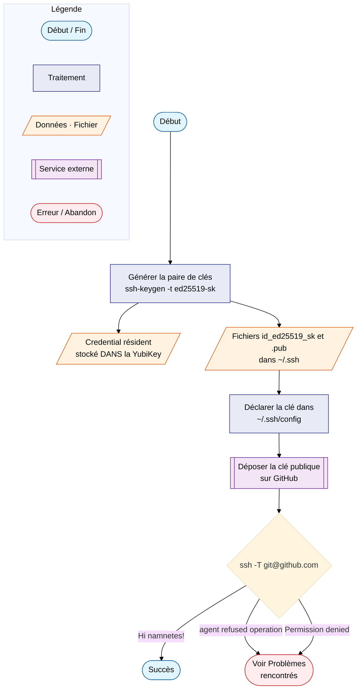

# Tutoriel — Clé SSH matérielle et GitHub

Ce tutoriel décrit pas à pas la création d'une clé SSH **liée à la
YubiKey** (type `ed25519-sk`) et son dépôt sur GitHub. Résultat : plus
aucune authentification GitHub possible sans la clé physique branchée,
un PIN saisi et un toucher sur la clé.

Il documente aussi les **problèmes réellement rencontrés** lors de la
mise en place (agent GNOME, permission refusée) et leurs solutions.

!!! info "Prérequis"
    - Une clé YubiKey avec FIDO2 et un **PIN déjà défini**
      (voir [la page YubiKey](index.md))
    - OpenSSH ≥ 8.2 (`ssh -V`) — toute Ubuntu récente convient
    - La bibliothèque `libfido2-1` installée (présente par défaut
      avec OpenSSH sur Ubuntu)

---

## Vue d'ensemble



La paire générée est particulière : le fichier « privé »
`~/.ssh/id_ed25519_sk` n'est qu'un **pointeur** vers le credential qui
vit dans la YubiKey. Volé sans la clé physique, il est inutilisable.

---

## Étape 1 — Générer la clé

```bash
ssh-keygen -t ed25519-sk \
    -O resident \                # (1)!
    -O verify-required \         # (2)!
    -O application=ssh:github \  # (3)!
    -f ~/.ssh/id_ed25519_sk \
    -C "keltalan@proton.me"
```

1. Stocke le credential **dans** la YubiKey : sur une machine neuve,
   `ssh-keygen -K` régénère les fichiers sans rien copier.
2. Exige le PIN **en plus** du toucher à chaque usage. Protection
   maximale, mais PIN demandé à chaque `git push` — voir
   [le compromis en fin de page](#pin-demande-a-chaque-git-push).
3. Étiquette le credential — visible ensuite dans
   `ykman fido credentials list`.

Déroulement interactif :

```text
Generating public/private ed25519-sk key pair.
You may need to touch your authenticator to authorize key generation.
Enter PIN for authenticator:            ← saisir le PIN FIDO2
                                        ← la clé clignote : LA TOUCHER
Enter passphrase (empty for no passphrase):   ← Entrée (vide)
Enter same passphrase again:                  ← Entrée (vide)
Your identification has been saved in /home/galan/.ssh/id_ed25519_sk
```

!!! tip "Passphrase vide : c'est voulu"
    Le fichier `id_ed25519_sk` est inutilisable sans la YubiKey
    physique, et le PIN protège déjà contre le vol de la clé physique.
    Une passphrase ajouterait un 3ᵉ secret sans bénéfice réel.

---

## Étape 2 — Déclarer la clé dans `~/.ssh/config`

```text
Host github.com
  User git
  IdentityFile ~/.ssh/id_ed25519_sk
  IdentitiesOnly yes
  IdentityAgent none
```

Chaque directive a sa raison d'être :

| Directive | Pourquoi |
|---|---|
| `IdentitiesOnly yes` | Ne présenter **que** cette clé — sans elle, l'agent propose toutes ses clés (y compris une éventuelle clé pro : fuite d'identité) |
| `IdentityAgent none` | Contourner l'agent SSH pour ce host — **indispensable avec l'agent GNOME**, voir [Problèmes rencontrés](#agent-refused-operation) |

---

## Étape 3 — Déposer la clé publique sur GitHub

1. Afficher la clé publique :

    ```bash
    cat ~/.ssh/id_ed25519_sk.pub
    ```

    Elle commence par `sk-ssh-ed25519@openssh.com` (le préfixe `sk-`
    signale une clé matérielle).

2. Ouvrir [github.com/settings/ssh/new](https://github.com/settings/ssh/new)
   (*Settings → SSH and GPG keys → New SSH key*).

3. Renseigner :
    - **Title** : un nom identifiant la clé et la machine, ex.
      `YubiKey Security Key C NFC — coruscant`
    - **Key type** : `Authentication Key`
    - **Key** : coller la ligne complète du `.pub`

!!! note "Authentication Key ≠ Signing Key"
    GitHub distingue deux usages pour une même clé : l'authentification
    (clone/push) et la **signature de commits** (badge « Verified »).
    Pour signer, il faut déposer la même clé publique une **seconde
    fois** avec le type `Signing Key`.

---

## Étape 4 — Tester

```bash
ssh -T git@github.com
```

Déroulement attendu :

```text
Enter PIN for ED25519-SK key /home/galan/.ssh/id_ed25519_sk:   ← PIN
Confirm user presence for key ED25519-SK                       ← toucher
Hi namnetes! You've successfully authenticated, but GitHub
does not provide shell access.
```

À partir de là, chaque `git push` / `git pull` / `git fetch` suit le
même rituel : PIN + toucher.

### Cas pratique — `git -C ~/alm_notes push`

Commande type pour pousser le dépôt de notes **sans quitter le
répertoire courant** :

```bash
git -C ~/alm_notes push
```

L'option `-C <chemin>` (majuscule) fait exécuter git *comme si* la
commande était lancée depuis ce répertoire — l'équivalent de
`cd ~/alm_notes && git push` sans le `cd`, donc sans changer le
répertoire du shell. Ne pas confondre avec `-c clé=valeur`
(minuscule), qui passe une option de configuration.

Le déroulement complet, maillon par maillon :

1. `-C ~/alm_notes` → git travaille sur `~/alm_notes/.git` ;
2. `push` → la branche courante part vers son remote (`origin`,
   URL SSH `git@github.com:...`) ;
3. la connexion à `github.com` applique le bloc `Host github.com`
   du `~/.ssh/config` : clé `id_ed25519_sk`, agent contourné
   (`IdentityAgent none`) ;
4. la clé étant `verify-required`, OpenSSH demande dans le
   terminal : `Enter PIN for ED25519-SK key ...` → **saisir le
   PIN** ;
5. `Confirm user presence for key ED25519-SK` → la YubiKey
   clignote, **la toucher** ;
6. le push s'exécute.

Sans la YubiKey branchée, la commande échoue — c'est le comportement
attendu : aucun push possible sans la clé physique.

---

## Problèmes rencontrés

### `agent refused operation`

```text
sign_and_send_pubkey: signing failed for ED25519-SK
"/home/galan/.ssh/id_ed25519_sk" from agent: agent refused operation
git@github.com: Permission denied (publickey).
```

**Cause** — Sur Ubuntu avec GNOME, l'agent SSH par défaut est
`gcr-ssh-agent` (celui du trousseau GNOME, socket
`/run/user/1000/keyring/ssh`). Il charge volontiers la clé `ed25519-sk`
(elle apparaît dans `ssh-add -l`), mais **ne sait pas déclencher la
demande de PIN** qu'exige `verify-required` — il refuse donc de signer.

**Diagnostic** — identifier l'agent en service :

```bash
echo "$SSH_AUTH_SOCK"
# /run/user/1000/keyring/ssh   ← agent GNOME (gcr) = le problème
```

**Solution** — contourner l'agent pour ce host uniquement, en ajoutant
dans le bloc `Host github.com` :

```text
  IdentityAgent none
```

SSH lit alors le fichier de clé directement et gère lui-même la
demande de PIN dans le terminal. Les autres connexions (autres clés,
autres hosts) continuent d'utiliser l'agent GNOME normalement.

??? note "Alternative non retenue : remplacer l'agent GNOME"
    Il est possible de désactiver `gcr-ssh-agent` et d'activer le
    véritable agent OpenSSH (`systemctl --user enable --now
    ssh-agent.socket` + export de `SSH_AUTH_SOCK`). Plus invasif :
    cela change le comportement de déverrouillage des clés à
    l'ouverture de session pour tout le bureau. Le contournement
    par host est suffisant et sans effet de bord.

### `Permission denied (publickey)` seul

Si le PIN et le toucher se passent bien mais que GitHub refuse :

- La clé publique n'est **pas déposée** sur GitHub, ou pas avec le
  type `Authentication Key` → vérifier sur
  [github.com/settings/keys](https://github.com/settings/keys) ;
- SSH ne présente pas la bonne clé → vérifier avec
  `ssh -G github.com | grep identityfile` que c'est bien
  `id_ed25519_sk`, et que `IdentitiesOnly yes` est présent ;
- En dernier recours, `ssh -vT git@github.com` montre chaque clé
  offerte et la réponse du serveur.

### PIN demandé à chaque `git push`

Ce n'est pas un bug : `verify-required` impose la vérification
utilisateur à **chaque** signature, et l'agent étant contourné, rien
n'est mis en cache. C'est le compromis sécurité/confort choisi.

Pour ne garder que le toucher (sans PIN), régénérer la clé **sans**
`-O verify-required`, puis remplacer la clé publique sur GitHub.
Le toucher physique reste exigé à chaque opération — la protection
anti-malware demeure, seule la protection anti-vol du PIN disparaît.

### PIN bloqué (8 échecs)

Le module FIDO2 se verrouille après 8 PIN erronés. Seule issue :
`ykman fido reset`, qui **efface tous les credentials** de la clé —
y compris cette clé SSH et les passkeys web. Il faut ensuite tout
réenregistrer. D'où l'importance de noter le PIN dans un gestionnaire
de mots de passe.

---

## Récupérer la clé sur une nouvelle machine

C'est le bénéfice du `-O resident` : le credential voyage dans la
YubiKey.

```bash
cd ~/.ssh
ssh-keygen -K        # (1)!
mv id_ed25519_sk_rk id_ed25519_sk            # (2)!
mv id_ed25519_sk_rk.pub id_ed25519_sk.pub
chmod 600 id_ed25519_sk
```

1. Demande le PIN, puis extrait les credentials résidents de la clé
   sous forme de fichiers `*_rk`.
2. `ssh-keygen -K` nomme les fichiers avec un suffixe `_rk`
   (*resident key*) — les renommer pour correspondre au
   `~/.ssh/config`.

Reste à reporter le bloc `Host github.com` dans le `~/.ssh/config`
de la nouvelle machine — rien à ajouter côté GitHub, c'est la même
clé.

Pour le scénario complet (dotfiles, dépôts, provisionnement), voir
[Réinstallation du poste](reinstallation.md).

---

## Aller plus loin

- Utiliser la même clé pour **signer les commits** (badge
  « Verified ») : `git config gpg.format ssh` + dépôt de la clé en
  *Signing Key* — voir [la page YubiKey](index.md#3-signature-des-commits-git-sans-gpg).
- Enregistrer une **seconde clé matérielle** de secours sur GitHub
  avant de supprimer l'ancienne clé logicielle.
