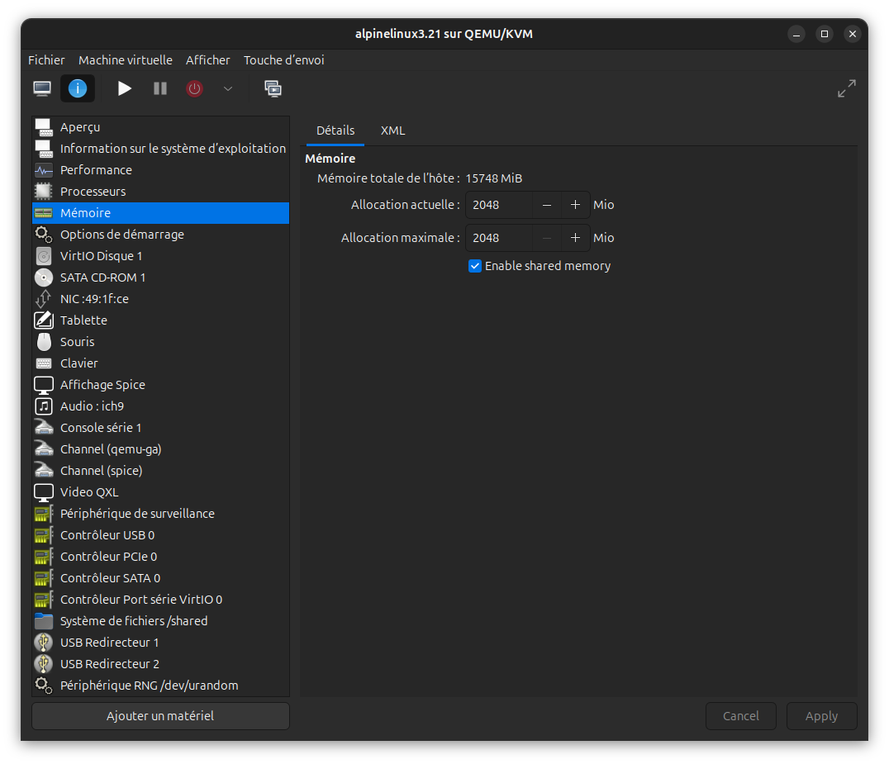
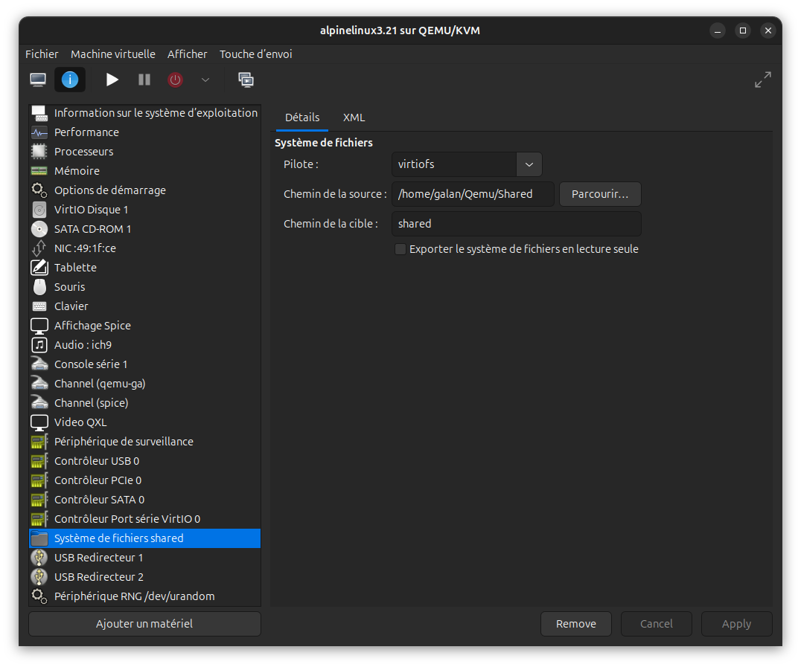
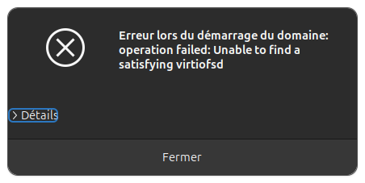
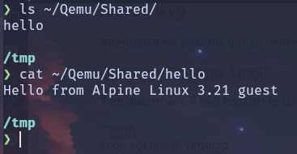

# Partage de répertoires via VirtioFS

VirtioFS est un mécanisme de partage de répertoires entre un hôte Linux et une machine virtuelle KVM.
Il repose sur le démon `virtiofsd` côté hôte et sur le module noyau `virtiofs` côté VM.
Les transferts transitent par une zone de mémoire partagée (fenêtre DAX), ce qui lui confère de meilleures performances que l'ancienne solution 9p/VirtFS.

## Prérequis

| Composant | Exigence |
|---|---|
| Hôte | Linux avec `libvirt`, `virt-manager`, `virtiofsd` |
| VM | Alpine Linux avec noyau ≥ 5.4 (module `virtiofs` inclus) |
| VM | Mémoire partagée activée dans la configuration libvirt |

!!! warning "virtiofsd côté hôte uniquement"
    `virtiofsd` est un démon qui s'exécute sur l'**hôte**. Il ne doit pas être installé dans la VM invitée. Côté Alpine, le support virtiofs est assuré entièrement par le noyau — aucun paquet supplémentaire n'est nécessaire dans la VM.

---

## 1. Préparation de l'hôte

### Installer virtiofsd

Sur l'hôte Ubuntu :

```bash
sudo apt install virtiofsd
```

Redémarrer libvirt pour que le démon soit détecté :

```bash
sudo systemctl restart libvirtd
```

### Créer le répertoire partagé

```bash
mkdir -p ~/Partages/vm-shared
```

---

## 2. Configuration dans Virtual Machine Manager

La VM doit être **arrêtée** avant toute modification matérielle.

### Activer la mémoire partagée

VirtioFS nécessite une mémoire partagée (backend `memfd`) entre l'hôte et la VM.

1. Ouvrir Virtual Machine Manager → clic droit sur la VM → **Ouvrir**
2. Aller dans **Afficher les détails** (icône `i`)
3. Sélectionner **Mémoire** dans le panneau gauche
4. Cocher **Activer la mémoire partagée**
5. Cliquer sur **Appliquer**



!!! danger "Étape obligatoire"
    Sans mémoire partagée activée, le démarrage de la VM échoue avec une erreur QEMU liée à `vhost-user-fs`. Cette option est un prérequis strict de VirtioFS.

### Ajouter le périphérique VirtioFS

1. Cliquer sur **Ajouter du matériel** (bas du panneau gauche)
2. Sélectionner **Système de fichiers**
3. Renseigner les paramètres suivants :

| Paramètre | Valeur |
|---|---|
| Pilote | `virtiofs` |
| Mode | `passthrough` |
| Chemin source | Chemin absolu du répertoire hôte (ex. `/home/utilisateur/Partages/vm-shared`) |
| Chemin cible | Nom du tag de montage (ex. `vm-shared`) |

!!! warning "Chemin cible sans slash initial"
    Le champ **Chemin cible** est un identifiant de tag, pas un chemin de système de fichiers. Il ne doit pas commencer par `/`. C'est cette valeur qui sera utilisée comme argument de montage dans la VM.



4. Cliquer sur **Terminer**

---

## 3. Démarrage de la VM

Démarrer la VM. Si une erreur similaire à celle-ci apparaît au lancement :



Cela indique que `virtiofsd` n'est pas installé ou que libvirt n'a pas été redémarré après son installation. Appliquer les étapes de la section [Installer virtiofsd](#installer-virtiofsd), puis relancer la VM.

---

## 4. Montage dans la VM Alpine

Se connecter à la VM Alpine.

### Créer le point de montage

```bash
mkdir -p /mnt/vm-shared
```

### Montage manuel

```bash
mount -t virtiofs vm-shared /mnt/vm-shared
```

`vm-shared` correspond au **Chemin cible** défini dans virt-manager.

Vérifier que le montage est actif :

```bash
mount | grep virtiofs
```

### Montage automatique au démarrage

Ajouter la ligne suivante dans `/etc/fstab` :

```
vm-shared  /mnt/vm-shared  virtiofs  defaults  0  0
```

Exemple de `/etc/fstab` complet après modification :

```
UUID=babeb607-5eeb-4447-95d3-dc51b9b785e0  /             ext4     rw,relatime  0 1
UUID=8afffcfa-99ce-472d-937f-13c97155e6b5  /boot         ext4     rw,relatime  0 2
UUID=8e7214fa-952d-45de-81da-d99adb0b2378  none          swap     defaults     0 0
/dev/cdrom                                 /media/cdrom  iso9660  noauto,ro    0 0
/dev/usbdisk                               /media/usb    vfat     noauto       0 0
tmpfs                                      /tmp          tmpfs    nosuid,nodev 0 0
vm-shared                                  /mnt/vm-shared virtiofs defaults    0 0
```

Tester la configuration fstab sans redémarrer :

```bash
umount /mnt/vm-shared
mount -a
```

Vérifier ensuite que le partage est bien monté :

```bash
mount | grep virtiofs
```

---

## 5. Vérification fonctionnelle

Créer un fichier de test depuis la VM :

```bash
echo "test depuis Alpine" > /mnt/vm-shared/test.txt
```

Vérifier depuis l'hôte :

```bash
cat ~/Partages/vm-shared/test.txt
```



!!! info "Permissions"
    En mode `passthrough`, les fichiers créés dans la VM appartiennent à l'UID/GID de l'utilisateur actif dans la VM. Sur l'hôte, ils apparaissent avec ce même UID. Ajuster les permissions du répertoire hôte en conséquence si nécessaire.
