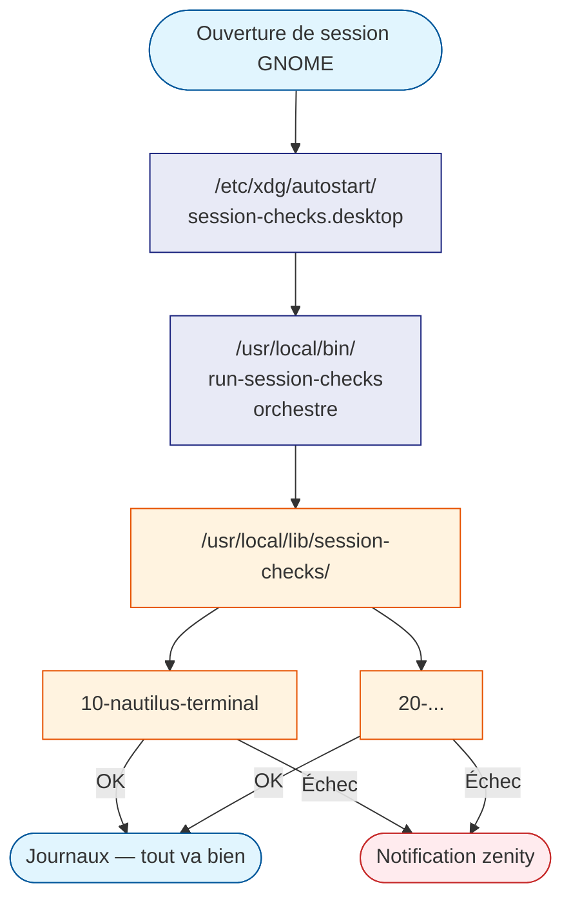
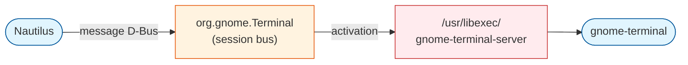

# Framework session-checks

Le framework **session-checks** exécute automatiquement des scripts de
vérification à chaque ouverture de session GNOME. Si l'environnement n'est
pas conforme (paquet manquant, configuration absente…), le framework le
détecte et propose une correction interactive à l'utilisateur.

!!! tip "Analogie pour les débutants"
    Imaginez un agent de sécurité qui vérifie votre badge à l'entrée du
    bureau chaque matin. S'il manque quelque chose, il vous prévient
    immédiatement — mais seulement quand c'est nécessaire. C'est exactement
    ce que fait session-checks à l'ouverture de votre session.

---

## Pourquoi ce framework ?

Sans ce système, garantir l'état d'un poste de travail après une
réinstallation ou une mise à jour imposait soit de mémoriser une liste
d'actions manuelles, soit d'écrire un script monolithique difficile à
maintenir.

session-checks résout les trois problèmes classiques :

| Problème | Solution apportée |
|----------|-------------------|
| Un paquet se désinstalle par erreur | Détecté au prochain login, réparation proposée |
| Ajouter un nouveau contrôle | Déposer un fichier dans un répertoire, c'est tout |
| Comprendre ce qui s'est passé | Journaux centralisés dans systemd (`journalctl`) |

---

## Architecture



### Ce qui se passe, étape par étape

1. **GNOME lit `/etc/xdg/autostart/`** au démarrage de chaque session
   utilisateur. Ce répertoire est l'équivalent système du dossier
   *Applications au démarrage* de l'interface graphique.

2. **Le fichier `.desktop`** indique à GNOME de lancer l'orchestrateur
   `/usr/local/bin/run-session-checks`.

3. **L'orchestrateur** parcourt tous les scripts exécutables de
   `/usr/local/lib/session-checks/` dans l'ordre alphabétique (les
   préfixes `10-`, `20-`… garantissent cet ordre).

4. **Chaque script de contrôle** :
   - Vérifie si tout est en ordre.
   - Ne fait rien si tout va bien (pas de fenêtre, pas de bruit).
   - Propose une correction graphique si quelque chose manque.

5. **Les résultats** sont écrits dans les journaux système (journald)
   sous l'identifiant `session-checks`, consultables à tout moment.

6. Si des contrôles ont échoué, **une fenêtre récapitulative** liste les
   problèmes rencontrés.

---

## Fichiers du système

### Vue d'ensemble

```
alm_tools/.functions/
└── session-checks/                     ← sources versionnées dans Git
    ├── install.sh                      ← installation complète (sudo bash install.sh)
    ├── run-session-checks              ← copié vers /usr/local/bin/
    ├── session-checks.desktop          ← copié vers /etc/xdg/autostart/
    └── 10-nautilus-terminal            ← contrôle : Nautilus ouvre kitty

/usr/local/bin/
└── run-session-checks                  ← orchestrateur
/usr/local/lib/session-checks/          ← contrôles actifs
└── 10-nautilus-terminal
/etc/xdg/autostart/session-checks.desktop ← déclencheur GNOME (tous les utilisateurs)
```

!!! info "Deux endroits, un seul rôle"
    Les **sources** (dans `alm_tools`) sont versionnées sous Git — c'est là
    que vous modifiez le code. Les **fichiers installés** (dans
    `/usr/local/`) sont ceux que GNOME et le système utilisent réellement.
    `install.sh` synchronise les deux.

---

### L'orchestrateur — `run-session-checks`

C'est le chef d'orchestre. Il ne contient aucune logique métier : il sait
seulement *comment* exécuter les contrôles et *comment* rapporter les
résultats.


```bash
#!/usr/bin/env bash
# Orchestrateur du framework session-checks.
#
# Exécute tous les scripts exécutables du répertoire
# /usr/local/lib/session-checks/ dans l'ordre lexicographique
# (convention run-parts de Debian/Ubuntu).

set -uo pipefail

CHECKS_DIR="/usr/local/lib/session-checks"
LOG_TAG="session-checks"
FAILED=()

log() {
    local priority="${2:-info}"
    echo "$1" | systemd-cat -t "$LOG_TAG" -p "$priority"
}

if [ ! -d "$CHECKS_DIR" ]; then
    log "Répertoire $CHECKS_DIR introuvable — aucun contrôle exécuté." \
        "warning"
    exit 0
fi

log "Démarrage des contrôles de session."

while IFS= read -r -d '' script; do
    name=$(basename "$script")
    log "Contrôle : $name — démarrage"

    if "$script"; then
        log "Contrôle : $name — OK"
    else
        FAILED+=("$name")
        log "Contrôle : $name — ÉCHEC" "warning"
    fi
done < <(
    find "$CHECKS_DIR" \
        -maxdepth 1 \
        -type f \
        -executable \
        -print0 \
    | sort -z
)

if [ ${#FAILED[@]} -eq 0 ]; then
    log "Tous les contrôles ont réussi."
else
    log "Contrôles en échec : ${FAILED[*]}" "err"
    zenity --warning \
        --title="Contrôles de session" \
        --text="Les contrôles suivants ont échoué :\n$(
            printf '• %s\n' "${FAILED[@]}"
        )\n\nConsultez les journaux :\njournalctl -t session-checks" \
        --width=420
fi
```


**Points clés :**

- `set -uo pipefail` — le script s'arrête proprement en cas d'erreur
  interne, mais continue en cas d'échec d'un contrôle individuel (géré
  par le `if "$script"`).
- `systemd-cat` — écrit dans journald avec l'identifiant `session-checks`,
  ce qui permet de filtrer les logs facilement.
- `sort -z` — trie les noms de fichiers par ordre alphabétique, ce qui
  respecte l'ordre des préfixes numériques (`10-`, `20-`…).
- `zenity --warning` — n'est affiché que si au moins un contrôle a échoué.
  Session silencieuse si tout va bien.

---

### Le contrôle — `10-nautilus-terminal`

Ce contrôle garantit que Nautilus dispose de l'option *Ouvrir dans Kitty*
et que l'extension est correctement configurée.

#### Pourquoi pas un simple wrapper ?

On pourrait croire qu'il suffit de placer un script nommé `gnome-terminal`
dans `/usr/local/bin/` (prioritaire dans le `PATH`) pour que Nautilus
ouvre kitty à la place. **Ce n'est pas possible.**

`nautilus-extension-gnome-terminal` ne lance **pas** `gnome-terminal` en
tant que processus fils. Elle envoie un **message D-Bus** au service
`org.gnome.Terminal`. Quand ce service n'est pas en cours d'exécution, le
démon D-Bus l'active directement via son fichier de service système :

```
/usr/share/dbus-1/services/org.gnome.Terminal.service
    → Exec=/usr/libexec/gnome-terminal-server
```

Le `PATH` n'est **jamais consulté**. Aucun wrapper dans `/usr/local/bin/`
ne sera jamais appelé par cette extension.



#### La solution : `nautilus-open-any-terminal`

[nautilus-open-any-terminal](https://github.com/Stunkymonkey/nautilus-open-any-terminal)
est une extension Python pour Nautilus. Elle ajoute l'entrée *Ouvrir dans
le terminal* dans le menu contextuel et se configure via `gsettings` — sans
aucune dépendance à gnome-terminal ni à D-Bus.

```bash
# Installation (utilisateur courant, pas besoin de sudo)
pip3 install --user --break-system-packages nautilus-open-any-terminal

# Compiler les schémas GSettings installés par le paquet
glib-compile-schemas ~/.local/share/glib-2.0/schemas

# Configurer kitty comme terminal cible
gsettings set com.github.stunkymonkey.nautilus-open-any-terminal terminal kitty
gsettings set com.github.stunkymonkey.nautilus-open-any-terminal new-tab false

# Redémarrer Nautilus pour charger l'extension
nautilus -q
```

Le contrôle `10-nautilus-terminal` automatise l'ensemble de ces étapes :

```bash
#!/usr/bin/env bash
# Contrôle : extension Nautilus "Ouvrir dans Kitty".
#
# nautilus-extension-gnome-terminal communique avec gnome-terminal via D-Bus
# (org.gnome.Terminal) — un wrapper PATH est sans effet car l'extension
# n'exécute jamais gnome-terminal en tant que processus fils.
#
# Ce contrôle vérifie que nautilus-open-any-terminal est installé et configuré
# pour ouvrir kitty. L'extension s'appuie sur l'API Python de Nautilus
# (nautilus-python), indépendante de D-Bus.
#
# Retourne :
#   0  — extension présente et configurée, ou refus de l'utilisateur
#   1  — installation tentée mais échouée

set -euo pipefail

EXTENSION_FILE="$HOME/.local/share/nautilus-python/extensions/open_any_terminal.py"
SCHEMAS_DIR="$HOME/.local/share/glib-2.0/schemas"
SCHEMA="com.github.stunkymonkey.nautilus-open-any-terminal"

_ready() {
    [ -f "$EXTENSION_FILE" ] \
        && gsettings get "$SCHEMA" terminal 2>/dev/null | grep -q "'kitty'"
}

_ready && exit 0

zenity --question \
    --title="Extension Nautilus manquante" \
    --text="L'option <b>Ouvrir dans Kitty</b> n'est pas disponible.\
\n\nautilus-extension-gnome-terminal utilise D-Bus et ne peut pas être\
\nredirigé vers kitty via un simple wrapper dans le PATH.\
\n\nSolution : <b>nautilus-open-any-terminal</b>, une extension Python\
\nindépendante de gnome-terminal, configurable via gsettings.\
\n\nVoulez-vous l'installer et la configurer maintenant ?" \
    --width=540 || exit 0

# Supprimer l'ancienne extension si présente (évite deux entrées dans le menu)
if dpkg -s nautilus-extension-gnome-terminal >/dev/null 2>&1; then
    pkexec apt-get remove -y nautilus-extension-gnome-terminal || true
fi

# Installer via pip — pas besoin de sudo (installation utilisateur)
if ! pip3 install --user --break-system-packages nautilus-open-any-terminal; then
    zenity --error \
        --title="Échec de l'installation" \
        --text="L'installation de nautilus-open-any-terminal a échoué.\
\nConsultez les journaux :\njournalctl -t session-checks" \
        --width=420
    exit 1
fi

# Compiler les schémas GSettings installés par le paquet
[ -d "$SCHEMAS_DIR" ] && glib-compile-schemas "$SCHEMAS_DIR" 2>/dev/null || true

# Configurer kitty comme terminal cible
gsettings set "$SCHEMA" terminal kitty
gsettings set "$SCHEMA" new-tab false

zenity --info \
    --title="Extension installée" \
    --text="nautilus-open-any-terminal installé et configuré pour kitty.\
\nNautilus va redémarrer." \
    --width=420

nautilus -q
```

**Points clés :**

- `_ready()` — vérifie deux conditions : le fichier d'extension est présent
  **et** gsettings pointe bien vers `'kitty'`. Si l'une ou l'autre est
  absente, le contrôle propose une correction.
- `pkexec apt-get remove` — supprime `nautilus-extension-gnome-terminal`
  pour éviter deux entrées *Ouvrir un terminal* dans le menu contextuel.
  L'élévation est graphique (fenêtre PolicyKit), sans `sudo`.
- `pip3 install --user --break-system-packages` — installation dans
  `~/.local/`, sans droits root.
- `glib-compile-schemas` — obligatoire après installation d'un nouveau
  schéma GSettings ; sans cela, `gsettings set` échoue avec une erreur de
  schéma introuvable.
- `nautilus -q` — redémarre Nautilus pour charger l'extension Python.

---

### Le fichier `.desktop` — déclencheur GNOME

```ini
[Desktop Entry]
Type=Application
Name=Session Checks
Name[fr_FR]=Contrôles de session
Comment=Vérifie la conformité de l'environnement au démarrage de session GNOME
Comment[en]=Verifies environment compliance at GNOME session start
Exec=/usr/local/bin/run-session-checks
Hidden=false
NoDisplay=true
X-GNOME-Autostart-enabled=true
```

- `NoDisplay=true` — n'apparaît pas dans la liste des *Applications au
  démarrage* de l'interface graphique (évite la confusion).
- `X-GNOME-Autostart-enabled=true` — active le déclenchement automatique.
- Placé dans `/etc/xdg/autostart/` (et non `~/.config/autostart/`), il
  s'applique à **tous les utilisateurs** du système.

---

## Écrire un nouveau contrôle

Un contrôle est un script Bash ordinaire qui respecte trois règles :

1. **Son nom ne contient pas de point** (convention `run-parts` Debian).
2. **Il est exécutable** (`chmod +x`).
3. **Il retourne 0** si tout va bien, **non-zéro** en cas d'échec réel.

### Modèle de départ

```bash
#!/usr/bin/env bash
# Contrôle : description courte de ce que fait ce script.
#
# Comportement attendu :
#   - Retourne 0 si l'état est conforme (ou si l'utilisateur refuse).
#   - Retourne 1 si une correction était nécessaire mais a échoué.

set -euo pipefail

# 1. Vérifier si l'état est déjà conforme
if <condition_déjà_ok>; then
    exit 0
fi

# 2. Proposer la correction à l'utilisateur
zenity --question \
    --title="Titre de la fenêtre" \
    --text="Description du problème.\nVoulez-vous corriger ?" \
    --width=420 || exit 0  # Refus = pas une erreur

# 3. Appliquer la correction (avec élévation si nécessaire)
if pkexec <commande_de_correction>; then
    zenity --info --title="Succès" --text="Correction appliquée." --width=300
else
    zenity --error --title="Échec" \
        --text="La correction a échoué.\nVoir : journalctl -t session-checks" \
        --width=380
    exit 1
fi
```

### Étapes concrètes

1. **Créer le fichier** dans `alm_tools/.functions/session-checks/` :

    ```bash
    touch ~/alm_tools/.functions/session-checks/20-mon-controle
    chmod +x ~/alm_tools/.functions/session-checks/20-mon-controle
    ```

2. **Écrire la logique** en suivant le modèle ci-dessus.

3. **Tester manuellement** avant de l'intégrer :

    ```bash
    bash ~/alm_tools/.functions/session-checks/20-mon-controle
    echo "Code de retour : $?"
    ```

4. **Installer** pour que le framework le prenne en compte :

    ```bash
    sudo install -m 755 \
        ~/alm_tools/.functions/session-checks/20-mon-controle \
        /usr/local/lib/session-checks/20-mon-controle
    ```

5. **Tester via l'orchestrateur** :

    ```bash
    /usr/local/bin/run-session-checks
    ```

---

## Consulter les journaux

Tous les événements sont écrits dans journald sous l'identifiant
`session-checks`.

```bash
# Tous les messages du framework (session en cours et précédentes)
journalctl -t session-checks

# En temps réel (utile lors d'un test)
journalctl -t session-checks -f

# Depuis le dernier démarrage uniquement
journalctl -t session-checks -b

# Uniquement les erreurs et avertissements
journalctl -t session-checks -p warning
```

!!! tip "Lire un journal systemd quand on débute"
    Chaque ligne commence par un horodatage, le nom de la machine, puis le
    message. Lisez de bas en haut pour voir les événements les plus récents
    en premier. L'option `-f` ("follow") affiche les nouvelles lignes en
    temps réel, comme `tail -f`.

---

## Tester sans rouvrir de session

Exécutez l'orchestrateur directement dans un terminal :

```bash
/usr/local/bin/run-session-checks
```

Il se comportera exactement comme lors d'un vrai démarrage de session :
fenêtres graphiques, journaux, notification en cas d'échec.

---

## Installation après une réinstallation du système

### Prérequis

- `alm_tools` cloné dans `~/alm_tools`

    ```bash
    git clone git@github.com:namnetes/alm_tools.git ~/alm_tools
    ```

### Option A — Via le postinstall (recommandée)

Le module `install_session_checks` (étape 20) et `install_nautilus_terminal`
(étape 21) sont intégrés au postinstall. Lancer le postinstall suffit :

```bash
cd ~/alm_tools/postinstall
sudo ./run_build.sh
```

Le framework est installé automatiquement, sans action supplémentaire.
La configuration de kitty comme terminal par défaut sera effectuée
automatiquement au premier login via `session-checks`.

### Option B — Installation standalone

Si vous souhaitez installer uniquement le framework, sans relancer
tout le postinstall :

```bash
sudo bash ~/alm_tools/.functions/session-checks/install.sh
```

Ce script installe en une seule commande :

- l'orchestrateur (`run-session-checks`)
- tous les contrôles (`10-nautilus-terminal`…)
- `nautilus-open-any-terminal` pour l'utilisateur courant
- le déclencheur GNOME (`.desktop`)
- nettoyage de l'ancien autostart utilisateur si présent

---

## Dépannage

### Nautilus ouvre quand même gnome-terminal

Vérifiez que `nautilus-extension-gnome-terminal` est bien supprimé :

```bash
dpkg -l nautilus-extension-gnome-terminal
```

Si encore installé, supprimez-le :

```bash
sudo apt-get remove nautilus-extension-gnome-terminal
nautilus -q
```

Vérifiez ensuite l'état complet :

```bash
# Extension Python présente ?
ls ~/.local/share/nautilus-python/extensions/open_any_terminal.py

# Schémas compilés ?
gsettings get com.github.stunkymonkey.nautilus-open-any-terminal terminal

# Doit afficher : 'kitty'
```

Si `gsettings get` renvoie une erreur de schéma introuvable :

```bash
glib-compile-schemas ~/.local/share/glib-2.0/schemas
gsettings set com.github.stunkymonkey.nautilus-open-any-terminal terminal kitty
gsettings set com.github.stunkymonkey.nautilus-open-any-terminal new-tab false
nautilus -q
```

### Le framework ne se lance pas au démarrage

Vérifiez que le fichier `.desktop` est bien présent et actif :

```bash
ls -la /etc/xdg/autostart/session-checks.desktop
cat /etc/xdg/autostart/session-checks.desktop
```

Vérifiez que l'orchestrateur est exécutable :

```bash
ls -la /usr/local/bin/run-session-checks
```

### Un contrôle échoue sans raison apparente

Consultez les journaux pour voir le détail :

```bash
journalctl -t session-checks -b --no-pager
```

Testez le contrôle individuellement :

```bash
bash /usr/local/lib/session-checks/10-nautilus-terminal
echo "Code retour : $?"
```

### `zenity` ne s'affiche pas

`zenity` a besoin de la variable `DISPLAY` ou `WAYLAND_DISPLAY`. Si vous
lancez l'orchestrateur depuis un terminal SSH (sans session graphique),
ces variables sont absentes. C'est normal : le framework est conçu pour
s'exécuter uniquement dans une session graphique GNOME.

---

## Référence rapide

| Commande | Description |
|----------|-------------|
| `/usr/local/bin/run-session-checks` | Lancer manuellement le framework |
| `journalctl -t session-checks` | Voir tous les journaux |
| `journalctl -t session-checks -f` | Journaux en temps réel |
| `ls /usr/local/lib/session-checks/` | Lister les contrôles installés |
| `gsettings get com.github.stunkymonkey.nautilus-open-any-terminal terminal` | Vérifier le terminal configuré |
| `sudo install -m 755 <fichier> /usr/local/lib/session-checks/` | Ajouter un contrôle |
| `sudo rm /usr/local/lib/session-checks/<nom>` | Supprimer un contrôle |
| `sudo bash ~/alm_tools/.functions/session-checks/install.sh` | Réinstaller le framework complet |
