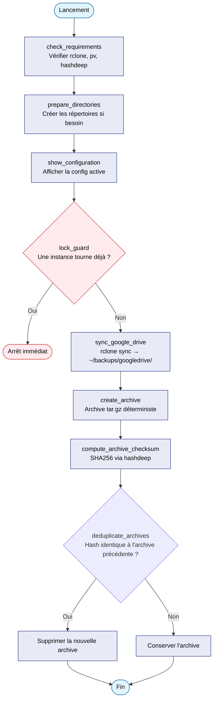

# backup_googledrive

`backup_googledrive.sh` synchronise Google Drive localement via `rclone` et
crée des archives compressées déterministes avec déduplication par hash SHA256.

**Source :** `~/alm_tools/jobs/backup_googledrive.sh`

---

## Prérequis

| Outil | Installation | Rôle |
|-------|-------------|------|
| `rclone` | `sudo make rclone` (postinstall) + config | Synchronisation Google Drive |
| `pv` | `sudo apt install pv` | Barre de progression pendant la compression |
| `hashdeep` | `sudo apt install hashdeep` | Calcul du SHA256 de l'archive |

!!! note "rclone : pas le paquet APT"
    Le module postinstall installe rclone via le **script officiel
    rclone.org**, car le paquet APT est très en retard sur l'amont
    (constaté : 1.60 en APT contre 1.74 en amont) — problématique pour un
    outil qui suit les APIs cloud. `pv` et `hashdeep` sont quant à eux déjà
    couverts par `sudo make pkg-install` (liste APT de postinstall).

### Configurer rclone pour Google Drive

```bash
rclone config
# Choisir "n" (nouveau remote), nommer "google_drive", type "drive"
# Suivre l'authentification OAuth dans le navigateur
```

!!! warning "Nom du remote"
    Le script attend un remote nommé exactement **`google_drive`** (avec
    underscore). Vérifier avec `rclone listremotes` — un nom différent
    provoque l'erreur `didn't find section in config file`.

### Sauvegarder la config pour une réinstallation rapide

`rclone config` demande un consentement OAuth interactif dans le
navigateur — c'est une contrainte de sécurité Google, impossible à
scripter pour un compte Google personnel. Le token obtenu est stocké dans
`~/.config/rclone/rclone.conf` (`refresh_token`, permet un accès
indéfini sans repasser par le navigateur). **Sauvegarder ce fichier
avant une réinstallation évite de refaire l'authentification.**

Config actuelle de référence : remote `google_drive`, type `drive`,
scope `drive.readonly` (lecture seule — suffisant pour un backup).

La procédure de chiffrement/stockage/restauration suit le runbook
générique [Sauvegarde et restauration d'un secret
(Proton Pass)](../../../../securite/proton/sauvegarde-restauration.md).
Éléments spécifiques à ce secret :

| Paramètre | Valeur |
|-----------|--------|
| Fichier à sauvegarder | `~/.config/rclone/rclone.conf` |
| Titre de la note Proton Pass | `rclone.conf — Google Drive backup` |
| Réinstallation préalable | `cd ~/alm_tools/postinstall && sudo make rclone` |
| Vérification après restauration | `rclone listremotes` doit afficher `google_drive:` |

---

## Utilisation

```bash
~/alm_tools/jobs/backup_googledrive.sh
```

Par défaut, `SOURCE_DIR` est vide et le script synchronise **la racine
complète du Drive**. Pour ne sauvegarder qu'un sous-dossier distant :

```bash
SOURCE_DIR="Documents" ~/alm_tools/jobs/backup_googledrive.sh
```

`SOURCE_DIR` doit toujours être un chemin **distant** (côté Drive), jamais
un chemin local.

---

## Anti-concurrence (verrou)

Le script empêche deux exécutions simultanées via `lock_guard` (fonction
partagée de `~/alm_tools/lib/common.sh`). Si une instance tourne déjà, un
second lancement s'arrête immédiatement :

```text
[INFO] 📋 Fichiers lock détectés :
[INFO]   - /tmp/backup_googledrive_pid34241.lock (✅ actif)
[FATAL] Arrêt du script pour éviter les conflits.
```

Le fichier de verrou est stocké dans `/tmp/backup_googledrive_pid<PID>.lock`
et supprimé automatiquement en fin d'exécution (même en cas d'erreur).

---

## Processus détaillé

Le script est découpé en fonctions (une bannière par fonction dans le
code), orchestrées depuis `main()` :



---

## Archives déterministes

Le script utilise une méthode de compression qui produit un hash SHA256
**identique si le contenu n'a pas changé**, permettant de détecter les vraies
modifications entre deux sauvegardes :

```bash
tar --sort=name \
    --mtime='UTC 2020-01-01' \
    --owner=0 --group=0 --numeric-owner \
    -c -C "$BACKUP_DIR" . \
  | gzip -9 -n \
  > archive.tar.gz
```

- `--sort=name` : ordre stable des fichiers
- `--mtime` fixe : élimine les variations de date de modification
- `--owner=0 --group=0` : élimine les variations d'utilisateur/groupe
- `gzip -n` : pas de timestamp dans l'en-tête gzip

---

## Emplacements

| Chemin | Contenu |
|--------|---------|
| `~/backups/googledrive/` | Fichiers synchronisés depuis Google Drive |
| `~/backups/archives/` | Archives `tar.gz` horodatées + fichiers SHA256 |
| `~/backups/archives/rclone_sync.log` | Log de la dernière synchronisation rclone (niveau `INFO`) |
| `/tmp/backup_googledrive_pid<PID>.lock` | Verrou anti-concurrence (existe pendant l'exécution) |

!!! warning "Pourquoi le log n'est PAS dans ~/backups/googledrive/"
    `rclone sync` rend la destination strictement identique à la source
    distante : tout fichier présent en local mais absent du Drive est
    supprimé. Si le log était écrit dans `~/backups/googledrive/`, rclone
    supprimerait son propre fichier de log à chaque synchronisation
    (constaté en pratique : le fichier disparaissait après un run complet).
    Il est donc stocké dans `~/backups/archives/`, jamais touché par la
    commande `sync`.

---

## Suivre une sauvegarde en cours

Le script tourne potentiellement longtemps sur un gros Drive (plusieurs
dizaines de Go). Pour vérifier son avancement depuis un autre terminal :

```bash
# Le script tourne-t-il, depuis combien de temps ?
ps aux | grep backup_googledrive | grep -v grep
ps -o pid,etimes,cmd -p <PID>

# Arbre des processus (rclone et ses sous-processus)
pstree -p <PID>

# Volume déjà transféré (l'indicateur le plus fiable)
du -sh ~/backups/googledrive

# Suivre les transferts en direct (nécessite --log-level INFO, déjà activé)
tail -f ~/backups/archives/rclone_sync.log
```

!!! note "Pourquoi pas juste le log ?"
    La barre de progression `--progress` de rclone (vitesse, %, ETA) ne
    s'affiche que dans le terminal où le script a été lancé — elle n'est
    pas récupérable depuis un autre terminal. Le log et la taille du
    dossier sont les seuls indicateurs consultables à distance.

---

## Déduplication

Après chaque sauvegarde, le script compare le SHA256 de la nouvelle archive
avec celui de l'avant-dernière. Si les hashs sont identiques (aucune
modification détectée), la nouvelle archive est supprimée — évitant
d'accumuler des doublons. C'est ce qui rend le script **idempotent** : le
relancer sans changement sur le Drive ne laisse aucun doublon derrière lui.

!!! warning "La compression a toujours lieu, même sans changement"
    Le script ne détecte pas les changements *avant* de compresser : il
    crée **systématiquement** une archive complète de tout
    `~/backups/googledrive/` (`tar` + `gzip`), calcule son SHA256, et
    seulement *ensuite* la supprime si elle est identique à la précédente.
    Seule la **conservation** de l'archive dépend du hash, pas sa
    **création**. Sur un gros volume (dizaines de Go), ce coût CPU/disque
    est donc payé à chaque exécution, qu'il y ait eu un changement ou non.

---

## Planification (cron)

Pour automatiser la sauvegarde quotidienne :

```bash
crontab -e
# Ajouter :
0 2 * * * ~/alm_tools/jobs/backup_googledrive.sh >> ~/.nohups/backup_gdrive.log 2>&1
```
