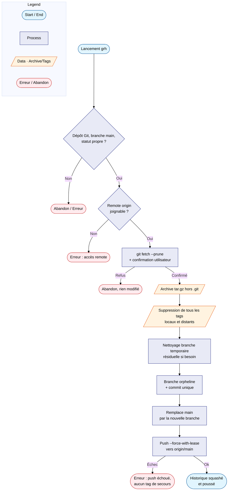

# reset_historique_git

`reset_historique_git.sh` écrase l'historique Git de la branche `main` d'un
dépôt pour ne conserver qu'un seul commit, tout en gardant les fichiers
actuels intacts, supprime tous les tags existants (locaux et distants), puis
force le push vers `origin`. Accessible depuis n'importe quel dépôt via le
raccourci shell `grh`.

**Source :** `~/alm_tools/jobs/reset_historique_git.sh`

---

!!! danger "Opération irréversible côté distant"
    Le push forcé (étape 5) écrase l'historique de `main` sur GitHub, et
    l'étape 2 supprime tous les tags du dépôt (locaux et distants), y
    compris des tags sans rapport avec le reset (versions, jalons...). Une
    fois poussé, l'ancien historique distant n'est plus récupérable **sur
    GitHub** — seule l'archive `tar.gz` créée par le script permet de
    récupérer les fichiers (pas l'historique Git, voir [Limites
    connues](#limites-connues)). Ne pas utiliser sur un dépôt partagé sans
    prévenir les autres contributeurs : tout clone existant devra faire un
    `git reset --hard origin/main` après coup.

## Utilisation

```bash
cd ~/chemin/vers/le/depot
grh
```

Équivalent explicite (sans le raccourci shell) :

```bash
~/alm_tools/jobs/reset_historique_git.sh
```

Le script doit être lancé **depuis la racine du dépôt cible**, jamais depuis
`alm_tools` lui-même sauf si c'est bien `alm_tools` qu'on veut réinitialiser.

---

## Fonctionnement détaillé



---

## Sauvegardes créées

Avant toute réécriture, un seul filet de sécurité est créé :

| Sauvegarde | Emplacement | Contenu |
|---|---|---|
| Archive `tar.gz` | `~/backups/git-reset-historique/<repo>/<repo>-<timestamp>.tar.gz` | Fichiers du dépôt au moment du run, **hors `.git`** |

Aucun tag Git de secours n'est créé : l'étape suivante supprime au contraire
tous les tags existants du dépôt (voir [Limites connues](#limites-connues)).

Un sous-dossier par dépôt est créé automatiquement sous
`~/backups/git-reset-historique/`, ce qui historise les sauvegardes de
chaque dépôt séparément sans les mélanger avec les autres sauvegardes déjà
présentes dans `~/backups`.

---

## Limites connues

!!! warning "Tous les tags existants sont supprimés, sans exception"
    L'étape 2 supprime **tous** les tags du dépôt — locaux et distants —
    y compris des tags créés bien avant ce run et sans rapport avec le
    reset (versions, jalons...). Aucune sauvegarde de ces tags n'est
    conservée par le script. Si un ancien tag doit être préservé, il faut
    le sauvegarder manuellement avant de lancer `grh` (ex. `git bundle`,
    voir [Récupération après un reset](#récupération-après-un-reset)).

- Le script ne traite que la branche `main` — les autres branches distantes
  gardent leur ancien historique (le script affiche un avertissement si
  elles existent, sans les toucher).
- `--force-with-lease` (plutôt que `--force`) protège contre un écrasement
  silencieux si `origin/main` a bougé depuis le dernier `fetch`, mais
  n'empêche pas un rejet légitime par une protection de branche GitHub.
- Une branche temporaire résiduelle (`temp_branch_reset`) issue d'une
  exécution précédente interrompue est nettoyée automatiquement avant
  chaque run.

---

## Récupération après un reset

Le script ne crée plus aucun filet de sécurité Git (ni tag de sauvegarde, ni
conservation des tags existants). Après un run, il n'existe **aucune
méthode de récupération côté Git** — seuls les fichiers restent accessibles
via l'archive `tar.gz` (sans historique).

Pour conserver une possibilité de retour en arrière, faire une sauvegarde
externe **avant** de lancer `grh`, par exemple :

```bash
git bundle create ~/backups/<repo>-avant-reset.bundle --all
```

Un `git bundle` restauré ailleurs (`git clone <fichier>.bundle`) redonne
accès à l'intégralité de l'historique et des tags d'origine.

Pour un clone existant après un reset accepté (pas une récupération) :

```bash
git fetch origin
git reset --hard origin/main
```

(un simple `git pull` provoquerait un conflit d'historique, le nouveau
`main` n'étant pas un descendant de l'ancien).
