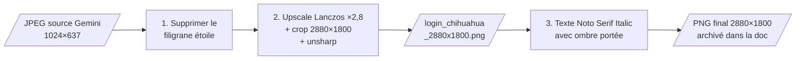

# Préparer l'image du fond GDM (ImageMagick)

Cette page documente la fabrication de l'image
[`gdm_login_background.png`](../../assets/images/gdm_login_background.png)
utilisée comme fond de l'écran de connexion — voir
[Fond d'écran GDM](fond-ecran-gdm.md). Toutes les retouches ont été
faites en ligne de commande avec **ImageMagick** (`convert`), à partir
d'une image générée par IA (Gemini).



!!! info "Pas besoin de rejouer ces étapes"
    Le résultat final est archivé dans la doc
    (`docs/assets/images/gdm_login_background.png`) — la checklist
    « Rejouer sur un poste neuf » du tutoriel GDM l'utilise
    directement. Cette page sert de référence : pour **refaire la même
    chose sur une autre image**, ou retrouver la recette exacte.

## 1. Image de départ

L'image source sort de Gemini en **1024×637 px** (JPEG, 77 Ko), avec
le filigrane « étoile » de Gemini incrusté en bas à droite. Elle est
archivée elle aussi, car les coordonnées des commandes ci-dessous
s'appliquent à **cette** définition :
[`assets/images/gdm_login_source.jpeg`](../../assets/images/gdm_login_source.jpeg)

Deux écarts par rapport à la cible (l'écran du TUXEDO en 2880×1800,
ratio 16:10) :

| | Source | Cible | Conséquence |
|---|---|---|---|
| Définition | 1024×637 | 2880×1800 | upscale ×2,8 nécessaire |
| Ratio | 1,607 | 1,600 | quasi identique — un *fill* + crop centré ne rogne que ~14 px de largeur |

## 2. Supprimer le filigrane (clone d'un patch)

Le filigrane est une petite étoile incrustée dans une zone de texture
uniforme : la technique la plus simple est de **recopier par-dessus un
patch propre** prélevé juste à côté, dans la même texture.

```bash
convert source.jpeg \
  \( +clone -crop 60x60+905+576 +repage \) \
  -geometry +905+515 -composite \
  sans_filigrane.png
```

- `\( +clone … \)` : ouvre une **sous-pile** ImageMagick — `+clone`
  duplique l'image courante, et tout ce qui suit dans les parenthèses
  ne s'applique qu'à cette copie.
- `-crop 60x60+905+576` : découpe dans la copie un carré **propre** de
  60×60 px, prélevé en (905, 576) — juste **sous** l'étoile, même
  texture de fond.
- `+repage` : remet à zéro le *canvas virtuel* du patch. Sans lui, le
  patch garderait en mémoire sa position d'origine (+905+576) et le
  `-composite` le recollerait au mauvais endroit.
- `-geometry +905+515 -composite` : colle le patch **sur** l'étoile,
  en (905, 515).

Les coordonnées se lisent dans un éditeur d'image (GIMP, ou même un
`convert -crop` de contrôle) sur l'image **source** — elles ne
valent que pour cette définition (1024×637).

!!! tip "Vérifier le résultat sans ouvrir d'éditeur"
    Extraire un agrandissement de la zone retouchée et l'inspecter :

    ```bash
    convert sans_filigrane.png -crop 200x150+850+480 +repage /tmp/check.png
    ```

## 3. Agrandir vers 2880×1800 (Lanczos + unsharp)

```bash
convert sans_filigrane.png \
  -filter Lanczos -resize 2880x1800^ \
  -gravity Center -crop 2880x1800+0+0 +repage \
  -unsharp 0x0.8+0.6+0.008 \
  login_chihuahua_2880x1800.png
```

- `-filter Lanczos` : filtre d'interpolation qui préserve le mieux les
  détails sur un **upscale** photographique (le filtre par défaut,
  Mitchell, lisse davantage).
- `-resize 2880x1800^` : le `^` signifie *fill* — l'image est agrandie
  en conservant son ratio jusqu'à ce que **les deux** dimensions
  atteignent au moins la cible (ici 1024×637 → ~2894×1800), au lieu du
  comportement par défaut (*fit*, qui s'arrête à la première dimension
  atteinte et laisserait 2880×1791).
- `-gravity Center -crop 2880x1800+0+0 +repage` : rogne l'excédent
  (~14 px de largeur) de façon symétrique, centré.
- `-unsharp 0x0.8+0.6+0.008` : accentuation légère
  (sigma 0,8, gain 0,6, seuil 0,008) pour compenser le flou
  qu'introduit mécaniquement un agrandissement ×2,8. Le seuil non nul
  évite d'amplifier le bruit des aplats.

!!! warning "Un upscale ×2,8 a ses limites"
    Lanczos + unsharp donnent un résultat très correct pour un fond
    d'écran regardé à distance, mais n'inventent pas de détail. Pour
    un agrandissement plus ambitieux, passer par un upscaler IA
    (Real-ESRGAN…) avant de revenir à ImageMagick pour la suite.

## 4. Insérer le texte avec ombre portée

Le texte « *Ferme les yeux, ouvre l'esprit.* » est posé en bas à
gauche, en **deux couches** composées séparément — c'est ce qui permet
de ne flouter **que** l'ombre :

```bash
F=/usr/share/fonts/truetype/noto/NotoSerif-Italic.ttf
T="Ferme les yeux, ouvre l'esprit."
convert login_chihuahua_2880x1800.png \
  \( -size 2880x1800 xc:none -font "$F" -pointsize 58 \
     -fill 'rgba(0,0,0,0.65)' -gravity SouthWest -annotate +123+96 "$T" \
     -blur 0x4 \) -composite \
  \( -size 2880x1800 xc:none -font "$F" -pointsize 58 \
     -fill 'rgba(255,255,255,0.92)' -gravity SouthWest -annotate +120+100 "$T" \) \
  -composite \
  login_chihuahua_2880x1800_texte.png
```

- Chaque sous-pile `\( -size 2880x1800 xc:none … \)` crée un **calque
  transparent** à la taille de l'image (`xc:none` = canvas vide), y
  écrit le texte, puis `-composite` le fusionne sur l'image.
- **Couche 1 — l'ombre** : texte noir à 65 % d'opacité, décalé de
  +3 px à droite et −4 px vers le bas par rapport au texte
  (`+123+96` contre `+120+100`, les offsets `SouthWest` se mesurant
  depuis le coin bas-gauche), puis flouté (`-blur 0x4`).
- **Couche 2 — le texte** : blanc à 92 % d'opacité, net, en
  Noto Serif Italic 58 pt.
- `-gravity SouthWest -annotate +120+100` : 120 px du bord gauche,
  100 px du bord bas.

!!! note "Choix de la police"
    Deux variantes ont été comparées sur l'image réelle :
    **Lato Light** (`-kerning 2`, rendu moderne) et
    **Noto Serif Italic** (rendu manuscrit/littéraire). La Noto Serif
    Italic a été retenue — plus en phase avec le ton de la citation.
    Les deux polices sont présentes d'office sur Ubuntu 24.04
    (`fonts-lato`, `fonts-noto-core`).

## 5. Script complet rejouable

La séquence de bout en bout, telle qu'exécutée le 2026-07-03 (adapter
les deux premières variables pour une autre image) :

```bash
#!/usr/bin/env bash
set -euo pipefail

SRC=~/Downloads/519b2f1e-a623-436a-b7b1-c0bdf0ac0808.jpeg  # 1024x637
OUT=~/Downloads/login_chihuahua_2880x1800
F=/usr/share/fonts/truetype/noto/NotoSerif-Italic.ttf
T="Ferme les yeux, ouvre l'esprit."

# 1+2. Filigrane -> patch clone, puis upscale Lanczos + crop + unsharp
convert "$SRC" \
  \( +clone -crop 60x60+905+576 +repage \) \
  -geometry +905+515 -composite \
  -filter Lanczos -resize 2880x1800^ \
  -gravity Center -crop 2880x1800+0+0 +repage \
  -unsharp 0x0.8+0.6+0.008 \
  "$OUT.png"

# 3. Texte en deux couches : ombre floutee puis texte net
convert "$OUT.png" \
  \( -size 2880x1800 xc:none -font "$F" -pointsize 58 \
     -fill 'rgba(0,0,0,0.65)' -gravity SouthWest -annotate +123+96 "$T" \
     -blur 0x4 \) -composite \
  \( -size 2880x1800 xc:none -font "$F" -pointsize 58 \
     -fill 'rgba(255,255,255,0.92)' -gravity SouthWest \
     -annotate +120+100 "$T" \) \
  -composite \
  "${OUT}_texte.png"

identify "${OUT}_texte.png"
```

Archivage dans la doc (l'image que consomme le
[tutoriel GDM](fond-ecran-gdm.md)) :

```bash
cp ~/Downloads/login_chihuahua_2880x1800_texte.png \
   ~/alm_notes/docs/assets/images/gdm_login_background.png
```

## Résultat


!!! note "Fichiers intermédiaires"
    Une première piste à partir d'une autre génération Gemini
    (PNG 1408×768, décliné en 1920×1080) a été abandonnée en cours de
    route — ces fichiers `login_chihuahua_1920x1080.png` et
    `edited_Gemini_Generated_Image_*.png` peuvent traîner dans
    `~/Downloads`, ils ne participent pas au résultat final.
