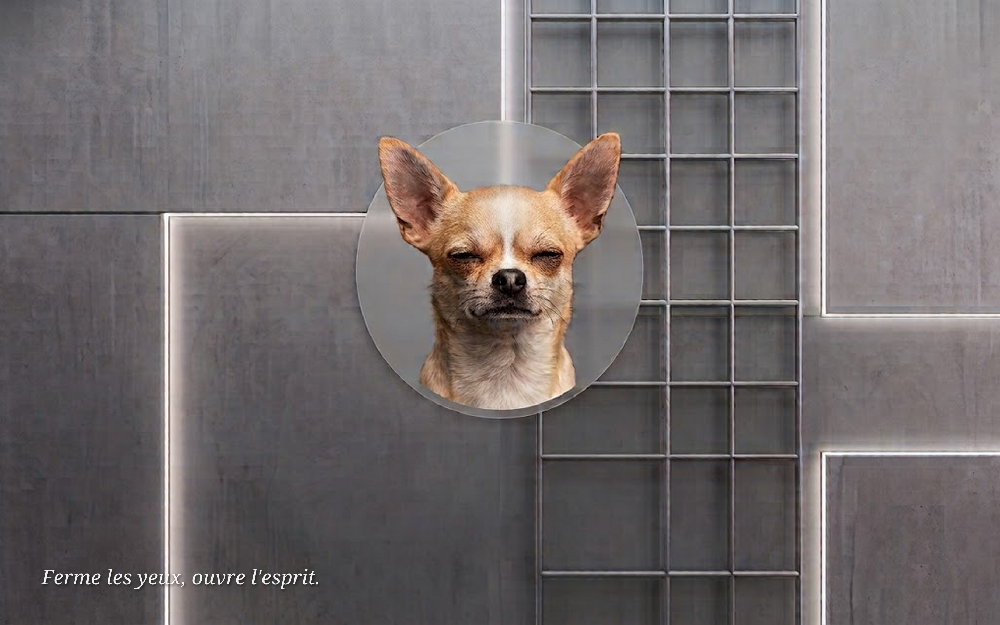

# Fond d'écran GDM (écran de connexion)

GDM ne propose **aucun réglage graphique** pour changer le fond de l'écran
de connexion : l'image et les styles du greeter sont embarqués dans un
fichier binaire *gresource* fourni par le thème Yaru. Ce tutoriel décrit la
méthode propre — extraire le thème, le modifier, le recompiler et
l'enregistrer via `update-alternatives` — testée sur **Ubuntu 24.04
(Noble, GDM/GNOME 46)**.

!!! note "Écran de connexion ≠ écran de verrouillage"
    Ce tutoriel change le fond de l'**écran de connexion** (saisie de
    l'identifiant et du mot de passe). L'**écran de verrouillage** de
    la session, lui, affiche une version floutée du fond d'écran de
    l'utilisateur — il se règle simplement dans
    **Paramètres → Apparence**.

!!! success "Configuration retenue sur cette machine"
    Les trois briques du tutoriel sont cumulées :

    1. **Fond d'écran custom** embarqué dans le thème gresource
       (sections 1 à 4) ;
    2. **Boîte de connexion descendue sous le sujet, réduite, et
       avatar générique masqué** par CSS dans le même thème
       (section 5) ;
    3. **Login minimaliste** — saisie manuelle du nom d'utilisateur,
       sans liste, sans logo Ubuntu — par dconf, sans toucher au
       thème (section 6).

    Les briques 2 et 3 sont **complémentaires** : dconf supprime la
    liste et le logo, mais même sans liste le greeter dessine un
    avatar générique — c'est le CSS de la section 5 qui le masque.

## 1. Principe

- Au démarrage, GDM charge son thème depuis
  `/usr/share/gnome-shell/gdm-theme.gresource`, un lien symbolique géré
  par `update-alternatives` qui pointe par défaut vers le thème Yaru
  (`/usr/share/gnome-shell/theme/Yaru/gnome-shell-theme.gresource`).
- Dans ce gresource, la feuille de style `gdm.css` définit le fond de
  l'écran de connexion :

  ```css
  #lockDialogGroup {
    background-color: #222222; }
  ```

- La méthode : extraire le contenu du gresource, injecter l'image,
  surcharger `#lockDialogGroup`, recompiler le tout vers
  `/usr/local/share/gnome-shell/` et déclarer le résultat comme
  alternative. **Aucun fichier du système n'est écrasé** — le retour en
  arrière tient en une commande.

## 2. Préparer l'image

- Résolution idéale : celle de l'écran (**2880×1800** sur le TUXEDO,
  ratio 16:10). Une image d'un autre ratio sera rognée par
  `background-size: cover`.
- Laisser respirer les zones occupées par GDM. Par défaut : la **boîte
  de connexion au centre**, la barre d'état en haut (~35 px) et le
  **logo Ubuntu en bas au centre**. Avec la configuration retenue
  (sections 5 et 6), le logo disparaît et la boîte, réduite, reste
  centrée horizontalement mais **descend sous le sujet** — le sujet de
  l'image peut occuper le centre, seule la bande sous lui doit rester
  dégagée.

L'image utilisée ici est générée par IA (1024×637 à l'origine) puis
retouchée avec ImageMagick : suppression du filigrane, upscale Lanczos
×2,8 vers 2880×1800, texte Noto Serif Italic avec ombre portée. Toutes
les commandes sont détaillées dans la page dédiée :
**[Préparer l'image du fond GDM (ImageMagick)](fond-ecran-gdm-image.md)**.
Le résultat est archivé dans la doc :
[`assets/images/gdm_login_background.png`](../../assets/images/gdm_login_background.png)



## 3. Prérequis

Le compilateur de ressources GLib n'est pas installé par défaut :

```bash
sudo apt install libglib2.0-dev-bin
```

## 4. Les quatre scripts

La manipulation est découpée en **quatre scripts autonomes**, à
enregistrer par exemple dans `/tmp/gdm/` sous les noms `a.sh`, `b.sh`,
`c.sh` et `d.sh`, puis à exécuter **dans l'ordre** :

```bash
bash /tmp/gdm/a.sh
bash /tmp/gdm/b.sh
bash /tmp/gdm/c.sh
bash /tmp/gdm/d.sh
```

!!! important "Anatomie d'un script robuste — à lire avant d'exécuter"
    Chaque script commence par les trois mêmes lignes, et ce n'est pas
    décoratif :

    ```bash
    #!/usr/bin/env bash
    set -euo pipefail
    cd "$HOME/gdm-theme"
    ```

    - **`#!/usr/bin/env bash`** (le *shebang*) : indique au système
      d'exécuter le fichier avec Bash, même si on le lance par
      `./script.sh`.
    - **`set -e`** : arrête le script à la **première commande qui
      échoue**, au lieu de continuer aveuglément avec un état incohérent.
    - **`set -u`** : traite l'usage d'une **variable non définie** comme
      une erreur (une faute de frappe dans un nom de variable devient
      visible immédiatement).
    - **`set -o pipefail`** : un enchaînement `cmd1 | cmd2` échoue si
      **n'importe quel** maillon échoue — pas seulement le dernier.
    - **`cd` explicite en tête de chaque script** : un script s'exécute
      dans **son propre shell** ; le `cd` fait par le script précédent
      disparaît quand celui-ci se termine. Sans ce `cd`, tous les chemins
      relatifs (`theme/gdm.css`…) dépendraient du répertoire d'où on
      lance le script — donc du hasard.

    Exemple concret du piège que ces lignes évitent : sans `set -e`, si
    le `cd theme` du script `c.sh` échoue, le script **continue** et le
    `find` génère un manifeste XML à partir du mauvais répertoire —
    erreur silencieuse et difficile à diagnostiquer. Avec `set -e`, le
    script s'arrête net sur le `cd` raté.

### a.sh — extraire le thème actif

```bash
#!/usr/bin/env bash
set -euo pipefail

WORK="$HOME/gdm-theme"
mkdir -p "$WORK/theme"
cd "$WORK"

# Gresource actuellement actif (Yaru par défaut)
SRC=$(update-alternatives --query gdm-theme.gresource \
    | awk '/^Value:/ {print $2}')

# Extraction de toutes les ressources en conservant l'arborescence
while read -r res; do
    rel=${res#/org/gnome/shell/theme/}
    mkdir -p "theme/$(dirname "$rel")"
    gresource extract "$SRC" "$res" > "theme/$rel"
done < <(gresource list "$SRC")
```

### b.sh — injecter l'image et patcher le CSS

```bash
#!/usr/bin/env bash
set -euo pipefail
cd "$HOME/gdm-theme"

# L'image (copie archivée dans alm_notes)
cp "$HOME/alm_notes/docs/assets/images/gdm_login_background.png" \
    theme/gdm-background.png

# Surcharge de #lockDialogGroup dans gdm.css
sed -i 's|^#lockDialogGroup {|#lockDialogGroup {\
  background-image: url("resource:///org/gnome/shell/theme/gdm-background.png");\
  background-size: cover;|' theme/gdm.css
```

Le bloc CSS devient :

```css
#lockDialogGroup {
  background-image: url("resource:///org/gnome/shell/theme/gdm-background.png");
  background-size: cover;
  background-color: #222222; }
```

### c.sh — recompiler le gresource

```bash
#!/usr/bin/env bash
set -euo pipefail
cd "$HOME/gdm-theme/theme"

# Manifeste XML listant toutes les ressources (image incluse).
# Exclure *.gresource est indispensable en cas de recompilation :
# sans cela, l'ancien binaire présent dans le dossier serait
# embarqué dans le nouveau (9 Mo de poids mort).
{
    echo '<?xml version="1.0" encoding="UTF-8"?>'
    echo '<gresources>'
    echo '  <gresource prefix="/org/gnome/shell/theme">'
    find . -type f ! -name '*.xml' ! -name '*.gresource' \
        -printf '    <file>%P</file>\n'
    echo '  </gresource>'
    echo '</gresources>'
} > gnome-shell-theme.gresource.xml

glib-compile-resources gnome-shell-theme.gresource.xml
```

Le fichier `gnome-shell-theme.gresource` est créé dans
`~/gdm-theme/theme/`.

### d.sh — installer et activer

```bash
#!/usr/bin/env bash
set -euo pipefail
cd "$HOME/gdm-theme/theme"

sudo install -Dm644 gnome-shell-theme.gresource \
    /usr/local/share/gnome-shell/gnome-shell-theme.gresource

sudo update-alternatives --install \
    /usr/share/gnome-shell/gdm-theme.gresource \
    gdm-theme.gresource \
    /usr/local/share/gnome-shell/gnome-shell-theme.gresource 20

sudo update-alternatives --set gdm-theme.gresource \
    /usr/local/share/gnome-shell/gnome-shell-theme.gresource
```

!!! warning "Dernière étape : redémarrer GDM ferme la session en cours"
    Aucun script ne redémarre GDM automatiquement — c'est volontaire,
    car cela **ferme la session en cours**. Sauvegarder son travail
    avant, puis :

    ```bash
    sudo systemctl restart gdm3
    ```

    Ou simplement redémarrer la machine.

## 5. Déplacer / réduire la boîte de connexion

Par défaut GDM centre la boîte de connexion — en plein sur le sujet de
l'image. Pas besoin de toucher au JavaScript du shell : dans GNOME 46,
`loginDialog.js` (`vfunc_allocate`) dispose **tous** les éléments du
greeter (liste des utilisateurs, mot de passe, bannière, logo Ubuntu) à
l'intérieur de la *content box* du nœud CSS `.login-dialog`. Un simple
`padding` dans `gdm.css` décale donc l'ensemble.

Bloc ajouté en fin de `theme/gdm.css` (avant l'étape `c.sh`) —
configuration retenue, validée visuellement le 2026-07-04 : boîte
centrée horizontalement, **descendue sous le sujet** et réduite :

```css
/* Descend la boite de connexion sous le sujet et la reduit.
   Echelle GDM 200% -> resolution logique 1440x900. */
.login-dialog {
  padding-top: 280px;    /* centre descendu de 140 px logiques */
  font-size: 0.85em;     /* reduit texte, champs et boutons (tailles em) */
}

/* Masque l'avatar generique dessine au-dessus du champ de saisie.
   L'icone (avatar-default-symbolic) est symbolique, donc peinte avec
   `color` — mais il faut EGALER les selecteurs de Yaru, pas seulement
   les surcharger depuis un parent (voir le piege de specificite dans
   l'admonition ci-dessous). Scope .login-dialog pour ne pas toucher
   l'ecran de verrouillage de session (.unlock-dialog). */
.login-dialog .user-widget .user-icon,
.login-dialog .user-widget.vertical .user-icon {
  color: transparent;
  background-color: transparent;
  box-shadow: none;
}

.login-dialog .user-widget .user-icon StIcon,
.login-dialog .user-widget.vertical .user-icon StIcon {
  color: transparent;
}
```

Pour rejouer sans édition manuelle (entre `b.sh` et `c.sh`) :

```bash
cat >> "$HOME/gdm-theme/theme/gdm.css" <<'EOF'

/* === Customisation locale (voir alm_notes/systeme/ubuntu/fond-ecran-gdm) === */
.login-dialog {
  padding-top: 280px;
  font-size: 0.85em;
}

.login-dialog .user-widget .user-icon,
.login-dialog .user-widget.vertical .user-icon {
  color: transparent;
  background-color: transparent;
  box-shadow: none;
}

.login-dialog .user-widget .user-icon StIcon,
.login-dialog .user-widget.vertical .user-icon StIcon {
  color: transparent;
}
EOF
```

Points de repère :

- Les longueurs `px` du CSS de GNOME Shell sont des **pixels logiques**
  (multipliés par le facteur d'échelle). Sur le TUXEDO (2880×1800 à
  200 %), l'écran logique fait 1440×900.
- Un `padding-left` de *N* px décale le **centre** de la boîte de
  *N/2* px vers la droite (la boîte reste centrée dans la zone
  restante) ; même logique pour `padding-top` vers le bas,
  `padding-right` vers la gauche, `padding-bottom` vers le haut.
- La largeur de la boîte (`.login-dialog-prompt-layout`) vaut `25em` :
  réduire `font-size` réduit tout proportionnellement.
- Le **logo Ubuntu** en bas de l'écran est disposé dans la même content
  box : un padding horizontal le décalerait aussi — la section 6 le
  supprime proprement.
- Variante testée puis écartée : **bas à droite**
  (`padding-left: 640px; padding-top: 400px;`) — fonctionne, mais la
  boîte centrée sous le sujet équilibre mieux la composition avec
  cette image.

!!! warning "Masquer l'avatar : trois pistes qui échouent"
    Testées en réel sur GNOME 46, le 2026-07-03 :

    - `.login-dialog .user-icon { icon-size: 0; }` — l'avatar reste
      affiché : sa taille est refixée programmatiquement par
      `set_size()` dans `userWidget.js` (classe `Avatar`), et l'icône
      retombe sur une taille par défaut, sans clipping.
    - Le mode sans liste d'utilisateurs (section 6) — il ne supprime
      **pas** l'avatar : même en saisie manuelle, `loginDialog.js`
      appelle `setUser(null)` et l'`AuthPrompt` dessine quand même un
      `UserWidget` avec l'icône générique `avatar-default-symbolic`.
    - **Piège de spécificité** :
      `.login-dialog .user-icon { color: transparent; }` seul ne
      marche pas non plus. Yaru pose `color: #f2f2f2` **directement
      sur le nœud enfant** `StIcon`
      (`.login-dialog .user-widget.vertical .user-icon StIcon`) — or
      un `color` hérité du parent n'atteint jamais un nœud qui a sa
      propre règle. Et le disque de fond vient de
      `.login-dialog .user-widget .user-icon` (3 classes, qui bat un
      sélecteur à 2 classes).

    La solution qui marche est celle du bloc CSS ci-dessus : **égaler
    les sélecteurs de Yaru** (parent `.user-icon` ET enfant `StIcon`)
    — à spécificité égale, la dernière règle du fichier gagne, et le
    bloc est ajouté en fin de `gdm.css`. L'icône par défaut étant
    **symbolique**, `color: transparent` la rend invisible ;
    `background-color: transparent` et `box-shadow: none` suppriment
    le disque de fond. L'emplacement (~64 px logiques) reste réservé
    mais vide.

    **Limite connue** : si l'utilisateur a une **photo de profil**
    (Paramètres → Utilisateurs), elle est appliquée en style *inline*
    (`background-image` posé par le code JS), prioritaire sur le thème
    — ce CSS ne la masquerait pas à l'étape mot de passe. Supprimer la
    photo du compte dans ce cas.

Après modification : re-dérouler `c.sh` puis `d.sh`, et redémarrer GDM.

!!! tip "Tester sans fermer sa session : le greeter transient"
    Pas besoin de `systemctl restart gdm3` (qui tue la session) pour
    vérifier le rendu : demander à GDM d'ouvrir un **greeter frais sur
    un autre VT**, la session survit —

    ```bash
    gdbus call --system --dest org.gnome.DisplayManager \
        --object-path /org/gnome/DisplayManager/LocalDisplayFactory \
        --method org.gnome.DisplayManager.LocalDisplayFactory\
    .CreateTransientDisplay
    ```

    C'est l'équivalent de l'entrée de menu « Changer d'utilisateur… »,
    cachée quand la machine n'a qu'un seul compte. Retour à la session
    d'origine : ++ctrl+alt+f2++ (ou le VT affiché par `loginctl`).
    Le greeter étant relancé à chaque invocation, il recharge le
    gresource et la base dconf — inutile de redémarrer GDM pour un
    changement de thème.

    À ne **pas** essayer : `gnome-shell --nested --mode=gdm` échoue
    sur GNOME 46 (`Could not acquire modal grab for the login screen`,
    refonte des grabs de mutter 42+), puis segfault au teardown.

## 6. Login minimaliste : ni liste, ni logo

Pour un greeter réduit à l'essentiel — un champ **« Nom d'utilisateur »**,
++enter++, puis le mot de passe — GDM propose un mode officiel via les
clés GSettings du schéma `org.gnome.login-screen` (cf. le
[GNOME System Admin Guide](https://help.gnome.org/admin/system-admin-guide/stable/login-userlist-disable.html.en)).
**C'est la configuration retenue ici**, combinée au padding de la
section 5 qui descend le champ de saisie sous le sujet de l'image.
Aucun CSS, aucune recompilation du thème : sur Ubuntu, tout se règle
dans `/etc/gdm3/greeter.dconf-defaults`, où les deux clés existent déjà
en commentaire :

```ini
[org/gnome/login-screen]
logo=''                  # supprime le logo Ubuntu en bas de l'écran
disable-user-list=true   # saisie manuelle du nom d'utilisateur
```

Application (le `restart` ferme la session en cours !) :

```bash
sudo cp /etc/gdm3/greeter.dconf-defaults \
    /etc/gdm3/greeter.dconf-defaults.bak
sudo sed -i \
    -e "s|^#logo='.*'|logo=''|" \
    -e 's|^# disable-user-list=true|disable-user-list=true|' \
    /etc/gdm3/greeter.dconf-defaults
sudo systemctl restart gdm3
```

!!! warning "Ce mode ne supprime pas l'avatar"
    Contrairement à l'intuition, l'invite sans liste dessine quand
    même un **avatar générique** au-dessus du champ de saisie
    (`loginDialog.js` appelle `setUser(null)`, qui crée un
    `UserWidget`). C'est le CSS `.login-dialog .user-widget .user-icon`
    de la **section 5** qui le masque — les deux réglages vont ensemble.

!!! info "Mécanique : recompilé à chaque démarrage de GDM"
    `/etc/gdm3/greeter.dconf-defaults` est symlinké en
    `/usr/share/gdm/dconf/90-debian-settings` ; `gdm.service` lance
    `/usr/share/gdm/generate-config` (`ExecStartPre`), qui recompile la
    base dconf du greeter (`/var/lib/gdm3/greeter-dconf-defaults`) à
    chaque démarrage. Éditer le fichier puis redémarrer GDM suffit —
    pas de `dpkg-reconfigure`. Ce réglage est indépendant du thème
    gresource : le padding de la section 5 reste actif.

Retour arrière : restaurer la sauvegarde
(`sudo cp /etc/gdm3/greeter.dconf-defaults.bak
/etc/gdm3/greeter.dconf-defaults`) ou recommenter les deux lignes,
puis redémarrer GDM.

## 7. Revenir en arrière

```bash
# Revenir au thème Yaru d'origine
sudo update-alternatives --set gdm-theme.gresource \
    /usr/share/gnome-shell/theme/Yaru/gnome-shell-theme.gresource
```

Pour supprimer complètement le thème custom :

```bash
sudo update-alternatives --remove gdm-theme.gresource \
    /usr/local/share/gnome-shell/gnome-shell-theme.gresource
sudo rm /usr/local/share/gnome-shell/gnome-shell-theme.gresource
```

!!! tip "Secours"
    Si l'écran de connexion ne s'affiche plus (thème incompatible après
    une grosse mise à jour), passer en console avec ++ctrl+alt+f3++ puis :

    ```bash
    sudo update-alternatives --auto gdm-theme.gresource
    sudo systemctl restart gdm3
    ```

## 8. Rejouer sur un poste neuf — checklist

Séquence complète pour retrouver le même écran de connexion après une
réinstallation (chaque étape renvoie à la section détaillée) :

1. **Prérequis** (section 3) : cloner `alm_notes` (l'image de fond y est
   archivée), puis `sudo apt install libglib2.0-dev-bin`.
2. **Thème** (section 4) : dérouler `a.sh` (extraction) puis `b.sh`
   (image + `#lockDialogGroup`).
3. **Boîte descendue + avatar masqué** (section 5) : coller le
   bloc `cat >> gdm.css` ci-dessus.
4. **Compiler et activer** (section 4) : dérouler `c.sh` puis `d.sh`.
5. **Login minimaliste** (section 6) : sauvegarde `.bak` puis `sed` sur
   `/etc/gdm3/greeter.dconf-defaults` (`logo=''`,
   `disable-user-list=true`).
6. `sudo systemctl restart gdm3` (ferme la session !), reboot, ou
   greeter transient via `gdbus` (tip de la section 5) pour tester
   sans fermer la session, puis vérifier : champ « Nom d'utilisateur »
   centré sous le sujet, ++enter++ → mot de passe, ni liste,
   ni avatar, ni logo.

Si l'échelle de l'écran diffère de 200 % (2880×1800 → logique
1440×900), recalculer le padding de la section 5 avant l'étape 3.

## 9. Après une mise à jour de GNOME / Yaru

Le gresource custom est une **copie figée** du thème Yaru au moment de sa
création. Après une mise à jour majeure de `gnome-shell` ou de
`yaru-theme-gnome-shell`, re-dérouler la section 4 pour repartir du thème
à jour (les mises à jour mineures ne posent en pratique pas de problème,
le lien `update-alternatives` étant préservé).

!!! info "Alternative graphique"
    L'application [GDM Settings](https://gdm-settings.github.io/)
    (`flatpak install io.github.realmazharhussain.GdmSettings`) automatise
    la même manipulation avec une interface graphique — utile pour un
    changement ponctuel, moins pour comprendre ce qui est modifié.
