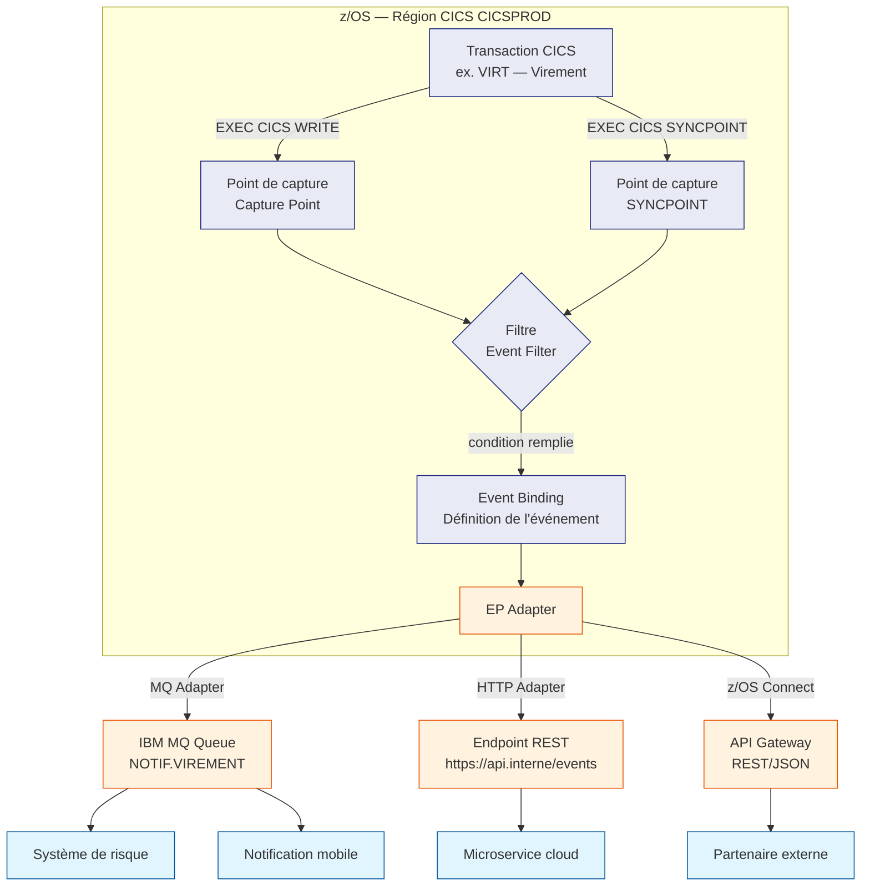
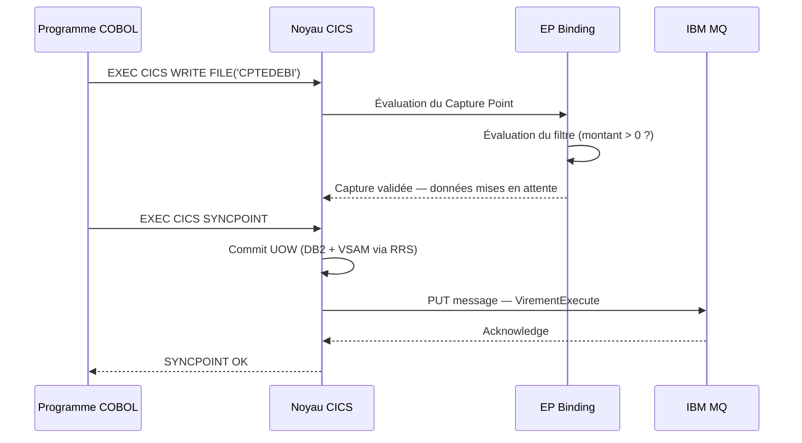
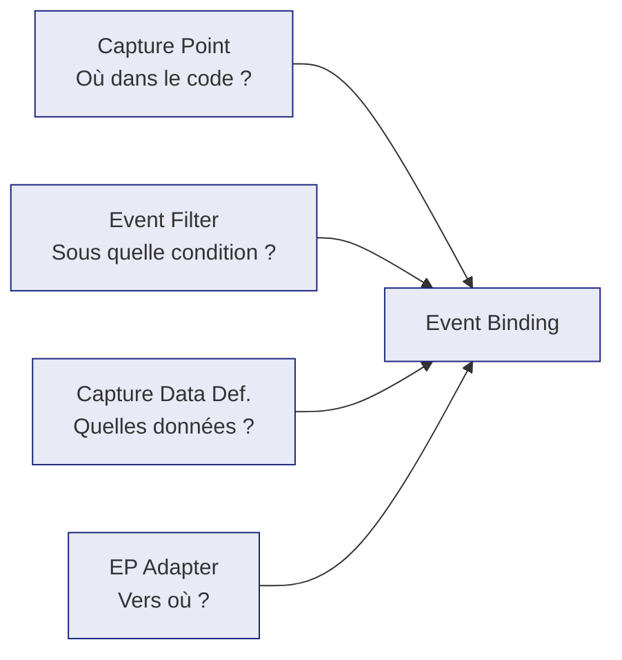
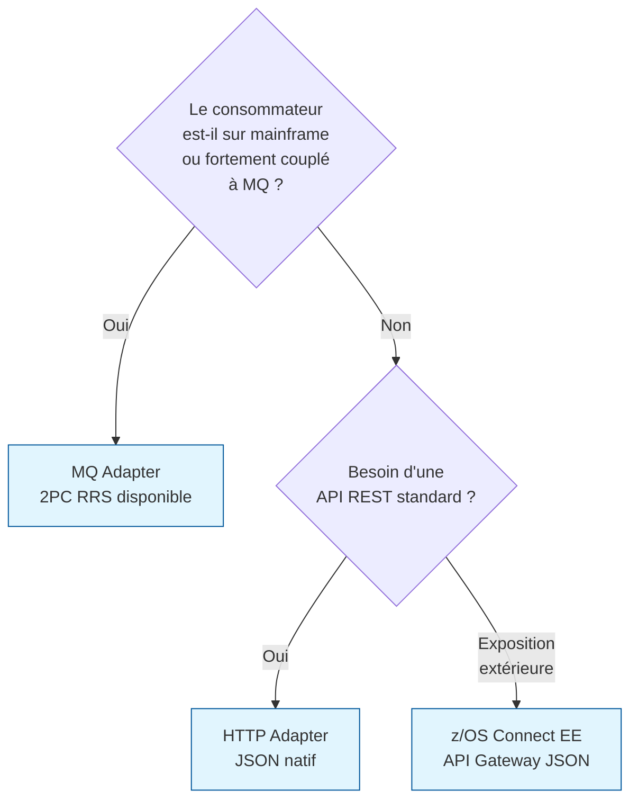
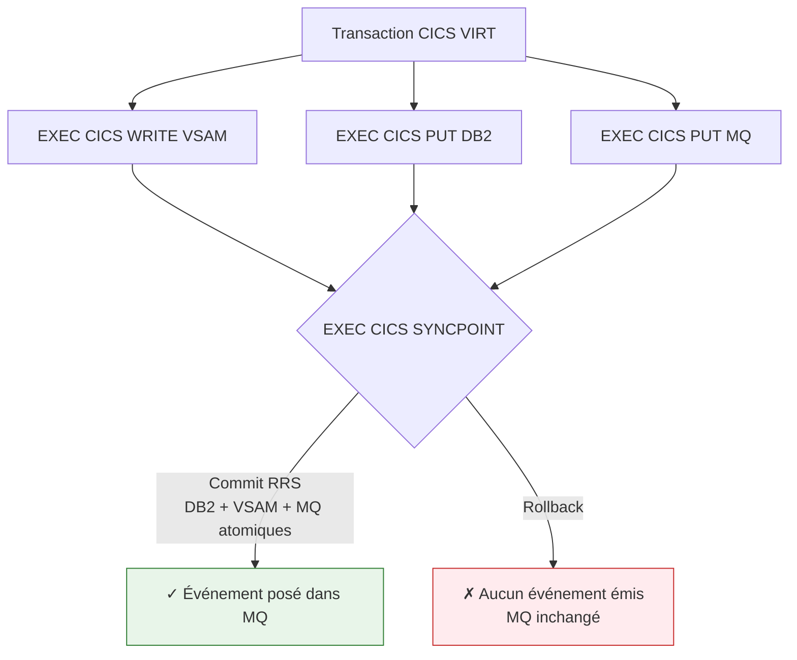
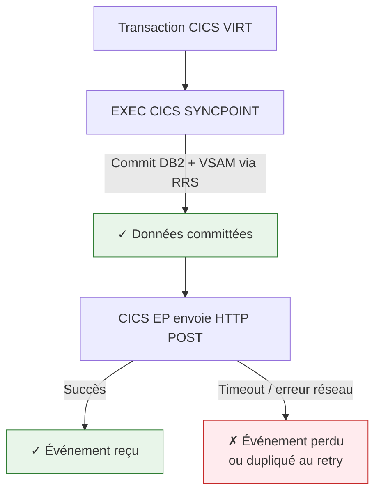
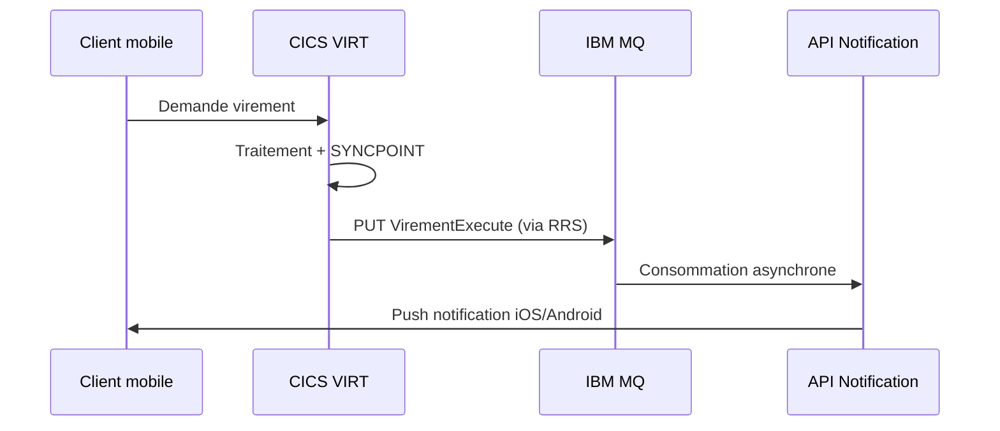
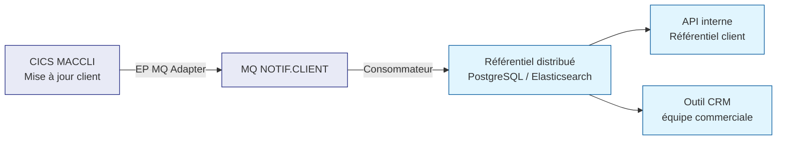
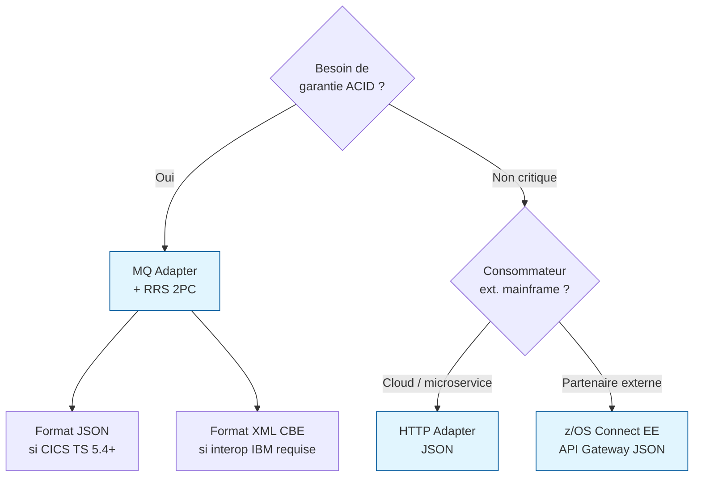

# CICS Event Processing sur z/OS — Guide pratique

> **Public cible :** architectes et développeurs mainframe souhaitant comprendre comment
> CICS peut émettre des événements métier vers des systèmes externes, sans modifier le
> code applicatif COBOL existant.

---

## Table des matières

1. [Qu'est-ce que CICS Event Processing ?](#1-quest-ce-que-cics-event-processing-)
2. [Architecture générale](#2-architecture-générale)
3. [Les composants du binding](#3-les-composants-du-binding)
4. [Les canaux de sortie (EP Adapters)](#4-les-canaux-de-sortie-ep-adapters)
5. [Exemple complet — Virement bancaire](#5-exemple-complet--virement-bancaire)
6. [Format des événements — XML vs JSON](#6-format-des-événements--xml-vs-json)
7. [Garantie transactionnelle](#7-garantie-transactionnelle)
8. [Cas d'usage en banque](#8-cas-dusage-en-banque)
9. [Synthèse et recommandations](#9-synthèse-et-recommandations)

---

## 1. Qu'est-ce que CICS Event Processing ?

CICS Event Processing (EP) est un mécanisme **natif z/OS** introduit dans CICS TS 3.2
qui permet de capturer automatiquement des événements métier lors de l'exécution d'une
transaction CICS et de les envoyer vers des systèmes externes.

### Le problème qu'il résout

Sans CICS EP, notifier un système externe d'un événement métier impose de modifier
chaque programme COBOL concerné :

```cobol
* Approche traditionnelle — code invasif dans chaque programme
EXEC CICS PUT QUEUE('NOTIF.MOBILE')
    MESSAGE(WS-EVENT-DATA)
    LENGTH(WS-EVENT-LENGTH)
END-EXEC.
```

Multiplié par des centaines de programmes, cela devient ingérable et crée un couplage
fort entre la logique métier et le canal de notification.

### La réponse de CICS EP

```
Code COBOL applicatif  →  inchangé
Configuration CICS EP  →  définit quoi capturer, où, et vers où envoyer
```

CICS intercepte les appels `EXEC CICS` ou les `SYNCPOINT` définis dans le binding
et émet l'événement **sans que le programme COBOL le sache**.

---

## 2. Architecture générale



### Flux d'exécution pas à pas



> **Point clé :** le message MQ n'est posé qu'**après** le commit de l'UOW CICS.
> Si la transaction rollback, aucun événement n'est émis.

---

## 3. Les composants du binding

Un Event Binding CICS se compose de quatre éléments :



### 3.1 Capture Point — où capturer

| Type de Capture Point | Déclencheur |
|---|---|
| `EXEC CICS API` | Un appel EXEC CICS spécifique (READ, WRITE, PUT, etc.) |
| `SYNCPOINT` | Le commit de l'UOW — le plus utilisé |
| `SYNCPOINT ROLLBACK` | Le rollback — utile pour audit des erreurs |
| `PROGRAM START` | Début d'exécution d'un programme |
| `PROGRAM END` | Fin d'exécution d'un programme |
| `ABEND` | Anomalie CICS — utile pour monitoring |

### 3.2 Event Filter — sous quelle condition

Le filtre est optionnel. Il permet de ne capturer l'événement que si une condition
est vraie, évaluée sur les données du Working Storage :

```
WS-MONTANT > 0
WS-CODE-RETOUR = '00'
WS-TYPE-OPERATION = 'VIRT'
```

Sans filtre, chaque déclenchement du Capture Point émet un événement.

### 3.3 Capture Data Definition — quelles données embarquer

La définition liste les champs à extraire du Working Storage COBOL et leur nom dans
l'événement. CICS EP les lit directement en mémoire au moment de la capture :

```
WS-COMPTE-DEBITEUR  (PIC X(11))  →  "compteDebiteur"
WS-COMPTE-CREDITEUR (PIC X(11))  →  "compteCreancier"
WS-MONTANT          (PIC 9(13)V99 COMP-3)  →  "montant"
WS-DEVISE           (PIC X(3))   →  "devise"
WS-REFERENCE        (PIC X(16))  →  "reference"
WS-CODE-RETOUR      (PIC X(2))   →  "codeRetour"
```

Le programme COBOL ne fait rien de spécial — il remplit son Working Storage comme
d'habitude. CICS EP sait où lire.

### 3.4 EP Adapter — vers où envoyer

Voir section 4.

---

## 4. Les canaux de sortie (EP Adapters)

| Adapter | Format | Disponible depuis | Usage recommandé |
|---|---|---|---|
| **MQ Adapter** | XML CBE ou personnalisé | CICS TS 3.2 | Intégration interne mainframe, 2PC RRS |
| **HTTP Adapter** | JSON ou XML | CICS TS 5.2 | Microservices, APIs cloud |
| **z/OS Connect EE** | JSON natif | CICS TS 5.3 | API gateway, partenaires externes |
| **WBE Adapter** | XML CBE uniquement | Legacy | Systèmes IBM anciens — ne pas choisir pour un nouveau projet |

### Choix selon le contexte



---

## 5. Exemple complet — Virement bancaire

### 5.1 Le programme COBOL — inchangé

```cobol
IDENTIFICATION DIVISION.
PROGRAM-ID. VIRTRMT.

DATA DIVISION.
WORKING-STORAGE SECTION.
   05 WS-COMPTE-DEBITEUR    PIC X(11) VALUE SPACES.
   05 WS-COMPTE-CREDITEUR   PIC X(11) VALUE SPACES.
   05 WS-MONTANT            PIC 9(13)V99 COMP-3.
   05 WS-DEVISE             PIC X(3)  VALUE SPACES.
   05 WS-REFERENCE          PIC X(16) VALUE SPACES.
   05 WS-CODE-RETOUR        PIC X(2)  VALUE '00'.

PROCEDURE DIVISION.
    MOVE 'VIR2026052201234' TO WS-REFERENCE
    MOVE '00123456789'      TO WS-COMPTE-DEBITEUR
    MOVE '00987654321'      TO WS-COMPTE-CREDITEUR
    MOVE 1500.00            TO WS-MONTANT
    MOVE 'EUR'              TO WS-DEVISE

    *> Débit du compte source
    EXEC CICS WRITE FILE('CPTEDEBI')
        FROM(WS-ENREG-DEBIT)
        RIDFLD(WS-COMPTE-DEBITEUR)
    END-EXEC

    *> Crédit du compte destination
    EXEC CICS WRITE FILE('CPTECRED')
        FROM(WS-ENREG-CREDIT)
        RIDFLD(WS-COMPTE-CREDITEUR)
    END-EXEC

    *>  ← CICS EP émet l'événement ici, après le commit
    EXEC CICS SYNCPOINT
    END-EXEC

    EXEC CICS RETURN
    END-EXEC.
```

### 5.2 La définition du binding (XML CICS EP)

```xml
<eventBinding name="VirementExecute"
              xmlns="http://www.ibm.com/xmlns/prod/cics/ep">

  <capturePoint type="SYNCPOINT"/>

  <eventFilter>
    <condition field="WS-CODE-RETOUR" operator="EQ" value="00"/>
  </eventFilter>

  <captureDataDefinition>
    <field name="compteDebiteur"  cicsName="WS-COMPTE-DEBITEUR"
           type="string"  length="11"/>
    <field name="compteCreancier" cicsName="WS-COMPTE-CREDITEUR"
           type="string"  length="11"/>
    <field name="montant"         cicsName="WS-MONTANT"
           type="packed-decimal"  length="8" scale="2"/>
    <field name="devise"          cicsName="WS-DEVISE"
           type="string"  length="3"/>
    <field name="reference"       cicsName="WS-REFERENCE"
           type="string"  length="16"/>
    <field name="codeRetour"      cicsName="WS-CODE-RETOUR"
           type="string"  length="2"/>
  </captureDataDefinition>

  <epAdapter type="HTTP">
    <endpoint>https://api.interne.lcl.fr/events/virements</endpoint>
    <format>JSON</format>
    <timeout>5000</timeout>
  </epAdapter>

</eventBinding>
```

---

## 6. Format des événements — XML vs JSON

### 6.1 Format XML — CommonBaseEvent (CBE)

Format historique IBM, émis par le MQ Adapter. Verbeux mais standardisé entre
produits IBM (WBE, IIB, App Connect).

```xml
<wbe:CommonBaseEvent
  xmlns:wbe="http://www.ibm.com/xmlns/prod/websphere/business-event/6.0.0"
  creationTime="2026-05-22T23:15:42.000Z"
  globalInstanceId="CICSPROD.VIRT.0000047823"
  version="1.0.1">

  <!-- Métadonnées CICS — renseignées automatiquement -->
  <wbe:sourceComponentId
    application="BANKING"
    component="VIRTRMT"
    componentIdType="Program"
    executionEnvironment="CICSPROD"
    instanceId="0000047823"
    location="MAINFRAME01"
    subComponent="VIRT"
    componentType="http://www.ibm.com/xmlns/prod/cics"/>

  <wbe:situation>
    <wbe:situationType>
      <wbe:ReportSituation
        reasoningScope="EXTERNAL"
        situationQualifier="Executed"/>
    </wbe:situationType>
  </wbe:situation>

  <!-- Nom de l'événement -->
  <wbe:extendedDataElements name="EventName" type="noValue">
    <wbe:values>VirementExecute</wbe:values>
  </wbe:extendedDataElements>

  <!-- Données métier -->
  <wbe:extendedDataElements name="compteDebiteur" type="string">
    <wbe:values>00123456789</wbe:values>
  </wbe:extendedDataElements>

  <wbe:extendedDataElements name="compteCreancier" type="string">
    <wbe:values>00987654321</wbe:values>
  </wbe:extendedDataElements>

  <wbe:extendedDataElements name="montant" type="decimal">
    <wbe:values>1500.00</wbe:values>
  </wbe:extendedDataElements>

  <wbe:extendedDataElements name="devise" type="string">
    <wbe:values>EUR</wbe:values>
  </wbe:extendedDataElements>

  <wbe:extendedDataElements name="reference" type="string">
    <wbe:values>VIR2026052201234</wbe:values>
  </wbe:extendedDataElements>

  <wbe:extendedDataElements name="codeRetour" type="string">
    <wbe:values>00</wbe:values>
  </wbe:extendedDataElements>

</wbe:CommonBaseEvent>
```

### 6.2 Format JSON — HTTP Adapter (CICS TS 5.2+)

Format moderne, natif pour les APIs REST. Beaucoup plus compact et lisible.

```json
{
  "eventName": "VirementExecute",
  "source": {
    "region":       "CICSPROD",
    "transaction":  "VIRT",
    "program":      "VIRTRMT",
    "taskNumber":   "0000047823",
    "server":       "MAINFRAME01",
    "timestamp":    "2026-05-22T23:15:42.000Z"
  },
  "data": {
    "compteDebiteur":  "00123456789",
    "compteCreancier": "00987654321",
    "montant":         1500.00,
    "devise":          "EUR",
    "reference":       "VIR2026052201234",
    "codeRetour":      "00"
  }
}
```

### 6.3 Comparaison des deux formats

| Critère | XML CBE | JSON |
|---|---|---|
| **Lisibilité** | Verbeux | Compact et clair |
| **Taille du message** | ~2 Ko pour l'exemple ci-dessus | ~300 octets |
| **Parsing côté consommateur** | Parser XML requis | Parser JSON standard |
| **Interopérabilité IBM** | Native (WBE, IIB) | À construire |
| **REST / microservices** | Inadapté | Natif |
| **Disponibilité CICS** | Depuis CICS TS 3.2 | Depuis CICS TS 5.2 |
| **Recommandation 2026** | Systèmes existants uniquement | Tout nouveau projet |

### 6.4 Origine de chaque champ dans l'événement JSON

| Champ | Valeur exemple | Renseigné par |
|---|---|---|
| `eventName` | `VirementExecute` | Binding EP (config) |
| `source.region` | `CICSPROD` | CICS — automatique |
| `source.transaction` | `VIRT` | CICS — automatique |
| `source.program` | `VIRTRMT` | CICS — automatique |
| `source.taskNumber` | `0000047823` | CICS — automatique |
| `source.server` | `MAINFRAME01` | CICS — automatique |
| `source.timestamp` | `2026-05-22T23:15:42.000Z` | CICS — automatique |
| `data.compteDebiteur` | `00123456789` | Working Storage COBOL |
| `data.compteCreancier` | `00987654321` | Working Storage COBOL |
| `data.montant` | `1500.00` | Working Storage COBOL |
| `data.devise` | `EUR` | Working Storage COBOL |
| `data.reference` | `VIR2026052201234` | Working Storage COBOL |
| `data.codeRetour` | `00` | Working Storage COBOL |

---

## 7. Garantie transactionnelle

C'est l'avantage décisif de CICS EP par rapport à une solution externe comme Kafka
consommée directement depuis un batch.

### 7.1 Avec MQ Adapter — 2PC via RRS



RRS coordonne le commit en deux phases sur DB2, VSAM et MQ simultanément.
**Soit tout commit ensemble, soit rien ne commit.**

### 7.2 Avec HTTP Adapter — Best effort



L'HTTP Adapter n'est pas dans le périmètre RRS. Si l'appel HTTP échoue après le
commit, l'événement peut être perdu. Il faut alors soit accepter la perte
(cas de notification non critique), soit implémenter un mécanisme de retry côté CICS,
soit combiner avec un Outbox DB2.

### 7.3 Tableau de garantie par adapter

| Adapter | Atomicité avec DB2/VSAM | Risque de perte | Risque de doublon |
|---|---|---|---|
| **MQ (2PC RRS)** | **Oui — garantie** | Aucun | Aucun |
| **MQ (sans RRS)** | Non | Possible | Possible |
| **HTTP** | Non | Possible | Possible (retry) |
| **z/OS Connect** | Non | Possible | Possible (retry) |

---

## 8. Cas d'usage en banque

### 8.1 Notification temps réel — virement reçu



### 8.2 Alimentation d'un moteur de détection de fraude

```json
{
  "eventName": "PaiementCarte",
  "source": {
    "region": "CICSPROD",
    "transaction": "PAIE",
    "timestamp": "2026-05-22T02:47:13.000Z"
  },
  "data": {
    "numeroCarte":   "4974XXXXXXXX1234",
    "montant":       850.00,
    "devise":        "USD",
    "paysMarchand":  "NG",
    "codeRetour":    "00",
    "heurLocale":    "03:47"
  }
}
```

Le moteur de fraude reçoit l'événement en quelques millisecondes, score la
transaction (pays inhabituel, heure atypique, montant élevé) et peut bloquer
la carte avant même que la réponse ne soit rendue au terminal.

### 8.3 Réplication vers un référentiel distribué



### 8.4 Audit réglementaire (DSP2, DORA)

Chaque opération sensible (virement, modification de plafond, changement de
coordonnées bancaires) émet un événement horodaté, signé par CICS avec les
métadonnées de la session (userID CICS, TRANID, région). Ces événements
constituent un **trail d'audit immuable** stocké dans un système dédié.

---

## 9. Synthèse et recommandations

### Ce que CICS EP permet

| Capacité | Détail |
|---|---|
| **Zéro modification applicative** | Le code COBOL n'est pas touché |
| **Capture transactionnelle** | L'événement n'est émis que si le commit réussit |
| **Données métier riches** | N'importe quel champ du Working Storage peut être capturé |
| **Multi-adapter** | Un même événement peut être routé vers MQ ET HTTP simultanément |
| **Filtrage** | Seuls les événements répondant aux conditions sont émis |
| **Formats modernes** | JSON natif depuis CICS TS 5.2 |

### Recommandations pour un nouveau projet en 2026



### Ce que CICS EP ne remplace pas

- **Les batchs JCL/COBOL** : CICS EP ne couvre que les transactions CICS online.
  Pour les batchs, utiliser le pattern Outbox DB2 ou un CDC sur le journal DB2.
- **Un bus de messages** : CICS EP n'est pas un routeur. MQ ou IBM App Connect
  prend en charge le routage complexe entre consommateurs.
- **Un moteur de règles** : les filtres CICS EP sont simples. La logique de
  traitement des événements appartient au consommateur.

---

## Références

- [IBM Docs — CICS Event Processing overview](https://www.ibm.com/docs/en/cics-ts/latest?topic=processing-event-overview)
- [IBM Docs — CICS HTTP EP Adapter](https://www.ibm.com/docs/en/cics-ts/latest?topic=adapters-http-ep-adapter)
- [IBM Docs — z/OS Connect EE](https://www.ibm.com/docs/en/zos-connect/latest)
- [IBM Docs — RRS Resource Recovery Services](https://www.ibm.com/docs/en/zos/latest?topic=mvs-programming-resource-recovery)
- [IBM Docs — IBM MQ et transactions XA](https://www.ibm.com/docs/en/ibm-mq/latest?topic=mq-xa-transactions)
